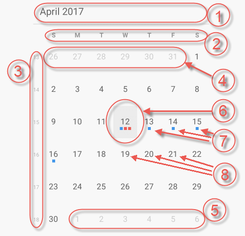
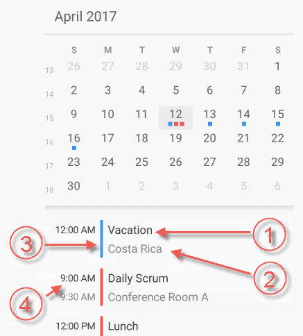

////
|metadata|
{
    "name": "scheduler-monthview",
    "controlName": ["scheduler"],
    "tags": [],
    "guid": "","buildFlags": [],
    "createdOn": "2017-03-30T09:37:02.0484523Z"
}
|metadata|
////

= Month View ({SchedulerName})

== Purpose

This topic explains how data is presented in the {SchedulerName}'s month view.

== Required Background

[options="header", cols="a,a"]
|=======
|Topic|Purpose

|link:scheduler-overview.html[Overview ({SchedulerName})]
|This topic provides an overview of the {SchedulerName} control.

|link:scheduler-binding-schedulelistdatasource.html[Binding Using ScheduleListDataSource ({SchedulerName})]
|This topic explains how to bind the control to a data source using ScheduleListDataSource.

|=======

== In This Topic

* <<Ref00001, Overview>>
* <<Ref00002, Split Mode>>
* <<Ref00003, Configuring>>
* <<Ref00004, Events>>
* <<Ref00005, Styling>>
* <<Ref00006, Related Topics>>

[[Ref00001]]
== Overview

The month view of the {SchedulerName} is visualizing the days of an entire month. Each day is represented by a cell which may contain up to three activities. The month view also supports the concept of the "selected date" which is displayed using different styling (foreground color, background color, font size or font style). Initially the selected date is the device's current date but you can set or obtain the selected date using the link:{SchedulerXFLink}.xamscheduler~selecteddate.html[SelectedDate] property.

You can navigate through the months by swiping over the month's days. The scrolling direction is configurable using the link:{SchedulerXFLink}.xamscheduler~monthviewscrolldirection.html[MonthViewScrollDirection] property. The range of months accessible by the control is defined using the link:{SchedulerXFLink}.xamscheduler~minimumdate.html[MinimumDate] and link:{SchedulerXFLink}.xamscheduler~maximumdate.html[MaximumDate] properties. These above properties can be set in any order and even illogically (for example the `MinimumDate` property may have greater value than the `MaximumDate` property). The control will normalize the dates before they are used internally. The default values for these properties is a date range that spans from 5 years prior to the current date to 5 years after the current date.

.Note
[NOTE]
====
Specifying a large working date range (greater than 100 years) when running on the Android platform can have a negative impact on the control's performance. Also this may result in arbitrarily clipping months at the end of the range due to some limitations in the Android platform.
====

The following screenshot shows the month view along with its visual elements:

. Month header (containing current month and year)
. Day of week header
. Week number
. Leading days (from previous month)
. Trailing days (from next month)
. Current day (displayed with different style)
. Activity indicators. These indicators are rendered on days occupied with activities. Up to three activity indicators are rendered. The indicators are drawn using the color scheme set on the associated resource.
. Current month days

[[Ref00002]]
== Split Mode

When the control displays the month view the space occupied can be split and an agenda view can be shown along with the month view. The agenda view shows the activities of the currently selected day or all days' activities depending on the value set on the link:{SchedulerXFLink}.xamscheduler~agendaviewappointmentscope.html[AgendaViewAppointmentScope] property. The agenda view can be rendered under the month view, at the right side of the month view or completely hidden to allow the month view to occupy all the space available to the control. By default the control positions the two views automatically based on its size:

* If the control's width is bigger than its height the two views are rendered side by side.
* If the control's height is bigger than its width the agenda view is rendered under the month view.

You have the option to turn off this automatic repositioning and sets a static views layout which is described in the table below.

The following screenshot shows visual elements of the month view combined with an agenda view:

. Activity's subject
. Activity's location
. The resource's color associated with this activity 
. Start and end time associated with this activity

[[Ref00003]]
== Configuring

The following table maps some configurable aspect/behavior of the month view to the property/method that is responsible for:

[options="header", cols="a,a,a"]
|=======
|Aspect/Behavior
|Description
|Property/Method

|Activities' Presentation
|You can choose whether the activities will be rendered as small colored squares (`SquareIndicator`) or big rectangles containing their subject (`ActivitySubject`).
|link:{SchedulerXFLink}.xamscheduler~monthviewdaycontentdisplaymode.html[MonthViewDayContentDisplayMode]

|Agenda view visibility
|You can specify whether the control should render an agenda view along with the month view.
|link:{SchedulerXFLink}.xamscheduler~monthviewagendavisibility.html[MonthViewAgendaVisibility]

|Swipe direction
|You can configure the swipe direction used to navigate through the months.
|link:{SchedulerXFLink}.xamscheduler~monthviewscrolldirection.html[MonthViewScrollDirection]

|Agenda view's content
|You can customize whether the agenda view should show only selected day's activities or all days' activities.
|link:{SchedulerXFLink}.xamscheduler~agendaviewappointmentscope.html[AgendaViewAppointmentScope]

|Leading days
|By default the previous month's days are not visible but you can configure their visibility using this property.
|link:{SchedulerXFLink}.xamscheduler~monthviewleadingdayvisibility.html[MonthViewLeadingDayVisibility]

|Trailing days
|By default the next month's days are not visible but you can configure their visibility using this property.
|link:{SchedulerXFLink}.xamscheduler~monthviewtrailingdayvisibility.html[MonthViewTrailingDayVisibility]

|Day of week header
|You can show or hide the header containing the days of week.
|link:{SchedulerXFLink}.xamscheduler~monthviewdayofweekheadervisibility.html[MonthViewDayOfWeekHeaderVisibility]

|Week number
|You can show or hide the column which displayes the week numbers.
|link:{SchedulerXFLink}.xamscheduler~monthviewweeknumbervisibility.html[MonthViewWeekNumberVisibility]

|Horizontal separators
|You can show or hide the horizontal separators between the weeks.
|link:{SchedulerXFLink}.xamscheduler~monthviewhorizontalseparatorvisibility.html[MonthViewHorizontalSeparatorVisibility]

|Vertical separators
|You can show or hide the vertical separators between the days.
|link:{SchedulerXFLink}.xamscheduler~monthviewverticalseparatorvisibility.html[MonthViewVerticalSeparatorVisibility]

|Change agenda view placement
|You can position the agenda view below or at the right side of the month view.
|link:{SchedulerXFLink}.xamscheduler~viewsplitorientation.html[ViewSplitOrientation]

|Dynamically agenda view placement
|Configure whether the agenda view should change its placement automatically when the display's aspect ratio changes.
|link:{SchedulerXFLink}.xamscheduler~viewsplitorientationmode.html[ViewSplitOrientationMode]

|Bring specific day into view
|Invoke this method to ensure the specified day is visible in the month view
|link:{SchedulerXFLink}.xamscheduler~ensuredayvisibleinmonthview.html[EnsureDayVisibleInMonthView]

|Bring specific month into view
|Invoke this method to ensure the specified month is visible in the month view
|link:{SchedulerXFLink}.xamscheduler~ensuremonthvisibleinmonthview.html[EnsureMonthVisibleInMonthView]

|=======

[[Ref00004]]
== Events

The following table maps some of the user interactions to the events that are raised by the control:

[options="header", cols="a,a,a"]
|=======
|User Interaction
|Description
|Event

|Date selected
|Occurs when the selected date in the month view has changed.
|link:{SchedulerXFLink}.xamscheduler~selecteddatechanged_ev.html[SelectedDateChanged]

|Activity tapped
|Occurs when tapping on an activity in the month view or in the integrated agenda view.
|link:{SchedulerXFLink}.xamscheduler~appointmentclicked_ev.html[AppointmentClicked]

|Activity selected
|Occurs after an activity is selected in the month view or in the integrated agenda view.
|link:{SchedulerXFLink}.xamscheduler~appointmentselected_ev.html[AppointmentSelected]

|Month header tapped
|Occurs when the month header is tapped.
|link:{SchedulerXFLink}.xamscheduler~monthheaderclicked_ev.html[MonthHeaderClicked]

|Day tapped
|Occurs when a day is tapped.
|link:{SchedulerXFLink}.xamscheduler~dayclicked_ev.html[DayClicked]

|Day of week header tapped
|Occurs when the day of week header is tapped.
|link:{SchedulerXFLink}.xamscheduler~dayofweekheaderclicked_ev.html[DayOfWeekHeaderClicked]

|Week number tapped
|Occurs when a week number is tapped.
|link:{SchedulerXFLink}.xamscheduler~weeknumberclicked_ev.html[WeekNumberClicked]

|=======

[[Ref00005]]
== Styling

The month view is highly configurable in terms of fonts, sizes and colors. There are a lot of properties at your disposal to configure this view and all of their names are prefixed with *MonthView* so that it is easier for you to find them. For example:

* The properties for controlling the foreground and background colors are of type `Brush`. For example: link:{SchedulerXFLink}.xamscheduler~monthviewbackgroundbrush.html[MonthViewBackgroundBrush] or link:{SchedulerXFLink}.xamscheduler~monthviewdayofweekheadertextbrush.html[MonthViewDayOfWeekHeaderTextBrush].

* The properties for controlling the font sizes are of type `double`. For example: link:{SchedulerXFLink}.xamscheduler~monthviewdayfontsize.html[MonthViewDayFontSize].

* The properties for controlling the font family are of type `string`. For example: link:{SchedulerXFLink}.xamscheduler~monthviewdayfontfamily.html[MonthViewDayFontFamily].

* The properties for controlling the font styling are of type `FontAttributes`. For example: link:{SchedulerXFLink}.xamscheduler~monthviewdayfontattributes.html[MonthViewDayFontAttributes]

[[Ref00006]]
== Related Topics

The following topics provide additional information related to this topic.

[options="header", cols="a,a"]
|=======
|Topic|Purpose

|link:scheduler-agendaview.html[Agenda View ({SchedulerName})]
|This topic explains how data is presented in the {SchedulerName}'s agenda view.

|link:scheduler-dayview.html[Day View ({SchedulerName})]
|This topic explains how data is presented in the {SchedulerName}'s day view.

|link:scheduler-weekview.html[Week View ({SchedulerName})]
|This topic explains how data is presented in the {SchedulerName}'s week view.

|link:scheduler-appointment.html[Appointment ({SchedulerName})]
|This topic explains the appointment activity type.

|=======