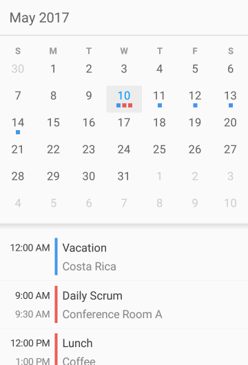

////
|metadata|
{
    "name": "scheduler-overview",
    "controlName": ["scheduler"],
    "tags": [],
    "guid": "","buildFlags": [],
    "createdOn": "2017-03-30T09:37:02.0484523Z"
}
|metadata|
////

= Overview ({SchedulerName})

The {SchedulerName} control provides a common scheduling solution for presenting and managing time periods and the associated activities.

The control itself is represented by the link:{SchedulerXFLink}.xamscheduler.html[{SchedulerClassName}] class which can be configured to visualize different views. The views are switched using the link:{SchedulerXFLink}.xamscheduler~viewmode.html[ViewMode] property which should be set to a value of type link:{SchedulerCoreLink}.core.schedulerviewmode.html[SchedulerViewMode]. By default the control renders a month view with an integrated agenda view which shows only the appointments for the selected day.

The following screenshots show the views provided by the control:

[cols="a,a"]
|=======
| *Month View* (with an optional agenda section)
| *Agenda View*
| 
| image:images/Scheduler_02.png[]
|=======

More information regarding each view can be found under the link:scheduler-views.html[Views] section.

The following topics provide the basic information you need to know to get started with the control.

== Related Topics

[options="header", cols="a,a"]
|=======
|Topic|Purpose

|link:scheduler-getting-started.html[Getting Started ({SchedulerName})]
|This topic provides information on how to get started with the {SchedulerName} control in your applications.

|link:scheduler-binding.html[Binding to Data ({SchedulerName})]
|The topics in this section explain different ways to populate the {SchedulerName} control with data.

|link:scheduler-views.html[Views ({SchedulerName})]
|The topics in this section provide information about the different views used by the {SchedulerName} control to present data.

|link:scheduler-activities.html[Activities ({SchedulerName})]
|The topics in this section provide information about the activities concept of the {SchedulerName} control.

|link:scheduler-resources.html[Resources ({SchedulerName})]
|This topic provides information about the resources concept of the {SchedulerName} control.

|=======