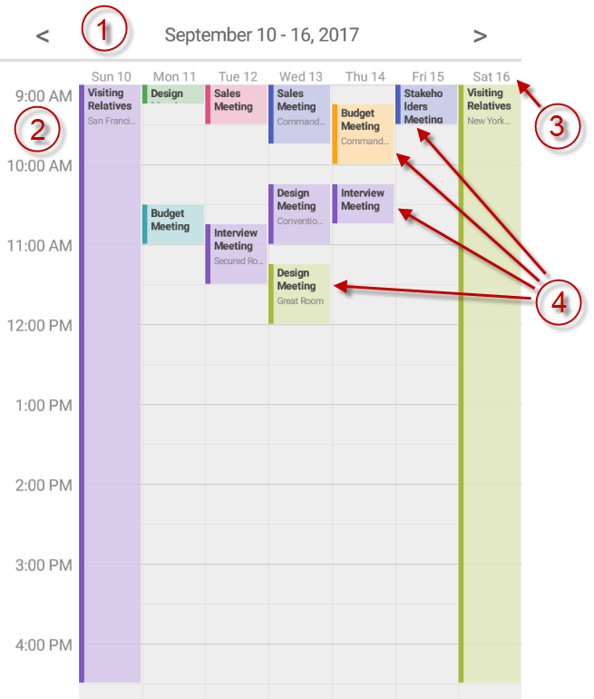

////
|metadata|
{
    "name": "scheduler-weekview",
    "controlName": ["scheduler"],
    "tags": [],
    "guid": "","buildFlags": [],
    "createdOn": "2017-09-13T09:37:02.0484523Z"
}
|metadata|
////

= Week View ({SchedulerName})

== Purpose

This topic explains how data is presented in the {SchedulerName}'s week view.

== Required Background

[options="header", cols="a,a"]
|=======
|Topic|Purpose

|link:scheduler-overview.html[Overview ({SchedulerName})]
|This topic provides an overview of the {SchedulerName} control.

|link:scheduler-binding-schedulelistdatasource.html[Binding Using ScheduleListDataSource ({SchedulerName})]
|This topic explains how to bind the control to a data source using ScheduleListDataSource.

|link:scheduler-dayview.html[Day View ({SchedulerName})]
|This topic explains how data is presented in the {SchedulerName}'s day view.

|=======

== In this topic

* <<Ref00001, Overview>>
* <<Ref00002, Configuring>>
* <<Ref00003, Events>>
* <<Ref00004, Styling>>
* <<Ref00005, Related Topics>>

[[Ref00001]]
== Overview

Just like the day view, the week view of the {SchedulerName} is visualizing the activities by rendering them in a vertical list with time slots. The difference is that you can configure the view to show all 7 week days or only the working days.

You can configure the week view to display all 24 hours or only the working hours.

The following image shows the week view along with its visual elements:

. Navigation Header
. Time slots
. Day headers
. Activities in the time slots

[[Ref00002]]
== Configuring

The following table maps some configurable aspect/behavior of the week view to the property/method that is responsible for:

[options="header", cols="a,a,a"]
|=======
|Aspect|Description|Property/Method

|Display mode
|The week view can be configured to show all 7 week days or only the days configured as working days.
|link:{SchedulerXFLink}.xamscheduler~weekviewdisplaymode.html[WeekViewDisplayMode]

|Time slot duration
|Configure the time slots' duration. Currently 5, 6, 10, 15, 30 and 60 minutes are supported.
|link:{SchedulerXFLink}.xamscheduler~timeslotinterval.html[TimeSlotInterval]

|Working days and hours
|You can configure this view to display only working hours or all 24 hours.
|link:{SchedulerXFLink}.xamscheduler~workinghoursdisplaymode.html[WorkingHoursDisplayMode]

|=======

[[Ref00003]]
== Events

The following table maps some of the user interactions to the events that are raised by the control:

[options="header", cols="a,a,a"]
|=======
|User Interaction
|Description
|Event

|Week number clicked
|Occurs when tapping on an a week number in the week view.
|link:{SchedulerXFLink}.xamscheduler~weeknumberclicked_ev.html[WeekNumberClicked]

|=======

[[Ref00004]]
== Styling

The week view styling is very similar to the day view. The week view has a link:{SchedulerXFLink}.xamscheduler~weekviewbackgroundbrush.html[WeekViewBackgroundBrush] property for changing its background. You can use the link:scheduler-dayview#Ref00004[day view styling properties] to customize the week view even more.

[[Ref00005]]
== Related Topics

The following topics provide additional information related to this topic.

[options="header", cols="a,a"]
|=======
|Topic|Purpose

|link:scheduler-agendaview.html[Agenda View ({SchedulerName})]
|This topic explains how data is presented in the {SchedulerName}'s agenda view.

|link:scheduler-monthview.html[Month View ({SchedulerName})]
|This topic explains how data is presented in the {SchedulerName}'s month view.

|link:scheduler-appointment.html[Appointment ({SchedulerName})]
|This topic explains the appointment activity type.

|=======