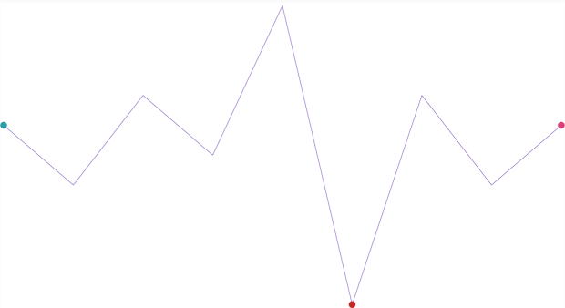

////
|metadata|
{
    "name": "sparkline-defining-markers",
    "controlName": ["{SparklineName}"],
    "tags": ["API","Charting","Layouts","Styling"],
    "guid": "a727b367-959f-4ff3-ae80-868e37929a67",
    "buildFlags": [],
    "createdOn": "2016-05-25T18:21:59.2563877Z"
}
|metadata|
////

= Defining Markers

=== Purpose

This topic demonstrates, with code examples, how to define the markers for link:{ApiPlatform}{SparklineAssembly}.html[{SparklineName}]™ control.

=== Required Background

The following table lists the topics required as a prerequisite to understanding this topic.

[options="header", cols="a,a"]
|====
|Topic|Purpose

| link:sparkline-sparkline-overview.html[{SparklineName} Overview]
|This topic provides an overview of the {SparklineName} control, its benefits, and the supported chart types.

| link:sparkline-configuring-sparkline.html[Configuring {SparklineName}]
|This topic provides an overview of the possible ways to configure the _{SparklineName}_ control. Links to the detailed configurations (available in separate topics) are provided as well.

|====

=== In This Topic

This topic contains the following sections:

* <<_Ref317083829,Defining Markers – Conceptual Overview>>

** <<_Ref317161385,Introduction>>
** <<_Ref317161389,Property settings>>
** <<_Ref317161394,Example>>
** <<_Ref317179476,Configuring Markers>>

* <<_Ref317083809,Defining Markers – Code Example>>

** <<_Ref317161460,Description>>
** <<Preview,Preview>>
** <<_Ref317161464,Code>>

* <<_Ref317161501,Related Content>>

[[_Ref317083802]]
[[_Ref317083829]]
== Defining Markers – Conceptual Overview

[[_Ref317161385]]

=== Introduction

Markers are symbols (circular colored icons) overlaid on the Sparkline to indicate the individual data points based on  _X/Y_   coordinates. Markers can be set on Sparkline of types pick:[sl,wpf,win-universal="link:{SparklineLink}.sparklinedisplaytype.html[Line]"] pick:[xamarin,win-forms,android="link:{SparklineLink}.{SparklineName}{ApiProp}displaytype.html[Line]"], pick:[sl,wpf,win-universal="link:{SparklineLink}.sparklinedisplaytype.html[Area]"] pick:[xamarin,win-forms,android="link:{SparklineLink}.{SparklineName}{ApiProp}displaytype.html[Area]"] and pick:[sl,wpf,win-universal="link:{SparklineLink}.sparklinedisplaytype.html[Column]"] pick:[xamarin,win-forms,android="link:{SparklineLink}.{SparklineName}{ApiProp}displaytype.html[Column]"]. The pick:[sl,wpf,win-universal="link:{SparklineLink}.sparklinedisplaytype.html[WinLoss]"] pick:[xamarin,win-forms,android="link:{SparklineLink}.{SparklineName}{ApiProp}displaytype.html[WinLoss]"] type of Sparkline does not accept markers.

Markers can be displayed on the first, last, highest, lowest and negative data points and as any combination of these.

By default, markers are not displayed.

[[_Ref317161389]]

=== Property settings

The following table maps the tasks related to displaying markers to the property settings that configure them.

Note: The Collapsed setting indicates the default state of any marker in which they are not visible.

[options="header", cols="a,a,a"]
|====
|In order to:|Use this property:|And set it to:

|[[_Hlk317185178]] 

Display all markers
| link:sparkline-sparkline-property-reference.html#MarkerVisibility[MarkerVisibility]
| _Visible_ 

|Hide all markers
| link:sparkline-sparkline-property-reference.html#MarkerVisibility[MarkerVisibility] 

| _Collapsed_ 

|Display the marker on the first data point
| link:sparkline-sparkline-property-reference.html#FirstMarkerVisibility[FirstMarkerVisibility]
| _Visible_ 

|Hide the marker on the first data point
| link:sparkline-sparkline-property-reference.html#FirstMarkerVisibility[FirstMarkerVisibility] 

| _Collapsed_ 

|Display the marker on the last data point
| link:sparkline-sparkline-property-reference.html#LastMarkerVisibility[LastMarkerVisibility]
| _Visible_ 

|Hide the marker on the last data point
| link:sparkline-sparkline-property-reference.html#LastMarkerVisibility[LastMarkerVisibility] 

| _Collapsed_ 

|Display the marker on the highest data point
| link:sparkline-sparkline-property-reference.html#HighMarkerVisibility[HighMarkerVisibility]
| _Visible_ 

|Hide the marker on the highest data point
| link:sparkline-sparkline-property-reference.html#HighMarkerVisibility[HighMarkerVisibility]
| _Collapsed_ 

|Display the marker on the lowest data point
| link:sparkline-sparkline-property-reference.html#LowMarkerVisibility[LowMarkerVisibility]
| _Visible_ 

|Hide the marker on the lowest data point
| link:sparkline-sparkline-property-reference.html#LowMarkerVisibility[LowMarkerVisibility]
| _Collapsed_ 

|Display the markers on the negative data points
| link:sparkline-sparkline-property-reference.html#NegativeMarkerVisibility[NegativeMarkerVisibility]
| _Visible_ 

|Hide the markers on the negative data points
| link:sparkline-sparkline-property-reference.html#NegativeMarkerVisibility[NegativeMarkerVisibility]
| _Collapsed_ 

|====

[[_Ref317161394]]

=== Example

The screenshot below demonstrates how the Sparkline looks as a result of the following settings:

[options="header", cols="a,a"]
|====
| *Property* | *Value* 

| link:{SparklineLink}.{SparklineName}{ApiProp}markervisibility.html[MarkerVisibility]
| _Visible_ 
| link:{SparklineLink}.{SparklineName}{ApiProp}markersize.html[MarkerSize]
| _15_ 
|====

image::images/sparkline_visual_elements_2.png[]

[[_Ref317179476]]

=== Configuring Markers

Markers can be configured in the following aspects:

* Selecting the data points to indicate, individually or in combination such as the first, last, highest, lowest and the negative values; for details, refer to the <<_Ref317161389,Property settings>> block.

* Size

* Color

For details on how to configure the markers’ size and color, refer to the link:sparkline-configuring-markers.html[Configuring Markers] topic.

[[_Ref317083809]]
== Defining Markers - Code Example

[[_Ref317161460]]

=== Description

The code below demonstrates how to display markers on the following data points:

* The first data point

* The last data point

* On all negative data points

[[Preview]]

=== Preview

[[_Ref317161464]]

=== Code
ifdef::sl,wpf,win-phone,win-universal,xamarin[]
*In XAML:*

[source,xaml]
----
    <igSparkline:{SparklineName} 
                MarkerVisibility="Collapsed"
                HighMarkerVisibility="Collapsed"
                LowMarkerVisibility="Collapsed"
                FirstMarkerVisibility="Visible"
                LastMarkerVisibility="Visible"
                NegativeMarkerVisibility="Visible" />
----
*In C#:*

[source,csharp]
----
this.{SparklineName}1.MarkerVisibility = System.Windows.Visibility.Collapsed;
this.{SparklineName}1.LowMarkerVisibility = System.Windows.Visibility.Collapsed;
this.{SparklineName}1.HighMarkerVisibility = System.Windows.Visibility.Collapsed;
this.{SparklineName}1.FirstMarkerVisibility = System.Windows.Visibility.Visible;
this.{SparklineName}1.LastMarkerVisibility = System.Windows.Visibility.Visible;
this.{SparklineName}1.NegativeMarkerVisibility = System.Windows.Visibility.Visible;
----

ifdef::sl,wpf,win-phone,win-universal,win-forms[] 
*In Visual Basic:*

[source,vb]
----
Me.{SparklineName}1.MarkerVisibility = System.Windows.Visibility.Collapsed
Me.{SparklineName}1.LowMarkerVisibility = System.Windows.Visibility.Collapsed
Me.{SparklineName}1.HighMarkerVisibility = System.Windows.Visibility.Collapsed
Me.{SparklineName}1.FirstMarkerVisibility = System.Windows.Visibility.Visible
Me.{SparklineName}1.LastMarkerVisibility = System.Windows.Visibility.Visible
Me.{SparklineName}1.NegativeMarkerVisibility = System.Windows.Visibility.Visible
----
endif::sl,wpf,win-phone,win-universal,win-forms[] 
endif::sl,wpf,win-phone,win-universal,xamarin[]
ifdef::win-forms[] 
*In C#:*

[source,csharp]
----
this.{SparklineName}1.MarkerVisibility = Infragistics.Portable.Components.UI.Visibility.Collapsed;
this.{SparklineName}1.LowMarkerVisibility = Infragistics.Portable.Components.UI.Visibility.Collapsed;
this.{SparklineName}1.HighMarkerVisibility = Infragistics.Portable.Components.UI.Visibility.Collapsed;
this.{SparklineName}1.FirstMarkerVisibility = Infragistics.Portable.Components.UI.Visibility.Visible;
this.{SparklineName}1.LastMarkerVisibility = Infragistics.Portable.Components.UI.Visibility.Visible;
this.{SparklineName}1.NegativeMarkerVisibility = Infragistics.Portable.Components.UI.Visibility.Visible;
----

*In Visual Basic:*

[source,vb]
----
Me.{SparklineName}1.MarkerVisibility = Infragistics.Portable.Components.UI.Visibility.Collapsed
Me.{SparklineName}1.LowMarkerVisibility = Infragistics.Portable.Components.UI.Visibility.Collapsed
Me.{SparklineName}1.HighMarkerVisibility = Infragistics.Portable.Components.UI.Visibility.Collapsed
Me.{SparklineName}1.FirstMarkerVisibility = Infragistics.Portable.Components.UI.Visibility.Visible
Me.{SparklineName}1.LastMarkerVisibility = Infragistics.Portable.Components.UI.Visibility.Visible
Me.{SparklineName}1.NegativeMarkerVisibility = Infragistics.Portable.Components.UI.Visibility.Visible
----
endif::win-forms[] 

[[_Ref317161501]]
== Related Content

The following topics provide additional information related to this topic.

[options="header", cols="a,a"]
|====
|Topic|Purpose

| link:sparkline-sparkline-overview.html[{SparklineName} Overview]
|This topic provides an overview of the _{SparklineName}_ control, its benefits, and the supported chart types.

| link:sparkline-configuring-sparkline.html[Configuring {SparklineName}]
|This topic provides an overview of the possible ways to configure the _{SparklineName}_ control. Links to the detailed configurations (available in separate topics) are provided as well.

| link:sparkline-configuring-markers.html[Configuring Markers]
|This topic demonstrates, with code examples, how to configure and customize the markers for _{SparklineName}_ control.

| link:sparkline-sparkline-property-reference.html[{SparklineName} Property Reference]
|This topic explains the featured properties of the _{SparklineName}_ control.

|====