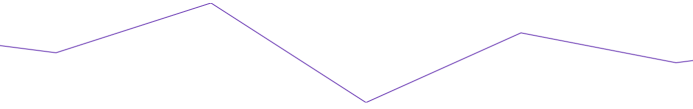
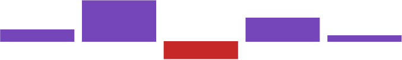

////
|metadata|
{
    "name": "sparkline",
    "controlName": ["{SparklineName}"],
    "tags": [],
    "guid": "3605f1f7-270f-45a7-8c08-175f4b1ee4aa","buildFlags": [],
    "createdOn": "2016-05-25T18:21:59.1843836Z"
}
|metadata|
////

= {SparklineName}

=== Introduction

The link:{ApiPlatform}{SparklineAssembly}.html[{SparklineName}]™ is a lightweight charting control that can render the following chart types:

* Line
* Area
* Column
* Win/Loss

It is intended for rendering in a small scale layout such as a grid Cell. It can also be rendered stand alone. The following previews illustrate the four Sparkline types.

Line

Area

Column

WinLoss

== Related Content

The following topics provide additional information related to this topic.

[cols="a,a"]
|====
| link:sparkline-sparkline-overview.html[{SparklineName} Overview]
|This topic provides an overview of the _{SparklineName}_ control, its benefits, and the supported chart types.

| link:sparkline-adding-sparkline.html[Adding {SparklineName}]
|This topic demonstrates, with code examples, how to add the _{SparklineName}_ control to a page and in the grid cell.

| link:sparkline-configuring-sparkline.html[Configuring {SparklineName}]
|This topic provides an overview of the possible ways to configure the _{SparklineName}_ control. Links to the detailed configurations (available in separate topics) are provided as well.

| link:sparkline-sparkline-property-reference.html[{SparklineName} Property Reference]
|This topic explains the featured properties of the _{SparklineName}_ control.

|====