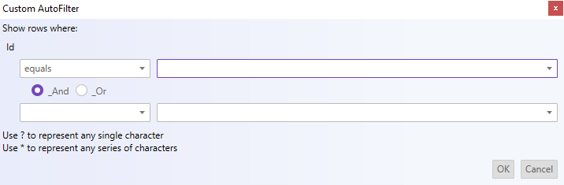

= Filter Dialog Interactions ({SpreadsheetName})

=== Purpose

This topic explains what operations can be performed by the user with the control’s filter dialog to create complex filters in a column.

=== Required background

The following table lists the concept and topics required as a prerequisite to understanding this topic.

[options="header", cols="a,a"]
|====

|Topic|Purpose 

|pick:[wpf,sl,xaml=" link:excelengine-about-infragistics-excel-engine.html[About Infragistics Excel Engine]"] pick:[win-forms=" link:excelengine-understanding-the-infragistics-excel-engine.html[Understanding Infragistics Excel Engine]"] 

|In this section you will find information that will help you to better understand the object model and the functionalities of the _Infragistics Excel Engine_ . 

| link:spreadsheet-features.html[Features Overview ({SpreadsheetName})] 

|This topic explains in details the features of the link:{SpreadsheetLink}.{SpreadsheetName}.html[{SpreadsheetName}] control from developer perspective. 

| link:spreadsheet-visual-elements.html[Visual Elements Overview ({SpreadsheetName})] 

|This topic provides an overview of the visual elements of the {SpreadsheetName} control. 

|====

=== In this topic

This topic contains the following sections:

* <<_Ref389847435, Introduction >>
* <<_Ref396316984, Filter Dialog for a Worksheet>>
* <<_Ref396400575, Filter Dialog for a Table >>
* <<_Ref396313862, Related Content >>

[[_Ref389847435]]
== Introduction

=== Filter dialog summary

The {SpreadsheetName} control provides a filter dialog which is opened by clicking on the dropdown button in the header row of either a loaded worksheet or created table. The filter dialog will change based on the field that was interacted with.

[[_Ref396316984]]
== Filter Dialog for a Worksheet

=== Code Example
The following example code demonstrates how to show the filter dialog for the first column in a worksheet region at index of zero. Alternatively, the index specified needs to exist within region.

*In C#:*

----
...
this.Spreadsheet1.ShowFilterDialogForWorksheet(0, Infragistics.Controls.Grids.SpreadsheetFilterDialogOption.Custom);
...
----

*In Visual Basic:*

----
...
Me.Spreadsheet1.ShowFilterDialogForWorksheet(0, Infragistics.Controls.Grids.SpreadsheetFilterDialogOption.Custom)
...
----

[[_Ref396400575]]
== Filter Dialog for a Table

=== Code Example
The following example code demonstrates how to show the filter dialog for the first column in a worksheet table, specified by it's index.

*In C#:*

----
...
WorksheetTable Table1;
Table1 = this.Spreadsheet1.ActiveWorksheet.Tables[0];
this.Spreadsheet1.ShowFilterDialogForTable(Table1.Columns[0], Infragistics.Controls.Grids.SpreadsheetFilterDialogOption.Custom);
...
----

*In Visual Basic:*

----
...
Dim Table1 As WorksheetTable
Table1 = Me.Spreadsheet1.ActiveWorksheet.Tables(0)
Me.Spreadsheet1.ShowFilterDialogForTable(Table1.Columns(0), Infragistics.Controls.Grids.SpreadsheetFilterDialogOption.Custom)
...
----

[[_Ref396313862]]
== Related Content

The following topics provide additional information related to this topic.

[options="header", cols="a,a"]
|====
|Topic|Purpose

| link:spreadsheet-uiu-activation-navigation.html[Activation and Navigation Interactions ({SpreadsheetName})]
|This topic explains the supported user actions when navigating the control’s cells.

| link:spreadsheet-uiu-cell-editing.html[Cell Editing Interactions ({SpreadsheetName})]
|This topic explains what action can be performed by the user when editing cells.

| link:spreadsheet-uiu-columns-and-rows.html[Columns and Rows Interactions ({SpreadsheetName})]
|This topic explains what actions can be performed by the user when interacting with worksheet columns and rows.

| link:spreadsheet-uiu-formula-bar.html[Formula Bar Interactions ({SpreadsheetName})]
|This topic explains what actions can be performed by the user when interacting with the formula bar.

| link:spreadsheet-uiu-selection.html[Selection Interactions ({SpreadsheetName})]
|This topic explains the supported user actions when selecting cells, rows, or columns.

| link:spreadsheet-uiu-tab-bar-area.html[Tab Bar Area Interactions ({SpreadsheetName})]
|This topic explains what actions can be performed by the user when interacting with the worksheets.

|===== Context Menu Interactions ({SpreadsheetName})