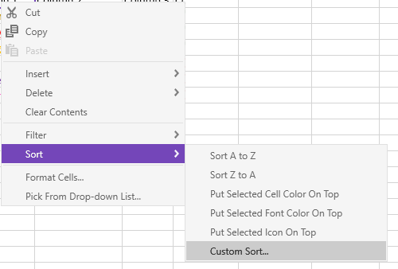
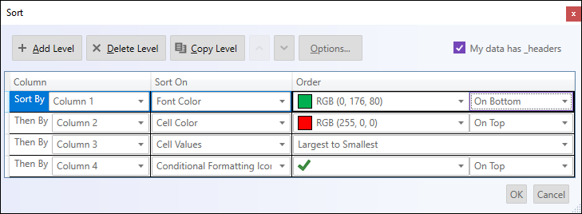

= Sorting Dialog Interactions ({SpreadsheetName})

=== Purpose

This topic explains what operations can be performed by the user with the control’s custom sort dialog to create multiple sort conditions for columns or rows present in a table, worksheet, or filter region.

=== Required background

The following table lists the concept and topics required as a prerequisite to understanding this topic.

[options="header", cols="a,a"]
|====

|Topic|Purpose 

|pick:[wpf,sl,xaml=" link:excelengine-about-infragistics-excel-engine.html[About Infragistics Excel Engine]"] pick:[win-forms=" link:excelengine-understanding-the-infragistics-excel-engine.html[Understanding Infragistics Excel Engine]"] 

|In this section you will find information that will help you to better understand the object model and the functionalities of the _Infragistics Excel Engine_ . 

| link:spreadsheet-features.html[Features Overview ({SpreadsheetName})] 

|This topic explains in details the features of the link:{SpreadsheetLink}.{SpreadsheetName}.html[{SpreadsheetName}] control from developer perspective. 

| link:spreadsheet-visual-elements.html[Visual Elements Overview ({SpreadsheetName})] 

|This topic provides an overview of the visual elements of the {SpreadsheetName} control. 

|====

[[_Ref389847435]]
== Custom Sort Dialog
image::images/spreadsheet_sort_dialog.png[]

=== Sort dialog summary

The {SpreadsheetName} control provides a custom sort dialog, aimed at sorting multiple columns or rows in a defined order.

The dialog can be opened by first displaying up the {SpreadsheetName}'s context menu. This can be achieved by either right-clicking or pressing (Alt + Shift + F10) on a cell that pertains to a worksheet, filter region or table. Next, select the Sort option followed by Custom Sort option (as shown in the image below) and the dialog will appear. 

To start an initial sort condition, you must fullfill three categories. *Note*, the dialog defaults to column sorting. You may change this to Row sorting, but not both, by using the Options button at the top of the dialog. 

* *Column or Row* - The minimum requirement for a sort condition to be applied. Defaults are provided for both Sort On and Order fields.
* *Sort On* - There are four distinct options for sorting, 'Font Color', 'Cell Color', 'Cell Value', and 'Conditional Formatting Icon'. See screenshot below for more details.
* *Order* - When 'Font Color' is selected from the Sort On field, the colors from the cell's foreground become the available as Order options. When 'Cell Color' is selected from the Sort On field, the unique colors from the cell's background become the available order options. When 'Cell Values' is selected from the Sort on field the Order can be sorted (A to Z) or (Z to A) for letters and symbols. When the values contain numeric values the Order can be sorted (Smallest to Largest) or (Largest to Smallest). When Conditional Formatting Icon is selected from the Sort On field, the order of rows will be based on the icons themselves. 

The following image is an example of all four *Sort On* options:

=== Additional Notes:

When more than one sort condition is applied you may reorder the conditions via the up and down buttons at the top of the dialog. 

The delete button will delete the active sort criteria.

[[_Ref396313862]]
== Related Content

The following topics provide additional information related to this topic.

[options="header", cols="a,a"]
|====
|Topic|Purpose

| link:spreadsheet-uiu-activation-navigation.html[Activation and Navigation Interactions ({SpreadsheetName})]
|This topic explains the supported user actions when navigating the control’s cells.

| link:spreadsheet-uiu-cell-editing.html[Cell Editing Interactions ({SpreadsheetName})]
|This topic explains what action can be performed by the user when editing cells.

| link:spreadsheet-uiu-columns-and-rows.html[Columns and Rows Interactions ({SpreadsheetName})]
|This topic explains what actions can be performed by the user when interacting with worksheet columns and rows.

| link:spreadsheet-uiu-formula-bar.html[Formula Bar Interactions ({SpreadsheetName})]
|This topic explains what actions can be performed by the user when interacting with the formula bar.

| link:spreadsheet-uiu-selection.html[Selection Interactions ({SpreadsheetName})]
|This topic explains the supported user actions when selecting cells, rows, or columns.

| link:spreadsheet-uiu-tab-bar-area.html[Tab Bar Area Interactions ({SpreadsheetName})]
|This topic explains what actions can be performed by the user when interacting with the worksheets.

|===== Context Menu Interactions ({SpreadsheetName})