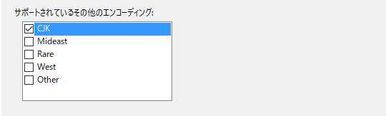
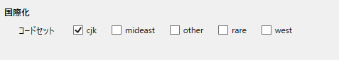

////
|metadata|
{
    "name": "xambarcode-adding-barcode-in-code-behind",
    "controlName": ["{BarcodesName}"],
    "tags": [],
    "guid": "c9440732-d400-48ca-b652-e73ded16274f",
    "buildFlags": [],
    "createdOn": "2015-09-23T20:39:17.4464668Z"
}
|metadata|
////

= コードビハインドでバーコードを追加

== 始める前に

このトピックではユーザーができるだけ早く操作に慣れることができるよう、pick:[wpf,android,win-forms="{Barcode128Name}™"]pick:[xamarin="{BarcodeQRName}™"] を[wpf="ページ"]pick:[android,win-forms,xamarin="アプリケーション"]に追加する際の最低限必要な手順について説明します。

== 達成すること

基本的な pick:[wpf,android,win-forms="{Barcode128Name}"]pick:[xamarin="{BarcodeQRName}"] コントロールをpick:[wpf="ページ"]pick:[android,win-forms="アプリケーション"]に追加します。

== 次の手順を実行します
[start=1]
ifdef::wpf,win-forms,android[]
. {PlatformName} アプリケーションを作成します。
endif::wpf,win-forms,android[]
ifdef::xamarin[]
. Xamarin.Forms アプリケーション プロジェクトを作成します。
endif::xamarin[]
[start=2]
ifdef::win-forms,android[]
. 以下のpick:[wpf,win-forms="参照"]pick:[android="jars"]をプロジェクトに追加します。
endif::win-forms,android[]

ifdef::wpf[]

. 以下の NuGet パッケージ参照をプロジェクトに追加します。

** Infragistics.WPF.Barcodes

+
NuGet フィードのセットアップと NuGet パッケージの追加の詳細については、link:nuget-feeds.html[NuGet フィード] ドキュメントを参照してください。

endif::wpf[]

ifdef::win-universal[]

** {ApiPlatform}dll
** {ApiPlatform}DataVisualization.dll
** {ApiPlatform}Controls.Barcodes.dll
** {ApiPlatform}Encoding.dll (QR Code のみ)

endif::win-universal[]
 
ifdef::xamarin[]

. link:xamarin-project-with-infragistics-controls.html#NuGetPackages[NuGet パッケージで参照を追加します。]

.注:
[NOTE]
====
CJK エンコードのサポートをプロジェクトに追加します。

Android プロジェクトの場合 - Android プロジェクトのプロパティを開き、[Android オプション] タブを選択し、[サポートされているその他のエンコーディング] セクションで CJK エンコードをチェックします。

iOS プロジェクトの場合 - iOS プロジェクトのプロパティを開き、[iOS ビルド] タブを選択し、[国際化] セクションで CJK コードセットをチェックします。

====

endif::xamarin[]

ifdef::android[]
** Infragistics.Barcode jar
** Infragistics.DV.Shared.jar
** Infragistics.UI.jar

endif::android[]

ifdef::win-forms[]
** Infragistics4.Win.DataVisualization.Barcode
** Infragistics4.Win.DataVisualization.Shared
** Infragistics4.Win.Portable.Core

endif::win-forms[]

[start=3]
. アプリケーションに以下の名前空間を追加します。

ifdef::wpf[]
*Visual Basic の場合:*
[source,vb]
----
Imports Infragistics.Controls.Barcodes
----
*In C#:*
[source,csharp]
----
using Infragistics.Controls.Barcodes;
----
endif::wpf[]

ifdef::xamarin[]
*C# の場合:*
[source,csharp]
----
using Infragistics.XamarinForms.Controls.Barcodes;
----
endif::xamarin[]

ifdef::win-forms[]

*Visual Basic の場合:*
[source,vb]
----
Imports Infragistics.Win.DataVisualization
----

*C# の場合:*
[source,csharp]
----
using Infragistics.Win.DataVisualization;
----

endif::win-forms[]

ifdef::android[]

*Java の場合:*

----
import com.infragistics.controls.Code128BarcodeView;
import com.infragistics.controls.QRCodeBarcodeView;
----

endif::android[]

[start=4]
. バーコード記号を選択します。 pick:[wpf="UserControl_Loaded イベント ハンドラーに、選択した xamBarcode 記号のインスタンスを追加し、Barcode と名前を付けます。"] 

ifdef::android,wpf,win-forms[]
注: 各バーコード記号は、個別のコントロールです。
endif::android,wpf,win-forms[]

*{BarcodesName} 記号タイプ:*

ifdef::android,wpf,win-forms[]
* link:xambarcode-configuring-code128.html[コード 128 の構成]
endif::android,wpf,win-forms[]
* link:xambarcode-configuring-qr-code.html[QR コードの構成]

ifdef::wpf,win-forms[]
* link:xambarcode-xamcode39barcode.html[コード 39]
* link:xambarcode-xameanupcbarcode.html[Ean/Upc]
* link:xambarcode-xaminterleaved2of5barcode.html[Interleaved 2 Of 5]
* link:xambarcode-xamgs1databarbarcode.html[GS1 DataBar]
* link:xambarcode-xamintelligentmailbarcode.html[Intelligent Mail]
* link:xambarcode-xamroyalmailbarcode.html[Royal Mail]
* link:xambarcode-xampdf417barcode.html[PDF 417]
* link:xambarcode-xammaxicodebarcode.html[Maxi Code]
endif::wpf,win-forms[]

ifdef::wpf,win-forms[]

*Visual Basic の場合:*
[source,vb]
----
Dim Barcode As New {Barcode128Name}()
----

*C# の場合:*
[source,csharp]
----
var Barcode = new {Barcode128Name}();
----

endif::wpf,win-forms[]

ifdef::xamarin[]

*C# の場合:*
[source,csharp]
----
var Barcode = new {BarcodeQRName}();
----

endif::xamarin[]

ifdef::android[]

*Java の場合:*

----
{Barcode128Name} Barcode = new {Barcode128Name}();
----

endif::android[]

[start=5]
. 値をコントロールの Data プロパティに指定します。

ifdef::wpf,win-forms[]

*Visual Basic の場合:*
[source,vb]
----
Barcode.Data = "Code128"
----

*C# の場合:*
[source,csharp]
----
Barcode.Data = "Code128";
----

endif::wpf,win-forms[]

ifdef::xamarin[]

*C# の場合:*
[source,csharp]
----
Barcode.Data = "QRBarcode";
----

endif::xamarin[]

ifdef::android[]

*Java の場合:*

----
Barcode.setData("Code128");
----

endif::android[]

[start=6]
. コントロールのインスタンスをメイン ビューに追加します。

ifdef::wpf[]

*Visual Basic の場合:*
[source,vb]
----
Me.LayoutRoot.Children.Add(Barcode)
----

*C# の場合:*
[source,csharp]
----
this.LayoutRoot.Children.Add(Barcode);
----

endif::wpf[]

ifdef::xamarin[]

*C# の場合:*
[source,csharp]
----
this.LayoutRoot.Children.Add(Barcode);
----

endif::xamarin[]

ifdef::win-forms[]

*Visual Basic の場合:*
[source,vb]
----
this.Controls.Add(Barcode)
----

*C# の場合:*
[source,csharp]
----
this.Controls.Add(Barcode);
----

endif::win-forms[]

ifdef::android[]

*Java の場合:*

----
sampleContainer.addView(Barcode);
----

endif::android[]

[start=7]
. アプリケーションを保存して実行します。

ifdef::wpf,win-forms[]

image::images/xamBarcode_Adding_Code128_01.png[]

endif::wpf,win-forms[]