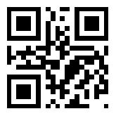
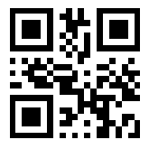
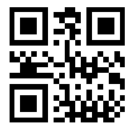

////
|metadata|
{
    "name": "xambarcode-configuring-qr-code",
    "controlName": ["{BarcodesName}"],
    "tags": [],
    "guid": "936860ed-ef6a-47ad-98f6-1d5dfb0b40de",  
    "buildFlags": [],
    "createdOn": "2015-09-23T20:38:04.7581431Z"
}
|metadata|
////

= QR コードの構成

QR (Quick Response) バーコード記号は、行列コードです。QR スキャナー、カメラ付き携帯電話、スマートフォンで読み込むことができます。このバーコード記号は、コンテンツが高速でデコードできるため、2 次元バーコードで最も人気のあるタイプの 1 つです。

コードは、全体的に四角いパターンに配列された黒の四角形のモジュール配列から構成されます。記号の 3 つの角に固有の検索パターンが含まれます。モジュール ディメンションは、広範な技術でユーザー指定の記号生成を可能にします。

ifdef::xamarin[]

.注:
[NOTE]
====
CJK エンコードのサポートをプロジェクトに追加します。

Android プロジェクトの場合 - Android プロジェクトのプロパティを開き、[Android オプション] タブを選択し、[サポートされているその他のエンコーディング] セクションで CJK エンコードをチェックします。

image::images/xamBarcode_Android_Encodings.png[]

iOS プロジェクトの場合 - iOS プロジェクトのプロパティを開き、[iOS ビルド] タブを選択し、[国際化] セクションで CJK コードセットをチェックします。

image::images/xamBarcode_iOS_Codesets.png[]

====

endif::xamarin[]

以下は {BarcodeQRName} 記号に固有なプロパティです。

* link:{BarcodesLink}.{BarcodeQRName}{ApiProp}errorcorrectionlevel.html[ErrorCorrectionLevel]
* link:{BarcodesLink}.{BarcodeQRName}{ApiProp}sizeversion.html[SizeVersion]
* link:{BarcodesLink}.{BarcodeQRName}{ApiProp}encodingmode.html[EncodingMode]
* link:{BarcodesLink}.{BarcodeQRName}{ApiProp}ecinumber.html[EciNumber]
* link:{BarcodesLink}.{BarcodeQRName}{ApiProp}fnc1mode.html[Fnc1Mode]
* link:{BarcodesLink}.{BarcodeQRName}{ApiProp}applicationindicator.html[ApplicationIndicator]

== エラー修正レベル

QRCode は、バーコードが損傷したり汚れた場合、エンコードされたデータを復元する機能があります。ユーザーは、{BarcodeQRName} コントロールの ErrorCorrectionLevel プロパティで設定されたユースケースに従って 4 つのエラーの修正レベルから選択できます。
ifdef::xaml[]

*XAML の場合:* 

[source,xaml]
----
<ig:XamQRCodeBarcode
    x:Name="Barcode"
    Data="QR Code"
    ErrorCorrectionLevel="Medium" />
----
endif::xaml[]

ifdef::wpf[]

*Visual Basic の場合:*

[source,vb]
----
Dim Barcode As New XamQRCodeBarcode()
Barcode.Data = "QR Code"
Barcode.ErrorCorrectionLevel = QRCodeErrorCorrectionLevel.Medium
----
endif::wpf[]

ifdef::xaml[]

*C# の場合:*

[source,csharp]
----
XamQRCodeBarcode Barcode = new XamQRCodeBarcode();
Barcode.Data = "QR Code";
Barcode.ErrorCorrectionLevel = QRCodeErrorCorrectionLevel.Medium;
----
endif::xaml[]

ifdef::android[]

*Java の場合:*

----
QRCodeBarcodeView QRBar = new QRCodeBarcodeView();
QRBar.setData("QR Code");
QRBar.setErrorCorrectionLevel(QRCodeErrorCorrectionLevel.Medium);
----
endif::android[]

ifdef::win-forms[]

*Visual Basic の場合:*

[source,vb]
----
Dim barcodeQR As New UltraQRCodeBarcode With
{
    .Data = "QR Code",
    .ErrorCorrectionLevel = QRCodeErrorCorrectionLevel.Medium
}
Me.Controls.Add(barcodeQR)
----

endif::win-forms[]

ifdef::win-forms[]

*C# の場合:*

[source,csharp]
----
var barcodeQR = new UltraQRCodeBarcode
{
    Data = "QR Code",
    ErrorCorrectionLevel = QRCodeErrorCorrectionLevel.Medium
};
this.Controls.Add(barcodeQR);
----

endif::win-forms[]

== サイズ バージョン

各サイズ バージョンのモジュール数は異なります (モジュールは QR コード マトリックスを構成する黒と白のモジュールを参照します)。

* Undefined – このサイズ バージョンは、{BarcodeQRName} に固有で、データに適応する最小のバージョンを内部で計算します。
* Version1 - 21x21 モジュール;
* …
* Version40 – 177x177 モジュール。

{BarcodeQRName} コントロールのサイズ バージョンは、SizeVersion プロパティを介して設定します。

ifdef::xaml[]

*XAML の場合:* 

[source,xaml]
----
<ig:XamQRCodeBarcode
    x:Name="Barcode"
    Data="Infragistics"
    SizeVersion="Version1" />
----
endif::xaml[]

ifdef::wpf[]

*Visual Basic の場合:*

[source,vb]
----
Dim Barcode As New XamQRCodeBarcode()
Barcode.Data = "Infragistics"
Barcode.SizeVersion = SizeVersion.Version1
----
endif::wpf[]

ifdef::xaml[]

*C# の場合:*

[source,csharp]
----
XamQRCodeBarcode Barcode = new XamQRCodeBarcode();
Barcode.Data = "Infragistics";
Barcode.SizeVersion = SizeVersion.Version1;
----
endif::xaml[]

ifdef::android[]
*Java の場合:*

----
QRCodeBarcodeView QRBar = new QRCodeBarcodeView();
QRBar.setData("Infragistics");
QRBar.setSizeVersion(SizeVersion.Version1);
----
endif::android[]

ifdef::win-forms[]

*Visual Basic の場合:*

[source,vb]
----
Dim barcodeQR As New UltraQRCodeBarcode With
{  
    .Data = "Infragistics",
    .SizeVersion = SizeVersion.Version1
}
Me.Controls.Add(barcodeQR)
----
endif::win-forms[]

ifdef::win-forms[]

*C# の場合:*

[source,csharp]
----
var barcodeQR = new UltraQRCodeBarcode
{
  Data = "Infragistics",  
  SizeVersion = SizeVersion.Version1
};
this.Controls.Add(barcodeQR);
----

endif::win-forms[]

image::images/xamBarcode_Adding_QR_Code_01.png[]

== エンコード モード

QR Code は、Data 文字のタイプに応じて、圧縮することで大量の文字をエンコードできます。EncodingMode を Kanji に設定すると、記号表示は JIS Kanji 文字もエンコードできます (漢字のみがエンコードされます)。

[NOTE]
====
注: 現在のバージョンの {BarcodeQRName} は文字固有のプラットフォームをサポートしません (4 バイトでエンコード)。
====

{BarcodeQRName} コントロールのエンコーディング モードを Undefined に設定した場合、コントロールは内部でモードを切り替え、文字データ タイプに最も効率的な圧縮を行います。

EncodingMode プロパティで {BarcodeQRName} コントロールのデータの比較モードを明白に設定します。

ifdef::xaml[]

*XAML の場合:* 

[source,xaml]
----
<ig:XamQRCodeBarcode
    x:Name="Barcode"
    Data="123"
    EncodingMode="Numeric" />
----
endif::xaml[]

ifdef::wpf[]

*Visual Basic の場合:*

[source,vb]
----
Dim Barcode As New XamQRCodeBarcode()
Barcode.Data = "123"
Barcode.EncodingMode = EncodingMode.Numeric
----
endif::wpf[]

ifdef::xaml[]

*C# の場合:*

[source,csharp]
----
XamQRCodeBarcode Barcode = new XamQRCodeBarcode();
Barcode.Data = "123";
Barcode.EncodingMode = EncodingMode.Numeric;
----
endif::xaml[]

ifdef::android[]
*Java の場合:*

----
QRCodeBarcodeView QRBar = new QRCodeBarcodeView();
QRBar.setData("123");
QRBar.setEncodingMode(EncodingMode.Numeric);
----
endif::android[]

ifdef::win-forms[]

*Visual Basic の場合:*

[source,vb]
----
Dim barcodeQR As New UltraQRCodeBarcode With
{
    .Data = "123",
    .EncodingMode = EncodingMode.Numeric
}
Me.Controls.Add(barcodeQR)
----

endif::win-forms[]

ifdef::win-forms[]

*C# の場合:*

[source,csharp]
----
var barcodeQR = new UltraQRCodeBarcode
{
  Data = "123", 
  EncodingMode = EncodingMode.Numeric
};
this.Controls.Add(barcodeQR);
----

endif::win-forms[]

image::images/xamBarcode_Adding_QR_Code_05.png[]

== Extended Channel Interpretation (ECI) 番号

{BarcodeQRName} コントロールは、ECI をサポート - コントロールでデフォルト (ISO/IEC 8859-1) 以外の文字セットのデータをエンコードできます。 ECI コードは、{BarcodeQRName} コントロールの EciNumber プロパティで設定します。

サポートされる ECI 値と対応する文字セットについては、ページの一番下の表を参照してください。EciNumber を -1 (デフォルト値) に設定した場合に、文字値と割り当てがデフォルト ECI に関連付けされ、ECI プロトコルがデータエンコーディングに使用されないことに注意してください。{BarcodeQRName} コントロールは指定した文字セットの文字のみエンコードすることに注意してください。

ギリシャ文字でデータがエンコードされる場合、ISO/IEC 8859-7 (ECI 000009) を使用します。

ifdef::xaml[]

*XAML の場合:* 

[source,xaml]
----
<ig:XamQRCodeBarcode x:Name="Barcode"
                     EciNumber="9"
                     Data="ΑΒΓΔΕ"
                     EciHeaderDisplayMode="Show"/>
----
endif::xaml[]

ifdef::wpf[]

*Visual Basic の場合:*

[source,vb]
----
Dim Barcode As New XamQRCodeBarcode()
Barcode.EciNumber = 9
Barcode.Data = "ΑΒΓΔΕ"
EciHeaderDisplayMode = HeaderDisplayMode.Show
----
endif::wpf[]

ifdef::xaml[]

*C# の場合:*

[source,csharp]
----
XamQRCodeBarcode Barcode = new XamQRCodeBarcode();
Barcode.EciNumber = 9
Barcode.Data = "ΑΒΓΔΕ";
EciHeaderDisplayMode = HeaderDisplayMode.Show;
----
endif::xaml[]

ifdef::android[]
*Java の場合:*

----
QRCodeBarcodeView QRBar = new QRCodeBarcodeView();
QRBar.setEciNumber(9);
QRBar.setData("ΑΒΓΔΕ");
QRBar.setEciHeaderDisplayMode(HeaderDisplayMode.Show);
----
endif::android[]

ifdef::win-forms[]

*Visual Basic の場合:*

[source,vb]
----
Dim barcodeQR As New UltraQRCodeBarcode With
{
  .EciNumber = 9,
  .Data = "ΑΒΓΔΕ",
  .EciHeaderDisplayMode = HeaderDisplayMode.Show
}
Me.Controls.Add(barcodeQR)
----

endif::win-forms[]

ifdef::win-forms[]

*C# の場合:*

[source,csharp]
----
var barcodeQR = new UltraQRCodeBarcode
{
    EciNumber = 9,
    Data = "ΑΒΓΔΕ",
    EciHeaderDisplayMode = HeaderDisplayMode.Show
};
this.Controls.Add(barcodeQR);
----

endif::win-forms[]

== FNC1 モード

FNC1 モードは、エンコード データの形式を指定するために使用します。データが GS1 一般仕様、または以前 AIM Inc. によって合意された特定の産業アプリケーションに対応しデータ書式の産業モードに対応するための書式を指定する Gs1 モードを選択できます。FNC1 モードは記号全体に適用され、次のモード インジケーターによる影響はありません。

ECI コードは、{BarcodeQRName} コントロールの Fnc1Mode プロパティで設定します。

ifdef::xaml[]

*XAML の場合:* 

[source,xaml]
----
<ig:XamQRCodeBarcode
    x:Name="Barcode"
    Fnc1Mode="Gs1"
    Data="(15)970331" />
----
endif::xaml[]

ifdef::wpf[]

*Visual Basic の場合:*

[source,vb]
----
Dim Barcode As New XamQRCodeBarcode()
Barcode.Fnc1Mode = Fnc1Mode.Gs1
Barcode.Data = "(15)970331"
----
endif::wpf[]

ifdef::xaml[]

*C# の場合:*

[source,csharp]
----
XamQRCodeBarcode Barcode = new XamQRCodeBarcode();
Barcode.Fnc1Mode = Fnc1Mode.Gs1;
Barcode.Data = "(15)970331";
----
endif::xaml[]

ifdef::android[]
*Java の場合:*

----
QRCodeBarcodeView QRBar = new QRCodeBarcodeView();
QRBar.setFnc1Mode(Fnc1Mode.Gs1);
QRBar.setData("(15)970331");
----
endif::android[]

ifdef::win-forms[]

*Visual Basic の場合:*

[source,vb]
----
Dim barcodeQR As New UltraQRCodeBarcode With
{
  .Data = "(15)970331",
  .Fnc1Mode = Fnc1Mode.Gs1
}
Me.Controls.Add(barcodeQR)
----

endif::win-forms[]

ifdef::win-forms[]

*C# の場合:*

[source,csharp]
----
var barcodeQR = new UltraQRCodeBarcode
{
  Data = "(15)970331",
  Fnc1Mode = Fnc1Mode.Gs1
};
this.Controls.Add(barcodeQR);
----

endif::win-forms[]

image::images/xamBarcode_Adding_QR_Code_02.png[]

ifdef::wpf,win-forms[]
GS1 General Specification コードについては、この link:xambarcode-configuring-code128.html[ページ]の一番下の表を参照してください。
endif::wpf,win-forms[]

== アプリケーション インジケーター

アプリケーション インジケーター プロパティは、{BarcodeQRName} コントロールの Fnc1 モード プロパティを Industry に設定したときに使用されます。AIM Inc. の関連仕様を識別します。

[NOTE]
====
注: {BarcodeQRName} は、Structured Append モードおよび Micro QR コード形式をサポートしません。この機能は、コントロールの以降のいずれかのバージョンでサポート予定です。
====

ifdef::xaml,win-forms[]
== コード宣言付きのサンプル画像:
endif::xaml,win-forms[]

ifdef::xaml[]
*XAML の場合:*
 
[source,xaml]
----
<ig:XamQRCodeBarcode
    x:Name="Barcode"
    Data="http://www.infragistics.com" />
----

ifdef::wpf[]

*Visual Basic の場合:*

[source,vb]
----
Dim Barcode As New XamQRCodeBarcode()
Barcode.Data = "http://www.infragistics.com"
----
endif::wpf[]

*C# の場合:*

[source,csharp]
----
XamQRCodeBarcode Barcode = new XamQRCodeBarcode();
Barcode.Data = "http://www.infragistics.com";
----
endif::xaml[]

ifdef::android[]
*Java の場合:*

----
QRCodeBarcodeView QRBar = new QRCodeBarcodeView();
QRBar.setData(http://www.infragistics.com);
----
endif::android[]

ifdef::win-forms[]

*Visual Basic の場合:*

[source,vb]
----
Dim barcodeQR As New UltraQRCodeBarcode With
{
  .Data = "http://www.infragistics.com"
}
Me.Controls.Add(barcodeQR)
----

endif::win-forms[]

ifdef::win-forms[]

*C# の場合:*

[source,csharp]
----
var barcodeQR = new UltraQRCodeBarcode
{
  Data = "http://www.infragistics.com"
};
this.Controls.Add(barcodeQR);
----

endif::win-forms[]

image::images/xamBarcode_Adding_QR_Code_03.png[]

ifdef::xaml[]
*XAML の場合:*

[source,xaml]
----
<ig:XamQRCodeBarcode
    x:Name="Barcode"
    Data="愛"
    EncodingMode="Kanji" />
----
endif::xaml[]

ifdef::wpf[]

*Visual Basic の場合:*

[source,vb]
----
Dim Barcode As New XamQRCodeBarcode()
Barcode.Data = "愛"
Barcode.EncodingMode = EncodingMode.Kanji
----
endif::wpf[]

ifdef::xaml[]

*C# の場合:*

[source,csharp]
----
XamQRCodeBarcode Barcode = new XamQRCodeBarcode();
Barcode.Data = "愛";
Barcode.EncodingMode = EncodingMode.Kanji;
----
endif::xaml[]

ifdef::android[]
*Java の場合:*

----
QRCodeBarcodeView QRBar = new QRCodeBarcodeView();
QRBar.setData("愛");
QRBar.setEncodingMode(EncodingMode.Kanji);
----
endif::android[]

ifdef::win-forms[]

*Visual Basic の場合:*

[source,vb]
----
Dim barcodeQR As New UltraQRCodeBarcode With
{
  .Data = "愛",
  .EncodingMode = EncodingMode.Kanji
}
Me.Controls.Add(barcodeQR)
----

endif::win-forms[]

ifdef::win-forms[]

*C# の場合:*

[source,csharp]
----
var barcode = new UltraQRCodeBarcode
{
    Data = "愛",
    EncodingMode = EncodingMode.Kanji
};
this.Controls.Add(barcodeQR);
----

endif::win-forms[]

== サポートされる ECI 番号

[options="header", cols="a,a"]
|====
|ECI 番号|ISO 文字セット

|0
|CP 437

|1
|ISO-8859-1

|2
|CP 437

|3
|ISO-8859-1

|4
|ISO-8859-2

|5
|ISO-8859-3

|6
|ISO-8859-4

|7
|ISO-8859-5

|8
|ISO-8859-6

|9
|ISO-8859-7

|10
|ISO-8859-8

|11
|ISO-8859-9

|13
|ISO-8859-11

|15
|ISO-8859-13

|17
|ISO-8859-15

|20
|Shift JIS

|21
|Windows-1250

|22
|Windows-1251

|23
|Windows-1252

|24
|Windows-1256

|25
|UTF-16

|26
|UTF-8

|27
|ISO-646-US

|28
|Big5

|29
|GB 2312

|30
|KSC-5601

|====