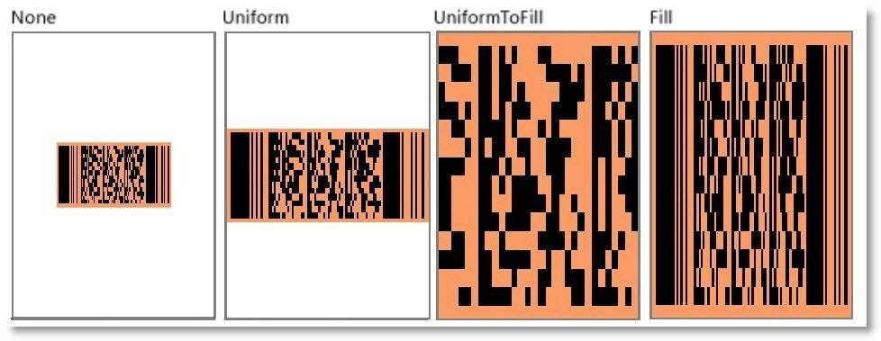

////
|metadata|
{
    "name": "xambarcode-stretch",
    "controlName": ["{BarcodesName}"],
    "tags": [],
    "guid": "cbaba02d-8411-42ef-b1c2-f362e4529f06",
    "buildFlags": ["XAML","WINFORMS"],
    "createdOn": "2015-09-23T20:40:56.1283956Z"
}
|metadata|
////

= 伸縮の構成

link:{BarcodesLink}.{BarcodesRoot}{ApiProp}stretch.html[Stretch] プロパティのメンバー:

* Fill - コンテンツは、指定先の寸法を満たすためにサイズ変更されます。コンテンツの高さと幅は単独で拡大縮小されるため、画像の元のアスペクト比は保持されません。これがバーコードが読み取りに使用される時この値を使用することを推奨しない理由です (読み取りには None または Uniform を使用します)。コントロールをアニメーションと使用する時この値は適しています。
* None - コンテンツは名目上の寸法を保持します。
* Uniform - コンテンツは、指定先の寸法に収めるためにサイズ変更され、ネイティブ アスペクト比は保持されます。これがデフォルト値です。
* UniformToFill - コンテンツは、指定先の寸法に完全に収めるためにサイズ変更され、ネイティブ アスペクト比は保持されます。指定先の四角形のアスペクト比がソースと異なる場合、ソース コンテンツは切り取られます。

以下の図は、異なる Stretch 設定を示します。

== Stretch プロパティの設定

ifdef::wpf[]

*XAML の場合:*
[source,xaml]
----
<ig:{Barcode128Name} x:Name="Barcode" Stretch="Fill" />
----

endif::wpf[]

ifdef::xamarin[]
*XAML の場合:*
[source,xaml]
----
<ig:{BarcodeQRName} x:Name="Barcode" Stretch="Fill" />
----

*C# の場合:*
[source,csharp]
----
var Barcode = new {BarcodeQRName}();
Barcode.Stretch = BarcodeStretch.Fill;
----
endif::xamarin[]

ifdef::wpf,win-forms[]

*Visual Basic の場合:*
[source,vb]
----
Dim Barcode As New {Barcode128Name}()
Barcode.Stretch = Stretch.Fill
----

*C# の場合:*
[source,csharp]
----
var Barcode = new {Barcode128Name}();
Barcode.Stretch = Stretch.Fill;
----

endif::wpf,win-forms[]

ifdef::android[]

*Java の場合:*

----
{Barcode128Name} Barcode = new {Barcode128Name}();
Barcode.Stretch = Stretch.Fill;
----

endif::android[]
