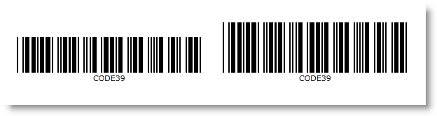

////
|metadata|
{
    "name": "xambarcode-widthtoheightratio",
    "controlName": ["{BarcodesName}"],
    "tags": [],
    "guid": "42a60ab4-0c94-48ce-8789-fad226d9698c",
    "buildFlags": [],
    "createdOn": "2015-09-23T20:41:02.0969289Z"
}
|metadata|
////

= WidthToHeight Ratio の構成

link:{BarcodesLink}.{BarcodesBase}{ApiProp}widthtoheightratio.html[WidthToHeightRatio] プロパティ (すべてのバーコード グリッド記号の pick:[xaml="、MaxiCode を除く"] ) はバーコード行の高さの比率を定義します。リニア記号では、XDimension プロパティ値に基づいてバーの高さの比率を定義します。つまり、barcode. pick:[android="set"] WidthToHeight = 30 の場合、バーの高さが 30$$*$$barcode.XDimensionであることを意味します。このプロパティは、Stretch.None が使用され Height が指定されていない時、記号のバーの高さを定義するために使用されます。各バーコードの最小値は、デフォルト値として設定されます。

ifdef::xaml[]
GS1 DataBar ファミリ コントロールでは、WidthToHeight プロパティは 全体的なシンボルの高さを定義し、1 行だけの高さを定義するものではありません。一部のコード タイプ (Stacked、StackedOmnidirectional、ExpandedStacked) では、Height は記号の行ごとに異なるため、これは必要です。
endif::xaml[]

pick:[xaml="*2 つのバーコード間の比較です。*"]

ifdef::xaml,win-forms[]

endif::xaml,win-forms[]

ifdef::xaml[]
*XAML の場合:*

----
<ig:{Barcode128Name}
	x:Name="barcode1"
	Data="CODE Data"
    Stretch="None" 
    WidthToHeightRatio="25" />

<ig:{Barcode128Name}
	x:Name="barcode2"
	Data="CODE Data"
    Stretch="None" 
    WidthToHeightRatio="35" />
----
endif::xaml[]

ifdef::xaml,win-forms[]

*Visual Basic の場合:*

----
Dim barcode1 As New {Barcode128Name} With _
{
  .Stretch = 320, _  
  .Data = "Code Data", _
  .WidthToHeightRatio = 25 _
}
Dim barcode2 As New {Barcode128Name} With _
{
  .Stretch = 320, _  
  .Data = "Code Data", _
  .WidthToHeightRatio = 35 _
}
----

*C# の場合:*

----
var barcode1 = new {Barcode128Name}
{
  Width = 320,
  Data = "Code Data",  
  WidthToHeightRatio = 25
};
var barcode2 = new {Barcode128Name}
{
  Width = 320,
  Data = "Code Data",  
  WidthToHeightRatio = 35
};
----
endif::xaml,win-forms[]

ifdef::android[]

*Java の場合:*

----
{Barcode128Name} barcode1 = new {Barcode128Name};
barcode1.setData("Code Data");
barcode1.setStretch(Stretch.None);
barcode1.setWidthToHeightRatio("25");

{Barcode128Name} barcode2 = new {Barcode128Name};
barcode2.setData("Code Data");
barcode2.setStretch(Stretch.None);
barcode2.setWidthToHeightRatio("35");
----
endif::android[]
