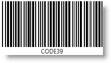

////

|metadata|
{
    "name": "xambarcode-xamcode39barcode",
    "controlName": ["{BarcodesName}"],
    "tags": ["Application Scenarios"],
    "guid": "d5285fae-a3c8-4296-ad8c-df1b3b6dacf5",  
    "buildFlags": ["wpf"],
    "createdOn": "2012-01-23T16:12:14.6151029Z"
}
|metadata|
////

= Code 39

{Barcode39Name} は Code 39 記号を生成します (USS Code 39、Code 3 of 9 としても知られている) 。これはリテール以外の環境で使用されるように開発された最初の英数字記号です。すべてのバーコード リーダーでデコードでき、

可変長のフォーマットの Data 値は、以下の 43 文字を受け付けます: 0123456789ABCDEFGHIJKLMNOPQRSTUVWXYZ-.$/+% およびスペース。必要な時には、コントロール プロパティ ShouldGenerateChecksum が True に設定されると、記号の最後にモジュロ 32 アルゴリズムに基づいたチェックサム デジットを追加できます。

コントロール プロパティ Extended が True に設定されると、XamCode39Barcode はフル ASCII サポートで Extended Code 39 もサポートします。

== pick:[xaml="XAML "]コード宣言付きのサンプル画像:

ifdef::xaml[]
*XAML の場合:*

----
<ig:XamCode39Barcode x:Name="Barcode" Data="CODE39" />
----
endif::xaml[]

*Visual Basic の場合:*

----
Dim Barcode As New {Barcode39Name}()
Barcode.Data = "CODE39"
----

*C# の場合:*

----
{Barcode39Name} Barcode = new {Barcode39Name}();
Barcode.Data = "CODE39";
----

ifdef::xaml[]
*XAML の場合:*

----
<ig:XamCode39Barcodex:Name="Barcode"  Data="code39" Extended="True" ShouldGenerateChecksum="True" />
----
endif::xaml[]

*Visual Basic の場合:*

----
Dim Barcode As New {Barcode39Name}()
Barcode.Data = "code39"
Barcode.Extended = True
Barcode.ShouldGenerateChecksum = True
----

*C# の場合:*

----
{Barcode39Name} Barcode = new {Barcode39Name}();
Barcode.Data = "code39";
Barcode.Extended = true;
Barcode.ShouldGenerateChecksum = true;
----

image::images/xamBarcode_XamCode39Barcode_02.png[]