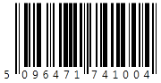
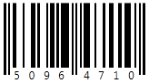
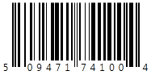

////

|metadata|
{
    "name": "xambarcode-xameanupcbarcode",
    "controlName": ["{BarcodesName}"],
    "tags": ["Application Scenarios"],
    "guid": "03c2c5c6-65af-4cab-b602-d405bdc6dde3",  
    "buildFlags": ["wpf"],
    "createdOn": "2012-01-23T16:12:14.6201034Z"
}
|metadata|
////

= Ean/Upc

{BarcodeEanUpcName} は CodeType プロパティ値によって設定される以下の数値記号をサポートします。

* EAN-13 - CodeType=”Ean13” で設定されます。この記号は、12 桁の数値文字をエンコードして、それ自体が Data 値の一部でない 1 桁のチェック デジットを追加します。

EAN13 データは以下の情報で構成されます : ナンバー システムに 1 桁、メーカー コードに 6 桁、製品コードに 5 桁、そしてチェック デジットが 1 桁です。ナンバー システムはバーコードの左側に配置されます。

メーカー コードと製品コードはバーコードの下にガード バーに区切られて配置されます。

ifdef::xaml[]
*XAML の場合:*

----
<ig:XamEanUpcBarcode x:Name="Barcode" CodeType="Ean13" Data="509647174100" />
----
endif::xaml[]

*Visual Basic の場合:*

----
Dim Barcode As New {BarcodeEanUpcName}()
Barcode.Data = "509647174100"
Barcode.CodeType = EanUpcCodeType.Ean13
----

*C# の場合:*

----
{BarcodeEanUpcName} Barcode = new {BarcodeEanUpcName}();
Barcode.Data = "509647174100";
Barcode.CodeType = EanUpcCodeType.Ean13;
----

* EAN-8 - CodeType=”Ean8” で設定されます。この記号は 7 桁をエンコードして、それ自体がデータ値の一部でない最後の文字として 1 桁のチェック デジットを計算します。

最初の 2 桁または 3 桁は番号管理組織を識別し残りの桁は製品を識別します。

ifdef::xaml[]
*XAML の場合:*

----
<ig:XamEanUpcBarcode x:Name="Barcode" CodeType="Ean8" Data="5096471" />
----
endif::xaml[]

*Visual Basic の場合:*

----
Dim Barcode As New {BarcodeEanUpcName}()
Barcode.Data = "5096471"
Barcode.CodeType = EanUpcCodeType.Ean8
----

*C# の場合:*

----
{BarcodeEanUpcName} Barcode = new {BarcodeEanUpcName}();
Barcode.Data = "5096471";
Barcode.CodeType = EanUpcCodeType.Ean8;
----

* UPC-A - CodeType=”UpcA” で設定されます。この記号は 11 桁をエンコードして、それ自体がデータでない追跡チェック デジットを追加します。

ifdef::xaml[]
*XAML の場合:*

----
<ig:XamEanUpcBarcode x:Name="Barcode" CodeType="UpcA" Data="50947174100" />
----
endif::xaml[]

*Visual Basic の場合:*

----
Dim Barcode As New {BarcodeEanUpcName}()
Barcode.Data = "509647174100"
Barcode.CodeType = EanUpcCodeType.UpcA
----

*C# の場合:*

----
{BarcodeEanUpcName} Barcode = new {BarcodeEanUpcName}();
Barcode.Data = "509647174100";
Barcode.CodeType = EanUpcCodeType.UpcA;
----

* UPC-E - CodeType=”UpcE” で設定されます。UPC-E バーコード シンボルは、ゼロで始まり定義された位置に 4 つまたは 5 つのゼロの連続を含む GTIN-12 要素文字列をエンコードするために使用されます。ゼロは、GTIN-8 要素文字列を含むためにゼロ抑制プロセスによってエンコーディングの間にデータから削除されます。

GTIN-8 要素文字列がデータ値として渡される場合、すでに実行済みであると考えてゼロ プロセスは適用されません。データが 6 桁または 10 桁長の値を受け入れることができることに注意してください。この場合、このコントロールは先頭に 0 を追加します。データが 7 または 11 桁長の場合、コントロールはその存在をチェックするだけです。

バーコード シンボルの右側に印刷される最終桁はオリジナルの UPC-A シンボルのチェック デジット文字であり、それ自体はデータ値の一部ではありません。

UPC-A 記号データ値は以下の情報で構成されます : ナンバー システムのデコーディングに 1 桁、メーカー コードに 5 桁、製品コードに 5 桁、そしてチェック デジットが 1 桁です。

ナンバー システムはバーコードの左側に配置されます。メーカー コードと製品コードはバーコードの下にガード バーに区切られて印刷されます。チェック デジットは最後です。

ifdef::xaml[]
*XAML の場合:*

----
<ig:XamEanUpcBarcode x:Name="Barcode" CodeType="UpcE" Data="0696471" />
----
endif::xaml[]

*Visual Basic の場合:*

----
Dim Barcode As New {BarcodeEanUpcName}()
Barcode.Data = "0696471"
Barcode.CodeType = EanUpcCodeType.UpcE
----

*C# の場合:*

----
{BarcodeEanUpcName} Barcode = new {BarcodeEanUpcName}();
Barcode.Data = "0696471";
Barcode.CodeType = EanUpcCodeType.UpcE;
----

image::images/xamBarcode_XamEanUpcBarcode_01.png[]