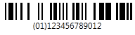
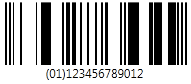
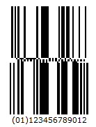
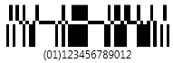

////

|metadata|
{
    "name": "xambarcode-xamgs1databarbarcode",
    "controlName": ["{BarcodesName}"],
    "tags": ["Application Blocks","Application Scenarios"],
    "guid": "76635c9c-bb4e-4e0e-9535-ca285bb3c8c2",  
    "buildFlags": ["wpf"],
    "createdOn": "2012-01-23T16:12:14.6221036Z"
}
|metadata|
////

= GS1 DataBar

GS1 DataBar はデータをエンコードするコード記号で、 AI で始まり GTIN が後ろに続きます。AI は Application Identifier - ‘(01)’ で、これは GS1 DataBar Expanded バージョンを除きデータ入力では使用されません。GTIN は、GS1 組織によって開発された Global Trade Item Number の頭字語で、取引商品を識別します。

GTIN の最初の数字は梱包インジケーターです。0 と 9 という数字には特別な意味があります。0 は多くの場合箱の中に 1 品目入っていることを意味し、9 は可変の品目が入っていることを示します。梱包インジケーターの次に GS1 会社プレフィックス (GS1 によって指定) と品目番号 (会社によって指定) が続きます。

GS1 DataBar はバーコード記号の仲間です。GS1 DataBar 記号の最初のグループ (Omnidirectional、Truncated、Stacked および Stacked Omnidirectional を含む)と 2 番目のグループ (Limited を含む) は、要素文字列 AI (01) をエンコードします。要素文字列 AI (01) 自体がデータ入力の一部ではないのはそのためです。この要素文字列 は、GTIN-12、GTIN-13 または GTIN-14 Data Structures に基づいており、11、12 または 13 桁長でなければなりません。最後のチェック デジットは内部で計算されるからです。GTIN-14 Data Structure を Limited 記号と使用する時は、インジケーター値 (1桁目) 1 しか許可されません。GS1 DataBar Limited バーコード記号は全方向 POS スキャナーで読み取る必要がない小さい商品のために設計されています。GS1 DataBar 記号の 3 番目のグループは Expanded バージョンと呼ばれますが、Expanded 記号と ExpandedStacked 記号が含まれています。これらは可変長のリニアな記号で、AI 要素文字列データで数字であれば最大 74 文字、アルファベットであれば最大 41 文字までエンコードできます。2 つのバージョンは POS またはその他のアプリケーションのために商品の一次データと補助データをエンコードするように設計されています。

GS1 DataBar 記号は、Barcode コントロールの CodeType プロパティによって設定されます。

* CodeType="Limited" で設定された DataBar Limited は、小さい記号で 0 または 1 のインジケーター数字によって最大 14 桁の商品識別をエンコードします。

ifdef::xaml[]
*XAML の場合:*

----
<ig:XamGs1DataBarBarcode x:Name="Barcode" CodeType="Limited" Data="12345678901" />
----
endif::xaml[]

*Visual Basic の場合:*

----
Dim Barcode As New {BarcodeGS1DataBarName}()
Barcode.Data = "12345678901"
Barcode.CodeType = GS1CodeType.Limited
----

*C# の場合:*

----
{BarcodeGS1DataBarName} Barcode = new {BarcodeGS1DataBarName}();
Barcode.Data = "12345678901";
Barcode.CodeType = GS1CodeType.Limited;
----

* CodeType="Omnidirectinal" で設定された DataBar Omnidirectional は、全方向スキャナーによって読み取られるように設計されています。

ifdef::xaml[]
*XAML の場合:*

----
<ig:XamGs1DataBarBarcode x:Name="Barcode" CodeType="Omnidirectional" Data="12345678901" />
----
endif::xaml[]

*Visual Basic の場合:*

----
Dim Barcode As New {BarcodeGS1DataBarName}()
Barcode.Data = "12345678901"
Barcode.CodeType = GS1CodeType.Omnidirectional
----

*C# の場合:*

----
{BarcodeGS1DataBarName} Barcode = new {BarcodeGS1DataBarName}();
Barcode.Data = "12345678901";
Barcode.CodeType = GS1CodeType.Omnidirectional;
----

* CodeType="StackedOmnidirectional" で設定された DataBar Stacked Omnidirectional は、全方向スキャナーによって読み取られるように設計された 2 行フォーマットです。3X (X は XDimension - 最小のモジュール幅) の高セパレーター パターンは記号行を区分します。

ifdef::xaml[]
*XAML の場合:*

----
<ig:XamGs1DataBarBarcode x:Name="Barcode" CodeType="StackedOmnidirectional" Data="12345678901" />
----
endif::xaml[]

*Visual Basic の場合:*

----
Dim Barcode As New {BarcodeGS1DataBarName}()
Barcode.Data = "12345678901"
Barcode.CodeType = GS1CodeType.StackedOmnidirectional
----

*C# の場合:*

----
{BarcodeGS1DataBarName} Barcode = new {BarcodeGS1DataBarName}();
Barcode.Data = "12345678901";
Barcode.CodeType = GS1CodeType.StackedOmnidirectional;
----

* CodeType="Stacked" で設定された DataBar Stacked。

ifdef::xaml[]
*XAML の場合:*

----
<ig:XamGs1DataBarBarcode x:Name="Barcode" CodeType="Stacked" Data="12345678901" />
----
endif::xaml[]

*Visual Basic の場合:*

----
Dim Barcode As New {BarcodeGS1DataBarName}()
Barcode.Data = "12345678901"
Barcode.CodeType = GS1CodeType.Stacked
----

*C# の場合:*

----
{BarcodeGS1DataBarName} Barcode = new {BarcodeGS1DataBarName}();
Barcode.Data = "12345678901";
Barcode.CodeType = GS1CodeType.Stacked;
----

* CodeType="Truncated" で設定された DataBar Truncated は、高さが最小 13X に縮小される点を除き、標準の GS1 DataBar フォーマットと同じに構成およびエンコードされます。小さい商品に使用することができ、ペン型スキャナー、ハンドヘルド レーザー、リニアおよび CCD スキャナーなどのスキャナーによって読み取るように設計されています。全方向スロット スキャナーによって効率的に読み取ることができません。

ifdef::xaml[]
*XAML の場合:*

----
<ig:XamGs1DataBarBarcode x:Name="Barcode" CodeType="Truncated" Data="12345678901" />
----
endif::xaml[]

*Visual Basic の場合:*

----
Dim Barcode As New {BarcodeGS1DataBarName}()
Barcode.Data = "12345678901"
Barcode.CodeType = GS1CodeType.Truncated
----

*C# の場合:*

----
{BarcodeGS1DataBarName} Barcode = new {BarcodeGS1DataBarName}();
Barcode.Data = "12345678901";
Barcode.CodeType = GS1CodeType.Truncated;
----

image::images/xamBarcode_XamGs1DataBarBarcode_05.png[]

* CodeType="Expanded" で設定された DataBar Expanded は可変長のデータをエンコードできる DataBar の拡張バージョンです。14 桁の GTIN のエンコードに加えて、重さ、消費期限、原産国などの追加データをエンコードできます。オプションのデータを用いて、このバーコードは数字であれば 70 文字または英数字であれば 34 文字まで使用できます。

ifdef::xaml[]
*XAML の場合:*

----
<ig:XamGs1DataBarBarcode x:Name="Barcode" CodeType="Expanded"
     Data="(01)98898765432106(3202)012345(15)991231" />
----
endif::xaml[]

*Visual Basic の場合:*

----
Dim Barcode As New {BarcodeGS1DataBarName}()
Barcode.Data = "(01)98898765432106(3202)012345(15)991231"
Barcode.CodeType = GS1CodeType.Expanded
----

*C# の場合:*

----
{BarcodeGS1DataBarName} Barcode = new {BarcodeGS1DataBarName}();
Barcode.Data = "(01)98898765432106(3202)012345(15)991231";
Barcode.CodeType = GS1CodeType.Expanded;
----

[NOTE]
====
*注:* DataBar Expanded Stacked 記号はこのバージョンではサポートされません。
====