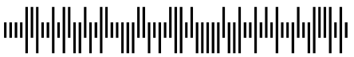

////
|metadata|
{
    "name": "xambarcode-xamintelligentmailbarcode",
    "controlName": ["{BarcodesName}"],
    "tags": ["Application Scenarios"],
    "guid": "22f004dc-02a9-4d12-b1b8-aa6327b07343",  
    "buildFlags": ["wpf"],
    "createdOn": "2012-01-23T16:12:14.6251039Z"
}
|metadata|
////

= Intelligent Mail

Intelligent Mail バーコードは、USPS メールストリームで使用するための 65 バーコードです。これは、4 つの異なる垂直バー タイプ（各バーは、フルバー、上昇、追跡、および下降）を使用して、郵便番号情報のルーティングとトラッキング情報をひとつのバーコードに結合します。POSTNET および PLANET のバーコードからのデータを 1 つのバーコードにエンコードし、トラッキング データの幅が広い範囲を提供します。このデータ値は数値のみを受け付け、正確に 20、25、29 または 31 文字でなければなりません。Intelligent Mail バーコードは以下のデータを持ちます。

[options="header", cols="a,a,a"]
|====
|タイプ|フィールド|数字

|トラッキング コード
|バーコード識別子
|2（2 番目の桁は 0 から 4 でなければなりません）

|
|特別サービス
|3

|
|顧客識別子
|6

|
|シーケンス番号
|9

|ルーティング コード
|配送ポイントの郵便番号
|0、5、9 または 11

|====

{BarcodeIntelligentMailName} のフィールド :

* バーコード識別子 - トラッキング サービスのタイプに USPS で指定されます。
* 特別サービス - メールピースの特別サービスに USPS で指定されます。エンコーディング範囲は 000 から 999 です。
* 顧客識別子 - 各顧客の一意の識別子として USPS で指定されます。エンコーディング範囲は 000000 から 999999 です。
* シーケンス番号 - メールピースのトラッキングのため送付者によって指定されます。エンコーディング範囲は 000000000 から 999999999 です。
* 配送ポイントの郵便番号 - メールピースのルーティングのため送付者によって指定されます。これは、最終の配送ポイントにメールピースをルーティングするために POSTNET を置き換えます。長さは 0、5、9、または 11 桁です。エンコーディング範囲は、桁数によって異なります。各桁は 0 から 9 でなければなりません。

image::images/xamBarcode_XamIntelligentMailBarcode_02.png[]

各フィールドについては、ルーティング コードを除き、先頭または後続のゼロが正しいサイズを得るために提供される必要があります。スペースや空白はパッディングでは受け付けられません。POSTNET および PLANET のあるチェックサムなどのエラーなし検出およびコレクションは、データ フィールドの一部として含まれます。

== pick:[xaml="XAML "]コード宣言付きのサンプル画像:

ifdef::xaml[]
*XAML の場合:*

----
<ig:XamIntelligentMailBarcode x:Name="Barcode" Data="1212312345612345678912345" />
----
endif::xaml[]

*Visual Basic の場合:*

----
Dim Barcode As New {BarcodeIntelligentMailName}()
Barcode.Data = "1212312345612345678912345"
----

*C# の場合:*

----
{BarcodeIntelligentMailName} Barcode = new {BarcodeIntelligentMailName}();
Barcode.Data = "1212312345612345678912345";
----

 

