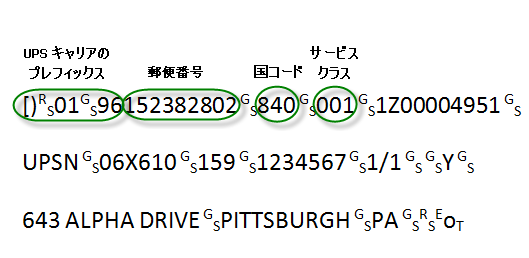
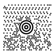
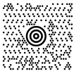

////
|metadata|
{
    "name": "xambarcode-xammaxicodebarcode",
    "controlName": ["{BarcodesName}"],
    "tags": ["Application Scenarios"],
    "guid": "528d4f72-784f-49c2-bb89-7ffdcefabff0",
    "buildFlags": ["wpf"],
    "createdOn": "2012-01-23T16:12:14.6321046Z"
}
|metadata|
////

= Maxi Code

MaxiCode はパッケージ追跡のために United Parcel Service (UPS) によって使用される平面エラー修正マトリックス記号です。2 次元記号は、bullseye とも呼ばれる一意の円形ファインダー パターンの周りの六角形要素のオフセット行でできています。これは方向にかかわらず素早い記号の配置に役に立ちます。

* MaxiCode はデータ エンコードをどのように構成すべきかを決定する 5 つのモードを使用します。一般的に、メッセージのフォーマットとエラー修正のレベルを定義するためにモードが使用されます。Mode0 と Mode1 は旧式でもう使用されていません。使用されるモードは以下のとおりです。

** Mode2 - モード 2 は、最大 9 桁までの数値の郵便番号をエンコードするために運送業で使用されます。
** Mode3 - モード 3 は、郵便番号が英数字で最大 6 文字までの時に運送業で使用されます。
** Mode4 - モード 4 は標準的な記号エンコードのためのものです。プライマリ メッセージは Enhanced Error Correction (EEC) を採用し、セカンダリ メッセージは Standard Error Correction (SEC) を採用するためです。
** Mode5 - モード 5 は、記号がプライマリおよびセカンダリ メッセージの両方に Enhanced Error Correction (EEC) を採用することを示します。
** Mode6 - モード 6 はリーダー プログラミングに使用され、Standard Error Correction はメッセージ全体に適用されます。

Mode2 または Mode3 の下でエンコードする時、メッセージが UPS キャリア プレフィックスで始まらない限り、プロパティ PostalCode、ServiceClass および Country が使用されます (以下を参照)。記号がその他のモードの下でエンコードされる時、記号エンコードでこれらのプロパティは使用されません。

* link:{BarcodesLink}.{BarcodeMaxiName}~postalcode.html[PostalCode] - 配送先住所の郵便番号。モード 3 の時、大文字と数字しか受け入れないため、最大 6 文字まででなければなりません。モード 2 の時、最大 9 桁まで設定できます。
* link:{BarcodesLink}.{BarcodeMaxiName}~serviceclass.html[ServiceClass] - サービス クラスを識別するためにキャリアと荷主によって定義された 000 から 999 の範囲の数字。
* link:{BarcodesLink}.{BarcodeMaxiName}~country.html[Country] - 国を表す 000 から 999 の範囲の数字。国コードの完全なリストは、ISO 規格 3166 を参照してください。

以下の図は、UPS キャリア プレフィックスが Mode2 または Mode3 で使用される時にデータ メッセージの構造がいかにあるべきかを示します。

データ値が標準の UPS キャリア プレフィックス ([)>[RS][GS]01[GS]YY) で始まる場合、 エンコード プロセスの間、関連プロパティ (PostalCode、ServiceClass および Country) は無視されます。これでプライマリおよびセカンダリ メッセージは以下のように取得されます。最初の 9 つのデータ文字 [)>[RS][GS]01[GS]YY はセカンダリ メッセージでエンコードされるために抽出されます。次の 3 つのデータ要素、これは郵便番号、国コードおよびサービス クラス コードをそれぞれ表しますが、データ値から抽出されます。データの残りの文字列は、ヘッダー [)>[RS][GS]01[GS]YY の後のセカンダリ メッセージでエンコードされます (3 つのデータ要素を分離する 3 つの RS 文字を除く)。たとえば、上記のメッセージは以下のようにプライマリ メッセージとセカンダリ メッセージに分離されます。

* プライマリ メッセージ:

郵便番号: 152382802

国コード: 840

サービス コードのクラス: 001

* セカンダリ メッセージ:

[)>RS GS01 GS 961Z00004951 GS

UPSN GS 06X610 GS 159 GS 1234567 GS 1/1

GS Y GS 634 ALPHA DRIVEGSPITTSBURGH GS PA RS EoT

[NOTE]
====
*注:* MaxiCode 記号はこのバージョンでは ECI (ラテン以外のアルファベットからデータをエンコードする機能) をサポートしません。このコントロールは最大 8 つのリンクされた記号にユーザー選択の構造が追加されることをサポートしません。
====

== pick:[xaml="XAML "]コード宣言付きのサンプル画像:

ifdef::xaml[]
*XAML の場合:*

----
<ig:XamMaxiCodeBarcode 
    x:Name="Barcode"
    Data="MaxiCode" 
    ServiceClass="001"
    PostalCode="152382802" 
    Country="840" 
    Mode="Mode2" />  
----
endif::xaml[]

*Visual Basic の場合:*

----
Dim Barcode As New {BarcodeMaxiName}()
Barcode.Data = "MaxiCode"
Barcode.ServiceClass = 1
Barcode.PostalCode = "152382802"
Barcode.Country = 840
Barcode.Mode = ModeIndicator.Mode2
----

*C# の場合:*

----
{BarcodeMaxiName} Barcode = new {BarcodeMaxiName}();
Barcode.Data = "MaxiCode";
Barcode.ServiceClass = 1;
Barcode.PostalCode = "152382802";
Barcode.Country = 840;
Barcode.Mode = ModeIndicator.Mode2;
----

