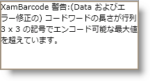
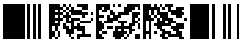

////
|metadata|
{
    "name": "xambarcode-xampdf417barcode",
    "controlName": ["{BarcodesName}"],
    "tags": ["Application Scenarios"],
    "guid": "d7226c35-c4ab-42da-a5d4-11a88ad18cd6",
    "buildFlags": ["wpf"],
    "createdOn": "2012-01-23T16:12:14.6351049Z"
}
|metadata|
////

= PDF 417

PDF417 は、大容量の平面記号です。

image::images/xamBarcode_XamPdf417Barcode_05.png[]

以下は {BarcodePDF417Name} 記号に固有なプロパティです。

* link:{BarcodesLink}.{BarcodePDF417Name}~rows.html[Rows]
* link:{BarcodesLink}.{BarcodePDF417Name}~columns.html[Columns]
* link:{BarcodesLink}.{BarcodePDF417Name}~errorcorrectionlevel.html[ErrorCorrectionLevel]
* link:{BarcodesLink}.{BarcodePDF417Name}~aspectratio.html[AspectRatio]
* link:{BarcodesLink}.{BarcodePDF417Name}~useminimumerrorcorrectionlevel.html[UseMinimumErrorCorrectionLevel]
* link:{BarcodesLink}.{BarcodePDF417Name}~encodingmode.html[EncodingMode]

== エラー訂正レベル

PDF417 エラー訂正レベルは、以下のプロパティで計算されます。

* UseMinimumErrorCorrectionLevel が True（デフォルト）に設定されており、現在のデータのコードワード番号の最小エラー訂正レベルが ErrorCorrectionLevel 値（デフォルトで Level0）の設定より高い場合、最小レベルがコントロールで使用されます。ErrorCorrectionLevel が計算された最小エラー訂正レベルより高いレベルに設定されている場合、設定された ErrorCorrectionLevel が優先されます。

== EncodingMode

PDF417 のエンコーディング アルゴリズムは、コントロールの EncodingMode プロパティによって選択されます。プロパティが Undefined（デフォルト値）に設定されている場合、コントロールは最善にアルゴリズム（場合によっては複数のアルゴリズムの組み合わせ）を選択し、最もコンパクトな方法で Data 値をエンコードします。データに適さない EncodingMode が設定されている場合、エラー メッセージが表示されます。

ifdef::xaml[]
*XAML の場合:*

----
<ig:XamPdf417Barcode x:Name="Barcode" Data="xamBarcode" EncodingMode="Numeric" />
----
endif::xaml[]

*Visual Basic の場合:*

----
Dim Barcode As New {BarcodePDF417Name}()
Barcode.Data = "xamBarcode"
Barcode.EncodingMode = CompactionMode.Numeric
----

*C# の場合:*

----
{BarcodePDF417Name} Barcode = new {BarcodePDF417Name}();
Barcode.Data = "xamBarcode";
Barcode.EncodingMode = CompactionMode.Numeric;
----

image::images/barcode_dataError.png[]

== Rows、Columns および AspectRatio

PDF417 マトリックスは、以下の順序で検証される異なる基準で定義されます。

[start=1]
. Columns/Rows プロパティが設定されている場合、このコントロールは、データおよびエラー訂正コードワードがこのセル数でエンコードできるかどうかをチェックし、できない場合はエラーを表示します。PDF417 は最大で 928 コードワードおよび Columns と Rows の組み合わせをエンコードすることに注意してください。つまり、928 を超えるセルではエラーとなります。
[start=2]
. Columns および Rows プロパティが設定されていない場合、このコントロールは AspectRatio が指定されているかどうかをチェックし、これを使用して、 link:xambarcode-widthtoheightratio.html[WidthToHeightRatio] に基づいてマトリックス サイズを作成します。
[start=3]
. 上記のいずれもが設定されていない場合、このコントロールはデフォルトの -0.5 に最も近いアスペクト比でマトリックスに Data および Error Correction コードバードを収めるために列および行数の最善の組み合わせを選択します。

上記のプロパティの一部を明示的に設定した場合、定義されたマトリックスがデータに適さないことがあります。この場合、{BarcodePDF417Name} は対応するエラー メッセージを表示します。

ifdef::xaml[]
*XAML の場合:*

----
<ig:XamPdf417Barcode x:Name="Barcode" Data="xamBarcode" Rows="3" Columns="3" />
----
endif::xaml[]

*Visual Basic の場合:*

----
Dim Barcode As New {BarcodePDF417Name}()
Barcode.Data = "xamBarcode"
Barcode.Rows = 3
Barcode.Columns = 3
----

*C# の場合:*

----
{BarcodePDF417Name} Barcode = new {BarcodePDF417Name}();
Barcode.Data = "xamBarcode";
Barcode.Rows = 3;
Barcode.Columns = 3;
----

[NOTE]
====
*注:* {BarcodePDF417Name} は ECI (Extended Channel Interpretation)、Structured Append モードおよび MacroPDF タイプをサポートしません。この機能は将来のバージョンで実装されます。
====

== pick:[xaml="XAML "]コード宣言付きのサンプル画像:

ifdef::xaml[]
*XAML の場合:*

----
<ig:XamPdf417Barcode x:Name="Barcode" Data="PDF 417" />
----
endif::xaml[]

*Visual Basic の場合:*

----
Dim Barcode As New {BarcodePDF417Name}()
Barcode.Data = "PDF 417"
----

*C# の場合:*

----
{BarcodePDF417Name} Barcode = new {BarcodePDF417Name}();
Barcode.Data = "PDF 417";
----

image::images/xamBarcode_XamPdf417Barcode_06.png[]