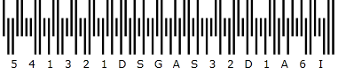

////

|metadata|
{
    "name": "xambarcode-xamroyalmailbarcode",
    "controlName": ["{BarcodesName}"],
    "tags": ["Application Scenarios"],
    "guid": "f3769d7c-8a1e-4926-a095-e1c9bc96a1fe",  
    "buildFlags": ["wpf"],
    "createdOn": "2012-01-23T16:12:14.6301044Z"
}
|metadata|
////

= Royal Mail

Royal Mail 4-state Customer Code (RM4SCC) は、郵便の自動仕分けで使用される高さによって変調されるバーコードです。それ自体 Data の一部でないエラー保護を提供するために最終文字としてチェックサムが印刷されます。0123456789ABCDEFGHIJKLMNOPQRSTUVWXYZ の文字を使用できます。

== pick:[xaml="XAML "]コード宣言付きのサンプル画像:

ifdef::xaml[]
*XAML の場合:*

----
<ig:XamRoyalMailBarcode x:Name="Barcode" Data="541321DSGAS32D1A6" />
----
endif::xaml[]

*Visual Basic の場合:*

----
Dim Barcode As New {BarcodeRoyalMailName}()
Barcode.Data = "541321DSGAS32D1A6"
----

*C# の場合:*

----
{BarcodeRoyalMailName} Barcode = new {BarcodeRoyalMailName}();
Barcode.Data = "541321DSGAS32D1A6";
----

