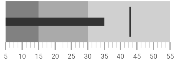
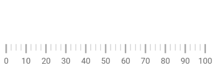
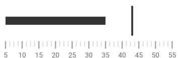

////
|metadata|
{
    "name": "bulletgraph-adding",
    "controlName": ["{BulletGraphName}"],
    "tags": ["Application Scenarios","Charting","Getting Started","How Do I"],
    "guid": "1d4c8246-db15-476a-b025-68aaf9a4a630",
    "buildFlags": [],
    "createdOn": "2014-06-05T19:53:11.991864Z"
}
|metadata|
////

= ブレット グラフの追加

=== 目的

このトピックでは、link:{BulletGraphLink}.{BulletGraphName}.html[{BulletGraphName}]™ コントロールを {PlatformName} アプリケーションに追加する方法を説明します。

=== 前提条件

本トピックの理解を深めるために、以下のトピックを参照することをお勧めします。

[options="header", cols="a,a"]
|====
|トピック|目的

| link:bulletgraph-overview.html[{BulletGraphName} 概要]
|このトピックでは、主要機能、最小要件、ユーザー機能など、 _{BulletGraphName}_ コントロールに関する概念的な情報を提供します。

|====

toc::[]

== _{BulletGraphName}_ の追加 – 概念的な概要

[[_Ref361648039]]
=== {BulletGraphName} の追加の概要

_{BulletGraphName}_ をページに追加するには、コントロールのインスタンスを作成して、pick:[android,xamarin,wpf="ページのルート要素"]pick:[win-forms="フォーム"]に追加する必要があります。コントロールは、主目盛や副目盛に0 から 100 までの値を使用して、スケールを表示するようあらかじめ設定されています。さらに、配置されたコンテナーのサイズをデフォルトで測定します。

=== 要件

ifdef::android[]
以下の Infragistics jar をメイン プロジェクトに追加します。

** Infragistics.Gauge.jar
** Infragistics.Core.jar
** Infragistics.UI.jar
** DV.Shared.jar
endif::android[]

ifdef::win-forms[]
以下の Infragistics アセンブリをメイン プロジェクトに追加します。

** {ApiPlatform}{BulletGraphAssembly}.{DllVersion}dll 
endif::win-forms[]

ifdef::wpf[]

以下の NuGet パッケージ参照をメイン プロジェクトに追加します。

** Infragistics.WPF.Gauges

NuGet フィードのセットアップと NuGet パッケージの追加の詳細については、link:nuget-feeds.html[NuGet フィード] ドキュメントを参照してください。

endif::wpf[]

ifdef::win-forms[]
** {ApiPlatform}{BulletGraphAssemblyBase}.{DllVersion}dll
** {ApiPlatform}Win.Portable.Core.{DllVersion}dll 
endif::win-forms[]

ifdef::xamarin[]
「link:xamarin-project-with-infragistics-controls.html#NuGetPackages[NuGet パッケージで参照を追加]」トピックの手順に従ってアセンブリ参照を追加します。
endif::xamarin[]

また、次の Infragistics 名前空間を追加します。

ifdef::xamarin[]
*XAML の場合:*
[source,xaml]
----
xmlns:ig="clr-namespace:{BulletGraphNamespace};assembly={ApiPlatform}Gauges"
----
*C# の場合:*
[source,csharp]
----
using {BulletGraphNamespace};
----
endif::xamarin[]

ifdef::wpf[]
*XAML の場合:*
[source,xaml]
----
xmlns:ig="http://schemas.infragistics.com/xaml"
---- 
*C# の場合:*
[source,csharp]
----
using {BulletGraphNamespace};
----
*VB の場合:* 
[source,vb]
----
Imports {BulletGraphNamespace}
---- 
endif::wpf[]

ifdef::win-forms[] 
*C# の場合:* 
[source,csharp]
----
using {BulletGraphNamespace};  
----  
*VB の場合:* 
[source,vb]
----
Imports {BulletGraphNamespace}
---- 
endif::win-forms[]

ifdef::android[] 
*Java の場合:*
[source,js]
----
import {BulletGraphNamespace}.{BulletGraphName};
---- 
endif::android[] 

=== 手順

以下は、_{BulletGraphName}_ を追加する一般的な手順です。

*1.{BulletGraphName} コントロールの追加*

*2.スケールの構成*

*3.パフォーマンス バーの構成*

*4.比較マーカーの構成*

*5.追加要素の構成*  (詳細は、<<_Ref361422086,{BulletGraphName} の追加 – コード例>>および link:bulletgraph-configuring.html[{BulletGraphName} の構成]を参照してください。)

== _{BulletGraphName} の追加_ – コード例

=== 概要

以下の手順は、{BulletGraphName} コントロールのインスタンスを作成して {PlatformName} アプリケーションに追加し、パーフォーマンス バーと比較目盛マーカー、および 3 つの比較範囲をスケールに構成します。

=== プレビュー

以下のスクリーンショットは最終結果のプレビューです。

ifdef::wpf,win-universal,win-forms[]
image::images/BulletGraph_Adding_BulletGraph_1.png[]
endif::wpf,win-universal,win-forms[]

ifdef::xamarin,android[]

endif::xamarin,android[]

=== 概要

以下はプロセスの概要です。

*1. {BulletGraphName} コントロールの追加*

*2. スケールの構成*

*3. パフォーマンス バーの構成*

*4. 比較マーカーの構成*

*5. 比較範囲の追加*

=== 手順

以下の手順は、_{BulletGraphName}_ コントロールをアプリケーションに追加する方法について説明します。

=== 1.{BulletGraphName} コントロールを追加します。

ifdef::wpf,sl,win-universal,xamarin,android[]
_{BulletGraphName}_ 宣言をページのルート `Grid` 要素に追加します。次に、任意の `Height` および `Width` を設定します。
endif::wpf,sl,win-universal,xamarin,android[]

ifdef::win-forms[]
{BulletGraphName} をフォームに追加し、サイズを設定します。
endif::win-forms[]

ifdef::wpf,sl,win-universal[]

*XAML の場合:*

[source,xaml]
----
<ig:{BulletGraphName} x:Name="bulletGraph"
                   Height="100"
                   Width="300">
</ig:{BulletGraphName}>
----

endif::wpf,sl,win-universal[]

ifdef::xamarin[]

*XAML の場合:*

[source,xaml]
----
<ig:{BulletGraphName} x:Name="bulletGraph"
                   VerticalOptions="Center"
                   HorizontalOptions="Center"
                   HeightRequest="100"
                   WidthRequest="300">
</ig:{BulletGraphName}>
----

endif::xamarin[]

ifdef::wpf,sl,win-universal[]

*C# の場合:*

[source,csharp]
----
{BulletGraphName} bulletGraph = new {BulletGraphName}();
bulletGraph.Height = 100;
bulletGraph.Width = 300;
----

*Visual Basic の場合:*

[source,vb]
----
Dim bulletGraph As New {BulletGraphName}()
bulletGraph.Height = 100
bulletGraph.Width = 300
----

endif::wpf,sl,win-universal[]

ifdef::win-forms[]

*C# の場合:*

[source,csharp]
----
{BulletGraphName} bulletGraph = new {BulletGraphName}();
bulletGraph.Height = 100;
bulletGraph.Width = 300;
this.Controls.Add(bulletGraph);
----

*Visual Basic の場合:*

[source,vb]
----
Dim bulletGraph As New {BulletGraphName}()
bulletGraph.Height = 100
bulletGraph.Width = 300
Me.Controls.Add(bulletGraph)
----

endif::win-forms[]

ifdef::xamarin[]

*C# の場合:*

[source,csharp]
----
{BulletGraphName} bulletGraph = new {BulletGraphName}();
bulletGraph.VerticalOptions = LayoutOptions.Center;
bulletGraph.HorizontalOptions = LayoutOptions.Center;
bulletGraph.HeightRequest = 100;
bulletGraph.WidthRequest = 300;
----

endif::xamarin[]

ifdef::android[]

*Java の場合:*

[source,js]
----
int height = (int)TypedValue.applyDimension(TypedValue.COMPLEX_UNIT_DIP,
    100, getResources().getDisplayMetrics());
int width = (int) TypedValue.applyDimension(TypedValue.COMPLEX_UNIT_DIP,
    300, getResources().getDisplayMetrics());

RelativeLayout.LayoutParams params = new RelativeLayout.LayoutParams(width, height);

BulletGraphView bulletGraph = new BulletGraphView(rootView.getContext());
bulletGraph.setLayoutParams(params);
----

endif::android[]

この宣言は、 link:bulletgraph-overview.html#_Ref361168550[デフォルトの外観]、 link:bulletgraph-overview.html#_Ref361168497[設定]および固定サイズで、 {BulletGraphName} のインスタンスを作成します。これは、スケールが主目盛および副目盛を使用して 0 から 100 の範囲で表示されるため、追加構成が必要なことを意味します。

ifdef::wpf,win-universal,win-forms[]
image::images/BulletGraph_Adding_BulletGraph_2.png[]
endif::wpf,win-universal,win-forms[]

ifdef::xamarin,android[]

endif::xamarin,android[]

=== 2.スケールを構成します。

スケールの値をカスタマイズするには、link:{BulletGraphLink}.{BulletGraphBase}{ApiProp}MinimumValue.html[MinimumValue] および link:{BulletGraphLink}.{BulletGraphBase}{ApiProp}MaximumValue.html[MaximumValue] プロパティを設定する必要があります。 この例では、スケールは 5 から開始され 55 で終了します。

ifdef::xaml[]

*XAML の場合:*

[source,xaml]
----
<ig:{BulletGraphName} x:Name="bulletGraph"
                   MinimumValue="5"
                   MaximumValue="55">
</ig:{BulletGraphName}>
----

endif::xaml[]

ifdef::xaml,win-forms[]

*C# の場合:*

[source,csharp]
----
bulletGraph.MaximumValue = 55;
bulletGraph.MinimumValue = 5;
----
endif::xaml,win-forms[]

ifdef::wpf,sl,win-universal,win-forms[]

*Visual Basic の場合:*

[source,vb]
----
bulletGraph.MaximumValue = 55
bulletGraph.MinimumValue = 5
----

endif::wpf,sl,win-universal,win-forms[]

ifdef::android[]

*Java の場合:*

[source,js]
----
bulletGraph.setMinimumValue(5);
bulletGraph.setMaximumValue(55);
----

endif::android[]

変化したスケールを以下のスクリーンショットに示します。

ifdef::wpf,win-universal,win-forms[]
image::images/BulletGraph_Adding_BulletGraph_3.png[]
endif::wpf,win-universal,win-forms[]

ifdef::xamarin,android[]
image::images/BulletGraph_Adding_BulletGraph_XF_3.png[]
endif::xamarin,android[]

=== 3.パフォーマンス バーを追加します。

_{BulletGraphName}_ の主要なメジャーはそのパフォーマンス バーにより視覚化されます。値は link:{BulletGraphLink}.{BulletGraphBase}{ApiProp}Value.html[Value] プロパティ設定で制御します。この例では、 link:{BulletGraphLink}.{BulletGraphBase}{ApiProp}Value.html[Value] プロパティを 35 に設定します。

ifdef::xaml[]

*XAML の場合:*

[source,xaml]
----
<ig:{BulletGraphName} x:Name="bulletGraph"
                   Value="35">
</ig:{BulletGraphName}>
----

endif::xaml[]

ifdef::xaml,win-forms[]

*C# の場合:*

[source,csharp]
----
bulletGraph.Value = 35;
----

endif::xaml,win-forms[]

ifdef::wpf,sl,win-universal,win-forms[]

*Visual Basic の場合:*

[source,vb]
----
bulletGraph.Value = 35
----

endif::wpf,sl,win-universal,win-forms[]

ifdef::android[]

*Java の場合:*

[source,js]
----
bulletGraph.setValue(35);
----

endif::android[]

=== 4.比較マーカーを構成します。

スケール上の比較目盛マーカーの配置は、link:{BulletGraphLink}.{BulletGraphBase}{ApiProp}TargetValue.html[TargetValue] プロパティの値で制御します。この例では、 link:{BulletGraphLink}.{BulletGraphBase}{ApiProp}TargetValue.html[TargetValue] プロパティを 43 に設定します。

ifdef::xaml[]

*XAML の場合:*

[source,xaml]
----
<ig:{BulletGraphName} x:Name="bulletGraph"
                   TargetValue="43">
</ig:{BulletGraphName}>
----

endif::xaml[]

ifdef::xaml,win-forms[]

*C# の場合:*

[source,csharp]
----
bulletGraph.TargetValue = 43;
----

endif::xaml,win-forms[]

ifdef::wpf,sl,win-universal,win-forms[]

*Visual Basic の場合:*

[source,vb]
----
bulletGraph.TargetValue = 43
----

endif::wpf,sl,win-universal,win-forms[]

ifdef::android[]

*Java の場合:*

[source,js]
----
bulletGraph.setTargetValue(43);
----

endif::android[]

以下のスクリーンショットは、これまでの手順で _{BulletGraphName}_ コントロールの外観がどのようになるかを示しています。

ifdef::wpf,win-universal,win-forms[]
image::images/BulletGraph_Adding_BulletGraph_4.png[]
endif::wpf,win-universal,win-forms[]

ifdef::xamarin,android[]

endif::xamarin,android[]

=== 5.比較範囲を追加します。

パフォーマンス バーで表示された値とある意味を持たせた範囲の値を比較するためには、比較範囲をスケール上に表示する必要があります。比較範囲は、複数の link:{BulletGraphLink}.{BulletGraphRange}.html[{BulletGraphRange}] を個別に内部で定義できる link:{BulletGraphLink}.{BulletGraphBase}{ApiProp}Ranges.html[Ranges] プロパティが制御します。各範囲には、独自の開始値と終了値 (link:{BulletGraphLink}.{BulletGraphRange}{ApiProp}StartValue.html[StartValue] および link:{BulletGraphLink}.{BulletGraphRange}{ApiProp}EndValue.html[EndValue]) と色 (link:{BulletGraphLink}.{BulletGraphRange}{ApiProp}Brush.html[Brush]) があります。

この例では、3 つの比較範囲を構成します。それぞれ異なる灰色のグラデーションで、スケール目盛の 0、15、30 から開始します。

ifdef::xaml[]

*XAML の場合:*

[source,xaml]
----
<ig:{BulletGraphName} x:Name="bulletGraph" >
    <ig:{BulletGraphName}.Ranges>
        <ig:{BulletGraphRange} StartValue="0"
                                EndValue="15"
                                Brush="#828181"/>
        <ig:{BulletGraphRange} StartValue="15"
                                EndValue="30"
                                Brush="#AAAAAA"/>
        <ig:{BulletGraphRange} StartValue="30"
                                EndValue="55"
                                Brush="#D0D0D0"/>
    </ig:{BulletGraphName}.Ranges>
</ig:{BulletGraphName}>
----

endif::xaml[]

ifdef::xaml,win-forms[]

*C# の場合:*

[source,csharp]
----
{BulletGraphRange} range1 = new {BulletGraphRange}();
range1.StartValue = 0;
range1.EndValue = 15;
range1.Brush = new SolidColorBrush(Color.Frompick:[wpf="R"]pick:[win-forms="Ar"]gb(47, 47, 47));

{BulletGraphRange} range2 = new {BulletGraphRange}();
range2.StartValue = 15;
range2.EndValue = 30;
range2.Brush = new SolidColorBrush(Color.Frompick:[wpf="R"]pick:[win-forms="Ar"]gb(158, 158, 158));

{BulletGraphRange} range3 = new {BulletGraphRange}();
range3.StartValue = 30;
range3.EndValue = 55;
range3.Brush = new SolidColorBrush(Color.Frompick:[wpf="R"]pick:[win-forms="Ar"]gb(198, 198, 198));

bulletGraph.Ranges.Add(range1);
bulletGraph.Ranges.Add(range2);
bulletGraph.Ranges.Add(range3);
bulletGraph.TargetValueBrush = new SolidColorBrush(Color.Frompick:[wpf="R"]pick:[win-forms="Ar"]gb(255, 255, 255));
----

endif::xaml,win-forms[]

ifdef::wpf,sl,win-universal,win-forms[]

*Visual Basic の場合:*

[source,vb]
----
Dim range1 As New {BulletGraphRange}()
range1.StartValue = 0
range1.EndValue = 15
range1.Brush = New SolidColorBrush(Color.Frompick:[wpf="R"]pick:[win-forms="Ar"]gb(47, 47, 47))

Dim range2 As New {BulletGraphRange}()
range2.StartValue = 15
range2.EndValue = 30
range2.Brush = New SolidColorBrush(Color.Frompick:[wpf="R"]pick:[win-forms="Ar"]gb(158, 158, 158))

Dim range3 As New {BulletGraphRange}()
range3.StartValue = 30
range3.EndValue = 55
range3.Brush = New SolidColorBrush(Color.Frompick:[wpf="R"]pick:[win-forms="Ar"]gb(198, 198, 198))

bulletGraph.Ranges.Add(range1)
bulletGraph.Ranges.Add(range2)
bulletGraph.Ranges.Add(range3)
bulletGraph.TargetValueBrush = New SolidColorBrush(Color.Frompick:[wpf="R"]pick:[win-forms="Ar"]gb(255, 255, 255))
----

endif::wpf,sl,win-universal,win-forms[]

ifdef::android[]

*Java の場合:*

[source,js]
----
LinearGraphRange lgrange1 = new LinearGraphRange(); 
lgrange1.setStartValue(0); 
lgrange1.setEndValue(15); 
lgrange1.setBrush(new SolidColorBrush(Color.DKGRAY));

LinearGraphRange lgrange2 = new LinearGraphRange();
lgrange2.setStartValue(15);
lgrange2.setEndValue(30) ;
lgrange2.setBrush(new SolidColorBrush(Color.GRAY));

LinearGraphRange lgrange3 = new LinearGraphRange();
lgrange3.setStartValue(30);
lgrange3.setEndValue(55) ;
lgrange3.setBrush(new SolidColorBrush(Color.LTGRAY));

bulletGraph.addRange(lgrange1);
bulletGraph.addRange(lgrange2);
bulletGraph.addRange(lgrange3);
bulletGraph.setValueBrush(new SolidColorBrush(Color.BLACK));
bulletGraph.setTargetValueBrush(new SolidColorBrush(Color.WHITE));
----

endif::android[]

グラフの最終的な外観を以下に示します。

ifdef::wpf,win-universal,win-forms[]
image::images/BulletGraph_Adding_BulletGraph_1.png[]
endif::wpf,win-universal,win-forms[]

ifdef::xamarin,android[]

endif::xamarin,android[]

== 関連コンテンツ

=== トピック

このトピックの追加情報については、以下のトピックも合わせてご参照ください。

[options="header", cols="a,a"]
|====
|トピック|目的

| link:bulletgraph-configuring.html[{BulletGraphName} の構成]
|このトピック グループは、向きや方向および視覚要素を含む _{BulletGraphName}_ コントロールのさまざまな要素を構成する方法を説明します。

| link:bulletgraph-api-reference.html[API リファレンス ({BulletGraphName})]
|このトピックでは、{BulletGraphName} コントロールに関連するキー クラスやプロパティに関する参考情報を提供します。

|====