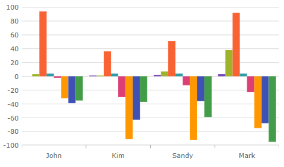

////
|metadata|
{
    "name": "categorychart-binding-to-data",
    "controlName": ["{CategoryChartName}"],
    "tags": [],
    "buildFlags": []
}
|metadata|
////

= データ バインド

=== 目的
このトピックは、フラットと階層データを link:{CategoryChartLink}.{CategoryChartName}.html[{CategoryChartName}] コントロールにバインドする方法を説明します。各セクションの最後で、サンプルの全コードを提供します。

=== このトピックの内容

このトピックは、以下のセクションで構成されます。

* <<Introduction,概要>> 
* <<SupportedChartTypes,サポートされるチャート タイプ>>
* <<IncludeExcludeProperties,含まれるプロパティと除外されるプロパティ>>
* <<Requirements,要件>>
* <<PreviewFlatData,フラット データのプレビュー>>
* <<OverviewFlatData,フラット データの概要>>
* <<StepsFlatData,手順 - フラット データ>>
* <<PreviewHierarchicalData,階層データのプレビュー>>
* <<OverviewHierarchicalData,階層データの概要>>
* <<StepsHierarchicalData,手順 - 階層データ>>
* <<PreviewCollectionOfCollection, コレクションのコレクション プレビュー>>
* <<OverviewCollectionOfCollection, コレクションのコレクション概要>>
* <<StepsCollectionOfCollection, コレクションのコレクション手順>>
* <<RelatedTopics,関連トピック>>

[[Introduction]]
== 概要

以下の手順は、{CategoryChartName} コントロールをデータ コレクションにバインドする方法を示します。 {CategoryChartName} は、IEnumerable インターフェイスを実装する任意のオブジェクトにバインドすることができます。ICollection および IEnumerable を実装するネスト コレクションがサポートされます。

このトピックでは、2 つのデータ コレクション (フラットおよび階層) を定義後、カテゴリ チャート コントロールをアプリケーションに追加し、そのコントロールの ItemsSource を指定データ コレクションのインスタンスにバインドします。

[[SupportedChartTypes]]
== サポートされるチャート タイプ

link:{DataChartLink}.{CategoryChartName}{ApiProp}charttype.html[ChartType] プロパティは、表示するシリーズ タイプを選択できます。ChartType を Auto に設定するとチャートでエリアが選択されます。または折れ線シリーズを選択すると コレクションを表します (データポイントに基づく)。それ以外は柱状チャートに解決されます。詳細については、「link:categorychart-chart-types.html[チャート タイプ]」トピックを参照してください。

サポートされるシリーズ タイプ:

*	Auto
*	Area
*	Column
*	Line
*	Point
*	Spline
*	StepLine
*   StepArea
*   SplineArea
*	Waterfall

[[IncludeExcludeProperties]]
== 含まれるプロパティと除外されるプロパティ
データ モデルに関連する特定のプロパティがチャートごとにシリーズとしてプロットする必要があるかどうかを明示的に定義する必要があります。2 つのオプションがあり、プロパティをタグ付けして {CategoryChartName} に含むか除外できます。

*Include および Exclude プロパティの設定*

各プロパティは、データモデルで定義されたプロパティ名に対応する文字列の配列に等しい必要があります。
ifdef::sl,wpf,win-phone,win-universal,xamarin[]
*C# の場合:*
[source,csharp]
----
this.xamCategoryChart.IncludedProperties = new string[] { "ID", "Name", "Department" };
this.xamCategoryChart.ExcludedProperties = new string[] { "Age" };

----
endif::sl,wpf,win-phone,win-universal,xamarin[] 
ifdef::win-forms[]
*C# の場合:*
[source,csharp]
----
this.ultraCategoryChart.IncludedProperties = new string[] { "ID", "Name", "Department" };
this.ultraCategoryChart.ExcludedProperties = new string[] { "Age" };

----
endif::win-forms[] 
ifdef::wpf[]
*Visual Basic の場合:*
[source,vb]
----
Me.xamCategoryChart.IncludedProperties = New String(){"ID", "Name", "Department"}
Me.xamCategoryChart.ExcludedProperties = New String(){ "Age" };

----
endif::wpf[]
ifdef::win-forms[]
*Visual Basic の場合:*
[source,vb]
----
Me.UltraCategoryChart.IncludedProperties = New String(){"ID", "Name", "Department"}
Me.UltraCategoryChart.ExcludedProperties = New String(){ "Age" };

----
endif::win-forms[]
*プロパティの属性*

DataSeriesMemberIntent 属性をプロパティに割り当てて明示的に状態を定義します。以下のコード スニペットは、プロパティの省略、名前付き Department が {CategoryChartName} でプロットされるシリーズを示します。

*C# の場合:*
[source,csharp]
----
[DataSeriesMemberIntent(DataSeriesIntent.DontPlot)]
public string Department
{
   get { return m_Department; }
   set { m_Department = value; }
}

----
ifdef::wpf,win-forms[]
*Visual Basic の場合:*
[source,vb]
----
<DataSeriesMemberIntent(DataSeriesIntent.DontPlot)> _
Public Property Department() As String
	Get
		Return m_Department
	End Get
	Set
		m_Department = value
	End Set
End Property
----
endif::wpf,win-forms[]

[[Requirements]]
== 要件

以下は、{CategoryChartName} コントロールを追加するための一般要件です。

ifdef::android[]
以下の jar をプロジェクトに追加します。

** Infragistics.Chart.jar
** Infragistics.Core.jar
** Infragistics.UI.jar
** DV.Shared.jar
endif::android[]

ifdef::wpf[]
以下の NuGet パッケージ参照をプロジェクトに追加します。

** Infragistics.WPF.Charts

NuGet フィードのセットアップと NuGet パッケージの追加の詳細については、link:nuget-feeds.html[NuGet フィード] ドキュメントを参照してください。

endif::wpf[]

ifdef::win-forms[]
以下の Infragistics アセンブリをメイン プロジェクトに追加します。

** {ApiPlatform}{CategoryChartAssembly}.{DllVersion}dll 
** {ApiPlatform}{DataVizAssembly}.{DllVersion}dll 
** {ApiPlatform}Win.Portable.Core.{DllVersion}dll 
endif::win-forms[]

ifdef::xamarin[]
1. link:xamarin-project-with-infragistics-controls.html[「NuGet パッケージで参照を追加」]トピックを参照してください。

2. {CategoryChartName} を以下の方法で追加できます。
* link:getting-started-with-toolbox.html[Infragistics ツールボックス]。
* 以下のコード スニペット。

endif::xamarin[]

以下の名前空間の参照を追加します。

ifdef::xamarin[]
*XAML の場合:*
[source,xaml]
----
xmlns:ig="clr-namespace:{CategoryChartNamespace};assembly={ApiPlatform}Charts"
---- 
endif::xamarin[]

ifdef::wpf[]
*XAML の場合:*
[source,xaml]
----
xmlns:ig="http://schemas.infragistics.com/xaml"
----
endif::wpf[]

ifdef::wpf,win-forms,xamarin[] 
*C# の場合:*
[source,csharp]
----
using {CategoryChartNamespace};  
----  
endif::wpf,win-forms,xamarin[]
 
ifdef::wpf,win-forms[] 
*Visual Basic の場合:*
[source,vb]
----
Imports {CategoryChartNamespace}
---- 
endif::wpf,win-forms[]

ifdef::android[] 
*Java の場合:*
[source,js]
----
import {CategoryChartNamespace}.{CategoryChartName};
---- 
endif::android[] 

*数値フィールド*

チャートにバインドしたコレクションに含まれる各数値プロパティは、データシリーズ値として翻訳され、項目とシリーズ ラベルとしてその名前を参照します。データ モデルで定義した数値プロパティがない場合、チャートは正しく動作しません。
階層構造のデータソースがサポートされるため、コントロールまたは XAML コードを変更せずに複数シリーズを表示できます。

ifdef::wpf[]
*XAML の場合:*
[source,xaml]
----
xmlns:ig="http://schemas.infragistics.com/xaml"
xmlns:local="clr-namespace;SampleApp;assembly=SampleApp"
----
endif::wpf[]

[[PreviewFlatData]]
== フラット データのプレビュー

{CategoryChartName} コントロールは、フラットデータサンプルコードによって実装されます。

図 1

image::images/categorychart_data_binding_01.png[]

[[OverviewFlatData]]
== フラット データの概要

1.	データ モデルの定義
2.	{CategoryChartName} コントロールのインスタンスの追加
3.	(オプション) 結果の検証

[[StepsFlatData]]
== 手順 - フラット データ

*データ モデルの定義*

データをモデル化するためのクラスを作成します。以下のコードは、シンプルな値とラベルのペアを表す DataItem クラス、およびそれらのペアのコレクションを表す Data クラスを作成します。

*C# の場合:*
[source, csharp]
----
  public class ViewModel
    {
        public ObservableCollection<DataItem> Data { get; set; }
        
        public ViewModel()
        {
            CreateData();
        }

        private string[] names = { "John", "Kim", "Sandy", "Mark", "Josh", "Jim", "Sam", "Mary", "Harry", "Sue", "Chris", "Joe", "Carl" };
        private void CreateData()
        {
            Random r = new Random();

            for (int j = 0; j <= 2; j++)
            {
                Data = new ObservableCollection<DataItem>();

                for (int i = 0; i <= 9; i++)
                {
                    Data.Add(new DataItem
                    {
                        ID = i,
                        Name = names[i],
                        Value1 = r.Next(1, 50),
                        Value2 = r.Next(1, 100)
                    });
                }               
            }
        }
    }

    public class DataItem
    {  
        public int ID { get; set; }
        public string Name { get; set; }
        public double Value1 { get; set; }
        public double Value2 { get; set; }
    }
----

ifdef::wpf,win-forms[]
*Visual Basic の場合:*
[source, vb]
----
Public Class ViewModel
    Public Property Data() As ObservableCollection(Of DataItem)
        Get
            Return m_Data
        End Get
        Set(value As ObservableCollection(Of DataItem))
            m_Data = Value
        End Set
    End Property
    Private m_Data As ObservableCollection(Of DataItem)

    Public Sub New()
        CreateData()
    End Sub

    Private names As String() = {"John", "Kim", "Sandy", "Mark", "Josh", "Jim", _
        "Sam", "Mary", "Harry", "Sue", "Chris", "Joe", _
        "Carl"}
    Private Sub CreateData()
        Dim r As New Random()

        For j As Integer = 0 To 2
            Data = New ObservableCollection(Of DataItem)()
            For i As Integer = 0 To 9

                Data.Add(New DataItem() With {
                     .ID = i,
                     .Name = names(i),
                     .Value1 = r.[Next](1, 50),
                     .Value2 = r.[Next](1, 100)
                })
            Next
        Next
    End Sub
End Class

Public Class DataItem

    Public Property ID() As Integer
        Get
            Return m_ID
        End Get
        Set(value As Integer)
            m_ID = value
        End Set
    End Property
    Private m_ID As Integer

    Public Property Name() As String
        Get
            Return m_Name
        End Get
        Set(value As String)
            m_Name = value
        End Set
    End Property
    Private m_Name As String

    Public Property Value1() As Double
        Get
            Return m_Value1
        End Get
        Set(value As Double)
            m_Value1 = value
        End Set
    End Property
    Private m_Value1 As Double

    Public Property Value2() As Double
        Get
            Return m_Value2
        End Get
        Set(value As Double)
            m_Value2 = value
        End Set
    End Property
    Private m_Value2 As Double

End Class
----
endif::wpf,win-forms[]

*{CategoryChartName} コントロールのインスタンスを追加*

レイアウト ルートにデータ コレクションのインスタンス、凡例インスタンス、および {CategoryChartName} のインスタンスを追加します:

ifdef::wpf[]
*XAML の場合:*
[source, xaml]
----

<Window x:Class="MainWindow"
    xmlns="http://schemas.microsoft.com/winfx/2006/xaml/presentation"
    xmlns:x="http://schemas.microsoft.com/winfx/2006/xaml"
    xmlns:local="clr-namespace:SampleApp"
    xmlns:ig="http://schemas.infragistics.com/xaml"
    Title="MainWindow" Height="350" Width="525">
    <Window.DataContext>
        <local:ViewModel/>
    </Window.DataContext>
    <Grid >
        <ig:{CategoryChartName} ItemsSource="{Binding Data}" XAxisLabel="{}{Name}" Margin="10" />
    </Grid>
</Window>
----
endif::wpf[]

ifdef::xamarin[]
*XAML の場合:*
[source, xaml]
----
<ContentView x:Class="Samples.Browser.Views.DataCharts.Axes.ChartEditingCategoryAxes"
             xmlns="http://xamarin.com/schemas/2014/forms"
             xmlns:x="http://schemas.microsoft.com/winfx/2009/xaml"
             xmlns:ig="clr-namespace:{CategoryChartNamespace};assembly={ApiPlatform}Charts">
    <Grid >
        <ig:{CategoryChartName} ItemsSource="{Binding}" XAxisLabel="{}{Name}" Margin="10" />
    </Grid>
</ContentView>
----
endif::xamarin[]

*結果の確認 (オプション)*

結果を検証するために、アプリケーションを実行します。{CategoryChartName} コントロールのデータ コレクションへのバインドが成功すれば、結果のチャートは上記の図 1 に示すようなものになります。

[[PreviewHierarchicalData]]
== 階層データのプレビュー

図 2

{CategoryChartName} コントロールは、ネスト サンプルコードによって実装されます。正の値は親データ項目のプロパティを表します。負の値は子プロパティの値を示します。

[[OverviewHierarchicalData]]
== 階層データの概要

. ネスト データ モデルの定義
. {CategoryChartName} コントロールのインスタンスの追加
. (オプション) 結果の検証

[[StepsHierarchicalData]]
== 手順 – 階層データ

*データ モデルの定義*

データをモデル化するためのクラスを作成します。以下のコードは、ネスト レベル コレクションを表す Parent および Child クラス、同様にペアのコレクションを表す ViewModel を作成します。 

前提条件:

* 子レベル クラスは数値プロパティを含みます。
* View Model は、親レベル コレクションと等しいタイプの ObservableCollection を実装する必要があります。これによって子オブジェクトを追加できます。
* 親クラスは IEnumerable を実装する必要があります。

*C# の場合:*
[source, csharp]
----

    public class ViewModel : ObservableCollection<Parent>
    {
        public ViewModel()
        {
            CreateData();
        }

        private string[] names = {"John","Kim","Sandy","Mark","Josh","Jim","Sam"};
        
        private void CreateData()
        {
            Random r = new Random();

            for (int j = 0; j <= 3; j++)
            {
                Parent dt = new Parent()
                {
                    ID = j,
                    Name = names[j],
                    Value1 = r.Next(1, 50),
                    Value2 = r.Next(1, 100),
                    Children = new ObservableCollection<Child>()
                };    
                       
                for (int y = 0; y <= 3; y++)
                {
                    Child children = new Child()
                    {
                        ID = y + 1,
                        Name = names[y],
                        Value2 = r.Next(-100, 0),
                    };
                
                    dt.Children.Add(children);
                }
                this.Add(dt);
            }
        }
    }

    public class Parent : IEnumerable
    {  
        public ObservableCollection<Child> Children { get; set; }
        public double ID { get; set; }
        public string Name { get; set; }
        public double Value1 { get; set; }
        public double Value2 { get; set; }
 
        public IEnumerator GetEnumerator()
        {
            return this.Children.GetEnumerator();
        }
    }  
    
    public class Child  
    {
    	public double ID { get; set; }
        public string Name { get; set; }       
        public double Value2 { get; set; }
    }  
----

ifdef::wpf,win-forms[]
*Visual Basic の場合:*
[source, vb]
----

Public Class ViewModel
Inherits ObservableCollection(Of Parent)
    Public Sub New()
        CreateData()
    End Sub

    Private names As String() = {"John", "Kim", "Sandy", "Mark", "Josh", "Jim", "Sam"}
    Private Sub CreateData()
        Dim r As New Random()

        For j As Integer = 0 To 3 Step 1
           
     Dim dt As New Parent With
     {
              .ID = j,
              .Name = names(j),
              .Value1 = r.[Next](1, 50),
              .Value2 = r.[Next](1, 100),
  		.Children = New ObservableCollection(Of Child)()
            }

     For y As Integer = 0 To 3 Step 1

                Dim children As New Child() With
                { 
                    .ID = y,
                    .Name = names(y),
                    .Value2 = r.[Next](-100, 0)
                }
		  dt.Children.Add(children)		 

            Next
		
     Me.Add(dt)
	     
        Next
    End Sub
End Class

Public Class Parent 
Implements IEnumerable
Public Property Children() As ObservableCollection(Of Child) 
        Get
            Return m_Children
        End Get
        Set(value As Integer)
            m_Children = value
        End Set
    End Property
    Public Property ID() As Integer
        Get
            Return m_ID
        End Get
        Set(value As Integer)
            m_ID = value
        End Set
    End Property
    Private m_ID As Integer
    Public Property Name() As String
        Get
            Return m_Name
        End Get
        Set(value As String)
            m_Name = value
        End Set
    End Property
    Private m_Name As String
    Public Property Value1() As Double
        Get
            Return m_Value1
        End Get
        Set(value As Double)
            m_Value1 = value
        End Set
    End Property
    Private m_Value1 As Double
    Public Property Value2() As Double
        Get
            Return m_Value2
        End Get
        Set(value As Double)
            m_Value2 = value
        End Set
    End Property
    Private m_Value2 As Double
    Public Function GetEnumerator() As IEnumerator Implements IEnumerable.GetEnumerator
        Return DirectCast(Children, ICollection).GetEnumerator()
    End Function
End Class

Public Class Child
    Public Property ID() As Double
        Get
            Return m_ID
        End Get
        Set(value As Double)
            m_ID = value
        End Set
    End Property
    Private m_ID As Double
    Public Property Name() As String
        Get
            Return m_Name
        End Get
        Set(value As String)
            m_Name = value
        End Set
    End Property
    Private m_Name As String
    Public Property Value1() As Double
        Get
            Return m_Value1
        End Get
        Set(value As Double)
            m_Value1 = value
        End Set
    End Property
    Private m_Value1 As Double
    Public Property Value2() As Double
        Get
            Return m_Value2
        End Get
        Set(value As Double)
            m_Value2 = value
        End Set
    End Property
    Private m_Value2 As Double

End Class
----
endif::wpf,win-forms[]

*{CategoryChartName} コントロールのインスタンスを追加*

レイアウト ルートにネスト データ コレクションのインスタンスおよびカテゴリ チャートのインスタンスを追加します:

ifdef::wpf[]
*XAML の場合*:
[source, xaml]
----
<Window x:Class="MainWindow"
    xmlns="http://schemas.microsoft.com/winfx/2006/xaml/presentation"
    xmlns:x="http://schemas.microsoft.com/winfx/2006/xaml"
    xmlns:local="clr-namespace:SampleApp"
    xmlns:ig="http://schemas.infragistics.com/xaml"
    Title="MainWindow" Height="350" Width="525">
    <Window.DataContext>
        <local:ViewModel/>
    </Window.DataContext>
    <Grid >
        <ig:{CategoryChartName} ItemsSource="{Binding}" XAxisLabel="{}{Name}" Margin="10" />
    </Grid>
</Window>
----
endif::wpf[]

ifdef::xamarin[]
*XAML の場合:*
[source, xaml]
----
<ContentPage x:Class="Samples.Browser.Views.DataCharts.Axes.ChartEditingCategoryAxes"
             xmlns="http://xamarin.com/schemas/2014/forms"
             xmlns:x="http://schemas.microsoft.com/winfx/2009/xaml"
             xmlns:ig="clr-namespace:{CategoryChartNamespace};assembly={ApiPlatform}Charts">
    <Grid>
        <ig:{CategoryChartName} ItemsSource="{Binding}" XAxisLabel="{}{Name}" Margin="10" />
    </Grid>
</ContentPage>
----
endif::xamarin[]

*結果の確認 (オプション)*

結果を検証するために、アプリケーションを実行します。カテゴリ チャート コントロールにデータ コレクションをバインドすると、チャートは上記の図 2 のようになります。

[[PreviewCollectionOfCollection]]
== コレクションのコレクション プレビュー

図 3

コレクションのコレクション データ ソースと実装される {CategoryChartName}。

image::images/categorychart_collection_of_collection.png[]

[[OverviewCollectionOfCollection]]
== コレクションのコレクション概要

. データ モデルの定義。
. {CategoryChartName} コントロールのインスタンスを追加します。
. (オプション) 結果を検証します。

[[StepsCollectionOfCollection]]
== コレクションのコレクション手順

*データ モデルの定義*

データをモデル化するためのクラスを作成します。以下のコードは、IList<IList<Type>> 形式のネストされるコレクションを持つ ViewModel クラスを作成し、上記の階層データ構造のように生成します。

*C# の場合:*
[source, csharp]
----
public class ViewModel
{
    public ObservableCollection<ObservableCollection<SampleData>> Data { get; set; }
       
    private string[] names = { "John", "Kim", "Sandy", "Mark", "Josh", "Jim", "Sam", "Mary", "Harry", "Sue", "Chris", "Joe", "Carl" };

    Random r = new Random();
    public ViewModel()
    {
        Data = new ObservableCollection<ObservableCollection<SampleData>>();

        for(int i=0; i<3; i++)
        {
            ObservableCollection<SampleData> innerData = new ObservableCollection<SampleData>();
            for(int j = 0; j <names.Length; j++)
            {
                SampleData sd = new SampleData() { Name = names[j] };

                if(i == 0)
                {
                    sd.Value = r.Next(10, 30);
                }
                else if(i == 1)
                {
                    sd.Value = r.Next(40, 60);
                }
                else
                {
                    sd.Value = r.Next(70, 90);
                }

                innerData.Add(sd);
            }
            Data.Add(innerData);
        }
    }
}

public class SampleData
{
    public string Name { get; set; }
    public int Value { get; set; }        
}

----

ifdef::wpf,win-forms[]

*Visual Basic の場合:*
[source, vb]
----
Public Class ViewModel
    Public Property Data() As ObservableCollection(Of ObservableCollection(Of SampleData))
        Get
            Return m_Data
        End Get
        Set
            m_Data = Value
        End Set
    End Property
    Private m_Data As ObservableCollection(Of ObservableCollection(Of SampleData))

    Private names As String() = {"John", "Kim", "Sandy", "Mark", "Josh", "Jim",
        "Sam", "Mary", "Harry", "Sue", "Chris", "Joe", "Carl"}

    Private r As New Random()
    Public Sub New()
        Data = New ObservableCollection(Of ObservableCollection(Of SampleData))()

        For i As Integer = 0 To 2
            Dim innerData As New ObservableCollection(Of SampleData)()
            For j As Integer = 0 To names.Length - 1
                Dim sd As New SampleData() With {
                    .Name = names(j)
                }

                If i = 0 Then
                    sd.Value = r.[Next](10, 30)
                ElseIf i = 1 Then
                    sd.Value = r.[Next](40, 60)
                Else
                    sd.Value = r.[Next](70, 90)
                End If

                innerData.Add(sd)
            Next

            Data.Add(innerData)
        Next
    End Sub
End Class

Public Class SampleData
    Public Property Name() As String
        Get
            Return m_Name
        End Get
        Set
            m_Name = Value
        End Set
    End Property
    Private m_Name As String
    Public Property Value() As Integer
        Get
            Return m_Value
        End Get
        Set
            m_Value = Value
        End Set
    End Property
    Private m_Value As Integer
End Class
----
endif::wpf,win-forms[]

*{CategoryChartName} コントロールのインスタンスを追加します。*
{CategoryChartName} のインスタンスをレイアウト ルートに追加し、それを IList<IList<Type>> にバインドします。

ifdef::wpf[]

*XAML の場合:*
[source, xaml]
----
<Window x:Class="MainWindow"
    xmlns="http://schemas.microsoft.com/winfx/2006/xaml/presentation"
    xmlns:x="http://schemas.microsoft.com/winfx/2006/xaml"
    xmlns:local="clr-namespace:MyAppNamespace"
    xmlns:ig="http://schemas.infragistics.com/xaml"
    Title="MainWindow" Height="350" Width="525">
    <Window.DataContext>
        <local:ViewModel/>
    </Window.DataContext>
    <Grid >
        <ig:{CategoryChartName} ItemsSource="{Binding Data}"
                             XAxisLabel="{}{Name}"
                             Margin="10"
                             YAxisMinimumValue="0"
                             YAxisMaximumValue="100"/>
    </Grid>
</Window>
----
endif::wpf[]

ifdef::xamarin[]
*XAML の場合:*
[source, xaml]
----
<ContentPage xmlns="http://xamarin.com/schemas/2014/forms"
             xmlns:x="http://schemas.microsoft.com/winfx/2009/xaml"
             xmlns:local="clr-namespace:MyAppNamespace"
             xmlns:ig="clr-namespace:{CategoryChartNamespace};assembly={ApiPlatform}Charts">
     <Grid>
        <Grid.BindingContext>
            <local:ViewModel />
        </Grid.BindingContext>
        
        <ig:{CategoryChartName} ItemsSource="{Binding Data}"
                         ChartType="Line" 
                         YAxisMinimumValue="0"
                         YAxisMaximumValue="100"/>
    </Grid>
</ContentPage>
----
endif::xamarin[]

*結果の確認 (オプション)*

結果を検証するために、アプリケーションを実行します。{CategoryChartName} に IList<IList<Type>> をバインドすると、チャートは上記の図 3 のようになります。

[[RelatedTopics]]
== 関連コンテンツ

=== トピック

このトピックの追加情報については、以下のトピックも合わせてご参照ください。

[options="header", cols="a,a"]
|====
|トピック|目的

| link:categorychart-overview.html[概要]
|このトピックは、カテゴリ チャート コントロールの概要を提供します。

|====