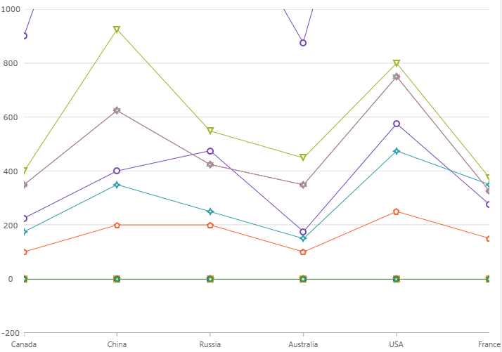

////
|metadata|
{
    "name": "categorychart-configuring-axis-range",
    "controlName": ["{CategoryChartName}"],
    "tags": [],
    "buildFlags": []
}
|metadata|
////

= 軸の範囲

link:{CategoryChartLink}.{CategoryChartName}.html[{CategoryChartName}] コントロールで、数値軸の範囲は軸の最初と終わり、つまりデータの最小値と最大値の数値の差です。範囲の最小値は、軸の最小値です。範囲の最大値は、軸の最大値です。

=== このトピックの内容

このトピックは、以下のセクションで構成されます。

* <<overview,概要>>
* <<codesnippet,コード スニペット>>
* <<RelatedContent,関連コンテンツ>>

[[overview]]
== 概要

デフォルトで、{CategoryChartName} コントロールは、チャート プロット領域を最大化するために、最小データ ポイントおよび最大データ ポイントに基づいて軸の範囲の最小値と最大値を計算します。軸の最小値と最大値の自動計算は、データ ポイントのセットに適切でない場合があります。たとえば、データの最小値が -150 の場合、軸の link:{CategoryChartLink}.{CategoryChartName}{ApiProp}yAxisMinimumValue.html[YAxisMinimumValue] プロパティを使用して軸の最小値を -200 に設定したい場合があります。これにより、軸の最小値とデータ ポイントの最小値の間に 50 のスペース値ができることになります。軸の link:{CategoryChartLink}.{CategoryChartName}{ApiProp}yAxisMaximumValue.html[YAxisMaximumValue] プロパティを使用すれば軸の最大値とデータ ポイントの最大値にも同様のことが適用できます。

[[codesnippet]]
== コード スニペット
以下のサンプル コードは、y 軸で軸の範囲を変更する方法を示します。

ifdef::xaml[]
*XAML の場合:*

[source,xaml]
----
<ig:{CategoryChartName} ItemsSource="{Binding EnergySampleData}"
                        YAxisMinimumValue="-200"
                        YAxisMaximumValue="1000">
</ig:{CategoryChartName}>
----
endif::xaml[]

ifdef::win-forms[]
*C# の場合:*
[source,csharp]
----
this.ultraCategoryChart1.YAxisMinimumValue = -200;
this.ultraCategoryChart1.YAxisMaximumValue = 1000;
----

*Visual Basic の場合:*
[source,csharp]
----
Me.ultraCategoryChart1.YAxisMinimumValue = -200
Me.ultraCategoryChart1.YAxisMaximumValue = 1000
----
endif::win-forms[] 

[[RelatedContent]]

== 関連コンテンツ

[options="header", cols="a,a"]

|====

|トピック|目的

| link:categorychart-walkthrough.html[カテゴリ チャートの追加]
|このトピックは、カテゴリ チャート コントロールを作成する方法を紹介します。

| link:categorychart-chart-types.html[チャート タイプ]
|このトピックは利用可能なチャート タイプを説明します。