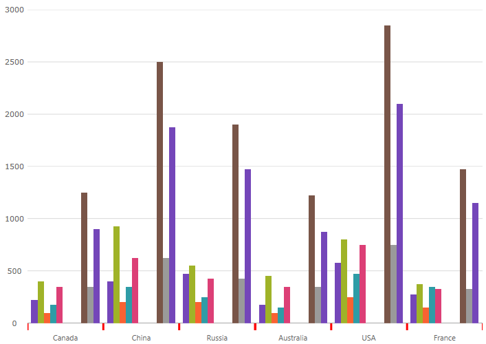

////
|metadata|
{
    "name": "categorychart-configuring-axis-tickmarks",
    "controlName": ["{CategoryChartName}"],
    "tags": [],
    "buildFlags": []
}
|metadata|
////

= 軸目盛

目盛りは軸にポイントを表示します。スケールに特定の数値ポイント、またはカテゴリ軸に基本のデータ項目の値を表します。

=== このトピックの内容

このトピックは、以下のセクションで構成されます。

* <<propertysettings,プロパティの設定>>
* <<codesnippet,コード スニペット>>
* <<RelatedContent,関連コンテンツ>>

[[propertysettings]]
== プロパティの設定

{CategoryChartName} コントロールでは、以下のプロパティで x 軸および y 軸の目盛りの長さ、太さ、色を変更できます。

[options="header", cols="a,a,a"]
|====
|プロパティ名|プロパティ タイプ|説明

| link:{CategoryChartLink}.{CategoryChartXY}{ApiProp}XAxisTickLength.html[XAxisTickLength], link:{CategoryChartLink}.{CategoryChartXY}{ApiProp}YAxisTickLength.html[YAxisTickLength]  
|`double`
|x 軸と y 軸の目盛りの長さを決定します。

ifdef::wpf[]
| link:{CategoryChartLink}.{CategoryChartXY}{ApiProp}XAxisTickStroke.html[XAxisTickStroke], link:{CategoryChartLink}.{CategoryChartXY}{ApiProp}YAxisTickStroke.html[YAxisTickStroke]  
|`Brush`
|x 軸と y 軸の目盛りの色を決定します。
endif::wpf[]

ifdef::xamarin[]
| link:{CategoryChartLink}.{CategoryChartXY}{ApiProp}XAxisTickStroke.html[XAxisTickStroke], link:{CategoryChartLink}.{CategoryChartXY}{ApiProp}YAxisTickStroke.html[YAxisTickStroke]  
|link:{DataVizLinkBase}.Brush.html[Brush]
|x 軸と y 軸の目盛りの色を決定します。
endif::xamarin[]

| link:{CategoryChartLink}.{CategoryChartXY}{ApiProp}XAxisTickStrokeThickness.html[XAxisTickStrokeThickness], link:{CategoryChartLink}.{CategoryChartXY}{ApiProp}YAxisTickStrokeThickness.html[YAxisTickStrokeThickness]  
|`double`
|x 軸と y 軸の目盛りの太さを決定します。

|==== 

[[codesnippet]]
== コード スニペット

以下のコードスニペットは、x 軸の色、長さ、太さを設定します。

ifdef::xaml[]
*XAML の場合:*

[source,xaml]
----
<ig:{CategoryChartName} ItemsSource="{Binding EnergySampleData}"
                     ChartType="Column"
                     XAxisTickLength = "7"
                     XAxisTickStrokeThickness = "2"
                     XAxisTickStroke = "Red"
/>
----
endif::xaml[]

ifdef::win-forms[]
*C# の場合:*

[source,csharp]
----
this.ultraCategoryChart1.ChartType = CategoryChartType.Column;
this.ultraCategoryChart1.XAxisTickLength = 7;
this.ultraCategoryChart1.XAxisTickStrokeThickness = 2;
this.ultraCategoryChart1.XAxisTickStroke = System.Drawing.Color.FromArgb(173, 37, 10, 0);
----

*Visual Basic の場合:*

[source,csharp]
----
Me.ultraCategoryChart1.ChartType = CategoryChartType.Column
Me.ultraCategoryChart1.XAxisTickLength = 7
Me.ultraCategoryChart1.XAxisTickStrokeThickness = 2
Me.ultraCategoryChart1.XAxisTickStroke = System.Drawing.Color.FromArgb(173, 37, 10, 0)
----
endif::win-forms[] 

[[RelatedContent]]
== 関連コンテンツ

[options="header", cols="a,a"]
|====
|トピック|目的

| link:categorychart-walkthrough.html[カテゴリ チャートの追加]
|このトピックは、カテゴリ チャート コントロールを作成する方法を紹介します。

| link:categorychart-chart-types.html[チャート タイプ]
|このトピックは利用可能なチャート タイプを説明します。