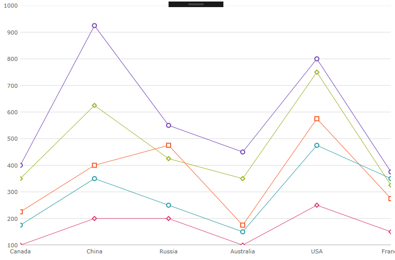

////
|metadata|
{
    "name": "categorychart-configuring-chart-markers",
    "controlName": ["{CategoryChartName}"],
    "tags": [],
    "buildFlags": []
}
|metadata|
////

= チャート マーカーの構成

マーカーは、link:{CategoryChartLink}.{CategoryChartName}.html[{CategoryChartName}] コントロールのプロット領域のデータ ポイント値に表示される視覚的要素です。マーカーは、値が主グリッド線と副グリッド線の間にある場合に、指定したデータ ポイントの値をただちに識別できるようユーザーをサポートをします。
このセクションは、{CategoryChartName} コントロールのマーカーでの作業に関するタスクベースの手順についての役立つ情報を提供します。

=== このトピックの内容

このトピックには以下のセクションがあります。

* <<markerappearance,マーカーの外観>> 
* <<markertypes,マーカー タイプ>>
* <<markerbrushesandoutlines,マーカー ブラシとアウトライン>>
* <<RelatedContent,関連コンテンツ>>

チャート マーカーの外観は、{CategoryChartName} クラスのマーカー プロパティで管理できます。

[[markerappearance]]
== マーカーの外観

以下の表は、マーカーのすべての外観プロパティの一覧です。

[options="header", cols="a,a,a"]
|====
|プロパティ名|プロパティ タイプ|説明

|pick:[wpf,xamarin="link:{CategoryChartLink}.{CategoryChartDomain}{ApiProp}MarkerTypes.html[MarkerTypes]"]pick:[win-forms="link:{CategoryChartLink}.{CategoryChartName}{ApiProp}MarkerTypes.html[MarkerTypes]"] 
|link:{CategoryChartLink}.MarkerTypeCollection.html[MarkerTypeCollection]
|チャートのすべてのシリーズで表示されるマーカーのタイプを決定します。

|pick:[wpf,xamarin="link:{CategoryChartLink}.{CategoryChartDomain}{ApiProp}MarkerBrushes.html[MarkerBrushes]"]pick:[win-forms="link:{CategoryChartLink}.{CategoryChartName}{ApiProp}MarkerBrushes.html[MarkerBrushes]"]
|link:{DataVizLinkBase}.BrushCollection.html[BrushCollection]
|マーカーの塗りつぶし色を決定します。

|pick:[wpf,xamarin="link:{CategoryChartLink}.{CategoryChartDomain}{ApiProp}MarkerOutlines.html[MarkerOutlines]"]pick:[win-forms="link:{CategoryChartLink}.{CategoryChartName}{ApiProp}MarkerOutlines.html[MarkerOutlines]"]
|link:{DataVizLinkBase}.BrushCollection.html[BrushCollection]
|マーカーのアウトライン色を決定します。
|====

[[markertypes]]
== マーカー タイプ

[options="header", cols="a,a,a"]
|====
|名前|タイプ|説明

|`CircleMarker`
|link:{CategoryChartLink}.MarkerType.html[MarkerType]
|円マーカーのタイプを表示します。

|`DiamondMarker`
|link:{CategoryChartLink}.MarkerType.html[MarkerType]
|ダイアモンド マーカーのタイプを表示します。

|`HexagonMarker`
|link:{CategoryChartLink}.MarkerType.html[MarkerType]
|六角形マーカーのタイプを表示します。

|`HexagramMarker`
|link:{CategoryChartLink}.MarkerType.html[MarkerType]
|六線星形マーカーのタイプを表示します。

|`PentagramMarker`
|link:{CategoryChartLink}.MarkerType.html[MarkerType]
|星形五角形マーカーのタイプを表示します。

|`PentagonMarker`
|link:{CategoryChartLink}.MarkerType.html[MarkerType]
|五角形マーカーのタイプを表示します。

|`PyramidMarker`
|link:{CategoryChartLink}.MarkerType.html[MarkerType]
|ピラミッドマーカーのタイプを表示します。

|`SquareMarker`
|link:{CategoryChartLink}.MarkerType.html[MarkerType]
|四角形マーカーのタイプを表示します。

|`TetragramMarker`
|link:{CategoryChartLink}.MarkerType.html[MarkerType]
|テトラグラム マーカーのタイプを表示します。

|`TriangleMarker`
|link:{CategoryChartLink}.MarkerType.html[MarkerType]
|三角形マーカーのタイプを表示します。

|====

以下のコードは、{CategoryChartName} のマーカー タイプの変更方法を示します。

ifdef::xaml[]
*XAML の場合:*

[source,xaml]
----
<ig:XamCategoryChart ItemsSource="{Binding}" ChartType="Line" MarkerTypes="Circle Diamond Square" />
----
endif::xaml[]

ifdef::win-forms[]
*C# の場合:*
[source,csharp]
----
this.ultraCategoryChart1.MarkerTypes.Add(MarkerType.Circle);
this.ultraCategoryChart1.MarkerTypes.Add(MarkerType.Diamond);
this.ultraCategoryChart1.MarkerTypes.Add(MarkerType.Square);
----

*Visual Basic の場合:*
[source,vb]
----
Me.ultraCategoryChart1.MarkerTypes.Add(MarkerType.Circle)
Me.ultraCategoryChart1.MarkerTypes.Add(MarkerType.Diamond)
Me.ultraCategoryChart1.MarkerTypes.Add(MarkerType.Square)
----
endif::win-forms[] 

以下のスクリーンショットは、折れ線チャート タイプでダイアモンド マーカーを使用した {CategoryChartName} コントロールを示します。

[[markerbrushesandoutlines]]
== マーカー ブラシとアウトライン

以下のコード スニペットは、{CategoryChartName} の MarkerBrushes および MarkerOutlines の変更方法を示します。

ifdef::xaml[]
*XAML の場合:*

[source,xaml]
----
<ig:XamCategoryChart 
      MarkerBrushes="White" 
      MarkerOutlines="Red Orange Green"
      Brushes="Red Orange Green"
	  ChartType="Line">
</ig:XamCategoryChart>
----
endif::xaml[]

ifdef::win-forms[]
*C# の場合:*
[source,csharp]
----
this.ultraCategoryChart1.MarkerBrushes.Add(System.Drawing.Color.FromArgb(255, 255, 255, 0));

this.ultraCategoryChart1.MarkerOutlines.Add(System.Drawing.Color.FromArgb(173, 10, 34, 0));
this.ultraCategoryChart1.MarkerOutlines.Add(System.Drawing.Color.FromArgb(173, 119, 10, 0));
this.ultraCategoryChart1.MarkerOutlines.Add(System.Drawing.Color.FromArgb(34, 173, 10, 0));

this.ultraCategoryChart1.Brushes.Add(System.Drawing.Color.FromArgb(173, 10, 34, 0));
this.ultraCategoryChart1.Brushes.Add(System.Drawing.Color.FromArgb(173, 119, 10, 0));
this.ultraCategoryChart1.Brushes.Add(System.Drawing.Color.FromArgb(34, 173, 10, 0));
----

*Visual Basic の場合:*
[source,vb]
----
Me.ultraCategoryChart1.MarkerBrushes.Add(System.Drawing.Color.FromArgb(255, 255, 255, 0))

Me.ultraCategoryChart1.MarkerOutlines.Add(System.Drawing.Color.FromArgb(173, 10, 34, 0))
Me.ultraCategoryChart1.MarkerOutlines.Add(System.Drawing.Color.FromArgb(173, 119, 10, 0))
Me.ultraCategoryChart1.MarkerOutlines.Add(System.Drawing.Color.FromArgb(34, 173, 10, 0))

Me.ultraCategoryChart1.Brushes.Add(System.Drawing.Color.FromArgb(173, 10, 34, 0))
Me.ultraCategoryChart1.Brushes.Add(System.Drawing.Color.FromArgb(173, 119, 10, 0))
Me.ultraCategoryChart1.Brushes.Add(System.Drawing.Color.FromArgb(34, 173, 10, 0))
----
endif::win-forms[] 

以下のスクリーンショットは、折れ線チャート タイプでマーカーをカスタマイズした {CategoryChartName} コントロールを示します。

image::images/categorychart_configuring_chart_markers_02.png[]

[[RelatedContent]]
== 関連コンテンツ

[options="header", cols="a,a"]
|====
|トピック|目的

| link:categorychart-binding-to-data.html[データ バインド]
|このトピックは、コントロールをデータにバインドする方法を紹介します。

| link:categorychart-overview.html[概要]
|このトピックは、カテゴリ チャート コントロールの概要を提供します。

|====