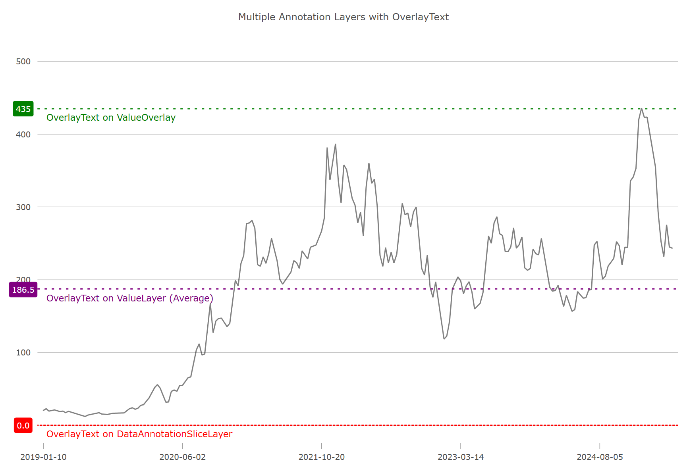

= チャート オーバーレイ テキスト (ベータ版)

このトピックでは、{ProductName} のlink:datachart-series-value-overlay.html[値オーバーレイ]、link:datachart-series-value-layer.html[値レイヤー]、およびlink:datachart-chartannotationlayers.html[チャート注釈レイヤー]を使用して、link:{DataChartLink}.{DataChartName}.html[{DataChartName}] コンポーネントにカスタム オーバーレイ テキストを表示する方法について説明します。これらの注釈やオーバーレイ レイヤーは、表示されているシリーズに関連する X 軸上の重要なイベント (例: 企業の四半期決算) や Y 軸上の重要な値 を注釈するためによく使用されますが、さらにオーバーレイ テキストを使用して補足的な注釈を加えることも可能です。

たとえば、DataAnnotationSliceLayer、ValueOverlay、ValueLayer を使用してオーバーレイ テキストを表示できます。

== オーバーレイ テキストの描画

次のコード スニペットは、上の図に示すように、3 つの注釈レイヤーの比較を描画する方法を示しています。

ifdef::wpf[]

*XAML の場合*:

[source, xaml]
----
<ig:DataAnnotationSliceLayer 
AnnotationValueMemberPath="Value" 
AnnotationLabelMemberPath="Label" 
OverlayTextLocation="OutsideBottomLeft"
OverlayText="OverlayText on DataAnnotationSliceLayer"
TargetAxis="{Binding ElementName=yAxis}"
IsAxisAnnotationEnabled="true"
{ApiDataSource}="{Binding}"
/>
----

endif::wpf[]

ifdef::wpf,win-forms[]

*C# の場合*:

[source, cs]
----

var yAxis = new NumericYAxis
{
    MinimumValue = 0,
    MaximumValue = 550,
    LabelExtent = 60,
    LabelMargin = new Padding(0, 0, 5, 0),
    LabelHorizontalAlignment = Portable.Components.UI.HorizontalAlignment.Center,
};

var sliceLayer = new DataAnnotationSliceLayer()
{
    DashArray = new DoubleCollection { 2, 4 },
    Brush = Brushes.Red,
    TargetMode = DataAnnotationTargetMode.NumericYAxes,
    Name = "AnnoLayer", 
    Thickness = 2,
    OverlayText = "OverlayText on DataAnnotationSliceLayer",
    OverlayTextLocation = OverlayTextLocation.OutsideBottomLeft,
    AnnotationLabelMemberPath = "Label",
    AnnotationValueMemberPath = "Value",
    DataSource = new List<Annotation> { new Annotation() { Value = 0, } }
};

// Create the ValueOverlay
var valueOverlay = new ValueOverlay()
{
    Value = 435,
    Brush = Brushes.Green,
    IsAxisAnnotationEnabled = true,
    Thickness = 2,
    DashArray = new DoubleCollection { 2, 4 },
    Axis = yAxis,
    OverlayText = "OverlayText on ValueOverlay",
    OverlayTextLocation = OverlayTextLocation.OutsideBottomLeft
};

// Create the ValueLayer
var valueLayer = new ValueLayer()
{
    ValueMode = ValueLayerValueMode.Average,
    Brush = Brushes.Purple,
    Thickness = 2,
    DashArray = new DoubleCollection { 2, 4 },
    IsAxisAnnotationEnabled = true,
    OverlayText = "OverlayText on ValueLayer (Average)",
    OverlayTextLocation = OverlayTextLocation.OutsideBottomLeft
};

chart.Series.Add(valueOverlay);
chart.Series.Add(valueLayer);
chart.Axes.Add(xAxisBottom);
chart.Series.Add(sliceLayer);

----

endif::wpf,win-forms[]

== オーバーレイ テキストのスタイル設定

このコード例は、link:datachart-series-value-overlay.html[値オーバーレイ]、link:datachart-series-value-layer.html[値レイヤー]、およびlink:datachart-chartannotationlayers.html[チャート注釈レイヤー]上のオーバーレイ テキストのスタイルを設定およびカスタマイズする方法を示しています。

ifdef::wpf,win-forms[]

*C# の場合*:

[source, cs]
----

public Series StylingOverlayText()
{
    var annoLayer = new DataAnnotationSliceLayer();

    // styling optional overlay text 
    annoLayer.OverlayTextColor = Brushes.White;
    annoLayer.OverlayTextBackground = Brushes.Green;
    annoLayer.OverlayTextBorderColor = Brushes.Black;
    annoLayer.OverlayTextBorderThickness = 1;
    annoLayer.OverlayTextBorderRadius = 4;
    annoLayer.OverlayTextHorizontalMargin = 5;
    annoLayer.OverlayTextHorizontalPadding = 2;
    annoLayer.OverlayTextVerticalMargin = 5;
    annoLayer.OverlayTextVerticalPadding = 2;

    return annoLayer;
}

----

endif::wpf,win-forms[]

== API リファレンス

[options="header", cols="a,a,a"]
|====
|プロパティ名|プロパティ タイプ|説明

| link:{DataChartLink}.valueoverlay{ApiProp}overlaytext.html[ValueOverlay.OverlayText] link:{DataChartLink}.ValueLayer{ApiProp}overlaytext.html[ValueLayer.OverlayText]
| `string`
| 値レイヤーまたは値オーバーレイに表示される静的テキストを割り当てます。データ注釈には、`OverlayTextMemberPath` プロパティを使用して、テキストに割り当てられたプロパティをマップできるという利点があります。

| link:{DataChartLink}.dataannotationaxislayer{ApiProp}targetaxis.html[TargetAxis]
|`Axis`
|

| link:{DataChartLink}.dataannotationshapelayer{ApiProp}OverlayTextMemberPath.html[OverlayTextMemberPath]
|`string`
|このプロパティは、注釈の横にオーバーレイ テキストとして表示されるデータ列の名前へのマッピングです。

| link:{DataChartLink}.dataannotationshapelayer{ApiProp}OverlayTextColor.html[OverlayTextColor]
|`object`
|オーバーレイ内のテキストの色を管理する構成可能な設定です。

| link:{DataChartLink}.dataannotationshapelayer{ApiProp}OverlayTextBackground.html[OverlayTextBackground]
|`object`
|注釈オーバーレイの背景に使用される色の構成可能な設定です。

| link:{DataChartLink}.dataannotationshapelayer{ApiProp}OverlayTextBorderColor.html[OverlayTextBorderColor]
|`object`
|注釈オーバーレイ テキストの境界線に使用される色の構成可能な設定です。

| link:{DataChartLink}.dataannotationshapelayer{ApiProp}OverlayTextLocation.html[OverlayTextLocation]
|`string`
|このプロパティは、オーバーレイ テキストの配置位置を管理します。

|====