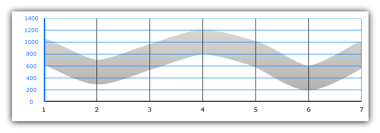
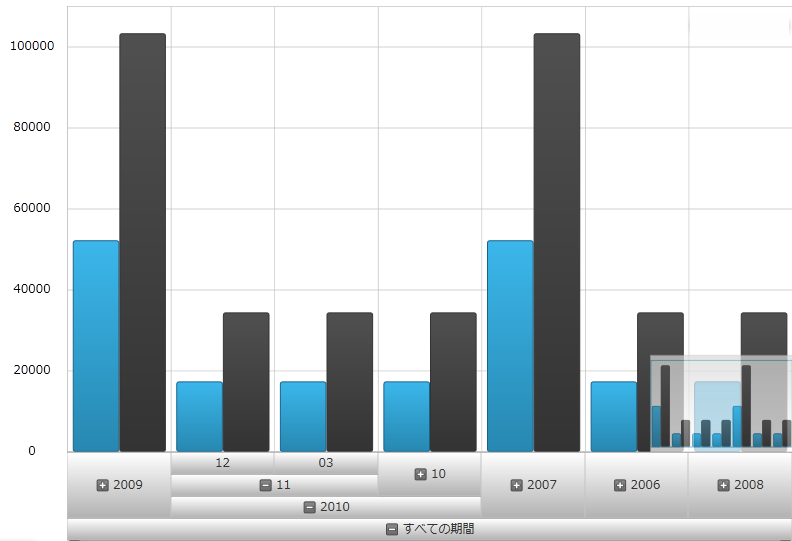
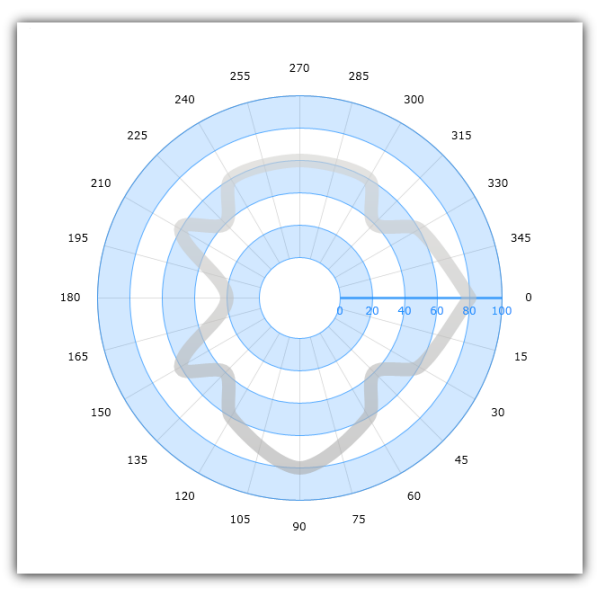
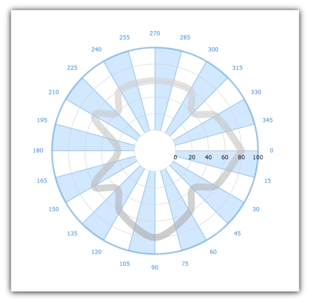
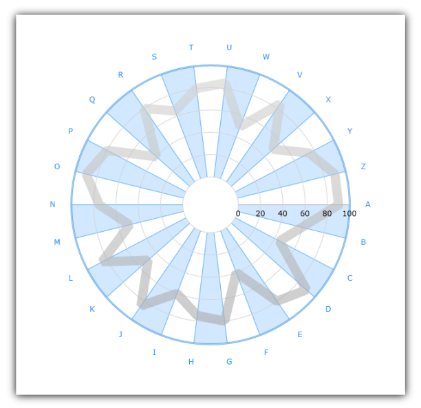

////

|metadata|
{
    "name": "datachart-axes",
    "controlName": ["{DataChartName}"],
    "tags": ["Charting"],
    "guid": "e0c1a537-ee33-4389-a939-eab0cea8fade",  
    "buildFlags": [],
    "createdOn": "2014-06-05T19:39:00.5863526Z"
}
|metadata|
////

= チャート軸

=== 目的

このトピックでは、 link:{DataChartLink}.{DataChartName}.html[{DataChartName}] コントロールで使用される link:{DataChartLink}.axis.html[軸]オブジェクトの概念的な情報を示します。

=== 前提条件

本トピックの理解を深めるために、以下のトピックを参照することをお勧めします。

[options="header", cols="a,a"]
|====
|トピック|目的

| link:datachart-datachart.html[{DataChartName}]
|このトピックでは、 _{DataChartName}_ コントロールの概要を説明します。

| link:datachart-getting-started-with-datachart.html[データ チャートを使用した作業の開始]
|このトピックでは、{DataChartName} コントロールを使用して作業を開始する方法に関する情報を提供します。

| link:datachart-series-requirements.html[シリーズ要件]
|このトピックでは、{DataChartName} コントロールで利用可能な散布シリーズに関する情報を提供します。

|====

=== このトピックの内容

このトピックは、以下のセクションで構成されます。

* <<Overview,概要>>

** <<Introduction,概要>>
** <<AxisProperties,Axis プロパティ>>
** <<AxisTypes,軸のタイプ>>

* <<CartesianAxes,デカルト軸>>
* <<PolarAxes,極座標軸>>
* <<RelatedContent,関連コンテンツ>>

[[Overview]]
== _概要_

[[Introduction]]

=== 概要

{DataChartName} コントロールでは、 link:{DataChartLink}.axis.html[軸]は軸のラベル、主線、目盛り、グリッド線、ストリップやタイトルの外観を特定する基本プロパティを提供します。チャート コントロールでサポートされる異なる link:datachart-series.html[チャート シリーズ] タイプで使用される軸にはいくつかのタイプがあります。シリーズのタイプは、一緒に使用できる軸を決定します。特定のシリーズで必要となる軸タイプの詳細については、link:datachart-series-requirements.html[「シリーズ要件」]のトピックを参照してください。

[[AxisProperties]]

=== Axis プロパティ

チャート コントロールのすべての軸オブジェクトの種類には共通のプロパティのセットがあり、それを次のテーブルで表示されます:

[options="header", cols="a,a,a"]
|====
|プロパティ名|プロパティ タイプ|説明

| link:{DataChartLink}.axis{ApiProp}crossingaxis.html[CrossingAxis]
| link:{DataChartLink}.axis.html[Axis]
|現在の軸を交差する軸を決定します (link:datachart-axis-crossing.html[「軸の交差の構成」]を参照してください)。

| link:{DataChartLink}.axis{ApiProp}crossingvalue.html[CrossingValue]
|double
|別の軸との交差位置を決定します (link:datachart-axis-crossing.html[「軸の交差の構成」]を参照してください)。

| link:{DataChartLink}.axis{ApiProp}isinverted.html[IsInverted]
|bool
|軸の方向が反転するかどうかを決定します (link:datachart-axis-orientation.html[「軸の方向の構成」]を参照してください)。

| link:{DataChartLink}.axis{ApiProp}label.html[Label]
|string
|データ マッピング (カテゴリ軸) およびすべての軸ラベルの書式を決定します。

ifdef::wpf,win-universal[]
|LabelSettings
| link:{DataChartLink}.axislabelsettings.html[AxisLabelSettings]
|前景、フォント、配置、余白、角度などのラベル設定を決定します。link:datachart-axis-label-settings.html[軸ラベル設定の構成]を参照してください。
endif::wpf,win-universal[]

|
ifdef::win-forms,xamarin,android[] 

link:{DataChartLink}.axis{ApiProp}labelangle.html[LabelAngle] 

endif::win-forms,xamarin,android[] 

ifdef::wpf,win-universal[] 

link:{DataChartLink}.axislabelsettings{ApiProp}angle.html[LabelSettings.Angle] 

endif::wpf,win-universal[] 

|double
|軸ラベルの回転角度を決定します。

|
ifdef::win-forms,xamarin,android[] 

link:{DataChartLink}.axis{ApiProp}labelextent.html[LabelExtent] 

endif::win-forms,xamarin,android[] 

ifdef::wpf,win-universal[] 

link:{DataChartLink}.axislabelsettings{ApiProp}extent.html[LabelSettings.Extent] 

endif::wpf,win-universal[] 

|double
|軸ラベルと軸主線の間の空スペースを決定します。

|
ifdef::xamarin,win-forms,android[] 

link:{DataChartLink}.axis{ApiProp}labelfontfamily.html[LabelFontFamily] 

endif::xamarin,win-forms,android[] 

ifdef::wpf,win-universal[] 

link:{DataChartLink}.axislabelsettings{ApiProp}fontfamily.html[LabelSettings.FontFamily] 

endif::wpf,win-universal[]
|
ifdef::win-forms[] 
Font 
endif::win-forms[] 

ifdef::xamarin[] 
string 
endif::xamarin[] 

ifdef::sl,wpf,win-phone,win-rt,win-universal[] 

link:{DataChartLink}.axislabelsettings{ApiProp}fontfamily.html[FontFamily] 

endif::sl,wpf,win-phone,win-rt,win-universal[]

|軸ラベルのフォントを決定します。

|
ifdef::win-forms,xamarin,android[] 

link:{DataChartLink}.axis{ApiProp}labelhorizontalalignment.html[LabelHorizontalAlignment] 

endif::win-forms,xamarin,android[] 

ifdef::wpf,win-universal[] 

link:{DataChartLink}.axislabelsettings{ApiProp}horizontalalignment.html[LabelSettings.HorizontalAlignment]  

endif::wpf,win-universal[]
|HorizontalAlignment
|CategoryYAxis と NumericYAxis のみのラベルの水平方向の配置を決定します。

|
ifdef::win-forms,xamarin,android[] 

link:{DataChartLink}.axis{ApiProp}labelverticalalignment.html[LabelVerticalAlignment] 

endif::win-forms,xamarin,android[] 

ifdef::wpf,win-universal[] 

link:{DataChartLink}.axislabelsettings{ApiProp}verticalalignment.html[LabelSettings.VerticalAlignment] 

endif::wpf,win-universal[]
|VerticalAlignment
|CategoryYAxis と NumericYAxis のみのラベルの垂直方向の配置を決定します。

|
ifdef::win-forms,xamarin,android[] 

link:{DataChartLink}.axis{ApiProp}labellocation.html[LabelLocation] 

endif::win-forms,xamarin,android[] 

ifdef::wpf,win-universal[] 

link:{DataChartLink}.axislabelsettings{ApiProp}location.html[LabelSettings.Location] 

endif::wpf,win-universal[]
|
ifdef::xamarin,win-forms[] 

link:{DataChartLinkBase}.axislabelslocation.html[AxisLabelsLocation] 

endif::xamarin,win-forms[] 

ifdef::android,wpf,win-universal[] 

link:{DataChartLink}.axislabelslocation.html[AxisLabelsLocation] 

endif::android,wpf,win-universal[]
|軸主線とチャート プロット領域に対する軸ラベルの位置を決定します。

|
ifdef::win-forms,android[] 

link:{DataChartLink}.axis{ApiProp}labelsvisible.html[LabelsVisible] 

endif::win-forms,android[] 

ifdef::xamarin[] 
link:{DataChartLink}.axis{ApiProp}labelvisibility.html[LabelVisibility] 
endif::xamarin[] 

ifdef::wpf,win-universal[] 

link:{DataChartLink}.axislabelsettings{ApiProp}visibility.html[LabelSettings.Visibility]

endif::wpf,win-universal[]
|
ifdef::win-forms[] 
bool 
endif::win-forms[] 

ifdef::sl,wpf,win-phone,win-universal,xamarin[] 
Visibility 
endif::sl,wpf,win-phone,win-universal,xamarin[] 
|軸ラベルを表示するかどうかを決定します。

|
ifdef::win-forms,xamarin,android[] 

link:{DataChartLink}.axis{ApiProp}labeltextcolor.html[LabelTextColor] 

endif::win-forms,xamarin,android[] 

ifdef::wpf,win-universal[] 

link:{DataChartLink}.axislabelsettings{ApiProp}foreground.html[LabelSettings.Foreground]  

endif::wpf,win-universal[]
|Brush
|軸ラベルのテキストの色を決定します。

| link:{DataChartLink}.axis{ApiProp}majorstroke.html[MajorStroke]
|Brush
|軸の主グリッド線のブラシを決定します。

| link:{DataChartLink}.axis{ApiProp}majorstrokethickness.html[MajorStrokeThickness]
|double
|軸の主グリッド線の太さを決定します。

ifdef::wpf,win-universal[]
| link:{DataChartLink}.axis{ApiProp}majorstrokedasharray.html[MajorStrokeDashArray]
|DoubleCollection
|軸の主グリッド線の破線のパターンと空間を決定します。
endif::wpf,win-universal[]

| link:{DataChartLink}.axis{ApiProp}minorstroke.html[MinorStroke]
|Brush
|軸の主グリッド線のブラシを決定します。

| link:{DataChartLink}.axis{ApiProp}minorstrokethickness.html[MinorStrokeThickness]
|double
|軸の主グリッド線の太さを決定します。

ifdef::wpf,win-universal[]
| link:{DataChartLink}.axis{ApiProp}minorstrokedasharray.html[MinorStrokeDashArray]
|DoubleCollection
|軸の主グリッド線の破線のパターンと空間を決定します。
endif::wpf,win-universal[]

| link:{DataChartLink}.axis{ApiProp}strip.html[Strip]
|Brush
|軸の主グリッド線の交互のストリップのブラシを決定します。

| link:{DataChartLink}.axis{ApiProp}stroke.html[Stroke]
|Brush
|主な軸線のブラシを決定します。

| link:{DataChartLink}.axis{ApiProp}strokethickness.html[StrokeThickness]
|double
|主な軸線の太さを決定します。

ifdef::wpf,win-universal[]
| link:{DataChartLink}.axis{ApiProp}strokedasharray.html[StrokeDashArray]
|DoubleCollection
|主な軸線の破線のパターンと空間を決定します。
endif::wpf,win-universal[]

| link:{DataChartLink}.axis{ApiProp}ticklength.html[TickLength]
|double
|軸の目盛の長さを決定します。

| link:{DataChartLink}.axis{ApiProp}tickstroke.html[TickStroke]
|Brush
|軸の目盛のブラシを決定します。

| link:{DataChartLink}.axis{ApiProp}tickstrokethickness.html[TickStrokeThickness]
|double
|軸の目盛の太さを決定します。

ifdef::wpf,win-universal[]
| link:{DataChartLink}.axis{ApiProp}tickstrokedasharray.html[TickStrokeDashArray]
|DoubleCollection
|目盛りの破線のパターンと空間を決定します。
endif::wpf,win-universal[]

| link:{DataChartLink}.axis{ApiProp}title.html[Title]
|string
|軸のタイトルのテキストを決定します。

ifdef::wpf,win-universal[]
| link:{DataChartLink}.axis{ApiProp}titlesettings.html[TitleSettings]
| link:{DataChartLink}.titlesettings.html[TitleSettings]
|前景、フォント、配置、余白、角度などのタイトル設定を決定します。
endif::wpf,win-universal[]

|
ifdef::win-forms,xamarin,android[] 

link:{DataChartLink}.axis{ApiProp}titleangle.html[TitleAngle] 

endif::win-forms,xamarin,android[] 

ifdef::wpf,win-universal[] 

link:{DataChartLink}.titlesettings{ApiProp}angle.html[TitleSettings.Angle] 

endif::wpf,win-universal[]
|double
|軸タイトルの回転角度を決定します。

|
ifdef::win-forms,xamarin,android[] 

link:{DataChartLink}.axis{ApiProp}titlefontfamily.html[TitleFontFamily] 

endif::win-forms,xamarin,android[] 

ifdef::wpf,win-universal[] 

link:{DataChartLink}.titlesettings{ApiProp}fontfamily.html[TitleSettings.FontFamily] 

endif::wpf,win-universal[]
|
ifdef::win-forms[] 
Font 
endif::win-forms[] 

ifdef::xamarin[] 
string 
endif::xamarin[] 

ifdef::sl,wpf,win-phone,win-rt[] 

link:{DataChartLink}.titlesettings{ApiProp}fontfamily.html[FontFamily] 

endif::sl,wpf,win-phone,win-rt[]
|軸タイトルのフォントを決定します。

|
ifdef::win-forms,xamarin,android[] 

link:{DataChartLink}.axis{ApiProp}titlehorizontalalignment.html[TitleHorizontalAlignment] 

endif::win-forms,xamarin,android[] 

ifdef::wpf,win-universal[] 

link:{DataChartLink}.titlesettings{ApiProp}horizontalalignment.html[TitleSettings.HorizontalAlignment] 

endif::wpf,win-universal[]
|HorizontalAlignment
|CategoryXAxis と NumericXAxis のみのタイトルの水平の配置を決定します。

|
ifdef::win-forms,xamarin,android[] 

link:{DataChartLink}.axis{ApiProp}titleverticalalignment.html[TitleVerticalAlignment] 

endif::win-forms,xamarin,android[] 

ifdef::wpf,win-universal[] 

link:{DataChartLink}.titlesettings{ApiProp}verticalalignment.html[TitleSettings.VerticalAlignment] 

endif::wpf,win-universal[]
|VerticalAlignment
|CategoryYAxis と NumericYAxis のみのタイトルの垂直の配置を決定します。

|
ifdef::win-forms,xamarin,android[] 

link:{DataChartLink}.axis{ApiProp}titleposition.html[TitlePosition] 

endif::win-forms,xamarin,android[] 

ifdef::wpf,win-universal[] 

link:{DataChartLink}.titlesettings{ApiProp}position.html[TitleSettings.Position] 

endif::wpf,win-universal[]
|
ifdef::xamarin,win-forms[] 

link:{DataChartLinkBase}.axistitleposition.html[AxisTitlePosition] 

endif::xamarin,win-forms[] 

ifdef::wpf,win-universal,android[] 

link:{DataChartLink}.axistitleposition.html[AxisTitlePosition] 

endif::wpf,win-universal,android[]
|軸ラベルに関連する軸タイトルの配置を決定します。

|
ifdef::win-forms,xamarin,android[] 

link:{DataChartLink}.axis{ApiProp}titletextcolor.html[TitleTextColor] 

endif::win-forms,xamarin,android[] 

ifdef::wpf,win-universal[] 

link:{DataChartLink}.titlesettings{ApiProp}foreground.html[TitleSettings.Foreground]

endif::wpf,win-universal[]
|Brush
|軸タイトルのテキストの色を決定します。

|====

[[AxisTypes]]

=== 軸のタイプ

チャートコントロールは、軸のさまざまなタイプをサポートします。この軸は、チャート プロット領域での方向および図形に応じて二つのグループに分類されています。次のテーブルでは、この軸のグループおよびサポートされている軸の種類と適用可能なシリーズを表示します。

[options="header", cols="a,a"]
|====
|デカルト軸|適用可能なシリーズのタイプ

| link:{DataChartLink}.categoryxaxis.html[CategoryXAxis]
| link:datachart-category-series-overview.html[カテゴリ シリーズ]、 link:datachart-financial-indicators-overview.html[財務指標]、 link:datachart-series-financial-price-series-overview.html[財務シリーズ]

| link:{DataChartLink}.categoryyaxis.html[CategoryYAxis]
| link:datachart-category-bar-series.html[棒シリーズ]

| link:{DataChartLink}.categorydatetimexaxis.html[CategoryDateTimeXAxis]
| link:datachart-category-series-overview.html[カテゴリ シリーズ]、 link:datachart-financial-indicators-overview.html[財務指標]、 link:datachart-series-financial-price-series-overview.html[財務シリーズ]

| link:{DataChartLink}.numericxaxis.html[NumericXAxis]
| link:datachart-scatter-series-overview.html[散布シリーズ] および link:datachart-category-bar-series.html[棒シリーズ]

| link:{DataChartLink}.numericyaxis.html[NumericYAxis]
| link:datachart-category-series-overview.html[カテゴリ シリーズ]、 link:datachart-scatter-series-overview.html[散布図シリーズ]および link:datachart-financial-indicators-overview.html[財務指標]、 link:datachart-series-financial-price-series-overview.html[財務シリーズ]

ifdef::sl,wpf[]
| link:{ApiPlatform}controls.charts.olap{ApiVersion}~{DataChartNamespace}.olapxaxis_members.html[OlapXAxis]
| link:datachart-category-series-overview.html[カテゴリ シリーズ]
endif::sl,wpf[]

ifdef::wpf,win-forms[]
| link:{DataChartLink}.timexaxis.html[TimeXAxis]
| link:datachart-category-series-overview.html[カテゴリ シリーズ]、 link:datachart-financial-indicators-overview.html[財務指標]、 link:datachart-series-financial-price-series-overview.html[財務シリーズ]

|link:{DataChartLink}.ordinaltimexaxis.html[OrdinalTimeXAxis]
| link:datachart-category-series-overview.html[カテゴリ シリーズ]、 link:datachart-financial-indicators-overview.html[財務指標]、 link:datachart-series-financial-price-series-overview.html[財務シリーズ]

|link:{DataChartLink}.percentchangeyaxis.html[PercentChangeYAxis]
| link:datachart-category-series-overview.html[カテゴリ シリーズ]、 link:datachart-scatter-series-overview.html[散布図シリーズ]および link:datachart-financial-indicators-overview.html[財務指標]、 link:datachart-series-financial-price-series-overview.html[財務シリーズ]
endif::wpf,win-forms[]
|====

[options="header", cols="a,a"]
|====
|極座標軸|適用可能なシリーズのタイプ

| link:{DataChartLink}.numericradiusaxis.html[NumericRadiusAxis]
| link:datachart-polar-series-overview.html[ポラー シリーズ]および link:datachart-radial-series-overview.html[ラジアル シリーズ]

| link:{DataChartLink}.numericangleaxis.html[NumericAngleAxis]
| link:datachart-polar-series-overview.html[極座標シリーズ]

| link:{DataChartLink}.categoryangleaxis.html[CategoryAngleAxis]
| link:datachart-radial-series-overview.html[ラジアル シリーズ]

|====

.注:
[NOTE]
====
軸線にラベル表示するには、すべてのカテゴリ軸にデータ バインディングおよびデータ マッピングが必要です。カテゴリにデータをバインドする方法については、  link:datachart-getting-started-with-datachart.html[データ チャートを使用した作業の開始]  トピックのコード例を参照してください。
====

[[CartesianAxes]]
== _デカルト軸_

[[Introduction]]

=== 概要

デカルト軸は、デカルト座標系にデータ ポイントを表示するシリーズに限って使用されます。この軸は、縦線および横線として表示されます。デフォルトで、水平軸と垂直軸は、左から右、また下から上へそれぞれ描画されます。個々の軸で link:{DataChartLink}.axis{ApiProp}isinverted.html[IsInverted] プロパティを使用することによって、チャート コントロールで軸の方向を変えることができます。これらの軸への垂線は「軸の主グリッド線」と呼ばれ、 link:{DataChartLink}.numericaxisbase{ApiProp}interval.html[Interval] 軸プロパティを構成することで等間隔に配置できます。以下のセクションでは、各デカルト軸について説明し、各軸に項目列を適用して {DataChartName} コントロールに表示したときの図を併記します。

[[CategoryXAxis]]

=== CategoryXAxis

link:{DataChartLink}.categoryxaxis.html[CategoryXAxis]は、データをカテゴリのデータ項目のシーケンスとして扱っています。この軸のラベルがシーケンスの位置に応じて、X 軸に沿って配置されます。この軸の種類では、数字、文字列などのほぼすべてのデータのタイプを表示できます。

image::images/xamDataChart_Axes_01.png[]

[[CategoryYAxis]]

=== CategoryYAxis

link:{DataChartLink}.categoryyaxis.html[CategoryYAxis]は、データをカテゴリのデータ項目のシーケンスとして扱っています。この軸のラベルがシーケンスの位置に応じて、Y 軸に沿って配置されます。この軸の種類では、数字、文字列などのほぼすべてのデータのタイプを表示できます。

image::images/xamDataChart_Axes_01b.png[]

[[CategoryDateTimeXAxis]]

=== CategoryDateTimeXAxis

link:{DataChartLink}.categorydatetimexaxis.html[CategoryDateTimeXAxis] は、データを日付によりソートされるカテゴリ データ項目のシーケンスとして扱っています。この軸のラベルは X 軸に沿って配置されます。この軸の link:{DataChartLink}.timeaxisbase{ApiProp}datetimememberpath.html[DateTimeMemberPath] プロパティを使用してマップされるデータ列の値に基づいて

image::images/xamDataChart_Axes_02.png[]

[[NumericXAxis]]

=== NumericXAxis

link:{DataChartLink}.numericxaxis.html[NumericXAxis] は、データをカテゴリのデータ項目のシーケンスとして扱っています。この軸のラベルは X 軸に沿ってに配置されます。ラベルの位置は、 link:datachart-scatter-series-overview.html[散布シリーズ] の link:{DataChartLink}.scatterbase{ApiProp}xmemberpath.html[XMemberPath] プロパティまたは link:datachart-category-bar-series.html[棒シリーズ]の link:{DataChartLink}.anchoredcategoryseries{ApiProp}valuememberpath.html[ValueMemberPath] を使用するマップされるデータ列の値によって異なります。

image::images/xamDataChart_Axes_03.png[]

[[NumericYAxis]]

=== NumericYAxis

link:{DataChartLink}.numericyaxis.html[NumericYAxis] は、データをカテゴリのデータ項目のシーケンスとして扱っています。この軸のラベルは Y 軸に沿ってに配置されます。ラベルの位置は、 link:datachart-scatter-series-overview.html[散布シリーズ] の link:{DataChartLink}.scatterbase{ApiProp}ymemberpath.html[YMemberPath] プロパティまたは link:datachart-category-series-overview.html[カテゴリ シリーズ] の link:{DataChartLink}.anchoredcategoryseries{ApiProp}valuememberpath.html[ValueMemberPath] を使用するマップされるデータ列の値によって異なります。

ifdef::wpf,win-forms[]
[[TimeXAxis]]

=== TimeXAxis

link:{DataChartLink}.timexaxis.html[TimeXAxis] は、データを日付で並べ替えられるデータ項目のシーケンスとして扱います。この軸のラベルは日付で、日付間隔に基づいて書式設定し、配置できます。日付範囲は link:{DataChartLink}.timeaxisbase{ApiProp}datetimememberpath.html[DateTimeMemberPath] プロパティを使用してマップされるデータ列の日付値に基づいて決定されます。link:{DataChartLink}.timexaxis.html[TimeXAxis] の詳細については、「link:datachart-using-time-x-axis.html[時間 X 軸の使用]」を参照してください。

image::images/xamDataChart_Axes_08.png[]
endif::wpf,win-forms[]

ifdef::sl,wpf[]

[[OlapXAxis]]

=== OlapXAxis

link:{ApiPlatform}controls.charts.olap{ApiVersion}~{DataChartNamespace}.olapxaxis_members.html[OlapXAxis] は OLAP データの視覚化のためにデザインされます。データにドリルダウンし、軸 (列または行) を選択して値をプロットするシリーズを選択できます。OlapXAxis の詳細については、 link:datachart-working-with-multi-dimensional-data-(olap-data)-(xamdatachart).html[マルチ ディメンション データ(OLAP データ) との作業] を参照してください。

endif::sl,wpf[]

[[PolarAxes]]
== _極座標軸_

=== 概要

極座標軸は、 link:datachart-polar-series-overview.html[極座標シリーズ]および link:datachart-radial-series-overview.html[ラジアル シリーズ]と排他的に使用され、チャートの半径座標または角度座標のいずれかに沿って線で表示されます。以下のセクションでは、各極座標軸について説明し、各軸に項目列を適用してチャート コントロールに表示したときの図を併記します。

=== NumericRadiusAxis

link:{DataChartLink}.numericradiusaxis.html[NumericRadiusAxis] は、データをカテゴリのデータ項目のシーケンスとして扱っています。この軸のラベルは円の周りに配置されます。このラベルの位置は、極座標シリーズ タイプの  link:{DataChartLink}.polarbase{ApiProp}anglememberpath.html[AngleMemberPath] プロパティを使用してマップされたデータ列の値に基づいて変わります。NumericAngleAxis の詳細は、 link:datachart-using-numeric-radius-axis.html[「数値角度軸の使用」]トピックを参照してください。

=== NumericAngleAxis

link:{DataChartLink}.numericangleaxis.html[NumericAngleAxis] は、連続するさまざまな数値データ項目としてデータを処理します。この軸のラベルは、極座標シリーズ オブジェクトの link:{DataChartLink}.polarbase{ApiProp}radiusmemberpath.html[RadiusMemberPath] プロパティまたはラジアル シリーズ タイプの link:{DataChartLink}.anchoredradialseries{ApiProp}valuememberpath.html[ValueMemberPath] プロパティを使用し、データ列の値に基づいて異なるラベルの円の位置の中央から開始する半径線に沿って配置されます。NumericRadiusAxis の詳細は、 link:datachart-using-numeric-angle-axis.html[「数値角度軸の使用」]トピックを参照してください。

=== CategoryAngleAxis

link:{DataChartLink}.categoryangleaxis.html[CategoryAngleAxis] は、データをカテゴリのデータ項目のシーケンスとして扱っています。この軸のラベルは、位置に応じて円周に沿って順番に配置されます。この軸の種類では、数字、文字列などのほぼすべてのデータのタイプを表示できます。IGCategoryAngleAxis の詳細は、 link:datachart-using-category-angle-axis.html[「カテゴリー角度軸の構成」]トピックを参照してください。

=== ProportionalCategoryAngleAxis

link:{DataChartLink}.proportionalcategoryangleaxis.html[ProportionalCategoryAngleAxis] は、円チャートと同様にデータ カテゴリのスライスを扱います。この軸のラベルは、シーケンス内の位置に応じて円の端に沿って配置されます。この軸の種類では、数字、文字列などのほぼすべてのデータのタイプを表示できます。ProportionalCategoryAngleAxis の詳細については、link:datachart-radial-pie-series.html[ラジアル円シリーズの使用]トピックを参照してください。

image::images/xamDataChart_Axes_09.png[]

[[RelatedContent]]
== 関連コンテンツ

[[_Ref386478106]]

=== トピック

このトピックの追加情報については、以下のトピックも合わせてご参照ください。

* link:datachart-axis-crossing.html[軸交差の構成]
* link:datachart-axis-label-format.html[軸ラベル形式の構成]

ifdef::wpf,win-universal[]
* link:datachart-axis-label-templates.html[軸ラベル テンプレートの構成]

endif::wpf,win-universal[]

* link:datachart-axis-label-settings.html[軸ラベル設定の構成]
* link:datachart-axis-orientation.html[軸方向の構成]
* link:datachart-configuring-major-and-minor-intervals.html[主間隔と副間隔の構成]

ifdef::wpf,win-universal,win-forms[]
* link:datachart-axis-tick-marks.html[軸目盛の構成]

endif::wpf,win-universal,win-forms[]

ifdef::wpf,win-universal,win-forms,xamarin[]
* link:datachart-axis-title.html[軸タイトルの構成]

endif::wpf,win-universal,win-forms,xamarin[]

* link:datachart-axis-range.html[軸範囲の構成]

ifdef::wpf,win-universal[]
* link:datachart-using-axis-scales.html[軸目盛の構成]

endif::wpf,win-universal[]

ifdef::sl,wpf[]
* link:datachart-creating-custom-axis-scalers.html[カスタム軸スケーラの作成]

endif::sl,wpf[]

ifdef::sl,wpf[]
* link:datachart-creating-custom-axis-tickmark-values.html[カスタム軸目盛値の作成]

endif::sl,wpf[]

* link:datachart-multiple-axes.html[複数軸の使用]

ifdef::sl,wpf,win-phone,win-universal,xamarin[]
* link:datachart-using-numeric-angle-axis.html[数値角度軸の使用]
* link:datachart-using-numeric-radius-axis.html[数値半径軸の使用]
* link:datachart-using-category-angle-axis.html[カテゴリ角度軸の使用]
endif::sl,wpf,win-phone,win-universal,xamarin[]

ifdef:wpf,win-forms[]
* link:datachart-using-percent-change-y-axis.html[PercentChangeYAxis の使用]
* link:datachart-using-ordinal-time-x-axis.html[OrdinalTimeXAxis の使用]
endif::wpf,win-forms[]