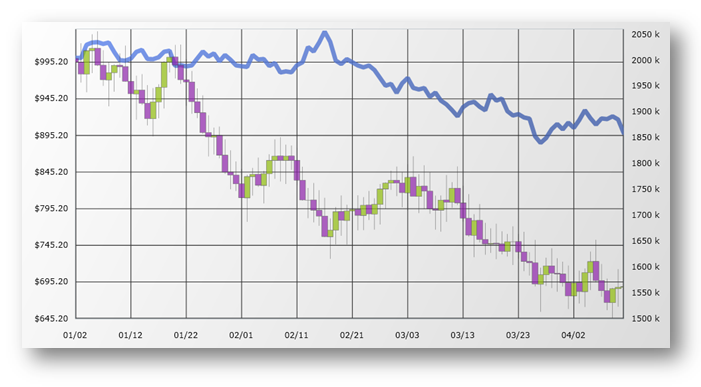

////

|metadata|
{
    "name": "datachart-axis-label-format",
    "controlName": ["{DataChartName}"],
    "tags": ["Application Scenarios","Charting","How Do I"],
    "guid": "d35b5e49-d706-46cb-80e4-f11f244538d1",  
    "buildFlags": [],
    "createdOn": "2014-06-05T19:39:00.6003586Z"
}
|metadata|
////

= 軸ラベル形式の構成

{DataChartName}™では、軸ラベルは書式を適用しない常にシンプルなテキストを表示します。ただし、 任意のタイプの link:{DataChartLink}.Axis.html[軸] の
endif::sl,wpf,win-forms,win-universal[]
ifdef::xamarin[]  ifdef::sl,wpf,win-forms,win-universal[]
link:{DataChartLink}.Axis{ApiProp}Label.html[Label] プロパティに書式文字列を設定して軸ラベルの書式を変更できます。
link:{DataChartLink}.Axis{ApiProp}FormatLabel_EV.html[Axis.FormatLabel] イベントのハンドラー内の link:{DataChartLink}.AxisFormatLabelEventArgs.html[AxisFormatLabelEventArgs] の link:{DataChartLink}.AxisFormatLabelEventArgs{ApiProp}Label.html[Label] プロパティ。
endif::xamarin[]

たとえば、y 軸に沿って通貨データをプロットしている場合、デフォルトのラベルは通貨値の小数点表現を表示するのみです。これらの値を通貨記号と一緒に表示する場合、少数を指定した番号が後に続く C 書式指定子を使用する必要があります。.NET フレームワーク複合書式文字列の詳細は、以下のオンライン リソースを参照してください。

* link:http://msdn.microsoft.com/ja-jp/library/dwhawy9k.aspx[標準の数値書式文字列]
* link:http://msdn.microsoft.com/ja-jp/library/az4se3k1(v=VS.100).aspx[標準日付/時刻書式の文字列]

以下のコード例は、日付書式設定と通貨書式設定を使用して `CategoryXAxis` と `NumericYAxis` のラベルを書式設定する方法を示します。

ifdef::sl,wpf,win-universal[]
[NOTE]
====
注: XAML の中括弧 ('{' と '}') はマークアップ拡張のための特殊文字です。文字列の最初の値が中括弧でなければならない場合、中括弧の空のセットをエスケープ シーケンスとして使用する必要があります。これによって、リテラル値として取得すべき中括弧の空のセットにテキストが続くことができます。
====
endif::sl,wpf,win-universal[]

ifdef::sl,wpf,win-universal[]

*XAML の場合:*
[source,xaml]
----
<ig:{DataChartName} x:Name="DataChart"   >
    <ig:{DataChartName}.Axes>
        <ig:CategoryXAxis x:Name="commonXAxis" Label="{}{Date:MM/dd}"
                         ItemsSource="{Binding}" >
            <ig:CategoryXAxis.LabelSettings>
                <ig:AxisLabelSettings Location="OutsideBottom"/>
            </ig:CategoryXAxis.LabelSettings>
        </ig:CategoryXAxis>
        <ig:NumericYAxis x:Name="priceYAxis" Label="{}{0:C1}">
            <ig:NumericYAxis.LabelSettings>
                <ig:AxisLabelSettings Location="OutsideLeft"/>
            </ig:NumericYAxis.LabelSettings>
        </ig:NumericYAxis>
        <ig:NumericYAxis x:Name="volumeYAxis" Label="{}{0:#,0} K" >
            <ig:NumericYAxis.LabelSettings>
                <ig:AxisLabelSettings Location="OutsideRight"/>
            </ig:NumericYAxis.LabelSettings>
        </ig:NumericYAxis>
    </ig:{DataChartName}.Axes>
</ig:{DataChartName}>
----

endif::sl,wpf,win-universal[]

ifdef::xamarin[]

*XAML の場合:*
[source,xaml]
----
<ig:{DataChartName}.Axes>
    <ig:CategoryXAxis FormatLabel="OnCategoryAxisFormatLabel" />
    <ig:NumericYAxis FormatLabel="OnPricesAxisFormatLabel" />
    <ig:NumericYAxis FormatLabel="OnVolumeAxisFormatLabel" />
</ig:{DataChartName}.Axes>
----

これは `FormatLabel` イベントを各軸のイベント ハンドラーに加入します。このハンドラーは、以下のコード スニペットのようにコード ビハインドで実装されます。

endif::xamarin[]

ifdef::xamarin[]

*C# の場合:*
[source, csharp]
----
var commonAxis = new CategoryXAxis();
commonAxis.FormatLabel += OnCategoryAxisFormatLabel;

var pricesAxis = new NumericYAxis();
pricesAxis.FormatLabel += OnPricesAxisFormatLabel;

var volumeAxis = new NumericYAxis();
volumeAxis.FormatLabel += OnVolumeAxisFormatLabel;

...

private void OnVolumeAxisFormatLabel(object sender, AxisFormatLabelEventArgs e)
{
    e.Label = string.Format("{0:#,0} K", (double)e.Item);
}

private void OnPricesAxisFormatLabel(object sender, AxisFormatLabelEventArgs e)
{
    e.Label = string.Format("{0:C1}", (double)e.Item);
}

private void OnCategoryAxisFormatLabel(object sender, AxisFormatLabelEventArgs e)
{
   var dataItem = (Sale)e.Item;
   e.Label = string.Format("{0:MMM dd}", dataItem.Date);
}
----

.注:
[NOTE]
====
`AxisFormatLabelEventArgs` の `Item` プロパティのタイプは、すべての数値軸に対して常に `double` タイプです。ただし、カテゴリ軸の場合、`Item` プロパティのタイプはデータ項目のタイプと同じです。この場合、`Sale` オブジェクトのリストが `CategoryXAxis` の link:{DataChartLink}.CategoryAxisBase~{ApiDataSource}.html[{ApiDataSource}] プロパティにバインドされているため、Item は `Sale` オブジェクトです。
==== 

endif::xamarin[]

ifdef::sl,wpf,win-universal[]
*C# の場合:*
[source, csharp]
----
var commonAxis = new CategoryXAxis();
var pricesAxis = new NumericYAxis();
var volumeAxis = new NumericYAxis();
commonAxis.Label = "{Date:MM/dd}";
pricesAxis.Label = "{0:C1}";
volumeAxis.Label = "{0:#,0} K";
----
endif::sl,wpf,win-universal[]

ifdef::win-forms[]

*C# の場合:*
[source, csharp]
----
var commonAxis = new CategoryXAxis();
var pricesAxis = new NumericYAxis();
var volumeAxis = new NumericYAxis();

commonAxis.Label = "Date:MM/dd";
// またはイベントを使用
commonAxis.FormatLabel += OnCategoryAxisFormatLabel;

pricesAxis.Label = "Price:C1";
// またはイベントを使用
pricesAxis.FormatLabel += OnPricesAxisFormatLabel;

volumeAxis.Label = "Value:#,0 K";
// またはイベントを使用
volumeAxis.FormatLabel += OnVolumeAxisFormatLabel;

// イベント ハンドラー
string OnCategoryAxisFormatLabel(AxisLabelInfo info)
{
	return string.Format("{0:MM/dd}", info.DateValue);
}

string OnPricesAxisFormatLabel(AxisLabelInfo info)
{
    return string.Format("{0:C1}", info.Value);
}

string OnVolumeAxisFormatLabel(AxisLabelInfo info)
{
    return string.Format("{0:#,0} K", info.Value);
}
----

endif::win-forms[]

ifdef::sl,wpf,win-universal[]
*Visual Basic の場合:*
[source, vb]
----
Dim commonAxis As New CategoryXAxis()
Dim pricesAxis As New NumericYAxis()
Dim volumeAxis As New NumericYAxis()
commonAxis.Label = "{Date:MM/dd}"
pricesAxis.Label = "{0:C1}"
volumeAxis.Label = "{0:#,0} K"
----

endif::sl,wpf,win-universal[]

ifdef::win-forms[]

*Visual Basic の場合:*
[source, vb]
----
Dim commonAxis As New CategoryXAxis()
Dim pricesAxis As New NumericYAxis()
Dim volumeAxis As New NumericYAxis()

commonAxis.Label = "Date:MM/dd"
' またはイベントを使用
AddHandler commonAxis.FormatLabel, AddressOf OnCategoryAxisFormatLabel

pricesAxis.Label = "Price:C1"
' またはイベントを使用
AddHandler pricesAxis.FormatLabel, AddressOf OnPricesAxisFormatLabel

volumeAxis.Label = "Value:#,0 K"
' またはイベントを使用
AddHandler volumeAxis.FormatLabel, AddressOf OnVolumeAxisFormatLabel
        
' イベント ハンドラー
Function OnCategoryAxisFormatLabel(info As AxisLabelInfo) As String
    Return String.Format("{0:MM/dd}", info.DateValue)
End Function

Function OnPricesAxisFormatLabel(info As AxisLabelInfo) As String
    Dim value = CType(info.Value, Double)
    Return String.Format("{0:C1}", value)
End Function

Function OnVolumeAxisFormatLabel(info As AxisLabelInfo) As String
    Dim value = info.Value
    Return String.Format("{0:#,0} K", value)
End Function
----

endif::win-forms[]

ifdef::android[]
*Java の場合:*

[source,js]
----
CategoryXAxis commonAxis = new CategoryXAxis();
NumericYAxis pricesAxis = new NumericYAxis(); 
NumericYAxis volumeAxis = new NumericYAxis();
commonAxis.setLabel("Date:MM/dd");
pricesAxis.setLabel("0:C1");
volumeAxis.setLabel("0:#,0");
----
endif::android[]

以下の画像は、{DataChartName} コントロールが CategoryXAxis および NumericYAxis の書式設定通貨 でどのように見えるかを示しています。

== 関連コンテンツ:

* link:datachart-axis-label-settings.html[軸ラベル設定の構成]