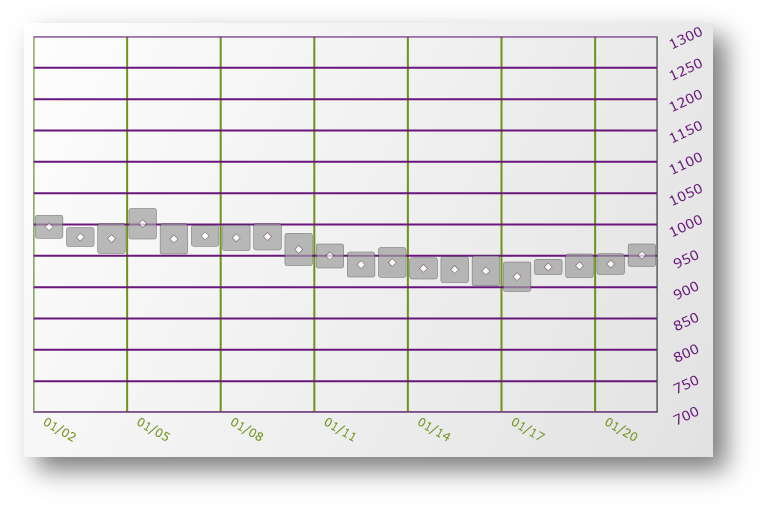

////
|metadata|
{
    "name": "datachart-axis-label-settings",
    "controlName": ["{DataChartName}"],
    "tags": ["Application Scenarios","Charting","How Do I"],
    "guid": "2a790505-160b-4323-9d84-ad3825198a94",
    "buildFlags": [],
    "createdOn": "2014-06-05T19:39:00.5983574Z"
}
|metadata|
////

= 軸ラベル設定の構成

link:{DataChartLink}.{DataChartName}.html[{DataChartName}] コントロールでは、以下の link:{DataChartLink}.axis.html[Axis] オブジェクトのプロパティを使用して、軸ラベルの配置、回転角度、余白、水平/垂直配置、表示/非表示、および外観を変更できます。

[options="header", cols="a,a,a"]
|====
|プロパティ名|プロパティ タイプ|説明

| link:{DataChartLink}.axis{ApiProp}label.html[Label]
|String
|データ マッピング (カテゴリ軸) およびすべての軸ラベルの書式を決定します。

ifdef::sl,wpf,win-universal[]
|LabelSettings
| link:{DataChartLink}.axislabelsettings.html[AxisLabelSettings]
|前景、フォント、配置、余白、角度などのラベル設定を決定します。link:datachart-axis-label-settings.html[軸ラベル設定の構成]を参照してください。
endif::sl,wpf,win-universal[]

|pick:[sl,wpf,win-universal="link:{DataChartLink}.axislabelsettings{ApiProp}angle.html[LabelSettings.Angle]"] pick:[xamarin,win-forms,android="link:{DataChartLink}.axis{ApiProp}labelangle.html[LabelAngle]"]
|double
|軸ラベルの回転角度を決定します。

|pick:[sl,wpf,win-universal="link:{DataChartLink}.axislabelsettings{ApiProp}extent.html[LabelSettings.Extent]"] pick:[xamarin,win-forms,android="link:{DataChartLink}.axis{ApiProp}labelextent.html[LabelExtent]"]
|double
|軸ラベルと軸主線の間の空スペースを決定します。

|pick:[sl,wpf,win-universal="link:{DataChartLink}.axislabelsettings{ApiProp}fontfamily.html[LabelSettings.FontFamily]"] pick:[xamarin,win-forms,android="link:{DataChartLink}.axis{ApiProp}labelfontfamily.html[LabelFontFamily]"]
|`FontFamily`
|軸ラベルのフォントを決定します。

|pick:[sl,wpf,win-universal="link:{DataChartLink}.axislabelsettings{ApiProp}horizontalalignment.html[LabelSettings.HorizontalAlignment]"] pick:[xamarin,win-forms,android="link:{DataChartLink}.axis{ApiProp}labelhorizontalalignment.html[LabelHorizontalAlignment]"]
|HorizontalAlignment
|CategoryYAxis と NumericYAxis のみのラベルの水平方向の配置を決定します。

|pick:[sl,wpf,win-universal="link:{DataChartLink}.axislabelsettings{ApiProp}verticalalignment.html[LabelSettings.VerticalAlignment]"] pick:[xamarin,win-forms,android="link:{DataChartLink}.axis{ApiProp}labelverticalalignment.html[LabelVerticalAlignment]"]
|VerticalAlignment
|CategoryYAxis と NumericYAxis のみのラベルの垂直方向の配置を決定します。

|pick:[sl,wpf,win-universal="link:{DataChartLink}.axislabelsettings{ApiProp}location.html[LabelSettings.Location]"] pick:[xamarin,win-forms,android="link:{DataChartLink}.axis{ApiProp}labellocation.html[LabelLocation]"]
|
ifdef::xamarin,win-forms[] 

link:{DataChartLinkBase}.axislabelslocation.html[AxisLabelsLocation] 

endif::xamarin,win-forms[] 

ifdef::android,sl,wpf,win-universal[] 

link:{DataChartLink}.axislabelslocation.html[AxisLabelsLocation] 

endif::android,sl,wpf,win-universal[]
|軸主線とチャート プロット領域に対する軸ラベルの位置を決定します。

|pick:[sl,wpf,win-universal="link:{DataChartLink}.axislabelsettings{ApiProp}angle.html[LabelSettings.Visibility]"] pick:[xamarin,android="link:{DataChartLink}.axis{ApiProp}labelvisibility.html[LabelsVisibility]"]pick:[win-forms=" link:{DataChartLink}.axis{ApiProp}labelsvisible.html[LabelsVisibility]"]
|`Visibility`
|軸ラベルを表示するかどうかを決定します。

|pick:[sl,wpf,win-universal="link:{DataChartLink}.axislabelsettings{ApiProp}angle.html[LabelSettings.Foreground]"] pick:[xamarin,win-forms,android="link:{DataChartLink}.axis{ApiProp}labelangle.html[LabelTextColor]"]
|Brush
|軸ラベルのテキストの色を決定します。

|====

以下のコード例は、 link:{DataChartLink}.{DataChartName}.html[{DataChartName}] コントロールの link:{DataChartLink}.categoryxaxis.html[CategoryXAxis] および link:{DataChartLink}.numericyaxis.html[NumericYAxis] で軸ラベルの場所、方向の角度、および外観を変更する方法を示します。

ifdef::sl,wpf,win-universal[]

*XAML の場合:*

----
<ig:{DataChartName} x:Name="DataChart" >
    <ig:{DataChartName}.Axes>
        <ig:CategoryXAxis x:Name="xAxis"
                          Label="{}{Date:MM/dd}"
                          ItemsSource="{Binding}" >
            <ig:CategoryXAxis.LabelSettings>
                <ig:AxisLabelSettings Foreground="Green"
                                    Location="OutsideBottom"
                                    Extent="40"
                                    Angle="45" />
                </ig:CategoryXAxis.LabelSettings>
        </ig:CategoryXAxis>
        <ig:NumericYAxis x:Name="yAxis" >
            <ig:NumericYAxis.LabelSettings>
                <ig:AxisLabelSettings Foreground="Red"
                                    Location="OutsideRight"
                                    Extent="40"
                                    Angle="-30" />
            </ig:NumericYAxis.LabelSettings>
        </ig:NumericYAxis>
    </ig:{DataChartName}.Axes>
</ig:{DataChartName}>
----

endif::sl,wpf,win-universal[]

ifdef::xamarin[]

*XAML の場合:*

[source,xaml]
----
<ig:CategoryXAxis x:Name="xAxis"
                  Label="Date"
                  LabelTextColor="Green"
                  LabelLocation="OutsideBottom"
                  LabelExtent="40"
                  LabelAngle="45"
                  ItemsSource="{Binding}" />
<ig:NumericYAxis x:Name="yAxis"
                 LabelTextColor="Red"
                 LabelLocation="OutsideRight"
                 LabelExtent="40"
                 LabelAngle="-30" />
----

endif::xamarin[]

ifdef::sl,wpf,win-universal[]

*C# の場合:*

----
var yAxis = new NumericYAxis();
var xAxis = new CategoryXAxis();
xAxis.Label = "Date";

xAxis.LabelSettings = new AxisLabelSettings();
xAxis.LabelSettings.Foreground = new SolidColorBrush(Colors.Green);
xAxis.LabelSettings.Location = AxisLabelsLocation.OutsideBottom;
xAxis.LabelSettings.Extent = 40;
xAxis.LabelSettings.Angle = 45;

yAxis.LabelSettings = new AxisLabelSettings();
yAxis.LabelSettings.Foreground = new SolidColorBrush(Colors.Red);
yAxis.LabelSettings.Location = AxisLabelsLocation.OutsideRight;
yAxis.LabelSettings.Extent = 40;
yAxis.LabelSettings.Angle = -30;
----

endif::sl,wpf,win-universal[]

ifdef::win-forms[]

*C# の場合:*

----
var yAxis = new NumericYAxis();
var xAxis = new CategoryXAxis();
xAxis.Label = "Date";
xAxis.LabelLocation = AxisLabelsLocation.OutsideBottom;
xAxis.LabelAngle = 45;
xAxis.LabelExtent = 40;
yAxis.LabelLocation = AxisLabelsLocation.OutsideRight;
yAxis.LabelAngle = -30;
yAxis.LabelExtent = 40;
----

endif::win-forms[]

ifdef::xamarin[]

*C# の場合:*

[source, csharp]
----
var xAxis = new CategoryXAxis()
{
    Label = "Date",
    LabelTextColor = new SolidColorBrush(Color.Green),
    LabelLocation = AxisLabelsLocation.OutsideBottom,
    LabelExtent = 40,
    LabelAngle = 45
};

var yAxis = new NumericYAxis()
{
    LabelTextColor= new SolidColorBrush(Color.Red),
    LabelLocation = AxisLabelsLocation.OutsideRight,
    LabelExtent = 40,
    LabelAngle = -30
};
----

endif::xamarin[]

ifdef::sl,wpf,win-universal[]

*Visual Basic の場合:*

----
Dim yAxis As New NumericYAxis()
Dim xAxis As New CategoryXAxis()
xAxis.Label = "Date"

xAxis.LabelSettings As New AxisLabelSettings()
xAxis.LabelSettings.Foreground = New SolidColorBrush(Colors.Green)
xAxis.LabelSettings.Location = AxisLabelsLocation.OutsideBottom
xAxis.LabelSettings.Extent = 40
xAxis.LabelSettings.Angle = 45

yAxis.LabelSettings As New AxisLabelSettings()
yAxis.LabelSettings.Foreground = New SolidColorBrush(Colors.Red)
yAxis.LabelSettings.Location = AxisLabelsLocation.OutsideRight
yAxis.LabelSettings.Extent = 40
yAxis.LabelSettings.Angle = -30
----

endif::sl,wpf,win-universal[]

ifdef::win-forms[]

*Visual Basic の場合:*

----
Dim yAxis As New NumericYAxis()
Dim xAxis As New CategoryXAxis()
xAxis.Label = "Date"
xAxis.LabelLocation = AxisLabelsLocation.OutsideBottom
xAxis.LabelAngle = 45
xAxis.LabelExtent = 40
yAxis.LabelLocation = AxisLabelsLocation.OutsideRight
yAxis.LabelAngle = -30
yAxis.LabelExtent = 40
----

endif::win-forms[]

ifdef::android[]

*Java の場合:*

[source,js]
----
xAxis.setLabel("Date");
xAxis.setLabelLocation(AxisLabelsLocation.OutsideBottom);
xAxis.setLabelAngle(45);
xAxis.setLabelExtent(40);
yAxis.setLabelLocation(AxisLabelsLocation.OutsideRight);
yAxis.setLabelAngle(-30);
yAxis.setLabelExtent(40);
----

endif::android[]

以下の画像は、{DataChartName} コントロールが CategoryXAxis および NumericYAxis のカスタム ラベル設定でどのように見えるかを示しています。

ifdef::sl,wpf,win-universal[]
以前の AxisLabelSettings を解除するには、Axis が以前にクリアして再追加されても、新しい AxisLabelSettings を追加する必要があります。
endif::sl,wpf,win-universal[]

== 関連コンテンツ:

ifdef::sl,wpf,win-universal[]
* link:datachart-axis-label-templates.html[軸ラベル テンプレートの構成]

endif::sl,wpf,win-universal[]

* link:datachart-multiple-axes.html[複数軸の使用]