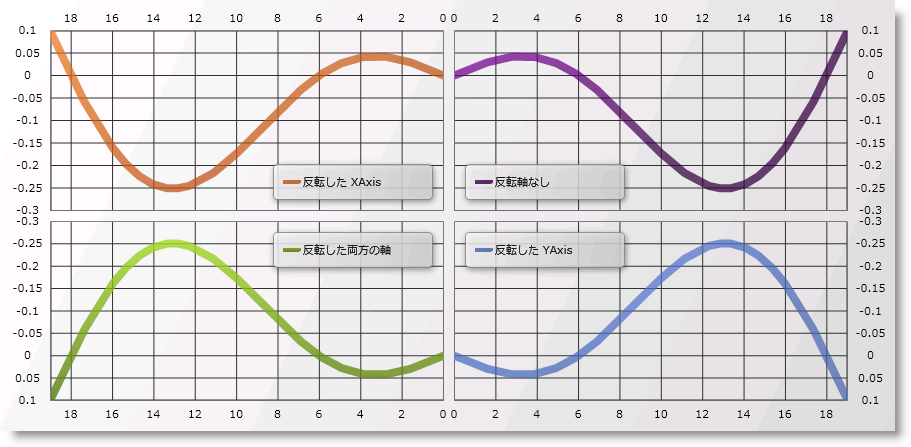

////

|metadata|
{
    "name": "datachart-axis-orientation",
    "controlName": ["{DataChartName}"],
    "tags": ["Application Scenarios","Charting","How Do I"],
    "guid": "84b2d327-324b-4831-8304-94a11ec8905e",  
    "buildFlags": [],
    "createdOn": "2014-06-05T19:39:00.5923563Z"
}
|metadata|
////

= 軸方向の構成

デフォルトでは、{DataChartName} コントロールは、チャートの左から右側に XAxis を描画し、チャートの下から上に YAxis を常に描画します。ただし、Axis オブジェクトの link:{DataChartLink}.axis{ApiProp}isinverted.html[IsInverted] プロパティを使用して、個別の軸の描画を反転することによって、これを変更するオプションがあります。軸を反転する場合、軸を使用するシリーズも反転されます。軸を反転する設定のみが表示されることに注意してください。

以下のコード例は、データ チャート コントロールで XAxis および YAxis 方向のすべての可能な組み合わせを示します。

ifdef::wpf,sl,win-universal[]

*XAML の場合:*

----
<Grid>
    <Grid.RowDefinitions>
        <RowDefinition Height="0.5*"/>
        <RowDefinition Height="0.5*"/>
    </Grid.RowDefinitions>
    <Grid.ColumnDefinitions >
        <ColumnDefinition Width="0.5*"/>
        <ColumnDefinition Width="0.5*"/>
    </Grid.ColumnDefinitions> 
    <ig:{DataChartName} x:Name="DataChart1" Grid.Row="0" Grid.Column="0" >
    <!--注: 反転 X-Axis  -->
        <ig:{DataChartName}.Axes>
            <ig:CategoryXAxis x:Name="xAxis1" IsInverted="True" />
            <ig:NumericYAxis x:Name="yAxis1" IsInverted=" />
        </ig:{DataChartName}.Axes>
    </ig:{DataChartName}>
    <ig:{DataChartName} x:Name="DataChart2" Grid.Row="0" Grid.Column="1" >
    <!--注: 反転 Axes なし -->
        <ig:{DataChartName}.Axes>
            <ig:CategoryXAxis x:Name="xAxis2" IsInverted="  />
            <ig:NumericYAxis x:Name="yAxis2" IsInverted=" />
        </ig:{DataChartName}.Axes>
    </ig:{DataChartName}>
    <ig:{DataChartName} x:Name="DataChart3" Grid.Row="1" Grid.Column="0">
    <!--注: 両軸の反転  -->
        <ig:{DataChartName}.Axes>
            <ig:CategoryXAxis x:Name="xAxis3" IsInverted="True" />
            <ig:NumericYAxis x:Name="yAxis3" IsInverted="True" />
        </ig:{DataChartName}.Axes>
    </ig:{DataChartName}>
    <ig:{DataChartName} x:Name="DataChart4" Grid.Row="1" Grid.Column="1">
    <!--注: 反転 Y-Axis  -->
         <ig:{DataChartName}.Axes>
            <ig:CategoryXAxis x:Name="xAxis4" IsInverted=" />
            <ig:NumericYAxis x:Name="yAxis4" IsInverted="True" />     
        </ig:{DataChartName}.Axes>
     </ig:{DataChartName}>
</Grid>
----

endif::wpf,sl,win-universal[]

ifdef::xamarin[]
*XAML の場合:*
[source, xaml]
<Grid>
    <ig:XamDataChart>
        <!--NOTE: Inverted X-Axis  -->
        <ig:XamDataChart.Axes>
            <ig:CategoryXAxis IsInverted="True" />
            <ig:NumericYAxis IsInverted="False" />
        </ig:XamDataChart.Axes>
    </ig:XamDataChart>
    <ig:XamDataChart>
        <!--NOTE: No Inverted Axes  -->
        <ig:XamDataChart.Axes>
            <ig:CategoryXAxis IsInverted="False" />
            <ig:NumericYAxis IsInverted="False" />
        </ig:XamDataChart.Axes>
    </ig:XamDataChart>
    <ig:XamDataChart>
        <!--NOTE: Inverted Both Axes  -->
        <ig:XamDataChart.Axes>
            <ig:CategoryXAxis IsInverted="True" />
            <ig:NumericYAxis IsInverted="True" />
        </ig:XamDataChart.Axes>
    </ig:XamDataChart>
    <ig:XamDataChart>
        <!--NOTE: Inverted Y-Axis  -->
        <ig:XamDataChart.Axes>
            <ig:CategoryXAxis IsInverted="False" />
            <ig:NumericYAxis IsInverted="True" />
        </ig:XamDataChart.Axes>
    </ig:XamDataChart>
</Grid>
endif::xamarin[]

ifdef::sl,wpf,win-universal[]

*C# の場合:*

----
var xAxis1 = new CategoryXAxis();
var yAxis1 = new NumericYAxis();
var xAxis2 = new CategoryXAxis();
var yAxis2 = new NumericYAxis();
var xAxis3 = new CategoryXAxis();
var yAxis3 = new NumericYAxis();
var xAxis4 = new CategoryXAxis();
var yAxis4 = new NumericYAxis();
xAxis1.IsInverted = true;
yAxis1.IsInverted = false;
xAxis2.IsInverted = false;
yAxis2.IsInverted = false;
xAxis3.IsInverted = true;
yAxis3.IsInverted = true;
xAxis4.IsInverted = false;
yAxis4.IsInverted = true;
----

endif::sl,wpf,win-universal[]

ifdef::win-forms[]

*C# の場合:*

----
var xAxis1 = new CategoryXAxis();
var yAxis1 = new NumericYAxis();
var xAxis2 = new CategoryXAxis();
var yAxis2 = new NumericYAxis();
var xAxis3 = new CategoryXAxis();
var yAxis3 = new NumericYAxis();
var xAxis4 = new CategoryXAxis();
var yAxis4 = new NumericYAxis();
xAxis1.IsInverted = true;
yAxis1.IsInverted = false;
xAxis2.IsInverted = false;
yAxis2.IsInverted = false;
xAxis3.IsInverted = true;
yAxis3.IsInverted = true;
xAxis4.IsInverted = false;
yAxis4.IsInverted = true;
----

endif::win-forms[]

ifdef::xamarin[]

*C# の場合:*

----
var xAxis1 = new CategoryXAxis();
xAxis1.IsInverted = true;

var yAxis1 = new NumericYAxis();
yAxis1.IsInverted = false;

var xAxis2 = new CategoryXAxis();
xAxis2.IsInverted = false;

var yAxis2 = new NumericYAxis();
yAxis2.IsInverted = false;

var xAxis3 = new CategoryXAxis();
xAxis3.IsInverted = true;

var yAxis3 = new NumericYAxis();
yAxis3.IsInverted = true;

var xAxis4 = new CategoryXAxis();
xAxis4.IsInverted = false;

var yAxis4 = new NumericYAxis();
yAxis4.IsInverted = true;
----

endif::xamarin[]

ifdef::sl,wpf,win-universal[]

*Visual Basic の場合:*

----
Dim xAxis1 As New CategoryXAxis()
Dim yAxis1 As New NumericYAxis()
Dim xAxis2 As New CategoryXAxis()
Dim yAxis2 As New NumericYAxis()
Dim xAxis3 As New CategoryXAxis()
Dim yAxis3 As New NumericYAxis()
Dim xAxis4 As New CategoryXAxis()
Dim yAxis4 As New NumericYAxis()
xAxis1.IsInverted = true
yAxis1.IsInverted = false 
xAxis2.IsInverted = false
yAxis2.IsInverted = false
xAxis3.IsInverted = true
yAxis3.IsInverted = true
xAxis4.IsInverted = false
yAxis4.IsInverted = true
----

endif::sl,wpf,win-universal[]

ifdef::win-forms[]

*Visual Basic の場合:*

----
Dim xAxis1 As New CategoryXAxis()
Dim yAxis1 As New NumericYAxis()
Dim xAxis2 As New CategoryXAxis()
Dim yAxis2 As New NumericYAxis()
Dim xAxis3 As New CategoryXAxis()
Dim yAxis3 As New NumericYAxis()
Dim xAxis4 As New CategoryXAxis()
Dim yAxis4 As New NumericYAxis()
xAxis1.IsInverted = true
yAxis1.IsInverted = false 
xAxis2.IsInverted = false
yAxis2.IsInverted = false
xAxis3.IsInverted = true
yAxis3.IsInverted = true
xAxis4.IsInverted = false
yAxis4.IsInverted = true
----

endif::win-forms[]

ifdef::android[]

*Java の場合:*

[source,js]
----
CategoryXAxis xAxis1 = new CategoryXAxis();
NumericYAxis yAxis1 = new NumericYAxis();
CategoryXAxis xAxis2 = new CategoryXAxis();
NumericYAxis yAxis2 = new NumericYAxis();
CategoryXAxis xAxis3 = new CategoryXAxis();
NumericYAxis yAxis3 = new NumericYAxis();
CategoryXAxis xAxis4 = new CategoryXAxis();
NumericYAxis yAxis4 = new NumericYAxis();
xAxis1.setIsInverted(true);
yAxis1.setIsInverted(false);
xAxis2.setIsInverted(false);
yAxis2.setIsInverted(false);
xAxis3.setIsInverted(true);
yAxis3.setIsInverted(true);
xAxis4.setIsInverted(false);
yAxis4.setIsInverted(true);
----

endif::android[]

以下の画像は、反転なしの軸から反転した X 軸と Y 軸を含む、さまざまな反転軸の組み合わせで 4 つの {DataChartName} コントロールで同じデータ シリーズを示します。

== 関連コンテンツ:

* link:datachart-axis-range.html[軸範囲の構成]
* link:datachart-axis-label-settings.html[軸ラベル設定の構成]
* link:datachart-multiple-axes.html[複数軸]