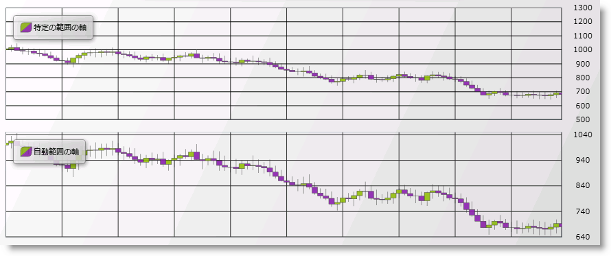

////

|metadata|
{
    "name": "datachart-axis-range",
    "controlName": ["{DataChartName}"],
    "tags": ["Charting","How Do I"],
    "guid": "6b4a3bb7-71b8-48f4-a23c-c3cb5e3646e7",  
    "buildFlags": [],
    "createdOn": "2014-06-05T19:39:00.6023593Z"
}
|metadata|
////

= 軸範囲の構成

{DataChartName}™ コントロールで、数値軸の範囲は軸の最初と終わり、つまりデータの最小値と最大値の数値の差です。範囲の最小値は、軸の最小値です。範囲の最大値は、軸の最大値です。

デフォルトで、 link:{DataChartLink}.{DataChartName}.html[{DataChartName}] コントロールは、チャート プロット領域を最大化するために、最小データ ポイントおよび最大データ ポイントに基づいて軸の範囲の最小値と最大値を計算します。軸の最小値と最大値の自動計算は、データ ポイントのセットに適切でない場合があります。たとえば、データの最小値が 850 の場合、軸の link:{DataChartLink}.numericaxisbase{ApiProp}minimumvalue.html[MinimumValue] プロパティを使用して軸の最小値を 800 に設定したい場合があります。これにより、軸の最小値とデータ ポイントの最小値の間に 50 のスペース値ができることになります。軸の link:{DataChartLink}.numericaxisbase{ApiProp}maximumvalue.html[MaximumValue] プロパティを使用すれば軸の最大値とデータ ポイントの最大値にも同様のことが適用できます。

以下のサンプル コードは、link:{DataChartLink}.numericyaxis.html[NumericYAxis] で軸の範囲を変更する方法を示します。

ifdef::xaml[]

*XAML の場合:*

----
<ig:NumericYAxis x:Name="yAxis" 
                MinimumValue="500"
                MaximumValue="1300"
                Interval="100">
</ig:NumericYAxis>
----

endif::xaml[]

ifdef::xaml,win-forms[]

*C# の場合:*

----
var yAxis = new NumericYAxis()
{
    MinimumValue = 500,
    MaximumValue = 1300,
    Interval = 100
};
----

endif::xaml,win-forms[]

ifdef::sl,wpf,win-universal[]

*Visual Basic の場合:*

----
Dim yAxis As New NumericYAxis()
yAxis.MinimumValue = 500
yAxis.MaximumValue = 1300
yAxis.Interval = 100
----

endif::sl,wpf,win-universal[]

ifdef::win-forms[]

*Visual Basic の場合:*

----
Dim yAxis As New NumericYAxis()
yAxis.MinimumValue = 500
yAxis.MaximumValue = 1300
yAxis.Interval = 100
----

endif::win-forms[]

ifdef::android[]

*Java の場合:*

[source,js]
----
NumericYAxis yAxis = new NumericYAxis();
yAxis.setMinimumValue(500);
yAxis.setMaximumValue(1300);
yAxis.setInterval(100);
----

endif::android[]

以下の画像は、{DataChartName} コントロールが NumericYAxis に軸範囲を設定した場合にどのように表示されるかを示します。

