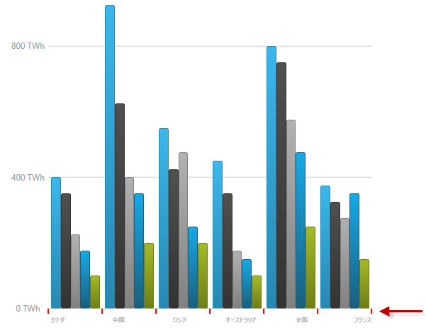
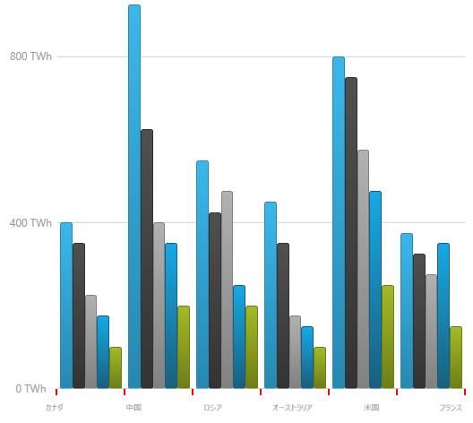

////

|metadata|
{
    "name": "datachart-axis-tick-marks",
    "tags": ["Charting","Data Presentation"],
    "controlName": ["{DataChartName}"],
    "guid": "7ae01fc6-c2c7-4caf-a244-cbf33594aac5",  
    "buildFlags": [],
    "createdOn": "2014-06-05T19:39:00.6103627Z"
}
|metadata|
////

= 軸目盛の構成

== トピックの概要

=== 目的

このトピックではコード例を使用して、 _{DataChartName}_™ コントロールのチャートの軸に目盛を構成する方法を説明します。

=== 前提条件

本トピックの理解を深めるために、以下のトピックを参照することをお勧めします。

[options="header", cols="a,a"]
|====
|トピック|目的

| link:datachart-getting-started-with-datachart.html[データ チャートを使用した作業の開始]
|{DataChartName} コントロールは、データ セットおよびデータ バインディングが必要です。このトピックでは、簡単なデータ オブジェクト モデルを提供する方法を示します。

| link:datachart-axes.html[チャート軸]
|このトピックは、 _{DataChartName}_ コントロールによってサポートされる軸のタイプを紹介します。

|====

[[_Ref367456508]]
== 軸目盛の構成

[[_Ref367456519]]

=== 概要

軸目盛は、_{DataChartName}_ コントロールのすべての水平および垂直軸に沿って表示することができます軸目盛が有効な場合、各ラベルに対応するすべての目盛が表示されます。

軸目盛りは、軸の link:{DataChartLink}.axis{ApiProp}ticklength.html[TickLength] プロパティを 0 以上の値に設定すると有効になります。(このプロパティは目盛を形成する線分の長さを指定します。)

目盛は常に、軸のストローク線に沿って表示されラベルの方向に向きます。各ラベルは、重複を避けるために、link:{DataChartLink}.axis{ApiProp}ticklength.html[TickLength] プロパティの値でオフセットが設定されます。たとえば、ラベルの位置が AxisLabelsLocation.OutsideBottom の水平軸の場合、link:{DataChartLink}.axis{ApiProp}ticklength.html[TickLength] を `5` に設定すると、ラベルは 5 単位下にシフトします。

ifdef::wpf,sl,win-forms,win-universal,android[]
.注:
[NOTE]
====
有効なプロパティの場合も、 pick:[wpf,win-universal="link:{DataChartLink}.axislabelsettings{ApiProp}visibility.html[LabelSettings] プロパティが折りたたまれた"] pick:[win-forms="link:{DataChartLink}.axis{ApiProp}labelsvisible.html[LabelsVisible プロパティが false の]"]場合、目盛は表示されません。
====
endif::wpf,sl,win-forms,win-universal,android[]

[[_Ref367456522]]

=== プロパティ設定

以下の表では、各プロパティ設定の構成です。

[options="header", cols="a,a,a"]
|====
|構成の目的:|使用するプロパティ:|設定の選択肢:

|軸目盛の長さ
| link:{DataChartLink}.axis{ApiProp}ticklength.html[TickLength]
|軸目盛の指定した任意の長さ

|軸目盛の線分の幅
| link:{DataChartLink}.axis{ApiProp}tickstrokethickness.html[TickStrokeThickness]
|double 値で設定された軸目盛りの指定した任意の幅

|軸目盛の色
| link:{DataChartLink}.axis{ApiProp}tickstroke.html[TickStroke]
|任意の色

ifdef::wpf,win-universal,win-forms[]
|目盛の線のスタイル (破線 / 実線)
| link:{DataChartLink}.axis{ApiProp}tickstrokedasharray.html[TickStrokeDashArray]
|偶数の double 値の集合。奇数位置の数字が破線の長さ、偶数位置の数字が破線の間隔をそれぞれ表し、ピクセルで指定されます。 

たとえば、 "2, 1" の値が指定された場合、目盛は破線で描画され、2-px の長いダッシュの後に 1-px のスペースのパターンが繰り返されます。 

`TickStrokeDashArray` を設定していない場合 (デフォルト)、線は実線になります。
endif::wpf,win-universal,win-forms[]

|====

[[_Ref367456525]]

=== 例

以下のスクリーンショットは、以下の目盛に関する設定の結果、 _{DataChartName}_   コントロールのカテゴリ X 軸の外観がどのようになるか示しています。

[options="header", cols="a,a"]
|====
|プロパティ|値

| link:{DataChartLink}.axis{ApiProp}ticklength.html[TickLength]
| _"7"_ 

| link:{DataChartLink}.axis{ApiProp}tickstroke.html[TickStroke]
| _"Red"_ 

| link:{DataChartLink}.axis{ApiProp}tickstrokethickness.html[TickStrokeThickness]
| _"2"_ 

|====

以下はチャートの X 軸のコード スニペットです。

ifdef::xaml[]

*XAML の場合:*

[source,xaml]
----
<ig:CategoryXAxis x:Name="XAxis"  
                  TickLength="7" 
                  TickStroke="Red" 
                  TickStrokeThickness="2" />
----

endif::xaml[]

ifdef::xaml,win-forms[]

*C# の場合:*

----
var xAxis = new CategoryXAxis()
{
    TickLength = 7,
    TickStroke = new SolidColorBrush(Color.Red),
    TickStrokeThickness = 2
};
----

endif::xaml,win-forms[]

ifdef::sl,wpf,win-universal[]

*Visual Basic の場合:*

----
Dim xAxis As New CategoryXAxis()
xAxis.TickLength = 7
xAxis.TickStrokeThickness = 2
----

endif::sl,wpf,win-universal[]

ifdef::win-forms[]

*Visual Basic の場合:*

----
Dim xAxis As New CategoryXAxis()
xAxis.TickLength = 7
xAxis.TickStrokeThickness = 2
----

endif::win-forms[]

ifdef::android[]

*Java の場合:*

[source,js]
----
CategoryXAxis xAxis = new CategoryXAxis();
xAxis.setTickLength(7);
xAxis.setTickStrokeThickness(2);
----

endif::android[]

[[_Ref367456536]]
== 関連コンテンツ

[[_Ref367456541]]

=== トピック

以下のトピックでは、このトピックに関連する追加情報を提供しています。

[options="header", cols="a,a"]
|====
|トピック|目的

| link:datachart-axis-label-settings.html[軸ラベル設定の構成]
|_{DataChartName}_ コントロールでは、任意の軸で AxisLabelSettings オブジェクトのプロパティを使用して、軸ラベルの場所、方向の角度、表示 / 非表示および外観を変更できます。

|====