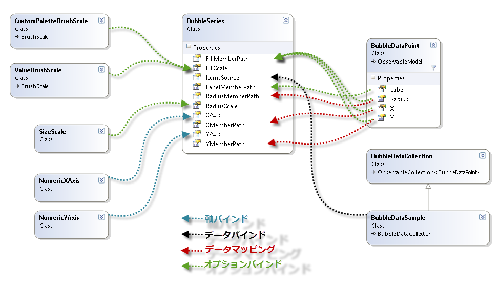
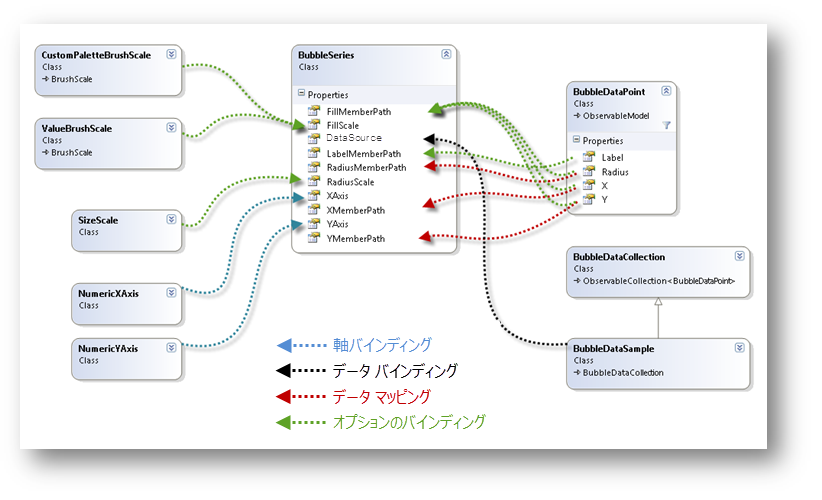
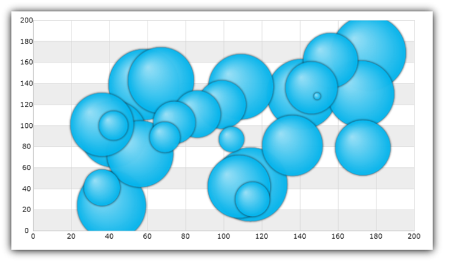

////

|metadata|
{
    "name": "datachart-bubble-series",
    "controlName": ["{DataChartName}"],
    "tags": ["Charting","Data Binding","Data Presentation","Sample Data Source"],
    "guid": "9a664e4b-d479-424c-a3cf-d7d051ff0788",  
    "buildFlags": [],
    "createdOn": "2014-06-05T19:39:00.5613429Z"
}
|metadata|
////

= 散布バブル シリーズ

このトピックは、コード例を示して、 link:{DataChartLink}.bubbleseries.html[BubbleSeries] を link:{DataChartLink}.{DataChartName}.html[{DataChartName}] コントロールで使用する方法を説明します。いくつかの重要な概念的情報も提供します。

=== このトピックの内容

このトピックには以下のセクションがあります。

* <<Introduction,概要>>
* <<Preview,プレビュー>>
* <<DataBinding,データ バインド>>
* <<BubbleSizeScaleFeature,バブル サイズの構成>>
* <<BubbleBrushScaleFeature,バブル ブラシの構成>>
* <<SupportedTypesLegends,サポートされる凡例タイプ>>
* <<RelatedContent,関連コンテンツ>>

[[Introduction]]
== 概要

`BubbleSeries` は、データをプロットにデカルト座標 (x, y) システムを使用するlink:datachart-scatter-series-overview.html[散布シリーズ]のファミリに属します。このシリーズは、スケールしたバブルのコレクションとしてデータを表示します。各シリーズはデカルト座標システムの位置を決定する 1 組の数値 X/Y 値とサイズを決定する 3 つ目の値を持ちます。 

散布シリーズでは、データの不均等な散らばりやデータの塊に注意が向けられます。予測結果の収集データの標準偏差を強調表示し、科学データや統計データをプロットするためによく使用されます。散布シリーズの特性に加えて、`BubbleSeries` マーカー (バブル) のサイズはデータ駆動型です。以下のセクションは、`BubbleSeries` とその機能を使用する方法で重要なコンセプトやタスクベースの情報を示します。
 
[[Preview]]
== プレビュー 

image::images/xamDataChart_Scatter_Bubble_Series_02.png[]

図 1: `BubbleSeries` 実装例

[[DataBinding]]
== データ バインド

`BubbleSeries` は link:{DataChartLink}.series~{ApiDataSource}.html[{ApiDataSource}] プロパティを使用し、IEnumerable インターフェイス (List、Collection、Queue、Stack など) を実装するデータ オブジェクトへバインドします。ただし、このオブジェクトの各データ項目には、2 つの数値データ列 (デカルト座標系でバブルを配置する X および Y 値用) に加えて、1 つの数値データ列 (バブルのサイズ用) がなければなりません。データ列は link:{DataChartLink}.BubbleSeries{ApiProp}RadiusMemberPath.html[RadiusMemberPath]、 link:{DataChartLink}.ScatterBase{ApiProp}XMemberPath.html[XMemberPath]、および link:{DataChartLink}.ScatterBase{ApiProp}YMemberPath.html[YMemberPath] プロパティを使用してマップされます。

上記の基準を満たすオブジェクトに link:resources-sample-bubble-data.html[BubbleDataSource] があり、ダウンロードしてプロジェクトで使用できます。

ifdef::xaml[]

図 2: {DataChartName} コントロールでデータを BubbleSeries にバインドする概略図
endif::xaml[]

ifdef::win-forms[]

図 2: {DataChartName} コントロールでデータを BubbleSeries にバインドする概略図
endif::win-forms[]

==== コード例

このコード スニペットは、サンプル バブル データを `BubbleSeries` にバインドする方法を説明します。

ifdef::wpf,win-universal[]

*XAML の場合:*

[source,xaml]
----
xmlns:local="clr-namespace:Infragistics.Models;assembly=YourAppName"
...
<ig:{DataChartName} >
    <ig:{DataChartName}.Resources>
        <local:BubbleDataSource x:Key="data"/> 
    </ig:{DataChartName}.Resources>
    <ig:{DataChartName}.Axes>
        <ig:NumericXAxis x:Name="XAxis" />
        <ig:NumericYAxis x:Name="YAxis" />
    </ig:{DataChartName}.Axes>
    <ig:{DataChartName}.Series>
		<ig:BubbleSeries ItemsSource="{StaticResource data}"
                         XAxis="{Binding ElementName=XAxis}"
                         YAxis="{Binding ElementName=YAxis}"
                         XMemberPath="X" 
                         YMemberPath="Y"
                         RadiusMemberPath="Radius">
        </ig:BubbleSeries>
    </ig:{DataChartName}.Series>
</ig:{DataChartName}>
----

endif::wpf,win-universal[]

ifdef::xamarin[]
*XAML の場合:*
[source,xaml]
----
xmlns:local="clr-namespace:Infragistics.Models;assembly=YourAppName"
...
<ig:{DataChartName} x:Name="DataChart" >
    <ig:{DataChartName}.Resources>
		<ResourceDictionary>
			<local:BubbleDataSource x:Key="data" />
		</ResourceDictionary>
    </ig:{DataChartName}.Resources>
    <ig:{DataChartName}.Axes>
        <ig:NumericXAxis x:Name="XAxis" />
        <ig:NumericYAxis x:Name="YAxis" />
    </ig:{DataChartName}.Axes>
    <ig:{DataChartName}.Series>
        <ig:BubbleSeries ItemsSource="{StaticResource data}"
                         XAxis="{x:Reference XAxis}"
                         YAxis="{x:Reference YAxis}"
                         XMemberPath="X" 
                         YMemberPath="Y"
                         RadiusMemberPath="Radius"> 
        </ig:BubbleSeries> 
    </ig:{DataChartName}.Series>
</ig:{DataChartName}>
----
endif::xamarin[]

ifdef::wpf,win-universal,xamarin[]

*C# の場合:*

[source,csharp]
----
var data = new BubbleDataSource();
var xAxis = new NumericXAxis();
var yAxis = new NumericYAxis();

var series = new BubbleSeries();
series.XAxis = xAxis;
series.YAxis = yAxis;
series.XMemberPath = "X";
series.YMemberPath = "Y";
series.RadiusMemberPath = "Radius";
series.ItemsSource = data; 
DataChart.Axes.Add(xAxis);
DataChart.Axes.Add(yAxis);
DataChart.Series.Add(series);
----
endif::wpf,win-universal,xamarin[]

ifdef::win-forms[]

*C# の場合:*

[source,csharp]
----
var data = new BubbleDataSource();
var xAxis = new NumericXAxis();
var yAxis = new NumericYAxis();

var series = new BubbleSeries();
series.XAxis = xAxis;
series.YAxis = yAxis;
series.XMemberPath = "X";
series.YMemberPath = "Y";
series.RadiusMemberPath = "Radius";
series.DataSource = data; 
DataChart.Axes.Add(xAxis);
DataChart.Axes.Add(yAxis);
DataChart.Series.Add(series);
----
endif::win-forms[]

ifdef::wpf,win-universal[]
*Visual Basic の場合:*
[source,vb]
----
Dim data As New BubbleDataSource()
Dim xAxis As New NumericXAxis()
Dim yAxis As New NumericYAxis()

Dim series As New BubbleSeries()
series.ItemsSource = data
series.XMemberPath = "X"
series.YMemberPath = "Y"
series.RadiusMemberPath = "Radius" 
series.XAxis = xAxis
series.YAxis = yAxis
Dim chart As New {DataChartName}()
chart.Axes.Add(xAxis)
chart.Axes.Add(yAxis)
chart.Series.Add(series)
----
endif::wpf,win-universal[]

ifdef::win-forms[]
*Visual Basic の場合:*
[source,vb]
----
Dim data As New BubbleDataSource()
Dim xAxis As New NumericXAxis() 
Dim yAxis As New NumericYAxis() 

Dim series As New BubbleSeries()
series.DataSource = data
series.XMemberPath = "X"
series.YMemberPath = "Y"
series.RadiusMemberPath = "Radius" 
series.XAxis = xAxis
series.YAxis = yAxis
Dim chart As New {DataChartName}()
chart.Axes.Add(xAxis)
chart.Axes.Add(yAxis)
chart.Series.Add(series)
----
endif::win-forms[]

ifdef::android[]

*Java の場合:*

[source,js]
----
BubbleDataSource data = new BubbleDataSource();
NumericYAxis yAxis = new NumericYAxis();
NumericXAxis xAxis = new NumericXAxis();

BubbleSeries series = new BubbleSeries();
series.setXAxis(xAxis);
series.setYAxis(yAxis);
series.setXMemberPath("X");
series.setYMemberPath("Y");
series.setRadiusMemberPath("Radius");
series.setDataSource(data);
chart.addAxis(xAxis);
chart.addAxis(yAxis);
chart.addSeries(series);
----

endif::android[]

[[BubbleSizeScaleFeature]]
== バブル サイズの構成

=== 概要

バブル サイズ スケールは、シリーズの link:{DataChartLink}.bubbleseries{ApiProp}radiusscale.html[RadiusScale] プロパティでバブルのサイズを決定する `BubbleSeries` のオプション機能です。この機能は link:{DataChartLink}.sizescale.html[SizeScale] オブジェクトを介して実装されます。半径スケールが設定されると、最小のバブルは link:{DataChartLink}.sizescale{ApiProp}minimumvalue.html[MinimumValue] と等しくなり、最大のバブルは link:{DataChartLink}.sizescale{ApiProp}maximumvalue.html[MaximumValue] と等しくなり、すべての残りのバブルはそれに応じて拡大/縮小されます。サイズ スケールはリニアと対数のいずれかにすることができます。半径スケールが設定されていない場合には、各バブルのサイズは RadiusMemberPath プロパティにマップされたデータ列の値に等しくなります。

図 3: バブル サイズ スケールの実装例

==== コード例

このコードは、SizeScale オブジェクトを使用して、BubbleSeries でバブルのサイズを拡大/縮小する方法を示します。

ifdef::xaml[]

*XAML の場合:*
[source,xaml]
----
<ig:BubbleSeries.RadiusScale>
    <ig:SizeScale IsLogarithmic="False" MaximumValue="120" MinimumValue="20"/>
</ig:BubbleSeries.RadiusScale>
----

endif::xaml[]

ifdef::sl,wpf,win-forms,win-universal[]

*Visual Basic の場合:*
[source,vb]
----
Dim sizeScale As New SizeScale()
sizeScale.IsLogarithmic = False
sizeScale.MinimumValue = 20
sizeScale.MaximumValue = 120
Dim series As New BubbleSeries()
series.RadiusScale = sizeScale
----

endif::sl,wpf,win-forms,win-universal[]

ifdef::sl,wpf,win-forms,win-universal,xamarin[]

*C# の場合:*
[source,csharp]
----
SizeScale sizeScale = new SizeScale();
sizeScale.IsLogarithmic = false;
sizeScale.MinimumValue = 20;
sizeScale.MaximumValue = 120;
BubbleSeries series = new BubbleSeries();
series.RadiusScale = sizeScale;
----

endif::sl,wpf,win-forms,win-universal,xamarin[]

[[BubbleBrushScaleFeature]]
== バブル ブラシの構成

バブル ブラシ スケールは、シリーズ オブジェクトの link:{DataChartLink}.bubbleseries{ApiProp}fillscale.html[FillScale] プロパティを介して 1 つの `BubbleSeries` 内の色パターンを決定するオプション機能です。`BubbleSeries` サポートは以下のブラシ スケールをサポートします。

* カスタム ブラシ スケール
* 値ブラシ スケール

各スケールには、色パターンを定義するブラシのコレクションを持ちます。スケールについてはサブセクションで説明します。

[[CustomBrushScale]]
=== カスタム ブラシ スケール

link:{DataChartLink}.custompalettebrushscale.html[CustomPaletteBrushScale] は、 link:{DataChartLink}.brushscale{ApiProp}brushes.html[Brushes] コレクションからブラシを選択するバブル マーカーのインデックスを使用します。link:{DataChartLink}.custompalettebrushscale{ApiProp}brushselectionmode.html[BrushSelectionMode] プロパティを link:{DataChartLink}.brushselectionmode.html[Select] 列挙値に設定した場合、バブルが連続して色付けされます。BrushSelectionMode が link:{DataChartLink}.brushselectionmode.html[Interpolate] に設定されると、ブラシがコレクションのバブルのインデックスとブラシの数に基づいて補間されます。

image::images/xamDataChart_Scatter_Bubble_Series_04.png[]

図 4: カスタム ブラシ スケールの実装例

==== コード例

このコード スニペットは、CustomPaletteBrushScale オブジェクトを使用して、BubbleSeries でバブルの色を塗りつぶす方法を示します。

ifdef::wpf,win-universal[]

*XAML の場合:*
[source,xaml]
----
xmlns:ig="http://schemas.infragistics.com/xaml"
...
<ig:BubbleSeries XMemberPath="X" 
                 YMemberPath="Y"
                 FillMemberPath="Radius"
                 RadiusMemberPath="Radius"> 
    <ig:BubbleSeries.FillScale>
        <ig:CustomPaletteBrushScale BrushSelectionMode="Interpolate">
            <ig:CustomPaletteBrushScale.Brushes>
                <ig:BrushCollection>
                    <SolidColorBrush Color="#FFC6EEFB" />
                    <SolidColorBrush Color="#FF08C3FE" />
                    <SolidColorBrush Color="#FF08A5FE" />
                    <SolidColorBrush Color="#FF086AFE" />
                    <SolidColorBrush Color="#FF084CFE" />
                </ig:BrushCollection>
            </ig:CustomPaletteBrushScale.Brushes>
        </ig:CustomPaletteBrushScale>
    </ig:BubbleSeries.FillScale>
</ig:BubbleSeries>
----

endif::wpf,win-universal[]

ifdef::xamarin[]

*XAML の場合:*
[source,xaml]
----
xmlns:ig="clr-namespace:Infragistics.XamarinForms.Controls.Charts;assembly=Infragistics.XF.Charts"
xmlns:dv="clr-namespace:Infragistics.XamarinForms;assembly=Infragistics.XF.DataVisualization"
...
<ig:BubbleSeries XMemberPath="X" 
                 YMemberPath="Y"
                 FillMemberPath="Radius"
                 RadiusMemberPath="Radius"> 
    <ig:BubbleSeries.FillScale>
        <ig:CustomPaletteBrushScale BrushSelectionMode="Interpolate">
            <ig:CustomPaletteBrushScale.Brushes>
                <dv:BrushCollection>
                    <dv:SolidColorBrush Color="#FFC6EEFB" />
                    <dv:SolidColorBrush Color="#FF08C3FE" />
                    <dv:SolidColorBrush Color="#FF08A5FE" />
                    <dv:SolidColorBrush Color="#FF086AFE" />
                    <dv:SolidColorBrush Color="#FF084CFE" />
                </dv:BrushCollection>
            </ig:CustomPaletteBrushScale.Brushes>
        </ig:CustomPaletteBrushScale>
    </ig:BubbleSeries.FillScale> 
</ig:BubbleSeries>
----
endif::xamarin[]

ifdef::sl,wpf,win-forms,win-universal[]

*C# の場合:*
[source,csharp]
----
var brushCollection = new BrushCollection();
brushCollection.Add(new SolidColorBrush(Color.FromArgb(0xFF, 0xC6, 0xEE, 0xFB)));
brushCollection.Add(new SolidColorBrush(Color.FromArgb(0xFF, 0x08, 0xC3, 0xFE)));
brushCollection.Add(new SolidColorBrush(Color.FromArgb(0xFF, 0x08, 0xA5, 0xFE)));
brushCollection.Add(new SolidColorBrush(Color.FromArgb(0xFF, 0x08, 0x6A, 0xFE)));
brushCollection.Add(new SolidColorBrush(Color.FromArgb(0xFF, 0x08, 0x4C, 0xFE)));
var brushScale = new CustomPaletteBrushScale();
brushScale.BrushSelectionMode = BrushSelectionMode.Interpolate;
brushScale.Brushes = brushCollection;
var series = new BubbleSeries();
series.FillScale = brushScale;
series.FillMemberPath = "Radius";
----

endif::sl,wpf,win-forms,win-universal[]

ifdef::xamarin[]
*C# の場合:*
[source,csharp]
----
var brushCollection = new BrushCollection();
brushCollection.Add(new SolidColorBrush(Color.FromHex("FFC6EEFB")));
brushCollection.Add(new SolidColorBrush(Color.FromHex("FF08C3FE")));
brushCollection.Add(new SolidColorBrush(Color.FromHex("FF08A5FE")));
brushCollection.Add(new SolidColorBrush(Color.FromHex("FF086AFE")));
brushCollection.Add(new SolidColorBrush(Color.FromHex("FF084CFE")));
var brushScale = new CustomPaletteBrushScale();
brushScale.BrushSelectionMode = BrushSelectionMode.Interpolate;
brushScale.Brushes = brushCollection;
var series = new BubbleSeries();
series.FillScale = brushScale;
series.FillMemberPath = "Radius";
----
endif::xamarin[]

ifdef::wpf,win-forms,win-universal[]
*Visual Basic の場合:*
[source,vb]
----
Dim brushCollection As New BrushCollection()
brushCollection.Add(New SolidColorBrush(Color.FromArgb(&HFF, &HC6, &HEE, &HFB)))
brushCollection.Add(New SolidColorBrush(Color.FromArgb(&HFF, &H08, &HC3, &HFE)))
brushCollection.Add(New SolidColorBrush(Color.FromArgb(&HFF, &H08, &HA5, &HFE)))
brushCollection.Add(New SolidColorBrush(Color.FromArgb(&HFF, &H08, &H6A, &HFE)))
brushCollection.Add(New SolidColorBrush(Color.FromArgb(&HFF, &H08, &H4C, &HFE)))
Dim brushScale As New CustomPaletteBrushScale()
brushScale.BrushSelectionMode = BrushSelectionMode.Interpolate
brushScale.Brushes = brushCollection
Dim series As New BubbleSeries()
series.FillScale = brushScale
series.FillMemberPath = "Radius"
----
endif::wpf,win-forms,win-universal[]

[[ValueBrushScale]]
=== 値ブラシ スケール

link:{DataChartLink}.valuebrushscale.html[ValueBrushScale] – バブルの補間ブラシを決定するために ItemsSource の数値列の 1 つからの値セットを使用してブラシを補間します。列は link:{DataChartLink}.bubbleseries{ApiProp}fillmemberpath.html[FillMemberPath] プロパティで指定されます。この軸スケールはリニアと対数のいずれかにすることができます。またユーザー指定の link:{DataChartLink}.valuebrushscale{ApiProp}minimumvalue.html[MinimumValue] や link:{DataChartLink}.valuebrushscale{ApiProp}maximumvalue.html[MaximumValue] を持つこともできます。このスケールで範囲が設定されると、範囲外になる値を持つバブルが link:{DataChartLink}.brushscale{ApiProp}brushes.html[Brushes] コレクションからブラシを取得せずに、色も付けられません。

image::images/xamDataChart_Scatter_Bubble_Series_05.png[]

図 5: 値ブラシ スケールの実装例

==== コード例

このコード スニペットは、ValueBrushScale オブジェクトを使用して、BubbleSeries でバブルの色を塗りつぶす方法を示します。

ifdef::wpf,win-universal[]

*XAML の場合:*
[source,xaml]
----
xmlns:ig="http://schemas.infragistics.com/xaml"
...
<ig:BubbleSeries XMemberPath="X" 
                 YMemberPath="Y"
                 FillMemberPath="Radius"
                 RadiusMemberPath="Radius"> 
    <ig:BubbleSeries.FillScale>
        <ig:ValueBrushScale IsLogarithmic=" MaximumValue="200" MinimumValue="5">
            <ig:ValueBrushScale.Brushes>
                <ig:BrushCollection>
                    <SolidColorBrush Color="#FFC6EEFB" />
                    <SolidColorBrush Color="#FF08C3FE" />
                    <SolidColorBrush Color="#FF08A5FE" />
                    <SolidColorBrush Color="#FF086AFE" />
                    <SolidColorBrush Color="#FF084CFE" />
                </igCommon:BrushCollection>
            </ig:ValueBrushScale.Brushes>
        </ig:ValueBrushScale>
    </ig:BubbleSeries.FillScale> 
</ig:BubbleSeries>
----

endif::wpf,win-universal[]

ifdef::xamarin[]
*XAML の場合:*
[source,xaml]
----
xmlns:ig="clr-namespace:Infragistics.XamarinForms.Controls.Charts;assembly=Infragistics.XF.Charts"
xmlns:dv="clr-namespace:Infragistics.XamarinForms;assembly=Infragistics.XF.DataVisualization"
...
<ig:BubbleSeries XMemberPath="X" 
                 YMemberPath="Y"
                 FillMemberPath="Radius"
                 RadiusMemberPath="Radius"> 
    <ig:BubbleSeries.FillScale>
        <ig:ValueBrushScale IsLogarithmic=" MaximumValue="200" MinimumValue="5">
            <ig:ValueBrushScale.Brushes>
                <dv:BrushCollection>
                    <dv:SolidColorBrush Color="#FFC6EEFB" />
                    <dv:SolidColorBrush Color="#FF08C3FE" />
                    <dv:SolidColorBrush Color="#FF08A5FE" />
                    <dv:SolidColorBrush Color="#FF086AFE" />
                    <dv:SolidColorBrush Color="#FF084CFE" />
                </dv:BrushCollection>
            </ig:ValueBrushScale.Brushes>
        </ig:ValueBrushScale>
    </ig:BubbleSeries.FillScale> 
</ig:BubbleSeries>
----
endif::xamarin[]

ifdef::sl,wpf,win-forms,win-universal[]

*C# の場合:*
[source,csharp]
----
var brushCollection = new BrushCollection();
brushCollection.Add(new SolidColorBrush(Color.FromArgb(0xFF, 0xC6, 0xEE, 0xFB)));
brushCollection.Add(new SolidColorBrush(Color.FromArgb(0xFF, 0x08, 0xC3, 0xFE)));
brushCollection.Add(new SolidColorBrush(Color.FromArgb(0xFF, 0x08, 0xA5, 0xFE)));
brushCollection.Add(new SolidColorBrush(Color.FromArgb(0xFF, 0x08, 0x6A, 0xFE)));
brushCollection.Add(new SolidColorBrush(Color.FromArgb(0xFF, 0x08, 0x4C, 0xFE)));
var brushScale = new ValueBrushScale();
brushScale.IsLogarithmic = false;
brushScale.MinimumValue = 5;
brushScale.MaximumValue = 200;
brushScale.Brushes = brushCollection;
var series = new BubbleSeries();
series.FillScale = brushScale;
series.FillMemberPath = "Radius";
----

endif::sl,wpf,win-forms,win-universal[]

ifdef::xamarin[]

*C# の場合:*
[source,csharp]
----
var brushCollection = new BrushCollection();
brushCollection.Add(new SolidColorBrush(Color.FromHex("FFC6EEFB")));
brushCollection.Add(new SolidColorBrush(Color.FromHex("FF08C3FE")));
brushCollection.Add(new SolidColorBrush(Color.FromHex("FF08A5FE")));
brushCollection.Add(new SolidColorBrush(Color.FromHex("FF086AFE")));
brushCollection.Add(new SolidColorBrush(Color.FromHex("FF084CFE")));
var brushScale = new ValueBrushScale();
brushScale.IsLogarithmic = false;
brushScale.MinimumValue = 5;
brushScale.MaximumValue = 200;
brushScale.Brushes = brushCollection;
var series = new BubbleSeries();
series.FillScale = brushScale;
series.FillMemberPath = "Radius";
----

endif::xamarin[]

ifdef::wpf,win-forms,win-universal[]
*Visual Basic の場合:*
[source,vb]
----
Dim brushCollection As New BrushCollection()
brushCollection.Add(New SolidColorBrush(Color.FromArgb(&HFF, &HC6, &HEE, &HFB)))
brushCollection.Add(New SolidColorBrush(Color.FromArgb(&HFF, &H08, &HC3, &HFE)))
brushCollection.Add(New SolidColorBrush(Color.FromArgb(&HFF, &H08, &HA5, &HFE)))
brushCollection.Add(New SolidColorBrush(Color.FromArgb(&HFF, &H08, &H6A, &HFE)))
brushCollection.Add(New SolidColorBrush(Color.FromArgb(&HFF, &H08, &H4C, &HFE)))
Dim brushScale As New ValueBrushScale()
brushScale.Brushes = brushCollection
brushScale.IsLogarithmic = False
brushScale.MinimumValue = 5
brushScale.MaximumValue = 200
Dim series As New BubbleSeries()
series.FillScale = brushScale
series.FillMemberPath = "Radius"
----
endif::wpf,win-forms,win-universal[]

[[SupportedTypesLegends]]
== サポートされる凡例タイプ

BubbleSeries は、以下の凡例タイプをサポートします。

* link:datachart-configuring-basiclegend.html[基本凡例] 
* link:datachart-configuring-scalelegend.html[スケールの凡例]
ifdef::wpf,win-forms,win-universal,xamarin[]
* link:datachart-configuring-itemlegend.html[項目の凡例]
endif::wpf,win-forms,win-universal,xamarin[]

サポートされる凡例と凡例を BubbleSeries で使用する方法については、link:datachart-legends.html[チャート凡例]トピックを参照してください。

[[RelatedContent]]
== 関連コンテンツ

** link:datachart-axes.html[チャート軸]
** link:datachart-legends.html[チャート凡例]
** link:datachart-series-requirements.html[シリーズ要件]
** link:datachart-scatter-series-overview.html[散布図シリーズ]