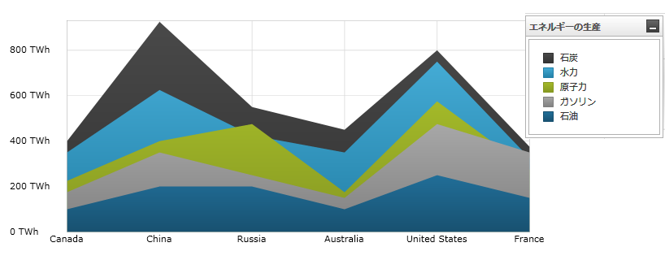
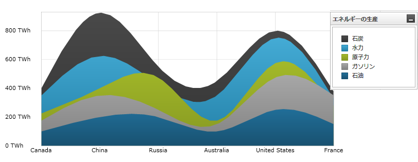

////

|metadata|
{
    "name": "datachart-category-area-series",
    "controlName": ["{DataChartName}"],
    "tags": ["Application Scenarios","Charting","How Do I"],
    "guid": "f28e6391-9f36-4957-874b-81db925c97ba",  
    "buildFlags": [],
    "createdOn": "2014-06-05T19:39:00.4502956Z"
}
|metadata|
////

= エリア シリーズ

このトピックは、コード例を示して、 link:{DataChartLink}.areaseries.html[AreaSeries] を link:{DataChartLink}.{DataChartName}.html[{DataChartName}]™ コントロールで使用する方法を説明します。

== 概要

トピックは以下のとおりです。

* <<Introduction,概要>>
* <<SeriesPreview,シリーズ プレビュー>>
* <<SeriesRecommendations,シリーズの提案>>
* <<DataRequirements,データ要件>>
* <<DataRenderingRules,データ描画の規則>>
* <<DataBindingExample,データ バインディング例>>
* <<RelatedContent,関連コンテンツ>>

** link:datachart-axes.html[軸]
** link:datachart-category-series-overview.html[カテゴリ シリーズ]
** link:datachart-category-spline-area-series.html[スプライン エリア シリーズ]
** link:datachart-series-requirements.html[シリーズ要件]

[[Introduction]]
== 概要

エリア シリーズは link:datachart-category-series-overview.html[カテゴリ シリーズ] のグループに属しており、塗りつぶされた線の下で線分で接続されたポイントのコレクションを使って描画されます。値は y 軸 (NumericYAxis) 上に表され、カテゴリは x 軸 (CategoryXAxis または CategoryDateTimeXAxis) 上に表示されます。エリア シリーズは時間毎のデータの変化や複数の項目を比較する場合に用いられ、プロットされた値の合計を表示することで全体に対するデータ間の関係も表します。link:{DataChartLink}.areaseries.html[AreaSeries] は、接続するデータ ポイントがデータの表示を改善するスプライン補間とスムージング機能をもたないこと以外のすべての面で link:{DataChartLink}.splineareaseries.html[SplineAreaSeries] と同一です。シリーズの他のタイプと軸のタイプを含んだより概念的情報は、link:datachart-category-series-overview.html[カテゴリ シリーズ]とlink:datachart-axes.html[チャート軸]トピックを参照してください。

[[SeriesPreview]]
== シリーズ プレビュー

図 1 と 2 は、 link:{DataChartLink}.areaseries.html[AreaSeries] と link:{DataChartLink}.splineareaseries.html[SplineAreaSeries] が {DataChartName} コントロール内でプロットされた時にどのように見えるかを示しています。

図 1: link:{DataChartLink}.areaseries.html[AreaSeries] タイプの実装例

図 2: link:{DataChartLink}.splineareaseries.html[SplineAreaSeries] タイプの実装例

[[SeriesRecommendations]]
== シリーズの提案

{DataChartName} は無数の各種シリーズ タイプのプロットをサポートしますが、同様のシリーズ タイプで `AreaSeries` を使用することをお勧めします。ステップ領域シリーズで推奨されるシリーズのタイプ、および複数のシリーズ タイプのプロット方法に関する情報は、 link:datachart-multiple-series.html[複数シリーズ]のトピックを参照してください。

[[DataRequirements]]
== データ要件

{DataChartName} コントロールによって固有のデータ項目にチャートを簡単にバインドすることができますが、そのシリーズが必要とするデータの適切な量とタイプを必ず提供するようにしてください。使用しているシリーズのタイプに基づいた最小要件をデータが満たさないと、コントロールによってエラーが生成されます。データ シリーズの要件についての詳細は、 link:datachart-series-requirements.html[シリーズ要件] と link:datachart-category-series-overview.html[カテゴリ シリーズ] を参照してください。

以下は、`AreaSeries` タイプのデータ要件のリストです。

* データ項目には少なくとも 1 つの数値プロパティを含む必要があります。
* データ項目にはラベルのためのオプションの文字列または日時プロパティを含むことができます。
* データソースはデータ項目間に線を描画するために少なくともデータ項目を 2 つ以上含む必要があります。

[[DataRenderingRules]]
== データ描画の規則

エリア シリーズは以下の規則を使用してデータを描画します。

* データ マッピングの link:{DataChartLink}.AnchoredCategorySeries{ApiProp}ValueMemberPath.html[ValueMemberPath] プロパティとして指定されるデータ列内の各行はチャートで単一の線 (または領域) でプロットされ、線内のポイントの数はデータ ソースの行数に等しくなります。
* エリア領域上部を描画するデータ ポイントは、値列内の隣接する行を結びます。
* x 軸上の `Label` プロパティにマップされる文字列または日時の列はカテゴリ ラベルとして使用されます。`Label` のデータ マッピングが指定されない場合、デフォルト ラベルが使用されます。
* カテゴリ ラベルは x 軸上に描かれます。データ値は y 軸上に描かれます。
* 複数のシリーズの描画時に、それぞれの連続シリーズが {DataChartName} コントロールのシリーズ コレクションの以前のシリーズの前に描画されて `AreaSeries` タイプはレイヤに描画されます。この機能の詳細は、 link:datachart-multiple-series.html[複数シリーズ]のトピックを参照してください。
* `AreaSeries` タイプは y 軸の `ReferenceValue` プロパティを使用して特定の参照値の上または下にそれらのデータ値をプロットする機能をサポートします。この機能の詳細は、軸参照値のトピックを参照してください。

[[DataBindingExample]]
== データ バインディング例

以下のコード スニペットは、 link:{DataChartLink}.areaseries.html[AreaSeries] オブジェクトをカテゴリ データ サンプル (link:resources-sample-energy-data.html[エネルギー製造データ サンプル]からダウンロード可能) にバインドする方法を示します。`AreaSeries` のデータ要件の詳細な情報はこのトピックのデータ要件セクションを参照してください。

ifdef::sl,wpf,win-universal[]

*XAML の場合:*

----
xmlns:local="clr-namespace:Infragistics.Models;assembly=YourAppName"
...
<ig:{DataChartName} x:Name="DataChart" >
    <ig:{DataChartName}.Resources>
        <local:EnergyDataSource x:Key="data" />
    </ig:{DataChartName}.Resources>
    <ig:{DataChartName}.Axes>
        <ig:NumericYAxis x:Name="YAxis"  />
        <ig:CategoryXAxis x:Name="XAxis" ItemsSource="{StaticResource data}" 
                          Label="{}{Country}" />
    </ig:{DataChartName}.Axes>
    <ig:{DataChartName}.Series>
        <ig:AreaSeries ItemsSource="{StaticResource data}" ValueMemberPath="Coal" Title="Coal" 
                       XAxis="{Binding ElementName=XAxis}"
                       YAxis="{Binding ElementName=YAxis}">
        </ig:AreaSeries>
        <ig:AreaSeries ItemsSource="{StaticResource data}" ValueMemberPath="Hydro" Title="Hydro" 
                       XAxis="{Binding ElementName=XAxis}"
                       YAxis="{Binding ElementName=YAxis}"
        </ig:AreaSeries>           
        <ig:AreaSeries ItemsSource="{StaticResource data}" ValueMemberPath="Nuclear" Title="Nuclear" 
                       XAxis="{Binding ElementName=XAxis}"
                       YAxis="{Binding ElementName=YAxis}">
        </ig:AreaSeries>
        <ig:AreaSeries ItemsSource="{StaticResource data}" ValueMemberPath="Gas" Title="Gas" 
                       XAxis="{Binding ElementName=XAxis}"
                       YAxis="{Binding ElementName=YAxis}">
        </ig:AreaSeries>
        <ig:AreaSeries ItemsSource="{StaticResource data}" ValueMemberPath="Oil"  Title="Oil" 
                       XAxis="{Binding ElementName=XAxis}"
                       YAxis="{Binding ElementName=YAxis}">
        </ig:AreaSeries>
    </ig:{DataChartName}.Series>
</ig:{DataChartName}>
----

endif::sl,wpf,win-universal[]

ifdef::xamarin[]

*XAML の場合:*

[source,xaml]
----
xmlns:local="clr-namespace:Infragistics.Models;assembly=YourAppName"
...
<ig:{DataChartName} x:Name="DataChart" >
    <ig:{DataChartName}.Resources>
        <ResourceDictionary>
			<local:EnergyDataSource x:Key="data" />
		</ResourceDictionary>
    </ig:{DataChartName}.Resources>
    <ig:{DataChartName}.Axes>
        <ig:NumericYAxis x:Name="YAxis"  />
        <ig:CategoryXAxis x:Name="XAxis" ItemsSource="{StaticResource data}" 
                          Label="Country" />
    </ig:{DataChartName}.Axes>
    <ig:{DataChartName}.Series>
        <ig:AreaSeries ItemsSource="{StaticResource data}" ValueMemberPath="Coal" Title="Coal" 
                       XAxis="{x:Reference XAxis}" 
                       YAxis="{x:Reference YAxis}">
        </ig:AreaSeries>
        <ig:AreaSeries ItemsSource="{StaticResource data}" ValueMemberPath="Hydro" Title="Hydro" 
                       XAxis="{x:Reference XAxis}" 
                       YAxis="{x:Reference YAxis}">
        </ig:AreaSeries>           
        <ig:AreaSeries ItemsSource="{StaticResource data}" ValueMemberPath="Nuclear" Title="Nuclear" 
                       XAxis="{x:Reference XAxis}" 
                       YAxis="{x:Reference YAxis}">
        </ig:AreaSeries>
        <ig:AreaSeries ItemsSource="{StaticResource data}" ValueMemberPath="Gas" Title="Gas" 
                       XAxis="{x:Reference XAxis}" 
                       YAxis="{x:Reference YAxis}">
        </ig:AreaSeries>
        <ig:AreaSeries ItemsSource="{StaticResource data}" ValueMemberPath="Oil" Title="Oil" 
                       XAxis="{x:Reference XAxis}" 
                       YAxis="{x:Reference YAxis}">
        </ig:AreaSeries>
    </ig:{DataChartName}.Series>
</ig:{DataChartName}>
----

endif::xamarin[]

ifdef::wpf,win-universal,xamarin[]

*C# の場合:*

[source,csharp]
----
var data = new EnergyDataSource();
var yAxis = new NumericYAxis();
var xAxis = new CategoryXAxis();
xAxis.{ApiDataSource} = data;
xAxis.Label = "{Country}";

var series = new AreaSeries();
series.{ApiDataSource} = data;
series.ValueMemberPath = "Coal";
series.Title = "Coal";
series.XAxis = xAxis;
series.YAxis = yAxis;

var chart = new {DataChartName}();
chart.Axes.Add(xAxis);
chart.Axes.Add(yAxis);
chart.Series.Add(series);
----
endif::wpf,win-universal,xamarin[]

ifdef::win-forms[]
*C# の場合:*
[source,csharp]
----
var data = new EnergyDataSource(); 
var yAxis = new NumericYAxis();
var xAxis = new CategoryXAxis();
xAxis.{ApiDataSource} = data;
xAxis.Label = "Country";

var series = new AreaSeries();
series.{ApiDataSource} = data;
series.ValueMemberPath = "Coal";
series.Title = "Coal";
series.XAxis = xAxis;
series.YAxis = yAxis;
var chart = new {DataChartName}();
chart.Axes.Add(xAxis);
chart.Axes.Add(yAxis);
chart.Series.Add(series);
----
endif::win-forms[]

ifdef::xaml,win-forms[]

ifdef::wpf,win-universal[]

*Visual Basic の場合:*

[source,vb]
----
Dim data As New EnergyDataSource()
Dim yAxis As New NumericYAxis()
Dim xAxis As New CategoryXAxis()
xAxis.{ApiDataSource} = data
xAxis.Label = "{Country}"

Dim series As New AreaSeries()
series.{ApiDataSource} = data
series.ValueMemberPath = "Coal"
series.Title = "Coal"
series.XAxis = xAxis
series.YAxis = yAxis

Dim chart As New {DataChartName}()
chart.Axes.Add(xAxis)
chart.Axes.Add(yAxis)
chart.Series.Add(series)
----
endif::wpf,win-universal[]

ifdef::win-forms[]
*Visual Basic の場合:*
[source,vb]
----
Dim data As New EnergyDataSource()
Dim yAxis As New NumericYAxis()
Dim xAxis As New CategoryXAxis()
xAxis.{ApiDataSource} = data
xAxis.Label = "Country"

Dim series As New AreaSeries()
series.{ApiDataSource} = data
series.ValueMemberPath = "Coal"
series.Title = "Coal"
series.XAxis = xAxis
series.YAxis = yAxis
Dim chart As New {DataChartName}()
chart.Axes.Add(xAxis)
chart.Axes.Add(yAxis)
chart.Series.Add(series)

Me.Controls.Add(chart)
----
endif::win-forms[]

ifdef::android[]

*Java の場合:*

[source,js]
----
EnergyDataSource data = new EnergyDataSource();
NumericYAxis yAxis = new NumericYAxis();
CategoryXAxis xAxis = new CategoryXAxis();
xAxis.setDataSource(data);
xAxis.setLabel("Country");

AreaSeries series = new AreaSeries();
series.setDataSource(data);
series.setValueMemberPath("Coal");
series.setTitle("Coal");
series.setXAxis(xAxis);
series.setYAxis(yAxis);
DataChartView chart = new DataChartView(rootView.getContext());
chart.addAxis(xAxis);
chart.addAxis(yAxis);
chart.addSeries(series);
----

endif::android[]

[[RelatedContent]]
== 関連コンテンツ

* link:datachart-axes.html[チャート軸]
* link:datachart-category-series-overview.html[カテゴリ シリーズ]
* link:datachart-category-spline-area-series.html[スプライン エリア シリーズ]
* link:datachart-series-requirements.html[シリーズ要件]

