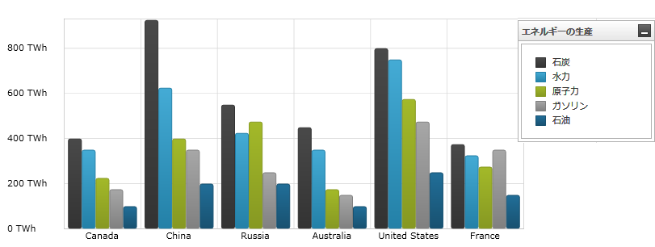
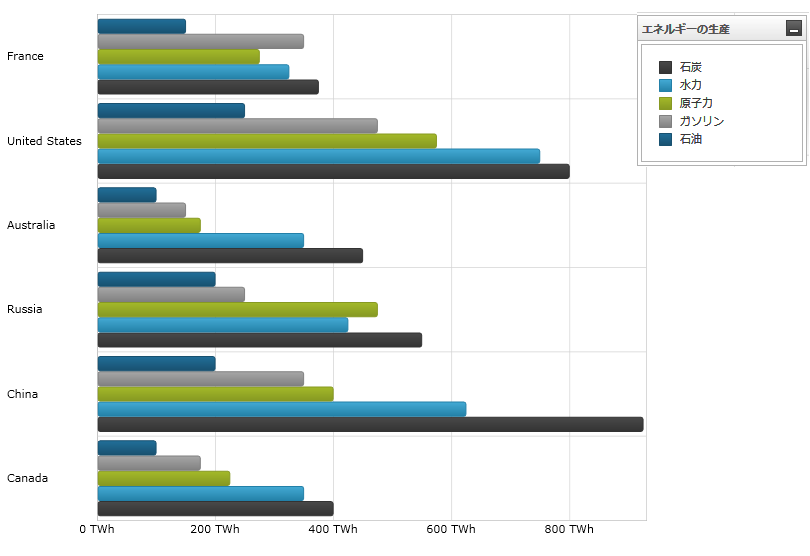
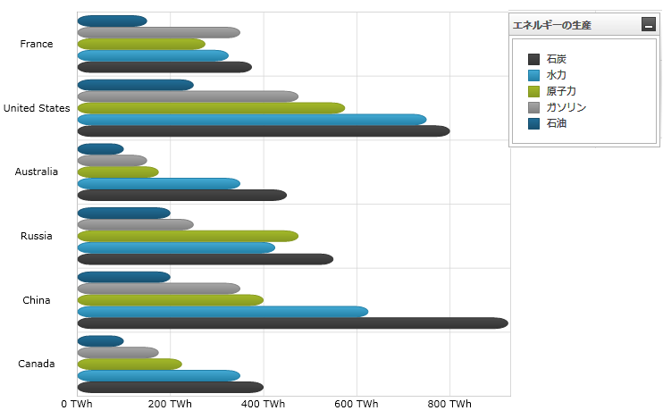

////

|metadata|
{
    "name": "datachart-category-bar-series",
    "controlName": ["{DataChartName}"],
    "tags": ["Charting","Data Presentation","Getting Started","How Do I"],
    "guid": "34c49a0d-810b-4d87-9e26-ba80cb5ff3e3",  
    "buildFlags": [],
    "createdOn": "2014-06-05T19:39:00.4072781Z"
}
|metadata|
////

= 棒シリーズ

このトピックは、コード例を示して、 link:{DataChartLink}.barseries.html[BarSeries] を link:{DataChartLink}.{DataChartName}.html[{DataChartName}]™ コントロールで使用する方法を説明します。

== 概要

トピックは以下のとおりです。

* <<Introduction,概要>>
* <<SeriesPreview,シリーズ プレビュー>>
* <<SeriesRecommendations,シリーズの提案>>
* <<DataRequirements,データ要件>>
* <<DataRenderingRules,データ描画の規則>>
* <<Examples,コード例>>

** データ バインディング
** 棒シリーズの角

* <<RelatedContent,関連コンテンツ>>

[[Introduction]]
== 概要

棒シリーズは、 link:datachart-category-series-overview.html[カテゴリ シリーズ]のグループに属し、チャートの左から右へデータ ポイント値に向かって延びる四角形のコレクションを使用して描画されます。棒シリーズは、柱状シリーズと同じデータ プロットの概念を使用していますが、データ ポイントは、水平 (X 軸) でなく垂直軸 (Y 軸) に沿って拡大します。言い換えると、 link:{DataChartLink}.barseries.html[BarSeries] は link:{DataChartLink}.columnseries.html[ColumnSeries] のように描画されますが、時計周りに 90 度回転されます。シリーズの他のタイプと軸のタイプを含んだより概念的情報は、link:datachart-category-series-overview.html[カテゴリ シリーズ]とlink:datachart-axes.html[チャート軸]トピックを参照してください。

[[SeriesPreview]]
== プレビュー

図 1 および図 2 は、{DataChartName} コントロールでプロットされる際に、 link:{DataChartLink}.barseries.html[BarSeries] と link:{DataChartLink}.columnseries.html[ColumnSeries] がどのように表示されるのかを示します。

図 1: link:{DataChartLink}.barseries.html[BarSeries] シリーズ タイプの実装例

図 2: link:{DataChartLink}.columnseries.html[ColumnSeries] シリーズ タイプの実装例

[[SeriesRecommendations]]
== シリーズの提案

{DataChartName} はシリーズのタイプ数に制限なくプロットできますが、同様タイプのシリーズで link:{DataChartLink}.barseries.html[BarSeries] を使用することをお勧めします。link:{DataChartLink}.barseries.html[BarSeries] で推奨されるシリーズのタイプ、および複数の Bar タイプのプロット方法に関する情報は、複数シリーズのトピックを参照してください。

[[DataRequirements]]
== データ要件

{DataChartName} コントロールによって固有のデータ モデルに簡単にバインドできますが、そのシリーズが必要とするデータの適切な量とタイプを提供することが重要です。使用しているシリーズのタイプに基づいた最小要件をデータが満たさないと、エラーが生成されます。データ シリーズの要件についての詳細は、 link:datachart-series-requirements.html[シリーズ要件] と link:datachart-category-series-overview.html[カテゴリ シリーズ] を参照してください。

以下は、`BarSeries` タイプのデータ要件のリストです。

* データ モデルには少なくとも 1 つの数値プロパティを含む必要があります。
* データ モデルにはラベルのためのオプションの文字列または日時プロパティを含むことができます。
* データソースに少なくとも 1 つのデータ項目を含む必要があります。

[[DataRenderingRules]]
== データ描画の規則

`BarSeries` は以下の規則を使用してデータを描画します。

* データ マッピングの ValueMemberPath プロパティとして指定されるデータ列内の各行は個別の水平棒で描かれます。
* Y 軸上のデータ マッピングの Label プロパティとして指定される文字列または日時の列はカテゴリ ラベルとして使用されます。Label トークンが指定されない場合、デフォルトのラベルが使用されます。
* カテゴリ ラベルは y 軸上に描かれます。データ値は x 軸上に描かれます。
* 描画する時、同じ X 軸 (link:datachart-multiple-series.html[複数シリーズ]のトピックを参照) を共有する複数の `BarSeries` は、各クラスターがデータ行を表すクラスターで描画されます。{DataChartName} コントロールのシリーズ コレクションの最初の `Series` は、クラスターの下側に棒として描画されます。それぞれの連続シリーズは以前のシリーズの一番上に描画されます。ただし、シリーズ セットで X 軸を共有しない場合、レイヤーで描画され、それぞれの連続するシリーズは、1 つ前のものの前面で描画されます。
* `BarSeries` タイプは、X 軸の ReferenceValue プロパティを使用して特定の参照値の左側または右側にその棒要素をプロットすることをサポートします。この機能の詳細は、軸参照値のトピックを参照してください。

[[Examples]]
== コード例

== データ バインディング

以下のコード・スニペットは、 link:{DataChartLink}.barseries.html[BarSeries] オブジェクトをカテゴリ データのサンプル (link:resources-sample-energy-data.html[エネルギー データのサンプル] リソースからダウンロード可能) にバインドする方法を示します。BarSeries のデータ要件に関する情報は、このトピックのデータ要件セクションを参照してください。

ifdef::sl,wpf,win-universal[]

*XAML の場合:*
[source,xaml]
----
xmlns:local="clr-namespace:Infragistics.Models;assembly=YourAppName"
...
<ig:{DataChartName} x:Name="DataChart" >
    <ig:{DataChartName}.Resources>
        <local:EnergyDataSourc x:Key="data" />
    </ig:{DataChartName}.Resources>
    <ig:{DataChartName}.Axes>
        <ig:NumericXAxis x:Name="XAxis"  />
        <ig:CategoryYAxis x:Name="YAxis" ItemsSource="{StaticResource data}" 
                        Label="{}{Country}" />
    </ig:{DataChartName}.Axes>
    <ig:{DataChartName}.Series>
		<ig:BarSeries ItemsSource="{StaticResource data}" ValueMemberPath="Coal" Title="Coal" 
                        XAxis="{Binding ElementName=XAxis}" 
                        YAxis="{Binding ElementName=YAxis}">
        </ig:BarSeries>
        <ig:BarSeries ItemsSource="{StaticResource data}" ValueMemberPath="Hydro" Title="Hydro" 
                        XAxis="{Binding ElementName=XAxis}" 
                        YAxis="{Binding ElementName=YAxis}">
        </ig:BarSeries>
        <ig:BarSeries ItemsSource="{StaticResource data}" ValueMemberPath="Nuclear" Title="Nuclear"  
                        XAxis="{Binding ElementName=XAxis}" 
                        YAxis="{Binding ElementName=YAxis}">
        </ig:BarSeries>
        <ig:BarSeries ItemsSource="{StaticResource data}" ValueMemberPath="Gas" Title="Gas" 
                        XAxis="{Binding ElementName=XAxis}" 
                        YAxis="{Binding ElementName=YAxis}">
        </ig:BarSeries>
        <ig:BarSeries ItemsSource="{StaticResource data}" ValueMemberPath="Oil"  Title="Oil"
                        XAxis="{Binding ElementName=XAxis}" 
                        YAxis="{Binding ElementName=YAxis}">
        </ig:BarSeries>
    </ig:{DataChartName}.Series>
</ig:{DataChartName}>
----
endif::sl,wpf,win-universal[]

ifdef::xamarin[]
*XAML の場合:*
[source,xaml]
----
xmlns:local="clr-namespace:Infragistics.Models;assembly=YourAppName"
...
<ig:{DataChartName} x:Name="DataChart" >
    <ig:{DataChartName}.Resources>
        <ResourceDictionary>
			<local:EnergyDataSource x:Key="data" />
		</ResourceDictionary>
    </ig:{DataChartName}.Resources>
    <ig:{DataChartName}.Axes>
        <ig:NumericXAxis x:Name="XAxis"  />
        <ig:CategoryYAxis x:Name="YAxis" ItemsSource="{StaticResource data}" 
                        Label="Country" />
    </ig:{DataChartName}.Axes>
    <ig:{DataChartName}.Series>
        <ig:BarSeries ItemsSource="{StaticResource data}" ValueMemberPath="Coal" Title="Coal" 
                       XAxis="{x:Reference XAxis}" 
                       YAxis="{x:Reference YAxis}">
        </ig:BarSeries>
        <ig:BarSeries ItemsSource="{StaticResource data}" ValueMemberPath="Hydro" Title="Hydro" 
                       XAxis="{x:Reference XAxis}" 
                       YAxis="{x:Reference YAxis}">
        </ig:BarSeries>
        <ig:BarSeries ItemsSource="{StaticResource data}" ValueMemberPath="Nuclear" Title="Nuclear" 
                       XAxis="{x:Reference XAxis}" 
                       YAxis="{x:Reference YAxis}">
        </ig:BarSeries>
        <ig:BarSeries ItemsSource="{StaticResource data}" ValueMemberPath="Gas" Title="Gas" 
                       XAxis="{x:Reference XAxis}" 
                       YAxis="{x:Reference YAxis}">
        </ig:BarSeries>
        <ig:BarSeries ItemsSource="{StaticResource data}" ValueMemberPath="Oil" Title="Oil" 
                       XAxis="{x:Reference XAxis}" 
                       YAxis="{x:Reference YAxis}">
        </ig:BarSeries>
    </ig:{DataChartName}.Series>
</ig:{DataChartName}>
----
endif::xamarin[]

ifdef::win-forms,xaml[]

*C# の場合:*
[source,csharp]
----
var data = new EnergyDataSource(); 
var xAxis = new NumericXAxis();
var yAxis = new CategoryYAxis();
yAxis.{ApiDataSource} = data;
yAxis.Label = "Country";

var series = new BarSeries();
series.{ApiDataSource} = data;
series.ValueMemberPath = "Coal";
series.Title = "Coal";
series.XAxis = xAxis;
series.YAxis = yAxis;
var chart = new {DataChartName}();
chart.Axes.Add(xAxis);
chart.Axes.Add(yAxis);
chart.Series.Add(series);
----
endif::win-forms,xaml[]

ifdef::xaml[]
*C# の場合:*
[source,csharp]
----
var data = new EnergyDataSource(); 
var xAxis = new NumericXAxis();
var yAxis = new CategoryYAxis();
yAxis.ItemsSource = data;
yAxis.Label = "Country";

var series = new BarSeries();
series.ItemsSource = data;
series.ValueMemberPath = "Coal";
series.Title = "Coal";
series.XAxis = xAxis;
series.YAxis = yAxis;
var chart = new {DataChartName}();
chart.Axes.Add(xAxis);
chart.Axes.Add(yAxis);
chart.Series.Add(series);
----
endif::xaml[]

ifdef::win-forms[]
*Visual Basic の場合:*
[source,vb]
----
Dim data As New EnergyDataSource()
Dim xAxis As New NumericXAxis()
Dim yAxis As New CategoryYAxis()
yAxis.DataSource = data
yAxis.Label = "Country"

Dim series As New BarSeries()
series.DataSource = data
series.ValueMemberPath = "Coal"
series.Title = "Coal"
series.XAxis = xAxis
series.YAxis = yAxis
Dim chart As New {DataChartName}()
chart.Axes.Add(xAxis)
chart.Axes.Add(yAxis)
chart.Series.Add(series)
----
endif::win-forms[]

ifdef::sl,wpf,win-universal[]
*Visual Basic の場合:*
[source,vb]
----
Dim data As New EnergyDataSource()
Dim xAxis As New NumericXAxis()
Dim yAxis As New CategoryYAxis()
yAxis.ItemsSource = data
yAxis.Label = "Country"

Dim series As New BarSeries()
series.ItemsSource = data
series.ValueMemberPath = "Coal"
series.Title = "Coal"
series.XAxis = xAxis
series.YAxis = yAxis
Dim chart As New {DataChartName}()
chart.Axes.Add(xAxis)
chart.Axes.Add(yAxis)
chart.Series.Add(series)
----
endif::sl,wpf,win-universal[]

ifdef::android[]

*Java の場合:*

[source,js]
----
EnergyDataSource data = new EnergyDataSource();
NumericXAxis xAxis = new NumericXAxis();
CategoryYAxis yAxis = new CategoryYAxis();
yAxis.setDataSource(data);
yAxis.setLabel("Country");

BarSeries series = new BarSeries();
series.setDataSource(data);
series.setValueMemberPath("Coal");
series.setTitle("Coal");
series.setXAxis(xAxis);
series.setYAxis(yAxis);
DataChartView chart = new DataChartView(rootView.getContext());
chart.addAxis(xAxis);
chart.addAxis(yAxis);
chart.addSeries(series);
----

endif::android[]

ifdef::sl,wpf,win-universal,xamarin,android[]

図 3: 角が直角の link:{DataChartLink}.barseries.html[BarSeries] シリーズ タイプ。

== 棒シリーズの角

棒シリーズにより、RadiusX および RadiusY のプロパティを使用して視覚的棒要素の角を設定できます。これらのプロパティの値を増やすと、棒要素の角に丸みが付き、値を減らすと丸みがなくなります。以下のコードは BarSeries の丸角を設定する方法を示します。

ifdef::xaml[]
*XAML の場合:*
[source,xaml]
----
<ig:BarSeries RadiusX="10" RadiusY="10" />
----
endif::xaml[]

ifdef::sl,wpf,win-universal,xamarin[]
*C# の場合:*
[source,csharp]
----
var series = new BarSeries();
series.RadiusX = 10;
series.RadiusY = 10;
...
DataChart.Series.Add(series);
----
endif::sl,wpf,win-universal,xamarin[]

ifdef::sl,wpf,win-universal[]
*Visual Basic の場合:*
[source,vb]
----
Dim series As New BarSeries()
series.RadiusX = 10
series.RadiusY = 10
...
chart.Series.Add(series)
----

endif::sl,wpf,win-universal[]

ifdef::android[]

*Java の場合:*

[source,js]
----
BarSeries series = new BarSeries();
series.setRadiusX(10);
series.setRadiusY(10);
...
chart.addSeries(series);
----

endif::android[]

図 4: 丸角付き link:{DataChartLink}.barseries.html[BarSeries] シリーズ タイプ。

endif::sl,wpf,win-universal,xamarin,android[]

[[RelatedContent]]
== 関連コンテンツ

* link:datachart-axes.html[軸]
* link:datachart-category-series-overview.html[カテゴリ シリーズ]
* link:datachart-category-column-series.html[柱状シリーズ]
* link:datachart-series-requirements.html[シリーズ要件]