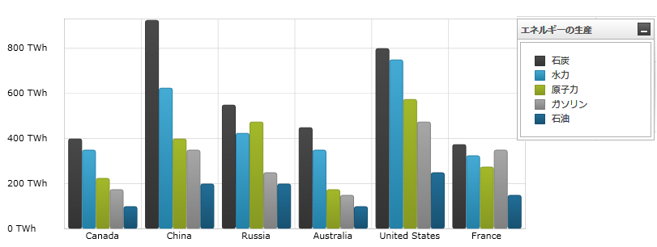
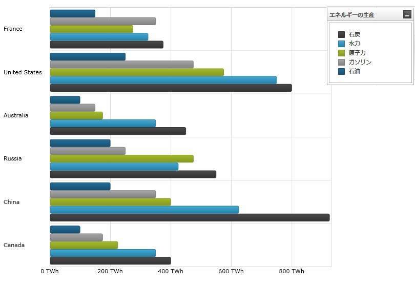
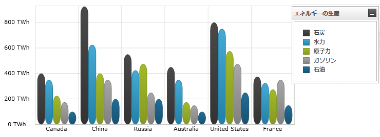
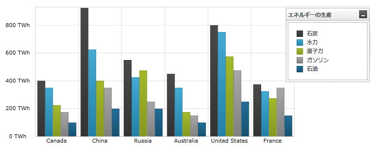

////

|metadata|
{
    "name": "datachart-category-column-series",
    "controlName": ["{DataChartName}"],
    "tags": ["Application Scenarios","Charting","How Do I"],
    "guid": "e176fecc-7f11-4415-9212-913e31a52df4",  
    "buildFlags": [],
    "createdOn": "2014-06-05T19:39:00.442293Z"
}
|metadata|
////

= 柱状シリーズ

このトピックは、コード例を示して、 link:{DataChartLink}.columnseries.html[ColumnSeries] を link:{DataChartLink}.{DataChartName}.html[{DataChartName}]™ コントロールで使用する方法を説明します。

== 概要

トピックは以下のとおりです。

* <<Introduction,概要>>
* <<SeriesPreview,シリーズ プレビュー>>
* <<SeriesRecommendations,シリーズの提案>>
* <<DataRequirements,データ要件>>
* <<DataRenderingRules,データ描画の規則>>
* <<CodeExamples,コード例>>

** データ バインディング
** 柱状シリーズの角

* <<RelatedContent,関連コンテンツ>>

[[Introduction]]
== 概要

柱状シリーズは、 link:datachart-category-series-overview.html[カテゴリ シリーズ]のグループに属し、チャートの下から上へデータ ポイント値に向かって延びる四角形のコレクションを使用して描画されます。柱状シリーズは時間毎のデータの変化や複数の項目を比較する場合に用いられます。値は Y 軸 (NumericYAxis) に表され、カテゴリは X 軸 (CategoryXAxis または CategoryDateTimeXAxis) に表示されます。柱状シリーズは、棒シリーズと同じデータ プロットの概念を採用していますが、データ ポイントは、垂直線 (Y 軸) でなく水平線 (X 軸) に沿って延びます。言い換えると、 link:{DataChartLink}.columnseries.html[ColumnSeries] は link:{DataChartLink}.barseries.html[BarSeries] のように描画されますが、反時計周りに 90 度回転されます。シリーズの他のタイプと軸のタイプを含んだより概念的情報は、link:datachart-category-series-overview.html[カテゴリ シリーズ]とlink:datachart-axes.html[チャート軸]トピックを参照してください。

[[SeriesPreview]]
== シリーズ プレビュー

図 1 および図 2 は、{DataChartName} コントロールでプロットされる際に、 link:{DataChartLink}.columnseries.html[ColumnSeries] と link:{DataChartLink}.barseries.html[BarSeries] がどのように表示されるのかを示します。

図 1: link:{DataChartLink}.columnseries.html[ColumnSeries] シリーズ タイプの実装例

図 2: link:{DataChartLink}.barseries.html[BarSeries] シリーズ タイプの実装例

[[SeriesRecommendations]]
== シリーズの提案

{DataChartName} コントロールは無数の各種シリーズ タイプのプロットをサポートしますが、同様のシリーズ タイプで link:{DataChartLink}.columnseries.html[ColumnSeries] を使用することをお勧めします。link:{DataChartLink}.columnseries.html[ColumnSeries] で推奨されるシリーズのタイプ、および複数のシリーズ タイプのプロット方法に関する情報は、 link:datachart-multiple-series.html[複数シリーズ]トピックを参照してください。

[[DataRequirements]]
== データ要件

{DataChartName} コントロールによって固有のデータ モデルにチャートを簡単にバインドすることができますが、そのシリーズが必要とするデータの適切な量とタイプを必ず提供するようにしてください。使用しているシリーズのタイプに基づいた最小要件をデータが満たさないと、エラーが発生します。データ シリーズの要件についての詳細は、 link:datachart-series-requirements.html[シリーズ要件] と link:datachart-category-series-overview.html[カテゴリ シリーズ] を参照してください。

以下は、`ColumnSeries` タイプのデータ要件のリストです。

* データ モデルには少なくとも 1 つの数値プロパティを含む必要があります。
* データ モデルにはラベルのためのオプションの文字列または日時プロパティを含むことができます。
* データソースに少なくとも 1 つのデータ項目を含む必要があります。

[[DataRenderingRules]]
== データ描画の規則

`ColumnSeries` は以下の規則を使用してデータを描画します。

* データ マッピングの link:{DataChartLink}.AnchoredCategorySeries{ApiProp}ValueMemberPath.html[ValueMemberPath] プロパティとして指定されるデータ列内の各行は個別の垂直棒で描かれます。
* x 軸上のデータ マッピングの `Label` プロパティとして指定される文字列または日時のフィールドはカテゴリ ラベルとして使用されます。`Label` トークンが指定されない場合、デフォルトのラベルが使用されます。
* カテゴリ ラベルは x 軸上に描かれます。データ値は y 軸上に描かれます。
* 描画する時、同じ X 軸 (link:datachart-multiple-series.html[複数シリーズ]のトピックを参照) を共有する `ColumnSeries` タイプの複数シリーズは、各クラスターがデータ ポイントを表すクラスターで描画されます。{DataChartName} コントロールの Series コレクションの最初のシリーズは、クラスターの左に柱状として描画されます。それぞれの連続シリーズは以前のシリーズの右に描画されます。ただし、シリーズ で X 軸を共有しない場合、レイヤーで描画され、それぞれの連続するシリーズは、1 つ前のものの前面で描画されます。
* `ColumnSeries` タイプは、Y 軸の ReferenceValue プロパティを使用して特定の参照値の下側または上側にその列をプロットすることをサポートします。

[[CodeExamples]]
== コード例

=== データ バインディング

以下のコード・スニペットは、 link:{DataChartLink}.columnseries.html[ColumnSeries] オブジェクトをカテゴリ データのサンプル (link:resources-sample-energy-data.html[エネルギー データのサンプル] リソースからダウンロード可能) にバインドする方法を示します。`ColumnSeries` のデータ要件に関する情報は、このトピックのデータ要件セクションを参照してください。

ifdef::sl,wpf,win-universal[]

*XAML の場合:*
[source,xaml]
----
xmlns:local="clr-namespace:Infragistics.Models;assembly=YourAppName"
...
<ig:{DataChartName} x:Name="DataChart" >
    <ig:{DataChartName}.Resources>
        <local:EnergyDataSource x:Key="data" />
    </ig:{DataChartName}.Resources>
    <ig:{DataChartName}.Axes>
        <ig:NumericYAxis x:Name="YAxis"  />
        <ig:CategoryXAxis x:Name="XAxis" ItemsSource="{StaticResource data}" 
                       Label="{}{Country}" />
    </ig:{DataChartName}.Axes>
    <ig:{DataChartName}.Series>
        <ig:ColumnSeries ItemsSource="{StaticResource data}" ValueMemberPath="Coal" Title="Coal" 
                       XAxis="{Binding ElementName=XAxis}"
                       YAxis="{Binding ElementName=YAxis}">
        </ig:ColumnSeries>
        <ig:ColumnSeries ItemsSource="{StaticResource data}" ValueMemberPath="Hydro" Title="Hydro" 
                       XAxis="{Binding ElementName=XAxis}"
                       YAxis="{Binding ElementName=YAxis}">
        </ig:ColumnSeries>           
        <ig:ColumnSeries ItemsSource="{StaticResource data}" ValueMemberPath="Nuclear" Title="Nuclear"
                       XAxis="{Binding ElementName=XAxis}"
                       YAxis="{Binding ElementName=YAxis}">
        </ig:ColumnSeries>
        <ig:ColumnSeries ItemsSource="{StaticResource data}" ValueMemberPath="Gas" Title="Gas"
                       XAxis="{Binding ElementName=XAxis}"
                       YAxis="{Binding ElementName=YAxis}">
        </ig:ColumnSeries>
        <ig:ColumnSeries ItemsSource="{StaticResource data}" ValueMemberPath="Oil"  Title="Oil"
                       XAxis="{Binding ElementName=XAxis}"
                       YAxis="{Binding ElementName=YAxis}">
        </ig:ColumnSeries>
    </ig:{DataChartName}.Series>
</ig:{DataChartName}>
----
endif::sl,wpf,win-universal[]

ifdef::xamarin[]
*XAML の場合:*
[source,xaml]
----
xmlns:local="clr-namespace:Infragistics.Models;assembly=YourAppName"
...
<ig:{DataChartName} x:Name="DataChart" >
    <ig:{DataChartName}.Resources>
        <ResourceDictionary>
			<local:EnergyDataSource x:Key="data" />
		</ResourceDictionary>
    </ig:{DataChartName}.Resources>
    <ig:{DataChartName}.Axes>
        <ig:NumericYAxis x:Name="YAxis"  />
        <ig:CategoryXAxis x:Name="XAxis" ItemsSource="{StaticResource data}" 
                       Label="Country" />
    </ig:{DataChartName}.Axes>
    <ig:{DataChartName}.Series>
        <ig:ColumnSeries ItemsSource="{StaticResource data}" ValueMemberPath="Coal" Title="Coal"
                       XAxis="{Binding ElementName=XAxis}"
                       YAxis="{Binding ElementName=YAxis}">
        </ig:ColumnSeries>
        <ig:ColumnSeries ItemsSource="{StaticResource data}" ValueMemberPath="Hydro" Title="Hydro" 
                       XAxis="{Binding ElementName=XAxis}"
                       YAxis="{Binding ElementName=YAxis}">
        </ig:ColumnSeries>           
        <ig:ColumnSeries ItemsSource="{StaticResource data}" ValueMemberPath="Nuclear" Title="Nuclear"  
                       XAxis="{Binding ElementName=XAxis}"
                       YAxis="{Binding ElementName=YAxis}">
        </ig:ColumnSeries>
        <ig:ColumnSeries ItemsSource="{StaticResource data}" ValueMemberPath="Gas" Title="Gas"   
                       XAxis="{Binding ElementName=XAxis}"
                       YAxis="{Binding ElementName=YAxis}">
        </ig:ColumnSeries>
        <ig:ColumnSeries ItemsSource="{StaticResource data}" ValueMemberPath="Oil" Title="Oil"  
                       XAxis="{Binding ElementName=XAxis}"
                       YAxis="{Binding ElementName=YAxis}">
        </ig:ColumnSeries>
    </ig:{DataChartName}.Series>
</ig:{DataChartName}>
----
endif::xamarin[]

ifdef::wpf,win-universal,xamarin[]

*C# の場合:*

[source,csharp]
----
var data = new EnergyDataSource(); 
var yAxis = new NumericYAxis();
var xAxis = new CategoryXAxis();
xAxis.{ApiDataSource} = data;
xAxis.Label = "{Country}";

var series = new ColumnSeries();
series.{ApiDataSource} = data;
series.ValueMemberPath = "Coal";
series.Title = "Coal";
series.XAxis = xAxis;
series.YAxis = yAxis;
var chart = new {DataChartName}();
chart.Axes.Add(xAxis);
chart.Axes.Add(yAxis);
chart.Series.Add(series);
----
endif::wpf,win-universal,xamarin[]

ifdef::win-forms[]
*C# の場合:*
[source,csharp]
----
var data = new EnergyDataSource(); 
var yAxis = new NumericYAxis();
var xAxis = new CategoryXAxis();
xAxis.{ApiDataSource} = data;
xAxis.Label = "Country";

var series = new ColumnSeries();
series.{ApiDataSource} = data;
series.ValueMemberPath = "Coal";
series.Title = "Coal";
series.XAxis = xAxis;
series.YAxis = yAxis;
var chart = new {DataChartName}();
chart.Axes.Add(xAxis);
chart.Axes.Add(yAxis);
chart.Series.Add(series);
----
endif::win-forms[]

ifdef::wpf,win-universal[]

*Visual Basic の場合:*

[source,vb]
----
Dim data As New EnergyDataSource()
Dim yAxis As New NumericYAxis()
Dim xAxis As New CategoryXAxis()
xAxis.{ApiDataSource} = data
xAxis.Label = "{Country}"

Dim series As New ColumnSeries()
series.{ApiDataSource} = data
series.ValueMemberPath = "Coal"
series.Title = "Coal"
series.XAxis = xAxis
series.YAxis = yAxis

Dim chart As New {DataChartName}()
chart.Axes.Add(xAxis)
chart.Axes.Add(yAxis)
chart.Series.Add(series)
----
endif::wpf,win-universal[] 

ifdef::win-forms[]
*Visual Basic の場合:*
[source,vb]
----
Dim data As New EnergyDataSource()
Dim yAxis As New NumericYAxis()
Dim xAxis As New CategoryXAxis()
xAxis.{ApiDataSource} = data
xAxis.Label = "{Country}"

Dim series As New ColumnSeries()
series.{ApiDataSource} = data
series.ValueMemberPath = "Coal"
series.Title = "Coal"
series.XAxis = xAxis
series.YAxis = yAxis
Dim chart As New {DataChartName}()
chart.Axes.Add(xAxis)
chart.Axes.Add(yAxis)
chart.Series.Add(series)

Me.Controls.Add(chart)
----
endif::win-forms[] 

ifdef::android[]

*Java の場合:*

[source,js]
----
EnergyDataSource data = new EnergyDataSource();
NumericYAxis yAxis = new NumericYAxis();
CategoryXAxis xAxis = new CategoryXAxis();
xAxis.setDataSource(data);
xAxis.setLabel("Country");

ColumnSeries series = new ColumnSeries();
series.setDataSource(data);
series.setValueMemberPath("Coal");
series.setTitle("Coal");
series.setXAxis(xAxis);
series.setYAxis(yAxis);
DataChartView chart = new DataChartView(rootView.getContext());
chart.addAxis(xAxis);
chart.addAxis(yAxis);
chart.addSeries(series);
----

endif::android[]

ifdef::sl,wpf,win-universal,xamarin,android[]
=== 柱状シリーズの角

柱状シリーズにより、RadiusX および RadiusY のプロパティを使用して視覚棒要素の角を設定できます。これらのプロパティの値を増やすと、柱状要素の角に丸みが付き、値を減らすと丸みがなくなります。以下のコードは ColumnSeries の丸角を設定する方法を示します。

ifdef::xaml[]
*XAML の場合:*
[source,xaml]
----
<ig:ColumnSeries RadiusX="10" RadiusY="10" />
----
endif::xaml[]

ifdef::sl,wpf,win-universal,xamarin[]
*C# の場合:*
[source,csharp]
----
var series = new ColumnSeries();
series.RadiusX = 10;
series.RadiusY = 10;
...
DataChart.Series.Add(series);
----
endif::sl,wpf,win-universal,xamarin[]

ifdef::sl,wpf,win-universal[]
*Visual Basic の場合:*
[source,vb]
----
Dim series As New ColumnSeries()
series.RadiusX = 10
series.RadiusY = 10
...
chart.Series.Add(series)
----
endif::sl,wpf,win-universal[]

ifdef::android[]

*Java の場合:*

[source,js]
----
ColumnSeries series = new ColumnSeries();
series.setRadiusX(10);
series.setRadiusY(10);
...
chart.addSeries(series);
----

endif::android[]

図 3: 丸角付き link:{DataChartLink}.columnseries.html[ColumnSeries] シリーズ タイプ

図 4: 丸角の無い link:{DataChartLink}.columnseries.html[ColumnSeries] シリーズ タイプ

endif::sl,wpf,win-universal,xamarin,android[]

[[RelatedContent]]
== 関連コンテンツ

* link:datachart-series.html[シリーズ]
* link:datachart-category-series-overview.html[カテゴリ シリーズ]
* link:datachart-series-requirements.html[シリーズ要件]

