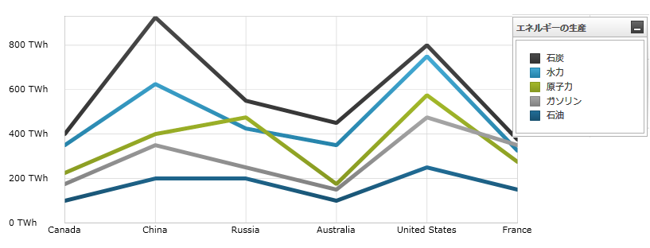

////

|metadata|
{
    "name": "datachart-category-line-series",
    "controlName": ["{DataChartName}"],
    "tags": ["Application Scenarios","Charting","How Do I"],
    "guid": "ae42b565-150c-4f35-b95e-d20065f62a6e",  
    "buildFlags": [],
    "createdOn": "2014-06-05T19:39:00.4442938Z"
}
|metadata|
////

= 折れ線シリーズ

このトピックは、コード例を示して、 link:{DataChartLink}.LineSeries.html[LineSeries] を link:{DataChartLink}.{DataChartName}.html[{DataChartName}]™ コントロールで使用する方法を説明します。

== 概要

トピックは以下のとおりです。

* <<Introduction,概要>>
* <<SeriesPreview,シリーズ プレビュー>>
* <<SeriesRecommendations,シリーズの提案>>
* <<DataRequirements,データ要件>>
* <<DataRenderingRules,データ描画の規則>>
* <<DataBindingExample,データ バインディング例>>
* <<DashArray, ダッシュ配列>>
* <<RelatedContent,関連コンテンツ>>

[[Introduction]]
== 概要

折れ線シリーズは link:datachart-category-series-overview.html[カテゴリ シリーズ] グループに属し、直線線分で結ばれるポイントのコレクションを使用して描画されます。値は Y 軸 (NumericYAxis) に表され、カテゴリは X 軸 (CategoryXAxis または CategoryDateTimeXAxis) に表示されます。ライン シリーズは時間毎のデータの変化や複数の項目を比較する場合に用いられます。またプロットされたデータの合計を表示することで全体に対するデータ間の関係も表します。link:{DataChartLink}.LineSeries.html[LineSeries] は、データ ポイントを結ぶラインにはデータの見た目を向上させるためのスプラインの補間および円滑化が無い点を除いてすべての面で link:{DataChartLink}.SplineSeries.html[SplineSeries] と等しくなります。シリーズの他のタイプと軸のタイプを含んだより概念的情報は、link:datachart-category-series-overview.html[カテゴリ シリーズ]とlink:datachart-axes.html[チャート軸]トピックを参照してください。

[[SeriesPreview]]
== シリーズ プレビュー

図 1 および図 2 は、{DataChartName} コントロールでプロットされる際に、 link:{DataChartLink}.LineSeries.html[LineSeries] と link:{DataChartLink}.SplineSeries.html[SplineSeries] がどのように表示されるのかを示します。

図 1: link:{DataChartLink}.LineSeries.html[LineSeries] タイプの実装例

image::images/Using_xamDataChart_Line_Series__02.png[]

図 2: link:{DataChartLink}.SplineSeries.html[SplineSeries] タイプの実装例

[[SeriesRecommendations]]
== シリーズの提案

{DataChartName} は無数の各種シリーズ タイプのプロットをサポートしますが、同様のシリーズ タイプで ライン シリーズを使用することをお勧めします。ライン シリーズで推奨されるシリーズのタイプ、および複数のシリーズ タイプのプロット方法に関する情報は、 link:datachart-multiple-series.html[複数シリーズ]のトピックを参照してください。

[[DataRequirements]]
== データ要件

{DataChartName} コントロールによって固有のデータ モデルにチャートを簡単にバインドすることができますが、そのシリーズが必要とするデータの適切な量とタイプを必ず提供するようにしてください。使用しているシリーズのタイプに基づいた最小要件をデータが満たさないと、エラーが発生します。データ シリーズの要件についての詳細は、 link:datachart-series-requirements.html[シリーズ要件] と link:datachart-category-series-overview.html[カテゴリ シリーズ] を参照してください。

以下は、 link:{DataChartLink}.LineSeries.html[LineSeries]のデータ要件のリストです。

* データ モデルには少なくとも 1 つの数値データ列を含む必要があります。1 つの線に 2 つまたはそれ以上のポイントが含まれるように、データ モデルに 2 つ以上のデータ項目を含めるようにします。
* データ モデルにはラベルのためのオプションの文字列または日時フィールドを含むことができます。

[[DataRenderingRules]]
== データ描画の規則

ライン シリーズは以下の規則を使用してデータを描画します。

* データ マッピングの ValueMemberPath プロパティとして指定されるデータ列内の各行はチャートで単一の点としてプロットされ、線の点の数はデータ モデルの行数に等しくなります。
* 折れ線チャートに沿ったデータ ポイントは線分によって結ばれ、特定の列内の隣接する行を表します。
* x 軸上のデータ マッピングの Label プロパティにマップされる文字列または日時の列はカテゴリ ラベルとして使用されます。Label のデータ マッピングが指定されない場合、デフォルト ラベルが使用されます。
* カテゴリ ラベルは x 軸上に描かれます。データ値は y 軸上に描かれます。
* 描画時、 link:{DataChartLink}.LineSeries.html[LineSeries] タイプの複数シリーズはレイヤーで描画され、それぞれの連続するシリーズは、{DataChartName} コントロールのシリーズ コレクション内の 1 つ前のものの前面で描画されます。この機能の詳細は、 link:datachart-multiple-series.html[複数シリーズ]のトピックを参照してください。

[[DataBindingExample]]
== データ バインディング例

以下のコード スニペットは、 link:{DataChartLink}.LineSeries.html[LineSeries] オブジェクトをカテゴリ データ サンプル (link:resources-sample-energy-data.html[エネルギー製造データ サンプル]からダウンロード可能) にバインドする方法を示します。LineSeries のデータ要件に関する情報は、このトピックのデータ要件セクションを参照してください。

ifdef::sl,wpf,win-universal[]

*XAML の場合:*
[source,xaml]
----
xmlns:local="clr-namespace:Infragistics.Models;assembly=YourAppName"
...
<ig:{DataChartName} x:Name="DataChart" >
    <ig:{DataChartName}.Resources>
        <local:EnergyDataSource x:Key="data" />
    </ig:{DataChartName}.Resources>
    <ig:{DataChartName}.Axes>
        <ig:NumericYAxis x:Name="YAxis"  />
        <ig:CategoryXAxis x:Name="XAxis" ItemsSource="{StaticResource data}" 
                          Label="{}{Country}" />
    </ig:{DataChartName}.Axes>
    <ig:{DataChartName}.Series>
        <ig:LineSeries ItemsSource="{StaticResource data}" ValueMemberPath="Coal" Title="Coal" 
                       XAxis="{Binding ElementName=XAxis}"
                       YAxis="{Binding ElementName=YAxis}">
        </ig:LineSeries>
        <ig:LineSeries ItemsSource="{StaticResource data}" ValueMemberPath="Hydro" Title="Hydro" 
                       XAxis="{Binding ElementName=XAxis}"
                       YAxis="{Binding ElementName=YAxis}"
        </ig:LineSeries>           
        <ig:LineSeries ItemsSource="{StaticResource data}" ValueMemberPath="Nuclear" Title="Nuclear" 
                       XAxis="{Binding ElementName=XAxis}"
                       YAxis="{Binding ElementName=YAxis}">
        </ig:LineSeries>
        <ig:LineSeries ItemsSource="{StaticResource data}" ValueMemberPath="Gas" Title="Gas" 
                       XAxis="{Binding ElementName=XAxis}"
                       YAxis="{Binding ElementName=YAxis}">
        </ig:LineSeries>
        <ig:LineSeries ItemsSource="{StaticResource data}" ValueMemberPath="Oil"  Title="Oil" 
                       XAxis="{Binding ElementName=XAxis}"
                       YAxis="{Binding ElementName=YAxis}">
        </ig:LineSeries>
    </ig:{DataChartName}.Series>
</ig:{DataChartName}>
----
endif::sl,wpf,win-universal[]

ifdef::xamarin[]
*XAML の場合:*
[source,xaml]
----
xmlns:local="clr-namespace:Infragistics.Models;assembly=YourAppName"
...
<ig:{DataChartName} x:Name="DataChart" >
    <ig:{DataChartName}.Resources>
		<ResourceDictionary>
			<local:EnergyDataSource x:Key="data" />
		</ResourceDictionary>
    </ig:{DataChartName}.Resources>
    <ig:{DataChartName}.Axes>
        <ig:NumericYAxis x:Name="YAxis"  />
        <ig:CategoryXAxis x:Name="XAxis" ItemsSource="{StaticResource data}" 
                          Label="Country" />
    </ig:{DataChartName}.Axes>
    <ig:{DataChartName}.Series>
        <ig:LineSeries ItemsSource="{StaticResource data}" ValueMemberPath="Coal" Title="Coal" 
                       XAxis="{x:Reference XAxis}" 
                       YAxis="{x:Reference YAxis}">
        </ig:LineSeries>
        <ig:LineSeries ItemsSource="{StaticResource data}" ValueMemberPath="Hydro" Title="Hydro" 
                       XAxis="{x:Reference XAxis}" 
                       YAxis="{x:Reference YAxis}">
        </ig:LineSeries>           
        <ig:LineSeries ItemsSource="{StaticResource data}" ValueMemberPath="Nuclear" Title="Nuclear" 
                       XAxis="{x:Reference XAxis}" 
                       YAxis="{x:Reference YAxis}">
        </ig:LineSeries>
        <ig:LineSeries ItemsSource="{StaticResource data}" ValueMemberPath="Gas" Title="Gas" 
                       XAxis="{x:Reference XAxis}" 
                       YAxis="{x:Reference YAxis}">
        </ig:LineSeries>
        <ig:LineSeries ItemsSource="{StaticResource data}" ValueMemberPath="Oil" Title="Oil" 
                       XAxis="{x:Reference XAxis}" 
                       YAxis="{x:Reference YAxis}">
        </ig:LineSeries>
    </ig:{DataChartName}.Series>
</ig:{DataChartName}>
----
endif::xamarin[]

ifdef::wpf,win-universal,xamarin[]
*C# の場合:*
[source,csharp]
----
var data = new EnergyDataSource(); 
var yAxis = new NumericYAxis();
var xAxis = new CategoryXAxis();
xAxis.{ApiDataSource} = data;
xAxis.Label = "{Country}";

var series = new LineSeries();
series.{ApiDataSource} = data;
series.ValueMemberPath = "Coal";
series.Title = "Coal";
series.XAxis = xAxis;
series.YAxis = yAxis;
var chart = new {DataChartName}();
chart.Axes.Add(xAxis);
chart.Axes.Add(yAxis);
chart.Series.Add(series);
----
endif::wpf,win-universal,xamarin[]

ifdef::wpf,win-universal[]
*Visual Basic の場合:*
[source,vb]
----
Dim data As New EnergyDataSource()
Dim yAxis As New NumericYAxis()
Dim xAxis As New CategoryXAxis()
xAxis.{ApiDataSource} = data;
xAxis.Label = "{Country}"

Dim series As New LineSeries()
series.{ApiDataSource} = data
series.ValueMemberPath = "Coal"
series.Title = "Coal"
series.XAxis = xAxis
series.YAxis = yAxis
Dim chart As New {DataChartName}()
chart.Axes.Add(xAxis)
chart.Axes.Add(yAxis)
chart.Series.Add(series)
----
endif::wpf,win-universal[]

ifdef::win-forms[]
*C# の場合:*
[source,csharp]
----
var data = new EnergyDataSource(); 
var yAxis = new NumericYAxis();
var xAxis = new CategoryXAxis();
xAxis.{ApiDataSource} = data;
xAxis.Label = "Country";

var series = new LineSeries();
series.{ApiDataSource} = data;
series.ValueMemberPath = "Coal";
series.Title = "Coal";
series.XAxis = xAxis;
series.YAxis = yAxis;
var chart = new {DataChartName}();
chart.Axes.Add(xAxis);
chart.Axes.Add(yAxis);
chart.Series.Add(series);
----

*Visual Basic の場合:*
[source,vb]
----
Dim data As New EnergyDataSource()
Dim yAxis As New NumericYAxis()
Dim xAxis As New CategoryXAxis()
xAxis.{ApiDataSource} = data
xAxis.Label = "Country"

Dim series As New LineSeries()
series.{ApiDataSource} = data
series.ValueMemberPath = "Coal"
series.Title = "Coal"
series.XAxis = xAxis
series.YAxis = yAxis
Dim chart As New {DataChartName}()
chart.Axes.Add(xAxis)
chart.Axes.Add(yAxis)
chart.Series.Add(series)
----
endif::win-forms[]

ifdef::android[]
*Java の場合:*
[source,java]
----
EnergyDataSource data = new EnergyDataSource();
NumericYAxis yAxis = new NumericYAxis();
CategoryXAxis xAxis = new CategoryXAxis();
xAxis.setDataSource(data);
xAxis.setLabel("Country");

LineSeries series = new LineSeries();
series.setDataSource(data);
series.setValueMemberPath("Coal");
series.setTitle("Coal");
series.setXAxis(xAxis);
series.setYAxis(yAxis);
DataChartView chart = new DataChartView(rootView.getContext());
chart.addAxis(xAxis);
chart.addAxis(yAxis);
chart.addSeries(series);
----
endif::android[]

[[DashArray]]
== ダッシュ配列

link:{DataChartLink}.LineSeries.html[LineSeries] は、ダッシュ配列を介して破線を適用する機能をサポートしています。これを行うには、シリーズの `DashArray` プロパティを新しい `DoubleCollection` に設定し、表示したいダッシュの長さを表す `double[]` を指定します。以下のコード例はその方法を示しています。

ifdef::wpf[]

*XAML の場合:*
[source, xaml]
----
<ig:LineSeries DashArray="5, 5" />
----

endif::wpf[]

*C# の場合:*
[source,csharp]
----
var series = new LineSeries();
series.DashArray = new DoubleCollection(new double[] { 5, 5 });
----

*Visual Basic の場合:*
[source,vb]
----
Dim series = New LineSeries()
series.DashArray = New DoubleCollection(New Double() {5, 5})
----

[[RelatedContent]]
== 関連コンテンツ

* link:datachart-axes.html[軸]
* link:datachart-category-series-overview.html[カテゴリ シリーズ]
* link:datachart-category-spline-series.html[スプライン シリーズ]
* link:datachart-series-requirements.html[シリーズ要件]