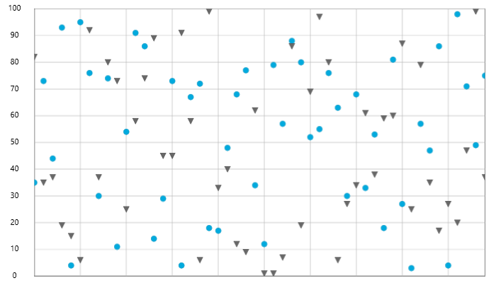

////

|metadata|
{
    "name": "datachart-category-point-series",
    "controlName": ["{DataChartName}"],
    "tags": ["Charting","Data Binding","Data Presentation"],
    "guid": "ba055edf-a657-4212-ab9f-f2d3935015be",  
    "buildFlags": [],
    "createdOn": "2014-06-05T19:39:00.4522967Z"
}
|metadata|
////

= ポイント シリーズ

=== 目的

このトピックは、コード例を示して、 link:{DataChartLink}.{DataChartName}.html[{DataChartName}]™ でポイント シリーズを表示する方法を説明します。

=== 前提条件

以下の表に、このトピックを理解するための前提条件として求められる素材をリストします。

[options="header", cols="a,a"]
|====
| *トピック* | *目的* 

| link:datachart-using-datachart.html[{DataChartName} の構成]
|このセクションは、 _{DataChartName}_™ コントロールが提供するさまざまな特徴や機能を使用するための重要な概念とタスク ベースの情報について説明します。

|====

=== このトピックの内容

このトピックは、以下のセクションで構成されます。

* <<_Ref321919323,概要>>
* <<SeriesRecommendations,シリーズの提案>>
* <<DataRequirements,データ要件>>
* <<DataRenderingRules,データ描画の規則>>
* <<DataBindingExample,データ バインディング例>>
* <<_Ref321919425,関連コンテンツ>>

[[_Ref321919323]]

=== 概要

ポイント シリーズは、カテゴリ シリーズの {DataChartName} のファミリのチャート タイプの 1 つです。チャートのポイントまたはマーカーとしてデータを描画するように設計されています。数値は Y 軸に対応し、X 軸はラベルを表示するために使用されます。

{DataChartName} は、単一または複数のポイント シリーズ オブジェクトのレンダリングに対応します。これは 2 つ以上のコレクションのデータに対応できるということになります。

image::images/xamDataChart_RT_Point_Series_1.png[]

図 1: 単一 `PointSeries` タイプの実装例

図 2: 複数 `PointSeries` タイプの実装例

[[SeriesRecommendations]]
=== シリーズの提案

{DataChartName} はシリーズのタイプ数に制限なくプロットできますが、同様タイプのシリーズで `PointSeries` を使用することをお勧めします。ステップ領域シリーズで推奨されるシリーズのタイプ、および複数のシリーズ タイプのプロット方法に関する情報は、link:datachart-multiple-series.html[複数シリーズ]のトピックを参照してください。

[[DataRequirements]]
=== データ要件

{DataChartName} コントロールによって固有のデータ項目にチャートを簡単にバインドすることができますが、そのシリーズが必要とするデータの適切な量とタイプを必ず提供するようにしてください。使用しているシリーズのタイプに基づいた最小要件をデータが満たさないと、コントロールによってエラーが生成されます。データ シリーズの要件についての詳細は、link:datachart-series-requirements.html[シリーズ要件]とlink:datachart-category-series-overview.html[カテゴリ シリーズ]のトピックを参照してください。

以下は、`PointSeries` タイプのデータ要件のリストです。

* データ モデルには、データを描画するために少なくとも 1 つの数値プロパティを含む必要があります。
* データ モデルにはラベルのためのオプションの文字列または日時プロパティを含むことができます。
* データソースはシリーズのポイント/マーカーを描画するために少なくともデータ項目を 1 つ含む必要があります。

[[DataRenderingRules]]
=== データ描画の規則

`PointSeries` は以下の規則を使用してデータを描画します。

* データ マッピングの link:{DataChartLink}.AnchoredCategorySeries{ApiProp}ValueMemberPath.html[ValueMemberPath] プロパティとして指定されるデータ列内の各行は、データソースの行数と等しい点の数でチャートでポイント/マーカーとしてプロットされます。
* x 軸上の `Label` プロパティにマップされる文字列または日時の列はカテゴリ ラベルとして使用されます。`Label` のデータ マッピングが指定されない場合、デフォルト ラベルが使用されます。
* カテゴリ ラベルは x 軸上に描かれます。データ値は y 軸上に描かれます。
* 描画時の `PointSeries` シリーズの複数のインスタンスは、{DataChartName} コントロールの `Series` コレクションの以前のシリーズの前に描画される各連続したシリーズのレイヤーで描画されます。この機能の詳細については、link:datachart-multiple-series.html[複数シリーズ]のトピックを参照してください。

[[DataBindingExample]]
=== データ バインディング例

以下のコードは、link:{DataChartLink}.PointSeries.html[PointSeries] オブジェクトをカテゴリ データ サンプル (link:resources-sample-energy-data.html[エネルギー製造データ サンプル]からダウンロード可能) にバインドする方法を示します。`PointSeries` のデータ要件の詳細な情報はこのトピックのデータ要件セクションを参照してください。

ifdef::sl,wpf,win-universal[]

*XAML の場合:*
[source,xaml]
----
xmlns:local="clr-namespace:Infragistics.Models;assembly=YourAppName"
...
<ig:{DataChartName} x:Name="DataChart" >
    <ig:{DataChartName}.Resources>
        <local:EnergyDataSource x:Key="data" />
    </ig:{DataChartName}.Resources>
    <ig:{DataChartName}.Axes>
        <ig:NumericYAxis x:Name="YAxis"  />
        <ig:CategoryXAxis x:Name="XAxis" ItemsSource="{StaticResource data}" 
                          Label="{}{Country}" />
    </ig:{DataChartName}.Axes>
    <ig:{DataChartName}.Series>
        <ig:PointSeries ItemsSource="{StaticResource data}" ValueMemberPath="Coal" Title="Coal" 
                       XAxis="{Binding ElementName=XAxis}"
                       YAxis="{Binding ElementName=YAxis}">
        </ig:PointSeries>
        <ig:PointSeries ItemsSource="{StaticResource data}" ValueMemberPath="Hydro" Title="Hydro" 
                       XAxis="{Binding ElementName=XAxis}"
                       YAxis="{Binding ElementName=YAxis}"
        </ig:PointSeries>           
        <ig:PointSeries ItemsSource="{StaticResource data}" ValueMemberPath="Nuclear" Title="Nuclear" 
                       XAxis="{Binding ElementName=XAxis}"
                       YAxis="{Binding ElementName=YAxis}">
        </ig:PointSeries>
        <ig:PointSeries ItemsSource="{StaticResource data}" ValueMemberPath="Gas" Title="Gas" 
                       XAxis="{Binding ElementName=XAxis}"
                       YAxis="{Binding ElementName=YAxis}">
        </ig:PointSeries>
        <ig:PointSeries ItemsSource="{StaticResource data}" ValueMemberPath="Oil"  Title="Oil" 
                       XAxis="{Binding ElementName=XAxis}"
                       YAxis="{Binding ElementName=YAxis}">
        </ig:PointSeries>
    </ig:{DataChartName}.Series>
</ig:{DataChartName}>
----
endif::sl,wpf,win-universal[]

ifdef::xamarin[]
*XAML の場合:*
[source,xaml]
----
xmlns:local="clr-namespace:Infragistics.Models;assembly=YourAppName"
...
<ig:{DataChartName} x:Name="DataChart" >
    <ig:{DataChartName}.Resources>
        <ResourceDictionary>
			<local:EnergyDataSource x:Key="data" />
		</ResourceDictionary>
    </ig:{DataChartName}.Resources>
    <ig:{DataChartName}.Axes>
        <ig:NumericYAxis x:Name="YAxis"  />
        <ig:CategoryXAxis x:Name="XAxis" ItemsSource="{StaticResource data}" 
                          Label="Country" />
    </ig:{DataChartName}.Axes>
    <ig:{DataChartName}.Series>
        <ig:PointSeries ItemsSource="{StaticResource data}" ValueMemberPath="Coal" Title="Coal" 
                       XAxis="{x:Reference XAxis}" 
                       YAxis="{x:Reference YAxis}">
        </ig:PointSeries>
        <ig:PointSeries ItemsSource="{StaticResource data}" ValueMemberPath="Hydro" Title="Hydro" 
                       XAxis="{x:Reference XAxis}" 
                       YAxis="{x:Reference YAxis}">
        </ig:PointSeries>           
        <ig:PointSeries ItemsSource="{StaticResource data}" ValueMemberPath="Nuclear" Title="Nuclear" 
                       XAxis="{x:Reference XAxis}" 
                       YAxis="{x:Reference YAxis}">
        </ig:PointSeries>
        <ig:PointSeries ItemsSource="{StaticResource data}" ValueMemberPath="Gas" Title="Gas" 
                       XAxis="{x:Reference XAxis}" 
                       YAxis="{x:Reference YAxis}">
        </ig:PointSeries>
        <ig:PointSeries ItemsSource="{StaticResource data}" ValueMemberPath="Oil" Title="Oil" 
                       XAxis="{x:Reference XAxis}" 
                       YAxis="{x:Reference YAxis}">
        </ig:PointSeries>
    </ig:{DataChartName}.Series>
</ig:{DataChartName}>
----
endif::xamarin[]

ifdef::wpf,win-universal,win-forms,xamarin[]

*C# の場合:*

[source,csharp]
----
var data = new EnergyDataSource(); 
var yAxis = new NumericYAxis();
var xAxis = new CategoryXAxis();
xAxis.{ApiDataSource} = data;
xAxis.Label = "{Country}";

var series = new PointSeries();
series.{ApiDataSource} = data;
series.ValueMemberPath = "Coal";
series.Title = "Coal";
series.XAxis = xAxis;
series.YAxis = yAxis;
var chart = new {DataChartName}();
chart.Axes.Add(xAxis);
chart.Axes.Add(yAxis);
chart.Series.Add(series);
----
endif::wpf,win-universal,win-forms,xamarin[]

ifdef::wpf,win-universal,win-forms[]

*Visual Basic の場合:*

[source,vb]
----
Dim data As New EnergyDataSource()
Dim yAxis As New NumericYAxis()
Dim xAxis As New CategoryXAxis()
xAxis.{ApiDataSource} = data
xAxis.Label = "{Country}"

Dim series As New PointSeries()
series.{ApiDataSource} = data
series.ValueMemberPath = "Coal"
series.Title = "Coal"
series.XAxis = xAxis
series.YAxis = yAxis
Dim chart As New {DataChartName}()
chart.Axes.Add(xAxis)
chart.Axes.Add(yAxis)
chart.Series.Add(series)
----
endif::wpf,win-universal,win-forms[]

ifdef::android[]

*Java の場合:*

[source,js]
----
EnergyDataSource data = new EnergyDataSource();
NumericYAxis yAxis = new NumericYAxis();
CategoryXAxis xAxis = new CategoryXAxis();
xAxis.setDataSource(data);
xAxis.setLabel("Country");

PointSeries series = new PointSeries();
series.setDataSource(data);
series.setValueMemberPath("Coal");
series.setTitle("Coal");
series.setXAxis(xAxis);
series.setYAxis(yAxis);
DataChartView chart = new DataChartView(rootView.getContext());
chart.addAxis(xAxis);
chart.addAxis(yAxis);
chart.addSeries(series);
----

endif::android[]

[[_Ref321919425]]
=== 関連コンテンツ

このトピックの追加情報については、以下のトピックも合わせてご参照ください。

[options="header", cols="a,a"]
|====
| *トピック* | *目的* 

| link:datachart-category-series-overview.html[カテゴリ シリーズ]
|このトピックは、{DataChartName} コントロールのカテゴリ シリーズのさまざまなタイプを説明します。

| link:datachart-series-requirements.html[シリーズ要件]
|_{DataChartName}_ コントロールは、多数のさまざまなシリーズをサポートしており、これらのシリーズの一部はチャート プロット領域に正しく描画するために固有の軸タイプおよびデータ マッピングを必要とします。

|====