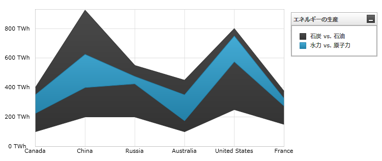

////

|metadata|
{
    "name": "datachart-category-range-area-series",
    "controlName": ["{DataChartName}"],
    "tags": ["Application Scenarios","Charting","How Do I"],
    "guid": "671e9cba-a555-4c0a-87f3-965bee173f75",  
    "buildFlags": [],
    "createdOn": "2014-06-05T19:39:00.4462945Z"
}
|metadata|
////

= 範囲領域シリーズ

このトピックは、コード例を示して、 link:{DataChartLink}.rangeareaseries.html[RangeAreaSeries] を link:{DataChartLink}.{DataChartName}.html[{DataChartName}]™ コントロールで使用する方法を説明します。

== 概要

トピックは以下のとおりです。

* <<Introduction,概要>>
* <<SeriesPreview,シリーズ プレビュー>>
* <<SeriesRecommendations,シリーズの提案>>
* <<DataRequirements,データ要件>>
* <<DataRenderingRules,データ描画の規則>>
* <<DataBindingExample,データ バインディング例>>
* <<RelatedContent,関連コンテンツ>>

[[Introduction]]
== 概要

範囲エリア シリーズは link:datachart-category-series-overview.html[カテゴリ シリーズ]のグループに属し、それは 2 本のラインを使いライン間の領域で塗りつぶされます。このシリーズのタイプは一定時間での同じデータ ポイント内で低い値と高い値の間の変化量を強調し、または複数項目を比較します。範囲の値は y 軸 (NumericYAxis) に表され、カテゴリは x 軸 (ategoryXAxis または CategoryDateTimeXAxis) に表示されます。link:{DataChartLink}.rangeareaseries.html[RangeAreaSeries] は、範囲が塗りつぶされた領域ではなく垂直柱の集まりで表されること以外は link:{DataChartLink}.rangecolumnseries.html[RangeColumnSeries] と同じです。シリーズの他のタイプと軸のタイプを含んだより概念的情報は、link:datachart-category-series-overview.html[カテゴリ シリーズ]とlink:datachart-axes.html[チャート軸]トピックを参照してください。

[[SeriesPreview]]
== シリーズ プレビュー

図 1 と 2 は、 link:{DataChartLink}.rangeareaseries.html[RangeAreaSeries] と link:{DataChartLink}.rangecolumnseries.html[RangeColumnSeries] が {DataChartName} コントロールにプロットされた時の外観を示しています。

図 1: link:{DataChartLink}.rangeareaseries.html[RangeAreaSeries] タイプの実装例

image::images/Using_xamDataChart_Range_Area_Series__02.png[]

図 2: link:{DataChartLink}.rangecolumnseries.html[RangeColumnSeries] タイプの実装例

[[SeriesRecommendations]]
== シリーズの提案

{DataChartName} はシリーズのタイプ数に制限なくプロットできますが、同様タイプのシリーズで link:{DataChartLink}.rangeareaseries.html[RangeAreaSeries] を使用することをお勧めします。link:{DataChartLink}.rangeareaseries.html[RangeAreaSeries] で推奨されるシリーズのタイプ、および複数のシリーズ タイプのプロット方法に関する情報は、 link:datachart-multiple-series.html[複数シリーズ]トピックを参照してください。

[[DataRequirements]]
== データ要件

{DataChartName} コントロールによって固有のデータ モデルにチャートを簡単にバインドすることができますが、そのシリーズが必要とするデータの適切な量とタイプを必ず提供するようにしてください。使用しているシリーズのタイプに基づいた最小要件をデータが満たさないと、コントロールによってエラーが生成されます。データ シリーズの要件についての詳細は、 link:datachart-series-requirements.html[シリーズ要件] と link:datachart-category-series-overview.html[カテゴリ シリーズ] を参照してください。

以下は、 `RangeAreaSeries` タイプのデータ要件の一覧です。

* データモデルには、値の間の範囲を描画するために少なくとも 2 つの数値データ列が含まれていなければなりません。
* データ モデルにはラベルのためのオプションの文字列または日時フィールドを含むことができます。
* データソースに少なくとも 2 つのデータ項目を含む必要があります。

[[DataRenderingRules]]
== データ描画の規則

`RangeAreaSeries` は以下の規則を使用してデータを描画します。

* データ マッピングの link:{DataChartLink}.RangeCategorySeries{ApiProp}LowMemberPath.html[LowMemberPath] と  link:{DataChartLink}.RangeCategorySeries{ApiProp}HighMemberPath.html[HighMemberPath] プロパティで指定された 2 つのデータ値をもつ各行はこれらのデータ値の間の差を表す 2 本の線で描画されます。
* x 軸上のデータ マッピングの `Label` プロパティにマップされる文字列または DateTime の列はカテゴリ ラベルとして使用されます。`Label` のデータ マッピングが指定されない場合、デフォルト ラベルが使用されます。
* カテゴリ ラベルは x 軸上に描かれます。データ値は y 軸上に描かれます。
* 描画時に、それぞれの連続シリーズが {DataChartName} コントロールの `Series` コレクションの以前のシリーズの前に描画されて `RangeAreaSeries` タイプの複数のシリーズはレイヤに描画されます。

[[DataBindingExample]]
== データ バインディング例

以下のコード スニペットは、 link:{DataChartLink}.rangeareaseries.html[RangeAreaSeries] オブジェクトをカテゴリ データ サンプル (link:resources-sample-energy-data.html[エネルギー製造データ サンプル]からダウンロード可能) にバインドする方法を示します。`RangeAreaSeries` のデータ要件の詳細な情報はこのトピックのデータ要件セクションを参照してください。

ifdef::sl,wpf,win-universal[]

*XAML の場合:*
[source,xaml]
----
xmlns:local="clr-namespace:Infragistics.Models;assembly=YourAppName"
...
<ig:{DataChartName} x:Name="DataChart" >
    <ig:{DataChartName}.Resources>
        <local:EnergyDataSource x:Key="data" />
    </ig:{DataChartName}.Resources>
    <ig:{DataChartName}.Axes>
        <ig:NumericYAxis x:Name="YAxis"  />
        <ig:CategoryXAxis x:Name="XAxis" ItemsSource="{StaticResource data}" 
                          Label="{}{Country}" />
    </ig:{DataChartName}.Axes>
    <ig:{DataChartName}.Series>
        <ig:RangeAreaSeries ItemsSource="{StaticResource data}" 
                            HighemberPath="Coal" LowMemberPath="Oil"  
                            Title="Coal vs Oil" 
                            XAxis="{Binding ElementName=XAxis}" 
                            YAxis="{Binding ElementName=YAxis}" >
        </ig:RangeAreaSeries >
        <ig:RangeAreaSeries ItemsSource="{StaticResource data}" 
                            HighemberPath="Hydro" LowMemberPath="Nuclear"  
                            Title="Hydro vs Nuclear" 
                            XAxis="{Binding ElementName=XAxis}" 
                            YAxis="{Binding ElementName=YAxis}" >
        </ig:RangeAreaSeries >          
    </ig:{DataChartName}.Series>
</ig:{DataChartName}>
----
endif::sl,wpf,win-universal[]

ifdef::xamarin[]
*XAML の場合:*
[source,xaml]
----
xmlns:local="clr-namespace:Infragistics.Models;assembly=YourAppName"
...
<ig:{DataChartName} x:Name="DataChart" >
    <ig:{DataChartName}.Resources>
        <ResourceDictionary>
			<local:EnergyDataSource x:Key="data" />
		</ResourceDictionary>
    </ig:{DataChartName}.Resources>
    <ig:{DataChartName}.Axes>
        <ig:NumericYAxis x:Name="YAxis"  />
        <ig:CategoryXAxis x:Name="XAxis" ItemsSource="{StaticResource data}" 
                          Label="Country" />
    </ig:{DataChartName}.Axes>
    <ig:{DataChartName}.Series>
        <ig:RangeAreaSeries ItemsSource="{StaticResource data}" 
                            HighemberPath="Coal" LowMemberPath="Oil"  
                            Title="Coal vs Oil"  
                            XAxis="{x:Reference XAxis}"  
                            YAxis="{x:Reference YAxis}">
        </ig:RangeAreaSeries >
        <ig:RangeAreaSeries ItemsSource="{StaticResource data}" 
                            HighemberPath="Hydro" LowMemberPath="Nuclear"  
                            Title="Hydro vs Nuclear"  
                            XAxis="{x:Reference XAxis}"  
                            YAxis="{x:Reference YAxis}">
        </ig:RangeAreaSeries >     
    </ig:{DataChartName}.Series>
</ig:{DataChartName}>
----
endif::xamarin[]

ifdef::win-forms[]

*C# の場合:*

[source,csharp]
----
var data = new EnergyDataSource(); 
var yAxis = new NumericYAxis();
var xAxis = new CategoryXAxis();
xAxis.DataSource = data;
xAxis.Label = "{Country}";

var series1 = new RangeAreaSeries();
series1.DataSource = data;
series1.HighMemberPath = "Coal";
series1.LowMemberPath = "Oil";
series1.Title = "Coal vs Oil";
series1.XAxis = xAxis;
series1.YAxis = yAxis;
var series2 = new RangeAreaSeries();
series2.DataSource = data;
series2.HighMemberPath = "Hydro";
series2.LowMemberPath = "Nuclear";
series2.Title = "Hydro vs Nuclear";
series2.XAxis = xAxis;
series2.YAxis = yAxis;
var chart = new {DataChartName}();
chart.Axes.Add(xAxis);
chart.Axes.Add(yAxis);
chart.Series.Add(series1);
chart.Series.Add(series2);
----
endif::win-forms[]

ifdef::xaml[]
*C# の場合:*
[source,csharp]
----
var data = new EnergyDataSource(); 
var yAxis = new NumericYAxis();
var xAxis = new CategoryXAxis();
xAxis.ItemsSource = data;
xAxis.Label = "Country";

var series1 = new RangeAreaSeries();
series1.ItemsSource = data;
series1.HighMemberPath = "Coal";
series1.LowMemberPath = "Oil";
series1.Title = "Coal vs Oil";
series1.XAxis = xAxis;
series1.YAxis = yAxis;
var series2 = new RangeAreaSeries();
series2.ItemsSource = data;
series2.HighemberPath = "Hydro";
series2.LowMemberPath = "Nuclear";
series2.Title = "Hydro vs Nuclear";
series2.XAxis = xAxis;
series2.YAxis = yAxis;
var chart = new {DataChartName}();
chart.Axes.Add(xAxis);
chart.Axes.Add(yAxis);
chart.Series.Add(series1);
chart.Series.Add(series2);
----
endif::xaml[]

ifdef::win-forms[]

*Visual Basic の場合:*

[source,vb]
----
Dim data As New EnergyDataSource()
Dim yAxis As New NumericYAxis()
Dim xAxis As New CategoryXAxis()
xAxis.DataSource = data
xAxis.Label = "{Country}"

Dim series1 As New RangeAreaSeries()
series1.DataSource = data
series1.HighMemberPath = "Coal"
series1.LowMemberPath = "Oil"
series1.Title = "Coal vs Oil"
series1.XAxis = xAxis
series1.YAxis = yAxis
Dim series2 As New RangeAreaSeries()
series2.DataSource = data
series2.HighemberPath = "Hydro"
series2.LowMemberPath = "Nuclear"
series2.Title = "Hydro vs Nuclear"
series2.XAxis = xAxis
series2.YAxis = yAxis
Dim chart As New {DataChartName}()
chart.Axes.Add(xAxis)
chart.Axes.Add(yAxis)
chart.Series.Add(series1)
chart.Series.Add(series2)
----
endif::win-forms[]

ifdef::sl,wpf,win-universal[]

*Visual Basic の場合:*

[source,vb]
----
Dim data As New EnergyDataSource()
Dim yAxis As New NumericYAxis()
Dim xAxis As New CategoryXAxis()
xAxis.ItemsSource = data
xAxis.Label = "Country"

Dim series1 As New RangeAreaSeries()
series1.ItemsSource = data
series1.HighemberPath = "Coal"
series1.LowMemberPath = "Oil"
series1.Title = "Coal vs Oil"
series1.XAxis = xAxis
series1.YAxis = yAxis
Dim series2 As New RangeAreaSeries()
series2.ItemsSource = data
series2.HighemberPath = "Hydro"
series2.LowMemberPath = "Nuclear"
series2.Title = "Hydro vs Nuclear"
series2.XAxis = xAxis
series2.YAxis = yAxis
Dim chart As New {DataChartName}()
chart.Axes.Add(xAxis)
chart.Axes.Add(yAxis)
chart.Series.Add(series1)
chart.Series.Add(series2)
----
endif::sl,wpf,win-universal[]

ifdef::android[]

*Java の場合:*

[source,js]
----
EnergyDataSource data = new EnergyDataSource();
NumericYAxis yAxis = new NumericYAxis();
CategoryXAxis xAxis = new CategoryXAxis();
xAxis.setDataSource(data);
xAxis.setLabel("Country");

RangeAreaSeries series1 = new RangeAreaSeries();
series1.setDataSource(data);
series1.setHighemberPath("Coal");
series1.setLowMemberPath("Oil");
series1.setTitle("Coal vs Oil");
series1.setXAxis(xAxis);
series1.setYAxis(yAxis);
RangeAreaSeries series2 = new RangeAreaSeries();
series2.setDataSource(data);
series2.setHighemberPath("Hydro");
series2.setLowMemberPath("Nuclear");
series2.setTitle("Hydro vs Nuclear");
series2.setXAxis(xAxis);
series2.setYAxis(yAxis);
DataChartView chart = new DataChartView(rootView.getContext());
chart.addAxis(xAxis);
chart.addAxis(yAxis);
chart.addSeries(series1);
chart.addSeries(series2);
----

endif::android[]

[[RelatedContent]]
== 関連コンテンツ

* link:datachart-axes.html[軸]
* link:datachart-category-series-overview.html[カテゴリ シリーズ]
* link:datachart-category-range-column-series.html[範囲柱状シリーズ]
* link:datachart-series-requirements.html[シリーズ要件]