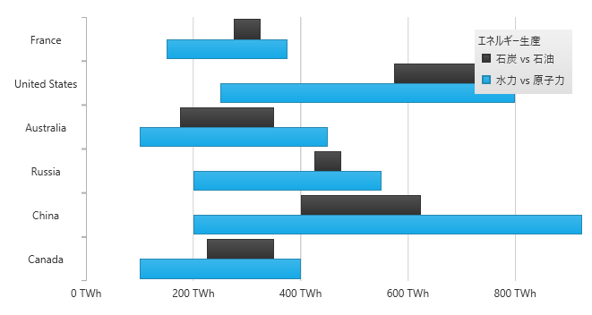

////

|metadata|
{
    "name": "datachart-category-range-bar-series",
    "controlName": ["{DataChartName}"],
    "tags": ["Application Scenarios","Charting","How Do I"],
    "guid": "b6f72554-ae23-4b95-a2ea-6d3ae4a097cf",
    "buildFlags": [],
    "createdOn": "2026-05-21T00:00:00Z"
}
|metadata|
////

= 範囲棒シリーズ

このトピックは、コード例を示して、 link:{DataChartLink}.RangeBarSeries.html[RangeBarSeries] を link:{DataChartLink}.{DataChartName}.html[{DataChartName}]™ コントロールで使用する方法を説明します。

== 概要

トピックは以下のとおりです。

* <<Introduction,概要>>
* <<SeriesPreview,シリーズ プレビュー>>
* <<SeriesRecommendations,シリーズの提案>>
* <<DataRequirements,データ要件>>
* <<DataRenderingRules,データ描画の規則>>
* <<DataBindingExample,データ バインディング例>>
* <<RelatedContent,関連コンテンツ>>

[[Introduction]]
== 概要

範囲棒シリーズは link:datachart-category-series-overview.html[カテゴリ シリーズ] のグループに属し、データ ポイントの 2 つの値の差を示す横棒のコレクションを使用して描画します。このタイプのシリーズは、同一データ ポイントにおける安値と高値の変化量を強調したり、複数の項目を比較したりします。範囲の値は x 軸 (NumericXAxis) に表され、カテゴリは y 軸 (CategoryYAxis) に表示されます。言い換えると、link:{DataChartLink}.RangeBarSeries.html[RangeBarSeries] は、link:{DataChartLink}.RangeColumnSeries.html[RangeColumnSeries] のように描画されますが、時計周りに 90 度回転されます。シリーズの他のタイプと軸のタイプを含んだより概念的情報は、link:datachart-category-series-overview.html[カテゴリ シリーズ]とlink:datachart-axes.html[チャート軸]トピックを参照してください。

[[SeriesPreview]]
== シリーズ プレビュー

図 1 と 2 は、 link:{DataChartLink}.RangeBarSeries.html[RangeBarSeries] と link:{DataChartLink}.RangeColumnSeries.html[RangeColumnSeries] が {DataChartName} コントロールにプロットされた時の外観を示しています。

図 1: link:{DataChartLink}.RangeBarSeries.html[RangeBarSeries] タイプの実装例

image::images/Using_xamDataChart_Range_Bar_Series__02.png[]

図 2: link:{DataChartLink}.RangeColumnSeries.html[RangeColumnSeries] タイプの実装例

[[SeriesRecommendations]]
== シリーズの提案

{DataChartName} はシリーズのタイプ数に制限なくプロットできますが、同様タイプのシリーズで範囲棒シリーズを使用することをお勧めします。範囲棒シリーズで推奨されるシリーズのタイプ、および複数のシリーズ タイプのプロット方法に関する情報は、 link:datachart-multiple-series.html[複数シリーズ]トピックを参照してください。

[[DataRequirements]]
== データ要件

{DataChartName} コントロールによって固有のデータ モデルにチャートを簡単にバインドすることができますが、そのシリーズが必要とするデータの適切な量とタイプを必ず提供するようにしてください。使用しているシリーズのタイプに基づいた最小要件をデータが満たさないと、コントロールによってエラーが生成されます。データ シリーズの要件についての詳細は、 link:datachart-series-requirements.html[シリーズ要件] と link:datachart-category-series-overview.html[カテゴリ シリーズ] を参照してください。

以下は、 `RangeBarSeries` タイプのデータ要件の一覧です。

* データモデルには、値の間の範囲を描画するために少なくとも 2 つの数値データ列が含まれていなければなりません。
* データ モデルにはラベルのためのオプションの文字列または日時フィールドを含むことができます。
* データソースに少なくとも 1 つのデータ項目を含む必要があります。

[[DataRenderingRules]]
== データ描画の規則

`RangeBarSeries` は以下の規則を使用してデータを描画します。

* データ マッピングの link:{DataChartLink}.RangeCategorySeries{ApiProp}LowMemberPath.html[LowMemberPath] と link:{DataChartLink}.RangeCategorySeries{ApiProp}HighMemberPath.html[HighMemberPath] プロパティで指定された 2 つのデータ値をもつ各行はこれらのデータ値の間の差を表す個別の横棒で描画されます。
* y 軸上のデータ マッピングの `Label` プロパティにマップされる文字列または日時の列はカテゴリ ラベルとして使用されます。`Label` のデータ マッピングが指定されない場合、デフォルト ラベルが使用されます。
* カテゴリ ラベルは y 軸上に描かれます。データ値は x 軸上に描かれます。
* 描画する時、`RangeBarSeries` の複数シリーズは各クラスターがデータ ポイントを表すクラスターに描画されます。{DataChartName} コントロールの `Series` コレクションの最初のシリーズは、クラスターの下側に描画されます。各連続するシリーズは、前のシリーズの上側に描画されます。詳細は、link:datachart-multiple-series.html[複数シリーズ]のトピックを参照してください。

[[DataBindingExample]]
== データ バインディング例

以下のコード スニペットは、 link:{DataChartLink}.RangeBarSeries.html[RangeBarSeries] オブジェクトをカテゴリ データ サンプル (link:resources-sample-energy-data.html[エネルギー製造データ サンプル]からダウンロード可能) にバインドする方法を示します。`RangeBarSeries` のデータ要件の詳細な情報はこのトピックのデータ要件セクションを参照してください。

ifdef::sl,wpf,win-universal[]

*XAML の場合:*
[source,xaml]
----
xmlns:local="clr-namespace:Infragistics.Models;assembly=YourAppName"
...
<ig:{DataChartName} x:Name="DataChart" >
    <ig:{DataChartName}.Resources>
        <local:EnergyDataSource x:Key="data" />
    </ig:{DataChartName}.Resources>
    <ig:{DataChartName}.Axes>
        <ig:NumericXAxis x:Name="XAxis"  />
        <ig:CategoryYAxis x:Name="YAxis" ItemsSource="{StaticResource data}"
                          Label="{}{Country}" />
    </ig:{DataChartName}.Axes>
    <ig:{DataChartName}.Series>
        <ig:RangeBarSeries ItemsSource="{StaticResource data}"
                            HighMemberPath="Coal" LowMemberPath="Oil"
                            Title="Coal vs Oil"
                            XAxis="{Binding ElementName=XAxis}"
                            YAxis="{Binding ElementName=YAxis}" >
        </ig:RangeBarSeries >
        <ig:RangeBarSeries ItemsSource="{StaticResource data}"
                            HighMemberPath="Hydro" LowMemberPath="Nuclear"
                            Title="Hydro vs Nuclear"
                            XAxis="{Binding ElementName=XAxis}"
                            YAxis="{Binding ElementName=YAxis}" >
        </ig:RangeBarSeries >
    </ig:{DataChartName}.Series>
</ig:{DataChartName}>
----
endif::sl,wpf,win-universal[]

ifdef::xamarin[]
*XAML の場合:*
[source,xaml]
----
xmlns:local="clr-namespace:Infragistics.Models;assembly=YourAppName"
...
<ig:{DataChartName} x:Name="DataChart" >
    <ig:{DataChartName}.Resources>
        <ResourceDictionary>
			<local:EnergyDataSource x:Key="data" />
		</ResourceDictionary>
    </ig:{DataChartName}.Resources>
    <ig:{DataChartName}.Axes>
        <ig:NumericXAxis x:Name="XAxis"  />
        <ig:CategoryYAxis x:Name="YAxis" ItemsSource="{StaticResource data}"
                          Label="Country" />
    </ig:{DataChartName}.Axes>
    <ig:{DataChartName}.Series>
        <ig:RangeBarSeries ItemsSource="{StaticResource data}"
                            HighMemberPath="Coal" LowMemberPath="Oil"
                            Title="Coal vs Oil"
                            XAxis="{x:Reference XAxis}"
                            YAxis="{x:Reference YAxis}">
        </ig:RangeBarSeries >
        <ig:RangeBarSeries ItemsSource="{StaticResource data}"
                            HighMemberPath="Hydro" LowMemberPath="Nuclear"
                            Title="Hydro vs Nuclear"
                            XAxis="{x:Reference XAxis}"
                            YAxis="{x:Reference YAxis}">
        </ig:RangeBarSeries >
    </ig:{DataChartName}.Series>
</ig:{DataChartName}>
----
endif::xamarin[]

ifdef::win-forms[]

*C# の場合:*

[source,csharp]
----
var data = new EnergyDataSource();
var xAxis = new NumericXAxis();
var yAxis = new CategoryYAxis();
yAxis.DataSource = data;
yAxis.Label = "{Country}";

var series1 = new RangeBarSeries();
series1.DataSource = data;
series1.HighMemberPath = "Coal";
series1.LowMemberPath = "Oil";
series1.Title = "Coal vs Oil";
series1.XAxis = xAxis;
series1.YAxis = yAxis;
var series2 = new RangeBarSeries();
series2.DataSource = data;
series2.HighMemberPath = "Hydro";
series2.LowMemberPath = "Nuclear";
series2.Title = "Hydro vs Nuclear";
series2.XAxis = xAxis;
series2.YAxis = yAxis;
var chart = new {DataChartName}();
chart.Axes.Add(xAxis);
chart.Axes.Add(yAxis);
chart.Series.Add(series1);
chart.Series.Add(series2);
----
endif::win-forms[]

ifdef::xaml[]
*C# の場合:*
[source,csharp]
----
var data = new EnergyDataSource();
var xAxis = new NumericXAxis();
var yAxis = new CategoryYAxis();
yAxis.ItemsSource = data;
yAxis.Label = "Country";

var series1 = new RangeBarSeries();
series1.ItemsSource = data;
series1.HighMemberPath = "Coal";
series1.LowMemberPath = "Oil";
series1.Title = "Coal vs Oil";
series1.XAxis = xAxis;
series1.YAxis = yAxis;
var series2 = new RangeBarSeries();
series2.ItemsSource = data;
series2.HighMemberPath = "Hydro";
series2.LowMemberPath = "Nuclear";
series2.Title = "Hydro vs Nuclear";
series2.XAxis = xAxis;
series2.YAxis = yAxis;
var chart = new {DataChartName}();
chart.Axes.Add(xAxis);
chart.Axes.Add(yAxis);
chart.Series.Add(series1);
chart.Series.Add(series2);
----
endif::xaml[]

ifdef::win-forms[]

*Visual Basic の場合:*

[source,vb]
----
Dim data As New EnergyDataSource()
Dim xAxis As New NumericXAxis()
Dim yAxis As New CategoryYAxis()
yAxis.DataSource = data
yAxis.Label = "{Country}"

Dim series1 As New RangeBarSeries()
series1.DataSource = data
series1.HighMemberPath = "Coal"
series1.LowMemberPath = "Oil"
series1.Title = "Coal vs Oil"
series1.XAxis = xAxis
series1.YAxis = yAxis
Dim series2 As New RangeBarSeries()
series2.DataSource = data
series2.HighMemberPath = "Hydro"
series2.LowMemberPath = "Nuclear"
series2.Title = "Hydro vs Nuclear"
series2.XAxis = xAxis
series2.YAxis = yAxis
Dim chart As New {DataChartName}()
chart.Axes.Add(xAxis)
chart.Axes.Add(yAxis)
chart.Series.Add(series1)
chart.Series.Add(series2)
----
endif::win-forms[]

ifdef::sl,wpf,win-universal[]
*Visual Basic の場合:*

[source,vb]
----
Dim data As New EnergyDataSource()
Dim xAxis As New NumericXAxis()
Dim yAxis As New CategoryYAxis()
yAxis.ItemsSource = data
yAxis.Label = "Country"

Dim series1 As New RangeBarSeries()
series1.ItemsSource = data
series1.HighMemberPath = "Coal"
series1.LowMemberPath = "Oil"
series1.Title = "Coal vs Oil"
series1.XAxis = xAxis
series1.YAxis = yAxis
Dim series2 As New RangeBarSeries()
series2.ItemsSource = data
series2.HighMemberPath = "Hydro"
series2.LowMemberPath = "Nuclear"
series2.Title = "Hydro vs Nuclear"
series2.XAxis = xAxis
series2.YAxis = yAxis
Dim chart As New {DataChartName}()
chart.Axes.Add(xAxis)
chart.Axes.Add(yAxis)
chart.Series.Add(series1)
chart.Series.Add(series2)
----
endif::sl,wpf,win-universal[]

ifdef::android[]

*Java の場合:*

[source,js]
----
EnergyDataSource data = new EnergyDataSource();
NumericXAxis xAxis = new NumericXAxis();
CategoryYAxis yAxis = new CategoryYAxis();
yAxis.setDataSource(data);
yAxis.setLabel("Country");

RangeBarSeries series1 = new RangeBarSeries();
series1.setDataSource(data);
series1.setHighMemberPath("Coal");
series1.setLowMemberPath("Oil");
series1.setTitle("Coal vs Oil");
series1.setXAxis(xAxis);
series1.setYAxis(yAxis);
RangeBarSeries series2 = new RangeBarSeries();
series2.setDataSource(data);
series2.setHighMemberPath("Hydro");
series2.setLowMemberPath("Nuclear");
series2.setTitle("Hydro vs Nuclear");
series2.setXAxis(xAxis);
series2.setYAxis(yAxis);
DataChartView chart = new DataChartView(rootView.getContext());
chart.addAxis(xAxis);
chart.addAxis(yAxis);
chart.addSeries(series1);
chart.addSeries(series2);
----

endif::android[]

[[RelatedContent]]
== 関連コンテンツ

* link:datachart-axes.html[軸]
* link:datachart-category-bar-series.html[棒シリーズ]
* link:datachart-category-range-column-series.html[範囲柱状シリーズ]
* link:datachart-category-range-area-series.html[範囲領域シリーズ]
* link:datachart-series-requirements.html[シリーズ要件]
