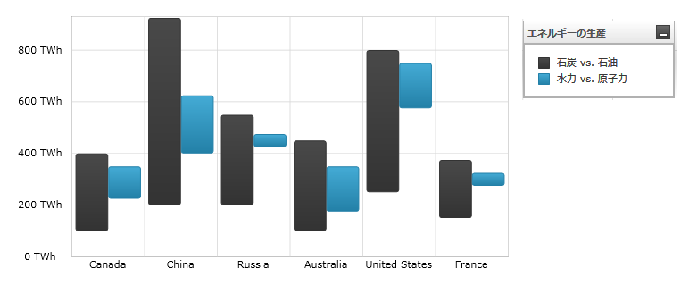
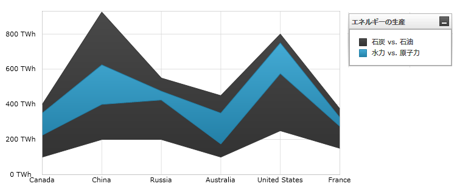

////

|metadata|
{
    "name": "datachart-category-range-column-series",
    "controlName": ["{DataChartName}"],
    "tags": ["Application Scenarios","Charting","How Do I"],
    "guid": "dfe2be76-2333-4f87-9b42-37b67e3a4054",  
    "buildFlags": [],
    "createdOn": "2014-06-05T19:39:00.4482953Z"
}
|metadata|
////

= 範囲柱状シリーズ

このトピックは、コード例を示して、 link:{DataChartLink}.rangecolumnseries.html[RangeColumnSeries] を link:{DataChartLink}.{DataChartName}.html[{DataChartName}]™ コントロールで使用する方法を説明します。

== 概要

トピックは以下のとおりです。

* <<Introduction,概要>>
* <<SeriesPreview,シリーズ プレビュー>>
* <<SeriesRecommendations,シリーズの提案>>
* <<DataRequirements,データ要件>>
* <<DataRenderingRules,データ描画の規則>>
* <<DataBindingExample,データ バインディング例>>
* <<RelatedContent,関連コンテンツ>>

[[Introduction]]
== 概要

範囲柱状シリーズは link:datachart-category-series-overview.html[カテゴリ シリーズ] のグループに属し、データ ポイントの 2 つの値の差を示す縦列のコレクションを使用して描画します。このタイプのシリーズは、一定時間にわたる同一データ ポイントにおける安値と高値間の変更量を強調し、複数の項目を比較します。範囲の値は y 軸 (NumericYAxis) に表され、カテゴリは x 軸 (ategoryXAxis または CategoryDateTimeXAxis) に表示されます。link:{DataChartLink}.rangecolumnseries.html[RangeColumnSeries] は範囲が塗りつぶされた領域ではなく縦の柱の集まりで表されること以外はすべての面で link:{DataChartLink}.rangeareaseries.html[RangeAreaSeries] と同一です。シリーズの他のタイプと軸のタイプを含んだより概念的情報は、link:datachart-category-series-overview.html[カテゴリ シリーズ]とlink:datachart-axes.html[チャート軸]トピックを参照してください。

[[SeriesPreview]]
== シリーズ プレビュー

図 1 と 2 は、 link:{DataChartLink}.rangecolumnseries.html[RangeColumnSeries] と link:{DataChartLink}.rangeareaseries.html[RangeAreaSeries] が {DataChartName} コントロール内でプロットされた時にどのように表示されるかを示しています。

図 1: link:{DataChartLink}.rangecolumnseries.html[RangeColumnSeries] タイプの実装例

図 2: link:{DataChartLink}.rangeareaseries.html[RangeAreaSeries] タイプの実装例

[[SeriesRecommendations]]
== シリーズの提案

{DataChartName} はシリーズのタイプ数に制限なくプロットできますが、範囲柱状シリーズは同種のシリーズで使用することを推奨します。範囲柱状シリーズで推奨されるシリーズのタイプおよびスプライン エリア シリーズのプロット方法についての情報は link:datachart-multiple-series.html[複数シリーズ]のトピックを参照してください。

[[DataRequirements]]
== データ要件

{DataChartName} コントロールによって固有のデータ モデルにチャートを簡単にバインドすることができますが、そのシリーズが必要とするデータの適切な量とタイプを必ず提供するようにしてください。使用しているシリーズのタイプに基づいた最小要件をデータが満たさないと、コントロールによってエラーが生成されます。データ シリーズの要件についての詳細は、 link:datachart-series-requirements.html[シリーズ要件] と link:datachart-category-series-overview.html[カテゴリ シリーズ] を参照してください。

以下は、`RangeColumnSeries` タイプのデータ要件のリストです。

* データモデルには、値の間の範囲を描画するために少なくとも 2 つの数値データ列が含まれていなければなりません。
* データ モデルにはラベルのためのオプションの文字列または日時フィールドを含むことができます。
* データソースに少なくとも 1 つのデータ項目を含む必要があります。

[[DataRenderingRules]]
== データ描画の規則

`RangeColumnSeries` は以下の規則を使用してデータを描画します。

* データ マッピングの link:{DataChartLink}.RangeCategorySeries{ApiProp}LowMemberPath.html[LowMemberPath] と  link:{DataChartLink}.RangeCategorySeries{ApiProp}HighMemberPath.html[HighMemberPath] プロパティで指定された 2 つのデータ値をもつ各行はこれらのデータ値の間の差を表す個別の縦の柱で描画されます。
* x 軸上のデータ マッピングの `Label` プロパティにマップされる文字列または日時の列はカテゴリ ラベルとして使用されます。`Label` のデータ マッピングが指定されない場合、デフォルト ラベルが使用されます。
* カテゴリ ラベルは x 軸上に描かれます。データ値は y 軸上に描かれます。
* 描画する時、`RangeColumnSeries` の複数シリーズは各クラスターがデータ ポイントを表すクラスターに描画されます。{DataChartName} コントロールの `Series` コレクションの最初のシリーズは、クラスターの左側に列として描画されます。各連続するシリーズは、前のシリーズの右側に描画されます。詳細は、複数シリーズのトピックを参照してください。

[[DataBindingExample]]
== データ バインディング例

以下のコード スニペットは、 link:{DataChartLink}.rangecolumnseries.html[RangeColumnSeries] オブジェクトをカテゴリ データ サンプル (link:resources-sample-energy-data.html[エネルギー製造データ サンプル]からダウンロード可能) にバインドする方法を示します。`RangeColumnSeries` のデータ要件の詳細な情報はこのトピックのデータ要件セクションを参照してください。

ifdef::sl,wpf,win-universal[]

*XAML の場合:*
[source,xaml]
----
xmlns:local="clr-namespace:Infragistics.Models;assembly=YourAppName"
...
<ig:{DataChartName} x:Name="DataChart" >
    <ig:{DataChartName}.Resources>
        <local:EnergyDataSource x:Key="data" />
    </ig:{DataChartName}.Resources>
    <ig:{DataChartName}.Axes>
        <ig:NumericYAxis x:Name="YAxis"  />
        <ig:CategoryXAxis x:Name="XAxis" ItemsSource="{StaticResource data}" 
                          Label="{}{Country}" />
    </ig:{DataChartName}.Axes>
    <ig:{DataChartName}.Series>
        <ig:RangeColumnSeries ItemsSource="{StaticResource data}" 
                            HighemberPath="Coal" LowMemberPath="Oil"  
                            Title="Coal vs Oil" 
                            XAxis="{Binding ElementName=XAxis}" 
                            YAxis="{Binding ElementName=YAxis}" >
        </ig:RangeColumnSeries >
        <ig:RangeColumnSeries ItemsSource="{StaticResource data}" 
                            HighemberPath="Hydro" LowMemberPath="Nuclear"  
                            Title="Hydro vs Nuclear" 
                            XAxis="{Binding ElementName=XAxis}" 
                            YAxis="{Binding ElementName=YAxis}" >
        </ig:RangeColumnSeries >          
    </ig:{DataChartName}.Series>
</ig:{DataChartName}>
----
endif::sl,wpf,win-universal[]

ifdef::xamarin[]
*XAML の場合:*
[source,xaml]
----
xmlns:local="clr-namespace:Infragistics.Models;assembly=YourAppName"
...
<ig:{DataChartName} x:Name="DataChart" >
    <ig:{DataChartName}.Resources>
        <ResourceDictionary>
			<local:EnergyDataSource x:Key="data" />
		</ResourceDictionary>
    </ig:{DataChartName}.Resources>
    <ig:{DataChartName}.Axes>
        <ig:NumericYAxis x:Name="YAxis"  />
        <ig:CategoryXAxis x:Name="XAxis" ItemsSource="{StaticResource data}" 
                          Label="Country" />
    </ig:{DataChartName}.Axes>
    <ig:{DataChartName}.Series>
        <ig:RangeColumnSeries ItemsSource="{StaticResource data}" 
                            HighemberPath="Coal" LowMemberPath="Oil"  
                            Title="Coal vs Oil"  
                            XAxis="{x:Reference XAxis}"  
                            YAxis="{x:Reference YAxis}">
        </ig:RangeColumnSeries >
        <ig:RangeColumnSeries ItemsSource="{StaticResource data}" 
                            HighemberPath="Hydro" LowMemberPath="Nuclear"  
                            Title="Hydro vs Nuclear"  
                            XAxis="{x:Reference XAxis}"  
                            YAxis="{x:Reference YAxis}">
        </ig:RangeColumnSeries >     
    </ig:{DataChartName}.Series>
</ig:{DataChartName}>
----
endif::xamarin[]

ifdef::win-forms[]

*C# の場合:*
[source,csharp]
----
var data = new EnergyDataSource(); 
var yAxis = new NumericYAxis();
var xAxis = new CategoryXAxis();
xAxis.DataSource = data;
xAxis.Label = "{Country}";

var series1 = new RangeColumnSeries();
series1.DataSource = data;
series1.HighMemberPath = "Coal";
series1.LowMemberPath = "Oil";
series1.Title = "Coal vs Oil";
series1.XAxis = xAxis;
series1.YAxis = yAxis;
var series2 = new RangeColumnSeries();
series2.DataSource = data;
series2.HighemberPath = "Hydro";
series2.LowMemberPath = "Nuclear";
series2.Title = "Hydro vs Nuclear";
series2.XAxis = xAxis;
series2.YAxis = yAxis;
var chart = new {DataChartName}();
chart.Axes.Add(xAxis);
chart.Axes.Add(yAxis);
chart.Series.Add(series1);
chart.Series.Add(series2);
----
endif::win-forms[]

ifdef::xaml[]
*C# の場合:*
[source,csharp]
----
var data = new EnergyDataSource(); 
var yAxis = new NumericYAxis();
var xAxis = new CategoryXAxis();
xAxis.ItemsSource = data;
xAxis.Label = "Country";

var series1 = new RangeColumnSeries();
series1.ItemsSource = data;
series1.HighMemberPath = "Coal";
series1.LowMemberPath = "Oil";
series1.Title = "Coal vs Oil";
series1.XAxis = xAxis;
series1.YAxis = yAxis;
var series2 = new RangeColumnSeries();
series2.ItemsSource = data;
series2.HighemberPath = "Hydro";
series2.LowMemberPath = "Nuclear";
series2.Title = "Hydro vs Nuclear";
series2.XAxis = xAxis;
series2.YAxis = yAxis;
var chart = new {DataChartName}();
chart.Axes.Add(xAxis);
chart.Axes.Add(yAxis);
chart.Series.Add(series1);
chart.Series.Add(series2);
----
endif::xaml[]

ifdef::win-forms[]

*Visual Basic の場合:*

[source,vb]
----
Dim data As New EnergyDataSource()
Dim yAxis As New NumericYAxis()
Dim xAxis As New CategoryXAxis()
xAxis.DataSource = data
xAxis.Label = "{Country}"

Dim series1 As New RangeColumnSeries()
series1.DataSource = data
series1.HighMemberPath = "Coal"
series1.LowMemberPath = "Oil"
series1.Title = "Coal vs Oil"
series1.XAxis = xAxis
series1.YAxis = yAxis
Dim series2 As New RangeColumnSeries()
series2.DataSource = data
series2.HighemberPath = "Hydro"
series2.LowMemberPath = "Nuclear"
series2.Title = "Hydro vs Nuclear"
series2.XAxis = xAxis
series2.YAxis = yAxis
Dim chart As New {DataChartName}()
chart.Axes.Add(xAxis)
chart.Axes.Add(yAxis)
chart.Series.Add(series1)
chart.Series.Add(series2)
----
endif::win-forms[]

ifdef::sl,wpf,win-universal[]
*Visual Basic の場合:*

[source,vb]
----
Dim data As New EnergyDataSource()
Dim yAxis As New NumericYAxis()
Dim xAxis As New CategoryXAxis()
xAxis.ItemsSource = data
xAxis.Label = "Country"

Dim series1 As New RangeColumnSeries()
series1.ItemsSource = data
series1.HighMemberPath = "Coal"
series1.LowMemberPath = "Oil"
series1.Title = "Coal vs Oil"
series1.XAxis = xAxis
series1.YAxis = yAxis
Dim series2 As New RangeColumnSeries()
series2.ItemsSource = data
series2.HighemberPath = "Hydro"
series2.LowMemberPath = "Nuclear"
series2.Title = "Hydro vs Nuclear"
series2.XAxis = xAxis
series2.YAxis = yAxis
Dim chart As New {DataChartName}()
chart.Axes.Add(xAxis)
chart.Axes.Add(yAxis)
chart.Series.Add(series1)
chart.Series.Add(series2)
----
endif::sl,wpf,win-universal[]

ifdef::android[]

*Java の場合:*

[source,js]
----
EnergyDataSource data = new EnergyDataSource();
NumericYAxis yAxis = new NumericYAxis();
CategoryXAxis xAxis = new CategoryXAxis();
xAxis.setDataSource(data);
xAxis.setLabel("Country");

RangeColumnSeries series1 = new RangeColumnSeries();
series1.setDataSource(data);
series1.setHighemberPath("Coal");
series1.setLowMemberPath("Oil");
series1.setTitle("Coal vs Oil");
series1.setXAxis(xAxis);
series1.setYAxis(yAxis);
RangeColumnSeries series2 = new RangeColumnSeries();
series2.setDataSource(data);
series2.setHighemberPath("Hydro");
series2.setLowMemberPath("Nuclear");
series2.setTitle("Hydro vs Nuclear");
series2.setXAxis(xAxis);
series2.setYAxis(yAxis);
DataChartView chart = new DataChartView(rootView.getContext());
chart.addAxis(xAxis);
chart.addAxis(yAxis);
chart.addSeries(series1);
chart.addSeries(series2);
----

endif::android[]

[[RelatedContent]]
== 関連コンテンツ

* link:datachart-axes.html[軸]
* link:datachart-category-series-overview.html[カテゴリ シリーズ]
* link:datachart-category-range-area-series.html[範囲領域シリーズ]
* link:datachart-series-requirements.html[シリーズ要件]