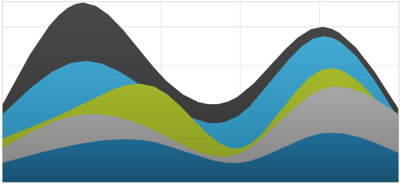
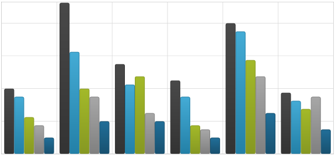
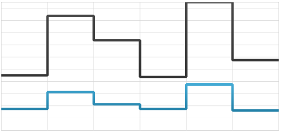
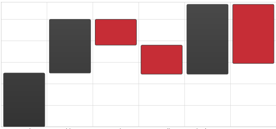

////

|metadata|
{
    "name": "datachart-category-series-overview",
    "controlName": ["{DataChartName}"],
    "tags": ["Charting"],
    "guid": "afeced41-35ad-487b-ba37-98e3b8240d1e",  
    "buildFlags": [],
    "createdOn": "2014-06-05T19:39:00.3992752Z"
}
|metadata|
////

= カテゴリ シリーズ

このトピックは、 link:{DataChartLink}.{DataChartName}.html[{DataChartName}]™ コントロールのカテゴリ シリーズのさまざまなタイプを説明します。

== このトピックの内容

このトピックは、以下のセクションで構成されます。

* <<Introduction,概要>>
* <<Types,カテゴリ シリーズのタイプ>>
* <<_Preview,カテゴリ シリーズのプレビュー>>
* <<SupportedAxes,サポートされる軸>>
* <<DataBinding,データ バインディング>>
** <<_DataRequirements,データ要件>>
** <<_DataSample,データの例>>
* <<RelatedContent,関連コンテンツ>>

[[_Introduction]]
== 概要

カテゴリ シリーズは、データを取り入れてそれを水平線 (たとえば、柱状シリーズ) または垂直線 (たとえば、棒シリーズ) に沿って延ばしたデータ ポイントのコレクションとして描画するチャート シリーズの中でも、もっとも簡単でもっとも一般的な形のグループです。

[[_Types]]
== カテゴリ シリーズのタイプ

{DataChartName} コントロールは、以下のタイプのカテゴリ座標シリーズをサポートし、それぞれについては個別のトピックで説明します:

* link:datachart-category-area-series.html[エリア シリーズ]
* link:datachart-category-bar-series.html[棒シリーズ]
* link:datachart-category-column-series.html[柱状シリーズ]
* link:datachart-category-line-series.html[折れ線シリーズ]
* link:datachart-category-point-series.html[ポイント シリーズ]
* link:datachart-category-step-area-series.html[ステップ エリア シリーズ]
* link:datachart-category-step-line-series.html[ステップ折れ線シリーズ]
* link:datachart-category-spline-series.html[スプライン シリーズ]
* link:datachart-category-spline-area-series.html[スプライン エリア シリーズ]
* link:datachart-category-waterfall-series.html[ウォーターフォール シリーズ]

これらのトピックは、特定のタイプのカテゴリ シリーズを作成してデータをこのシリーズにバインドする方法に関する有用な情報を提供します。

このセクションは、カテゴリ シリーズのすべてのタイプのプレビューを提供します。

さらに、複雑なチャート視覚要素を作るために link:datachart-series-financial-price-series-overview.html[財務シリーズ] または link:datachart-financial-indicators-overview.html[財務指標]をもつ複数タイプのカテゴリ シリーズを使用することもできます。{DataChartName} コントロールのこの機能についての詳細は link:datachart-multiple-series.html[複数シリーズの追加]および link:datachart-multiple-axes.html[複数軸の使用]トピックスを参照してください。 

[[_Preview]]
== カテゴリ シリーズのプレビュー

このセクションは、カテゴリ シリーズのすべてのタイプのプレビューを提供します。

[options="header", cols="a,a"]
|====
|シリーズ タイプ|説明

| link:datachart-category-line-series.html[折れ線シリーズ]

image::images/Using_xamDataChart_Category_Series_01.png[]
|線で接続された一定配置のポイントのセットを表示します。カテゴリは水平方向、値は垂直方向にプロットされます。 

経時的に連続的に変化するデータまたは情報を示すために使用します。ポイントの間の関係を強調する必要がある場合に役立ちます。

| link:datachart-category-area-series.html[エリア シリーズ]

image::images/Using_xamDataChart_Category_Series_02.png[]
|線の下の領域が塗りつぶされる以外は折れ線シリーズ タイプと同じです。カテゴリは水平に配置され、値は垂直に配置されます。

| link:datachart-category-spline-series.html[スプライン シリーズ]

image::images/Using_xamDataChart_Category_Series_03.png[]
|折れ線シリーズ タイプと同様であり、データの表示を改善するスプライン補間とスムージング機能が追加されています。

| link:datachart-category-spline-area-series.html[スプライン エリア シリーズ]

|エリア シリーズ タイプと同様であり、データの表示を改善するスプライン補間とスムージング機能が追加されています。

ifdef::wpf,win-universal[]
| link:datachart-category-bar-series.html[棒シリーズ]

image::images/Using_xamDataChart_Category_Series_05.png[]
|個々のデータを別々の行に表示します。カテゴリは垂直方向、値は水平方向にプロットされます。 

データ シリーズの経時的な変化を表示、または複数の項目を比較するために使用します。
endif::wpf,win-universal[]

| link:datachart-category-column-series.html[柱状シリーズ]

|個々のデータを別々の列に表示します。カテゴリは水平方向、値は垂直方向にプロットされます。 

データ シリーズの経時的な変化を表示、または複数の項目を比較するために使用します。

| link:datachart-category-step-line-series.html[ステップ折れ線シリーズ]

|値をポイント間を最短の直線で結ぶ代わりに階段状の連鎖を形成する連続する垂直線と水平線で接続する以外は折れ線シリーズ タイプと同じです。

| link:datachart-category-step-area-series.html[ステップ エリア シリーズ]

image::images/Using_xamDataChart_Category_Series_14.png[]
|データ ポイント間の変化を階段状の連鎖を形成する連続する垂直線と水平線を使う代わりに値の下の領域が塗りつぶされる以外はステップ折れ線シリーズ タイプと同じです。

| link:datachart-category-waterfall-series.html[ウォーターフォール シリーズ]

|ポイントの集合を、連続するデータ ポイントの値同士の差異を示す垂直列として表示します。列は色でコード化され、値が正の変化であるか負の変化であるかを区別します。カテゴリは水平方向、値は垂直方向にプロットされます。 

データ ポイントの経時的な変化を表示、または複数の項目を比較するために使用します。

|====

リンクされた各トピックは、コード例と共に特定のタイプのカテゴリ シリーズの作成方法とデータをバインドする方法を示します。

[[_SupportedAxes]] 
== サポートされる軸

{DataChartName} コントロールは、さまざまな軸タイプを提供しますが、カテゴリ シリーズの特定のタイプでは以下の軸タイプのみ使用できます。以下の表に、サポートされる軸を示します。

[options="header", cols="a,a,a"]
|====
|シリーズ タイプ| XAxis タイプ | YAxis タイプ 

| `BarSeries`
|link:{DataChartLink}.NumericXAxis.html[NumericXAxis]
|link:{DataChartLink}.CategoryYAxis.html[CategoryYAxis]
| 
`AreaSeries` 

`ColumnSeries` 

`LineSeries` 

`SplineSeries` 

`SplineAreaSeries` 

`StepAreaSeries` 

`StepLineSeries` 

`WaterfallSeries`

|link:{DataChartLink}.CategoryXAxis.html[CategoryXAxis]

link:{DataChartLink}.CategoryDateTimeXAxis.html[CategoryDateTimeXAxis]

ifdef::wpf,win-forms[]
link:{DataChartLink}.TimeXAxis.html[TimeXAxis] 

link:{DataChartLink}.OrdinalTimeXAxis.html[OrdinalTimeXAxis]
endif::wpf,win-forms[]

|link:{DataChartLink}.NumericYAxis.html[NumericYAxis]

ifdef::wpf,win-forms[]
link:{DataChartLink}.PercentChangeYAxis.html[PercentChangeYAxis]
endif::wpf,win-forms[]
 
|====

さらに、各カテゴリ シリーズは link:{DataChartLink}.HorizontalAnchoredCategorySeries{ApiProp}XAxis.html[XAxis] プロパティを使用する 1 つの x 軸と link:{DataChartLink}.HorizontalAnchoredCategorySeries{ApiProp}XAxis.html[YAxis] プロパティを使用する 1 つの y 軸にバインドを設定する必要があります。軸についての詳細は、link:datachart-axes.html[「軸」]トピックを参照してください。

[[_DataBinding]]
== データ バインディング

このセクションではデータ要件からデータ例、バインディング ダイアグラムまでのすべてのタイプのカテゴリ シリーズに対するバインディング データについての情報を提供します。

[[_DataRequirements]] 
=== データ要件

{DataChartName} コントロールの他のシリーズ タイプと同様、カテゴリ シリーズも link:{DataChartLink}.Series~{ApiDataSource}.html[{ApiDataSource}] プロパティを使用してデータをバインドします。以下は、カテゴリ シリーズのデータ要件のリストです。

* データ モデルは、カテゴリ軸 (link:{DataChartLink}.CategoryXAxis.html[CategoryXAxis] など) の link:{DataChartLink}.Axis{ApiProp}Label.html[Label] プロパティpick:[wpf,win-forms="または link:{DataChartLink}.TimeXAxis.html[TimeXAxis] の場合に link:{DataChartLink}.TimeAxisBase{ApiProp}DateTimeMemberPath.html[DateTimeMemberPath] "]にマップするデータ 1 列を含む必要があります。
* データ モデルは、カテゴリシリーズ (link:{DataChartLink}.LineSeries.html[LineSeries]) の link:{DataChartLink}.AnchoredCategorySeries{ApiProp}ValueMemberPath.html[ValueMemberPath] プロパティを使用してマップする少なくとも数値データ列を 1 列含む必要があります。
* データソースはデータ項目を 1 つ含む必要があります。含まない場合はチャートはカテゴリ シリーズを描画しません。
* データ ソースは link:http://msdn.microsoft.com/ja-jp/library/system.collections.ienumerable.aspx[IEnumerable] インターフェイス (link:http://msdn.microsoft.com/ja-jp/library/6sh2ey19.aspx[List], link:http://msdn.microsoft.com/ja-jp/library/ms132397.aspx[Collection], link:http://msdn.microsoft.com/ja-jp/library/7977ey2c.aspx[Queue], link:http://msdn.microsoft.com/ja-jp/library/system.collections.stack.aspx[Stack] など) を実装しなければなりません。
 
特定のシリーズ タイプの要件については、link:datachart-series-requirements.html[シリーズ要件]トピックを参照してください。

[[_DataSample]] 
=== データの例

上記の基準を満たすオブジェクトの例は link:resources-sample-energy-data.html[サンプル エネルギ データ] で、ダウンロードしてプロジェクトで使用できます。

[[_RelatedTopics]] 
== 関連コンテンツ

* link:datachart-axes.html[軸]
* link:datachart-multiple-axes.html[複数軸の使用]
* link:datachart-multiple-series.html[複数シリーズの追加]
* link:datachart-series-requirements.html[シリーズ要件]