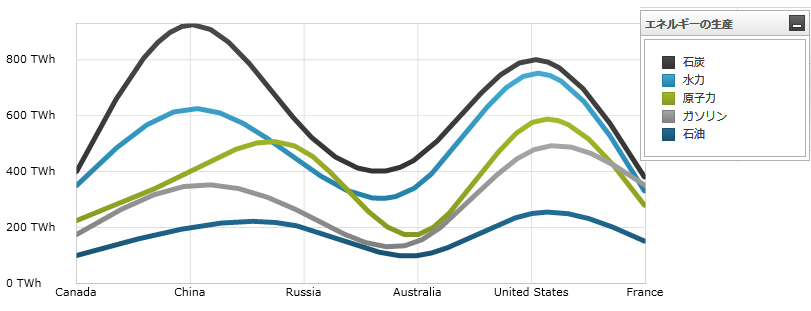
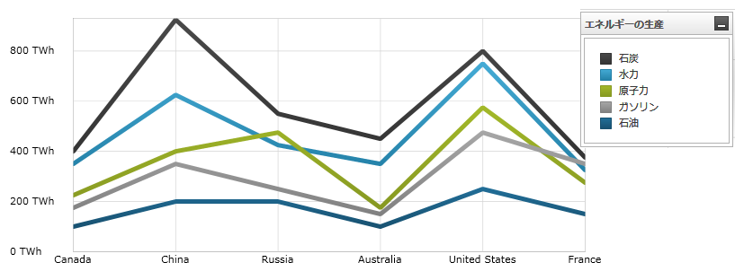

////

|metadata|
{
    "name": "datachart-category-spline-series",
    "controlName": ["{DataChartName}"],
    "tags": ["Application Scenarios","Charting","How Do I"],
    "guid": "d2f35760-2c71-4dd7-9239-6ac531d5870f",
    "buildFlags": [],
    "createdOn": "2014-06-05T19:39:00.4232848Z"
}
|metadata|
////

= スプライン シリーズ

このトピックは、コード例を示して、 link:{DataChartLink}.SplineSeries.html[SplineSeries] を link:{DataChartLink}.{DataChartName}.html[{DataChartName}]™ コントロールで使用する方法を説明します。

== 概要

トピックは以下のとおりです。

* <<Introduction,概要>>
* <<SeriesPreview,シリーズ プレビュー>>
* <<SeriesRecommendations,シリーズの提案>>
* <<DataRequirements,データ要件>>
* <<DataRenderingRules,データ描画の規則>>
* <<DataBindingExample,データ バインディング例>>
* <<DashArray, ダッシュ配列>>
* <<RelatedContent,関連コンテンツ>>

[[Introduction]]
== 概要

SplineSeries は link:datachart-category-series-overview.html[Category Series] のグループに属し、スプラインのスムーズなカーブに接続された点のコレクションを使用して描画されます。値は Y 軸 (NumericYAxis) に表され、カテゴリは X 軸 (CategoryXAxis または CategoryDateTimeXAxis) に表示されます。スプライン シリーズは時間毎のデータの変化や複数の項目を比較する場合に用いられ、プロットされた値の合計を表示することで全体に対するデータ間の関係も表します。link:{DataChartLink}.SplineSeries.html[SplineSeries] は、接続するデータ ポイントがデータの表示を改善するスプライン補間とスムージング機能以外のすべての面で link:{DataChartLink}.LineSeries.html[LineSeries] と同一です。シリーズの他のタイプと軸のタイプを含んだより概念的情報は、 link:datachart-category-series-overview.html[カテゴリ シリーズ]と link:datachart-axes.html[チャート軸]トピックを参照してください。

[[SeriesPreview]]
== シリーズ プレビュー

図 1 と 2 は、 link:{DataChartLink}.SplineSeries.html[SplineSeries] と link:{DataChartLink}.LineSeries.html[LineSeries] が {DataChartName} コントロール内でプロットされた時にどのように見えるかを示しています。

図 1: link:{DataChartLink}.SplineSeries.html[SplineSeries] タイプの実装例

図 2: link:{DataChartLink}.LineSeries.html[LineSeries] タイプの実装例

[[SeriesRecommendations]]
== シリーズの提案

{DataChartName} はシリーズのタイプ数に制限なくプロットできますが、スプライン シリーズは同種のシリーズで使用することを推奨します。積層型 100 柱状シリーズで推奨されるシリーズのタイプおよびスプライン シリーズのプロット方法についての情報は link:datachart-multiple-series.html[複数シリーズ]のトピックを参照してください。

[[DataRequirements]]
== データ要件

{DataChartName} コントロールによって固有のデータ モデルにチャートを簡単にバインドすることができますが、そのシリーズが必要とするデータの適切な量とタイプを必ず提供するようにしてください。使用しているシリーズのタイプに基づいた最小要件をデータが満たさないと、エラーが発生します。データ シリーズの要件についての詳細は、 link:datachart-series-requirements.html[シリーズ要件] と link:datachart-category-series-overview.html[カテゴリ シリーズ] を参照してください。

以下は、`SplineSeries` タイプのデータ要件のリストです。

* データ項目には少なくとも 1 つの数値プロパティを含む必要があります。 
* データ項目にはラベルのためのオプションの文字列または日時プロパティを含むことができます。
* データソースはデータ項目間に線を描画するために少なくともデータ項目を 2 つ以上含む必要があります。

[[DataRenderingRules]]
== データ描画の規則

`SplineSeries` は以下の規則を使用してデータを描画します。

* データ マッピングの link:{DataChartLink}.AnchoredCategorySeries{ApiProp}ValueMemberPath.html[ValueMemberPath] プロパティとして指定されるデータ列内の各行はチャートで単一のスプラインでプロットされ、スプラインの点の数はデータモデルの行数に等しくなります。
* スプラインに沿ったデータ ポイントは滑らかな曲線によって結ばれ、特定の列内の隣接する行を表します (投影される順に)。
* x 軸上の `Label` プロパティにマップされる文字列または日時の列はカテゴリ ラベルとして使用されます。`Label` のデータ マッピングが指定されない場合、デフォルト ラベルが使用されます。
* カテゴリ ラベルは x 軸上に描かれます。データ値は y 軸上に描かれます。
* 描画時に、それぞれの連続シリーズが {DataChartName} コントロールのシリーズ コレクションの以前のシリーズの前に描画されて `SplineSeries` タイプの複数のシリーズはレイヤに描画されます。詳細は、link:datachart-multiple-series.html[複数シリーズ]のトピックを参照してください。

[[DataBindingExample]]
== データ バインディング例

以下のコード スニペットは、link:{DataChartLink}.SplineSeries.html[SplineSeries] オブジェクトをカテゴリ データ サンプル (link:resources-sample-energy-data.html[エネルギー製造データ サンプル]からダウンロード可能) にバインドする方法を示します。SplineSeries のデータ要件の詳細な情報はこのトピックのデータ要件セクションを参照してください。

ifdef::sl,wpf,win-universal[]
*XAML の場合:*
[source,xaml]
----
xmlns:local="clr-namespace:Infragistics.Models;assembly=YourAppName"
...
<ig:{DataChartName} x:Name="DataChart" >
    <ig:{DataChartName}.Resources>
        <local:EnergyDataSource x:Key="data" />
    </ig:{DataChartName}.Resources>
    <ig:{DataChartName}.Axes>
        <ig:NumericYAxis x:Name="YAxis"  />
        <ig:CategoryXAxis x:Name="XAxis" ItemsSource="{StaticResource data}" 
                          Label="{}{Country}" />
    </ig:{DataChartName}.Axes>
    <ig:{DataChartName}.Series>
        <ig:SplineSeries ItemsSource="{StaticResource data}" ValueMemberPath="Coal" Title="Coal" 
                       XAxis="{Binding ElementName=XAxis}"
                       YAxis="{Binding ElementName=YAxis}">
        </ig:SplineSeries>
        <ig:SplineSeries ItemsSource="{StaticResource data}" ValueMemberPath="Hydro" Title="Hydro" 
                       XAxis="{Binding ElementName=XAxis}"
                       YAxis="{Binding ElementName=YAxis}"
        </ig:SplineSeries>           
        <ig:SplineSeries ItemsSource="{StaticResource data}" ValueMemberPath="Nuclear" Title="Nuclear" 
                       XAxis="{Binding ElementName=XAxis}"
                       YAxis="{Binding ElementName=YAxis}">
        </ig:SplineSeries>
        <ig:SplineSeries ItemsSource="{StaticResource data}" ValueMemberPath="Gas" Title="Gas" 
                       XAxis="{Binding ElementName=XAxis}"
                       YAxis="{Binding ElementName=YAxis}">
        </ig:SplineSeries>
        <ig:SplineSeries ItemsSource="{StaticResource data}" ValueMemberPath="Oil"  Title="Oil" 
                       XAxis="{Binding ElementName=XAxis}"
                       YAxis="{Binding ElementName=YAxis}">
        </ig:SplineSeries>
    </ig:{DataChartName}.Series>
</ig:{DataChartName}>
----
endif::sl,wpf,win-universal[]

ifdef::xamarin[]
*XAML の場合:*
[source,xaml]
----
xmlns:local="clr-namespace:Infragistics.Models;assembly=YourAppName"
...
<ig:{DataChartName} x:Name="DataChart" >
    <ig:{DataChartName}.Resources>
		<ResourceDictionary>
			<local:EnergyDataSource x:Key="data" />
		</ResourceDictionary>
    </ig:{DataChartName}.Resources>
    <ig:{DataChartName}.Axes>
        <ig:NumericYAxis x:Name="YAxis"  />
        <ig:CategoryXAxis x:Name="XAxis" ItemsSource="{StaticResource data}" 
                          Label="Country" />
    </ig:{DataChartName}.Axes>
    <ig:{DataChartName}.Series>
        <ig:SplineSeries ItemsSource="{StaticResource data}" ValueMemberPath="Coal" Title="Coal" 
                       XAxis="{x:Reference XAxis}" 
                       YAxis="{x:Reference YAxis}">
        </ig:SplineSeries>
        <ig:SplineSeries ItemsSource="{StaticResource data}" ValueMemberPath="Hydro" Title="Hydro" 
                       XAxis="{x:Reference XAxis}" 
                       YAxis="{x:Reference YAxis}">
        </ig:SplineSeries>           
        <ig:SplineSeries ItemsSource="{StaticResource data}" ValueMemberPath="Nuclear" Title="Nuclear" 
                       XAxis="{x:Reference XAxis}" 
                       YAxis="{x:Reference YAxis}">
        </ig:SplineSeries>
        <ig:SplineSeries ItemsSource="{StaticResource data}" ValueMemberPath="Gas" Title="Gas" 
                       XAxis="{x:Reference XAxis}" 
                       YAxis="{x:Reference YAxis}">
        </ig:SplineSeries>
        <ig:SplineSeries ItemsSource="{StaticResource data}" ValueMemberPath="Oil" Title="Oil" 
                       XAxis="{x:Reference XAxis}" 
                       YAxis="{x:Reference YAxis}">
        </ig:SplineSeries>
    </ig:{DataChartName}.Series>
</ig:{DataChartName}>
----
endif::xamarin[]

ifdef::wpf,win-universal,win-forms,xamarin[]
*C# の場合:*
[source,csharp]
----
var data = new EnergyDataSource(); 
var yAxis = new NumericYAxis();
var xAxis = new CategoryXAxis();
xAxis.{ApiDataSource} = data;
xAxis.Label = "{Country}";

var series = new SplineSeries();
series.{ApiDataSource} = data;
series.ValueMemberPath = "Coal";
series.Title = "Coal";
series.XAxis = xAxis;
series.YAxis = yAxis;
var chart = new {DataChartName}();
chart.Axes.Add(xAxis);
chart.Axes.Add(yAxis);
chart.Series.Add(series);
----
endif::wpf,win-universal,win-forms,xamarin[]

ifdef::wpf,win-universal,win-forms[]
*Visual Basic の場合:*
[source,vb]
----
Dim data As New EnergyDataSource()
Dim yAxis As New NumericYAxis()
Dim xAxis As New CategoryXAxis()
xAxis.{ApiDataSource} = data;
xAxis.Label = "{Country}"

Dim series As New SplineSeries()
series.{ApiDataSource} = data
series.ValueMemberPath = "Coal"
series.Title = "Coal"
series.XAxis = xAxis
series.YAxis = yAxis
Dim chart As New {DataChartName}()
chart.Axes.Add(xAxis)
chart.Axes.Add(yAxis)
chart.Series.Add(series)
----
endif::wpf,win-universal,win-forms[]

ifdef::android[]
*Java の場合:*
[source,java]
----
EnergyDataSource data = new EnergyDataSource();
NumericYAxis yAxis = new NumericYAxis();
CategoryXAxis xAxis = new CategoryXAxis();
xAxis.setDataSource(data);
xAxis.setLabel("Country");

SplineSeries series = new SplineSeries();
series.setDataSource(data);
series.setValueMemberPath("Coal");
series.setTitle("Coal");
series.setXAxis(xAxis);
series.setYAxis(yAxis);
DataChartView chart = new DataChartView(rootView.getContext());
chart.addAxis(xAxis);
chart.addAxis(yAxis);
chart.addSeries(series);
----
endif::android[]

[[DashArray]]
== ダッシュ配列

link:{DataChartLink}.SplineSeries.html[SplineSeries] は、ダッシュ配列を介して破線を適用する機能をサポートしています。これを行うには、シリーズの `DashArray` プロパティを新しい `DoubleCollection` に設定し、表示したいダッシュの長さを表す `double[]` を指定します。以下のコード例はその方法を示しています。

ifdef::wpf[]

*XAML の場合:*
[source, xaml]
----
<ig:SplineSeries DashArray="5, 5" />
----

endif::wpf[]

*C# の場合:*
[source,csharp]
----
var series = new SplineSeries();
series.DashArray = new DoubleCollection(new double[] { 5, 5 });
----

*Visual Basic の場合:*
[source,vb]
----
Dim series = New SplineSeries()
series.DashArray = New DoubleCollection(New Double() {5, 5})
----

[[RelatedContent]]
== 関連コンテンツ

link:datachart-axes.html[軸]

link:datachart-category-series-overview.html[カテゴリ シリーズ]

link:datachart-category-line-series.html[ライン シリーズ]

link:datachart-series-requirements.html[シリーズ要件]