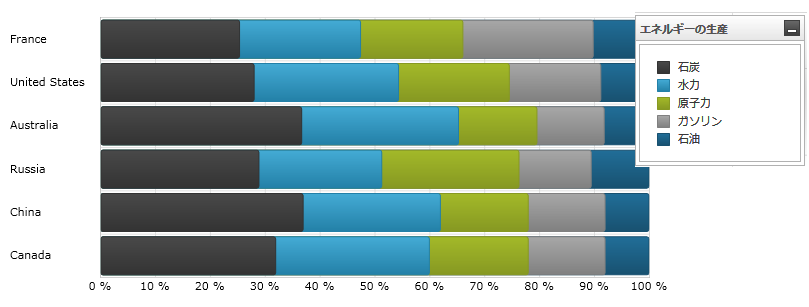
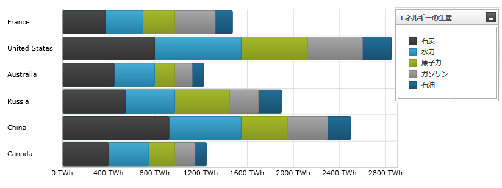

////

|metadata|
{
    "name": "datachart-category-stacked-100-bar-series",
    "controlName": ["{DataChartName}"],
    "tags": ["Charting","Data Presentation","Getting Started","How Do I"],
    "guid": "7ac79938-575c-48a7-92c6-fcfde191faa6",  
    "buildFlags": ["wpf","win-universal","ANDROID","WINFORMS"],
    "createdOn": "2014-06-05T19:39:00.4332893Z"
}
|metadata|
////

= 積層型 100 棒シリーズ

このトピックは、コード例を示して、 link:{DataChartLink}.stacked100barseries.html[Stacked100BarSeries] を link:{DataChartLink}.{DataChartName}.html[{DataChartName}]™ コントロールで使用する方法を説明します。

== 概要

トピックは以下のとおりです。

* <<Introduction,概要>>
* <<SeriesPreview,シリーズ プレビュー>>
* <<SeriesRecommendations,シリーズの提案>>
* <<DataRequirements,データ要件>>
* <<DataRenderingRules,データ描画の規則>>
* <<Examples,コード例>>
* <<RelatedContent,関連コンテンツ>>

[[Introduction]]
== 概要

積層型 100 棒シリーズは link:datachart-category-series-overview.html[カテゴリ シリーズ] に属しており、それぞれの隣に積層された短形のコレクション (StackedFragmentSeries) を用いて描画されます。コレクションのそれぞれの積層フラグメントは各積層の視覚的な要素を表します。各積層は正の値と負の値の両方を含みます。正の値はいずれも x 軸の正の側にグループ化され、負の値は x 軸の負の側にグループ化されます。link:{DataChartLink}.stacked100barseries.html[Stacked100BarSeries] は y 軸の値の処理を除いたすべての面で link:{DataChartLink}.stackedbarseries.html[StackedBarSeries] と同じです。データを直接表現する代わりに、 link:{DataChartLink}.stacked100barseries.html[Stacked100BarSeries] はデータ ポイント内のすべての値の合計のパーセントに関するデータを表します。さらに、積層型 100 棒シリーズは積層型 100 柱状シリーズと同じデータプロットの概念を使用していますが、データ ポイントは縦の線 (y 軸) に沿ってではなく、横の線 (x 軸) に沿って積層されます。言い換えると、 link:{DataChartLink}.stacked100barseries.html[Stacked100BarSeries] は link:{DataChartLink}.stacked100columnseries.html[Stacked100ColumnSeries] のように描画されますが、時計周りに 90 度回転されます。シリーズの他のタイプと軸のタイプを含んだより概念的情報は、link:datachart-category-series-overview.html[カテゴリ シリーズ]とlink:datachart-axes.html[チャート軸]トピックを参照してください。

[[SeriesPreview]]
== シリーズ プレビュー

図 1 と 2 は、 link:{DataChartLink}.stacked100barseries.html[Stacked100BarSeries] と link:{DataChartLink}.stackedbarseries.html[StackedBarSeries] が {DataChartName} コントロール内でプロットされた時にどのように見えるかを示しています。

図 1: link:{DataChartLink}.stacked100barseries.html[Stacked100BarSeries] タイプの実装例。

図 2: link:{DataChartLink}.stackedbarseries.html[StackedBarSeries] タイプの実装例

[[SeriesRecommendations]]
== シリーズの提案

{DataChartName} はシリーズのタイプ数に制限なくプロットできますが、積層型 100 棒シリーズは同種のシリーズで使用することを推奨します。積層型 100 棒シリーズで推奨されるシリーズのタイプおよび複数シリーズのプロット方法に関する情報は、 link:datachart-multiple-series.html[複数シリーズ] トピックを参照してください。

[[DataRequirements]]
== データ要件

{DataChartName} コントロールによって固有のデータ モデルにチャートを簡単にバインドすることができますが、そのシリーズが必要とするデータの適切な量とタイプを必ず提供するようにしてください。使用しているシリーズのタイプに基づいた最小要件をデータが満たさないと、コントロールによってエラーが生成されます。データ シリーズの要件についての詳細は、 link:datachart-series-requirements.html[シリーズ要件] と link:datachart-category-series-overview.html[カテゴリ シリーズ] を参照してください。

以下は、 link:{DataChartLink}.stacked100barseries.html[Stacked100BarSeries] タイプのデータ要件のリストです。

* データ モデルには少なくとも 1 つの数値データ列を含む必要があります。各 link:{DataChartLink}.stacked100barseries.html[Stacked100BarSeries] の棒が 2 つ以上の積層したフラグメントを持つように、データ モデルが 2 つ以上の数値データ列を含むことが推奨されます。
* データ モデルにはラベルのためのオプションの文字列または日時フィールドを含むことができます。

[[DataRenderingRules]]
== データ描画の規則

積層型 100 棒シリーズは以下の規則を使用してデータを描画します。

* 描画したいデータ モデルの各数値列に対し、 link:{DataChartLink}.stacked100barseries.html[Stacked100BarSeries] のシリーズ コレクション プロパティに StackedFragmentSeries を追加する必要があります。
* データ モデルの各行は単一の積層型棒を表します。セクションは、 StackedFragmentSeries オブジェクトの ValueMemberPath プロパティにマップされたデータ モデル内の列に基づいて作成されます。
* 行の 2 番目の値が描画された時、その値はその行の前の値の点に追加されます。この結果、チャートの上方に描画される各点は、その点での累積合計です。
* 行内のデータ値の合計を使用して棒の各セクションに適用可能なパーセントを計算するため、データ値はパーセントである必要はありません。
* y 軸上のデータ マッピングの Label プロパティにマップされる文字列または日時の列はカテゴリ ラベルとして使用されます。Label のデータ マッピングが指定されない場合、デフォルト ラベルが使用されます。
* カテゴリ ラベルは y 軸上に描かれます。データ値は x 軸上に描かれます。
* 描画する時、 link:{DataChartLink}.stacked100barseries.html[Stacked100BarSeries] タイプの複数シリーズは、各クラスターがデータ ポイントを表すクラスターに描画されます。{DataChartName} コントロールの Series コレクションの最初の積層型 100 棒シリーズは、クラスターの下に棒として描画されます。各連続するシリーズは、前のシリーズの上に描画されます。この機能の詳細は、 link:datachart-multiple-series.html[複数シリーズ]のトピックを参照してください。

[[Examples]]
== コード例

== データ バインディング

以下のコードは、 link:{DataChartLink}.stacked100barseries.html[Stacked100BarSeries] オブジェクトをカテゴリ データ サンプル (link:resources-sample-energy-data.html[エネルギー製造データ サンプル]からダウンロード可能) にバインドする方法を示します。Stacked100BarSeries のデータ要件に関する情報は、このトピックのデータ要件セクションを参照してください。

ifdef::sl,wpf,win-universal[]

*XAML の場合:*

----
xmlns:local="clr-namespace:[DATA_MODEL_NAMESPACE]"
----

endif::sl,wpf,win-universal[]

ifdef::sl,wpf,win-universal[]

*XAML の場合:*

----
<ig:{DataChartName} x:Name="DataChart" >
    <ig:{DataChartName}.Resources>
        <local:EnergyProductionDataSample x:Key="energyProdData" />
    </ig:{DataChartName}.Resources>
    <ig:{DataChartName}.Axes>
        <ig:NumericXAxis x:Name="XAxis" MinimumValue="0" Label="{}{} %" />
        <ig:CategoryYAxis x:Name="YAxis" ItemsSource="{StaticResource energyProdData}" Label="{}{Country}" />
    </ig:{DataChartName}.Axes>
    <ig:{DataChartName}.Series>
    <!-- ========================================================================== -->
        <ig:Stacked100BarSeries XAxis="{Binding ElementName=XAxis}" 
                                YAxis="{Binding ElementName=YAxis}" 
                                ItemsSource="{StaticResource energyProdData}">
            <ig:Stacked100BarSeries.Series>
                <ig:StackedFragmentSeries ValueMemberPath="Coal" Title="Coal" />
                <ig:StackedFragmentSeries ValueMemberPath="Hydro" Title="Hydro" />
                <ig:StackedFragmentSeries ValueMemberPath="Nuclear" Title="Nuclear" />
                <ig:StackedFragmentSeries ValueMemberPath="Gas" Title="Gas" />
                <ig:StackedFragmentSeries ValueMemberPath="Oil" Title="Oil" />
            </ig:Stacked100BarSeries.Series>
        </ig:Stacked100BarSeries>
    </ig:{DataChartName}.Series>
    <!-- ========================================================================== -->
</ig:{DataChartName}>
----

endif::sl,wpf,win-universal[]

ifdef::sl,wpf,win-forms,win-universal[]

*Visual Basic の場合:*

[source]
----
Dim dataSample As New EnergyProductionDataSample()
Dim xAxis As New NumericXAxis()
Dim yAxis As New CategoryYAxis()
xAxis.DataSource = dataSample
xAxis.Label = "Country"
xAxis.ItemsSource = dataSample
xAxis.Label = "{Country}"
Me.DataChart.Axes.Add(xAxis)
Me.DataChart.Axes.Add(yAxis)
' create a stack fragment for each numeric column in your data
Dim seriesFragment As New StackedFragmentSeries()
seriesFragment.ValueMemberPath = "Coal"
seriesFragment.Title = "Coal"
' ...
Dim series As New Stacked100BarSeries()
series.ItemsSource = dataSample
series.DataSource = dataSample
series.XAxis = xAxis
series.YAxis = yAxis
' add all stack fragments to the series
series.Series.Add(seriesFragment)
' ...
Me.DataChart.Series.Add(series)
----

endif::sl,wpf,win-forms,win-universal[]

ifdef::sl,wpf,win-forms,win-universal[]

*C# の場合:*

[source]
----
EnergyProductionDataSample dataSample = new EnergyProductionDataSample(); 
NumericXAxis xAxis = new NumericXAxis();
CategoryYAxis yAxis = new CategoryYAxis();
xAxis.DataSource = dataSample;
xAxis.Label = "Country";
xAxis.ItemsSource = dataSample;
xAxis.Label = "{Country}";
this.DataChart.Axes.Add(xAxis);
this.DataChart.Axes.Add(yAxis);
// データ中の各数値列の積層フラグメントを作成
StackedFragmentSeries seriesFragment = new StackedFragmentSeries();
seriesFragment.ValueMemberPath = "Coal";
seriesFragment.Title = "Coal";
// ...
Stacked100BarSeries series = new Stacked100BarSeries();
series.ItemsSource = dataSample;
series.DataSource = dataSample;
series.XAxis = xAxis;
series.YAxis = yAxis;
// シリーズの全積層フラグメントを追加
series.Series.Add(seriesFragment);
// ...
this.DataChart.Series.Add(series);
----

endif::sl,wpf,win-forms,win-universal[]

ifdef::android[]

*Java の場合:*

[source,js]
----
EnergyProductionDataSample data = new EnergyProductionDataSample();
DataChartView chart = new DataChartView(rootView.getContext());
NumericXAxis xAxis = new NumericXAxis();
CategoryYAxis yAxis = new CategoryYAxis();
yAxis.setDataSource(data);
yAxis.setLabel("Country");
// データ中の各数値列の積層フラグメントを作成
StackedFragmentSeries seriesFragment = new StackedFragmentSeries();
seriesFragment.setValueMemberPath("Coal");
seriesFragment.setTitle("Coal");
// ...
Stacked100BarSeries series = new Stacked100BarSeries();
series.setDataSource(data);
series.setXAxis(xAxis);
series.setYAxis(yAxis);
// シリーズの全積層フラグメントを追加
series.addSeries(seriesFragment);
chart.addAxis(xAxis);
chart.addAxis(yAxis);
chart.addSeries(series);
----

endif::android[]

[[RelatedContent]]
== 関連コンテンツ

link:datachart-axes.html[軸]

link:datachart-category-bar-series.html[棒シリーズ]

link:datachart-category-stacked-bar-series.html[積層型棒シリーズ]

link:datachart-category-series-overview.html[カテゴリ シリーズ]

link:datachart-series-requirements.html[シリーズ要件]