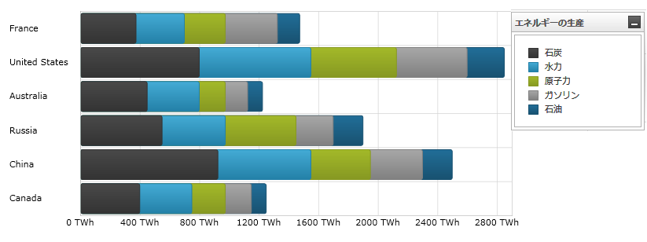

////

|metadata|
{
    "name": "datachart-category-stacked-column-series",
    "controlName": ["{DataChartName}"],
    "tags": ["Charting","Data Presentation","Getting Started","How Do I"],
    "guid": "fec59340-0c45-49f2-bc7b-231b760c2ead",  
    "buildFlags": ["WINFORMS","wpf","win-universal","ANDROID"],
    "createdOn": "2014-06-05T19:39:00.4132804Z"
}
|metadata|
////

= 積層型柱状シリーズ

このトピックは、コード例を示して、 link:{DataChartLink}.stackedcolumnseries.html[StackedColumnSeries] を link:{DataChartLink}.{DataChartName}.html[{DataChartName}]™ コントロールで使用する方法を説明します。

== 概要

トピックは以下のとおりです。

* <<Introduction,概要>>
* <<SeriesPreview,シリーズ プレビュー>>
* <<SeriesRecommendations,シリーズの提案>>
* <<DataRequirements,データ要件>>
* <<DataRenderingRules,データ描画の規則>>
* <<Examples,コード例>>
* <<RelatedContent,関連コンテンツ>>

[[Introduction]]
== 概要

積層型柱状シリーズはlink:datachart-category-series-overview.html[カテゴリ シリーズ]に属しており、それぞれの上に積層された短形のコレクション (StackedFragmentSeries) を用いて描画されます。コレクションのそれぞれの積層フラグメントは各積層の視覚的な要素を表します。各積層は正の値と負の値の両方を含みます。正の値はいずれも y 軸の正の側にグループ化され、負の値は y 軸の負の側にグループ化されます。積層型柱状シリーズは積層型棒シリーズと同じデータプロットの概念を使用していますが、データ ポイントは横の線 (x 軸) に沿ってではなく、縦の線 (y 軸) に沿って積層されます。言い換えれば、 link:{DataChartLink}.stackedcolumnseries.html[StackedColumnSeries] は反時計回りに 90 度回転して link:{DataChartLink}.stackedbarseries.html[StackedBarSeries] のように描画されます。シリーズの他のタイプと軸のタイプを含んだより概念的情報は、link:datachart-category-series-overview.html[カテゴリ シリーズ]とlink:datachart-axes.html[チャート軸]トピックを参照してください。

[[SeriesPreview]]
== シリーズ プレビュー

図 1 と 2 は、 link:{DataChartLink}.stackedcolumnseries.html[StackedColumnSeries] と link:{DataChartLink}.stackedbarseries.html[StackedBarSeries] が {DataChartName} コントロール内でプロットされた時にどのように見えるかを示しています。

image::images/Stacked_Column_Series__01.png[]

図 1: link:{DataChartLink}.stackedcolumnseries.html[StackedColumnSeries] タイプの実装例

図 2: link:{DataChartLink}.stackedbarseries.html[StackedBarSeries] タイプの実装例

[[SeriesRecommendations]]
== シリーズの提案

{DataChartName} はシリーズのタイプ数に制限なくプロットできますが、積層型柱状シリーズは同種のシリーズで使用することを推奨します。積層型柱状シリーズで推奨されるシリーズのタイプおよびスプライン エリア シリーズのプロット方法についての情報は link:datachart-multiple-series.html[複数シリーズ]のトピックを参照してください。

[[DataRequirements]]
== データ要件

{DataChartName} コントロールによって固有のデータ モデルにチャートを簡単にバインドすることができますが、そのシリーズが必要とするデータの適切な量とタイプを必ず提供するようにしてください。使用しているシリーズのタイプに基づいた最小要件をデータが満たさないと、コントロールによってエラーが生成されます。データ シリーズの要件についての詳細は、 link:datachart-series-requirements.html[シリーズ要件] と link:datachart-category-series-overview.html[カテゴリ シリーズ] を参照してください。

以下は、 link:{DataChartLink}.stackedcolumnseries.html[StackedColumnSeries] タイプのデータ要件のリストです。

* データ モデルには少なくとも 1 つの数値データ列を含む必要があります。各 link:{DataChartLink}.stackedcolumnseries.html[StackedColumnSeries] の列が 2 つ以上の積層したフラグメントを持つようにデータ モデルが 2 つ以上の数値データ列を含むことが推奨されます。
* データ モデルにはラベルのためのオプションの文字列または日時フィールドを含むことができます。

[[DataRenderingRules]]
== データ描画の規則

積層型柱状シリーズは以下の規則を使用してデータを描画します。

* 描画したいデータ モデルの各数値列に対し、 link:{DataChartLink}.stackedcolumnseries.html[StackedColumnSeries] のシリーズ コレクション プロパティに StackedFragmentSeries を追加する必要があります。
* データ モデルの各行は単一の積層型柱状を表します。セクションは、 StackedFragmentSeries オブジェクトの ValueMemberPath プロパティにマップされたデータ モデル内の列に基づいて作成されます。
* 行の 2 番目の値が描画された時、その値はその行の前の値の点に追加されます。この結果、チャートの上方に描画される各点は、その点での累積合計です。
* x 軸上のデータ マッピングの Label プロパティにマップされる文字列または日時の列はカテゴリ ラベルとして使用されます。Label のデータ マッピングが指定されない場合、デフォルト ラベルが使用されます。
* カテゴリ ラベルは x 軸上に描かれます。データ値は y 軸上に描かれます。
* 描画する時、 link:{DataChartLink}.stackedcolumnseries.html[StackedColumnSeries] の複数シリーズは各クラスターがデータ ポイントを表すクラスターに描画されます。{DataChartName} コントロールの Series コレクションの最初の積層型柱状シリーズは、クラスターの左に柱状として描画されます。各連続するシリーズは、前のシリーズの右側に描画されます。この機能の詳細は、 link:datachart-multiple-series.html[複数シリーズ]のトピックを参照してください。

[[Examples]]
== コード例

== データ バインディング

以下のコード スニペットは、 link:{DataChartLink}.stackedcolumnseries.html[StackedColumnSeries] オブジェクトをカテゴリ データ サンプル (link:resources-sample-energy-data.html[エネルギー製造データ サンプル]からダウンロード可能) にバインドする方法を示します。StackedColumnSeries のデータ要件の詳細な情報はこのトピックのデータ要件セクションを参照してください。

ifdef::sl,wpf,win-universal[]

*XAML の場合:*

----
xmlns:local="clr-namespace:[DATA_MODEL_NAMESPACE]"
----

endif::sl,wpf,win-universal[]

ifdef::sl,wpf,win-universal[]

*XAML の場合:*

----
<ig:{DataChartName} x:Name="DataChart" >
    <ig:{DataChartName}.Resources>
        <local:EnergyProductionDataSample x:Key="energyProdData" />
    </ig:{DataChartName}.Resources>
    <ig:{DataChartName}.Axes>
        <ig:NumericYAxis x:Name="YAxis" MinimumValue="0" Interval="400" Label="{}{} TWh" />
        <ig:CategoryXAxis x:Name="XAxis" ItemsSource="{StaticResource energyProdData}" Label="{}{Country}" />
    </ig:{DataChartName}.Axes>
    <ig:{DataChartName}.Series>
    <!-- ========================================================================== -->
        <ig:StackedColumnSeries XAxis="{Binding ElementName=XAxis}" 
                                YAxis="{Binding ElementName=YAxis}" 
                                ItemsSource="{StaticResource energyProdData}">
            <ig:StackedColumnSeries.Series>
                <ig:StackedFragmentSeries ValueMemberPath="Coal" Title="Coal" />
                <ig:StackedFragmentSeries ValueMemberPath="Hydro" Title="Hydro" />
                <ig:StackedFragmentSeries ValueMemberPath="Nuclear" Title="Nuclear" />
                <ig:StackedFragmentSeries ValueMemberPath="Gas" Title="Gas" />
                <ig:StackedFragmentSeries ValueMemberPath="Oil" Title="Oil" />
            </ig:StackedColumnSeries.Series>
        </ig:StackedColumnSeries>
    </ig:{DataChartName}.Series>
    <!-- ========================================================================== -->
</ig:{DataChartName}>
----

endif::sl,wpf,win-universal[]

ifdef::sl,wpf,win-forms,win-universal[]

*Visual Basic の場合:*

[source]
----
Dim dataSample As New EnergyProductionDataSample()
Dim yAxis As New NumericYAxis()
Dim xAxis As New CategoryXAxis()
xAxis.DataSource = dataSample
xAxis.Label = "Country"
xAxis.ItemsSource = dataSample
xAxis.Label = "{Country}"
Me.DataChart.Axes.Add(xAxis)
Me.DataChart.Axes.Add(yAxis)
‘ create a stack fragment for each numeric column in your data
Dim seriesFragment As New StackedFragmentSeries()
seriesFragment.ValueMemberPath = "Coal"
seriesFragment.Title = "Coal"
...
Dim series As New StackedColumnSeries()
series.ItemsSource = dataSample
series.DataSource = dataSample
series.XAxis = xAxis
series.YAxis = yAxis
‘ add all stack fragments to the series
series.Series.Add(seriesFragment)
...
Me.DataChart.Series.Add(series)
----

endif::sl,wpf,win-forms,win-universal[]

ifdef::sl,wpf,win-forms,win-universal[]

*C# の場合:*

[source]
----
EnergyProductionDataSample dataSample = new EnergyProductionDataSample(); 
NumericYAxis yAxis = new NumericYAxis();
CategoryXAxis xAxis = new CategoryXAxis();
xAxis.DataSource = dataSample;
xAxis.Label = "Country";
xAxis.ItemsSource = dataSample;
xAxis.Label = "{Country}";
this.DataChart.Axes.Add(xAxis);
this.DataChart.Axes.Add(yAxis);
// データ中の各数値列の積層フラグメントを作成
StackedFragmentSeries seriesFragment = new StackedFragmentSeries();
seriesFragment.ValueMemberPath = "Coal";
seriesFragment.Title = "Coal";
...
StackedColumnSeries series = new StackedColumnSeries();
series.ItemsSource = dataSample;
series.DataSource = dataSample;
series.XAxis = xAxis;
series.YAxis = yAxis;
// シリーズの全積層フラグメントを追加
series.Series.Add(seriesFragment);
...
this.DataChart.Series.Add(series);
----

endif::sl,wpf,win-forms,win-universal[]

ifdef::android[]

*Java の場合:*

[source,js]
----
EnergyProductionDataSample data = new EnergyProductionDataSample();
DataChartView chart = new DataChartView(rootView.getContext());
NumericYAxis yAxis = new NumericYAxis();
CategoryXAxis xAxis = new CategoryXAxis();
xAxis.setDataSource(data);
xAxis.setLabel("Country");
// データ中の各数値列の積層フラグメントを作成
StackedFragmentSeries seriesFragment = new StackedFragmentSeries();
seriesFragment.setValueMemberPath("Coal");
seriesFragment.setTitle("Coal");
// ...
StackedColumnSeries series = new StackedColumnSeries();
series.setDataSource(data);
series.setXAxis(xAxis);
series.setYAxis(yAxis);
// シリーズの全積層フラグメントを追加
series.addSeries(seriesFragment);
----

endif::android[]

[[RelatedContent]]
== 関連コンテンツ

link:datachart-axes.html[軸]

link:datachart-category-column-series.html[柱状シリーズ]

link:datachart-category-stacked-100-column-series.html[積層 100-列シリーズ]

link:datachart-category-series-overview.html[カテゴリ シリーズ]

link:datachart-series-requirements.html[シリーズ要件]