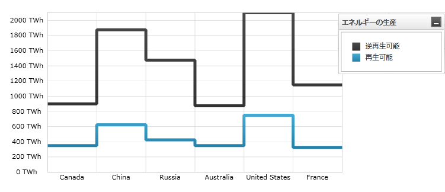
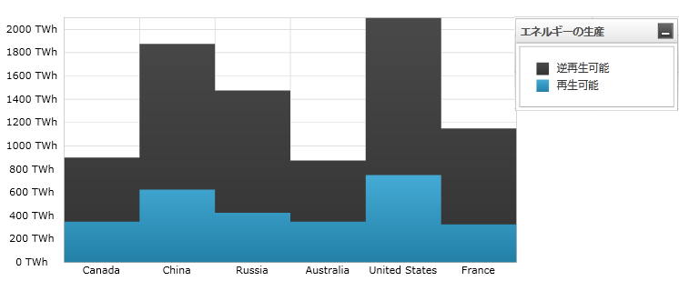

////

|metadata|
{
    "name": "datachart-category-step-line-series",
    "controlName": ["{DataChartName}"],
    "tags": ["Application Scenarios","Charting","How Do I"],
    "guid": "b1eb35d3-40a6-4179-b757-6bb739cb360f",  
    "buildFlags": [],
    "createdOn": "2014-06-05T19:39:00.4272867Z"
}
|metadata|
////

= ステップ折れ線シリーズ

このトピックは、コード例を示して、 link:{DataChartLink}.steplineseries.html[StepLineSeries] を link:{DataChartLink}.{DataChartName}.html[{DataChartName}]™ コントロールで使用する方法を説明します。

== 概要

トピックは以下のとおりです。

* <<Introduction,概要>>
* <<SeriesPreview,シリーズ プレビュー>>
* <<SeriesRecommendations,シリーズの提案>>
* <<DataRequirements,データ要件>>
* <<DataRenderingRules,データ描画の規則>>
* <<DataBindingExample,データ バインディング例>>
* <<RelatedContent,関連コンテンツ>>

[[Introduction]]
== 概要

ステップ ライン シリーズは link:datachart-category-series-overview.html[カテゴリ シリーズ]グループに属し、連続する垂直線および水平線でつながるポイントのコレクションを使用して描画され、ステップ状の進捗を形成します。値は Y 軸 (NumericYAxis) に表され、カテゴリは X 軸 (CategoryXAxis または CategoryDateTimeXAxis) に表示されます。ステップ ライン シリーズは時間毎のデータの変化や複数の項目を比較する場合に用いられます。link:{DataChartLink}.steplineseries.html[StepLineSeries]は、ステップライン下の領域が塗りつぶされるという点を除いてすべての面で link:{DataChartLink}.stepareaseries.html[StepAreaSeries] と同じです。概念的な情報、その他のシリーズ タイプの理解、およびサポートされる軸のタイプについては、「 link:datachart-category-series-overview.html[カテゴリ シリーズ]」および「 link:datachart-axes.html[チャート軸]」のトピックを参照してください。

[[SeriesPreview]]
== シリーズ プレビュー

図 1 および図 2 は、{DataChartName} コントロールでプロットされる際に、link:{DataChartLink}.steplineseries.html[StepLineSeries] と link:{DataChartLink}.stepareaseries.html[StepAreaSeries] がどのように表示されるのかを示します。

図 1: link:{DataChartLink}.steplineseries.html[StepLineSeries] タイプの実装例

図 2: link:{DataChartLink}.stepareaseries.html[StepAreaSeries] タイプの実装例

[[SeriesRecommendations]]
== シリーズの提案

{DataChartName} は無数の各種シリーズ タイプのプロットをサポートしますが、同様のシリーズ タイプでステップ ライン シリーズを使用することをお勧めします。ステップ折れ線シリーズで推奨されるシリーズのタイプ、および複数のシリーズ タイプのプロット方法に関する情報は、 link:datachart-multiple-series.html[複数シリーズ]のトピックを参照してください。

[[DataRequirements]]
== データ要件

{DataChartName} コントロールによって固有のデータ モデルに簡単にバインドできますが、そのシリーズが必要とするデータの適切な量とタイプを提供することが重要です。使用しているシリーズのタイプに基づいた最小要件をデータが満たさないと、コントロールによってエラーが生成されます。データ シリーズの要件についての詳細は、 link:datachart-series-requirements.html[シリーズ要件]とlink:datachart-category-series-overview.html[カテゴリ シリーズ]を参照してください。

以下は、`StepLineSeries` のデータ要件のリストです。

* データ モデルには少なくとも 1 つの数値プロパティを含む必要があります。
* データ モデルにはラベルのためのオプションの文字列または日時プロパティを含むことができます。
* データソースに少なくとも 1 つのデータ項目を含む必要があります。

[[DataRenderingRules]]
== データ描画の規則

`StepLineSeries` は以下の規則を使用してデータを描画します。

* データ マッピングの link:{DataChartLink}.AnchoredCategorySeries{ApiProp}ValueMemberPath.html[ValueMemberPath] プロパティとして指定されるデータ列内の各行は、別の水平線と垂直線で結ばれる水平線としてプロットされ、ステップ状の進捗をチャート上に形成します。
* x 軸上のデータ マッピングの `Label` プロパティにマップされる文字列または日時の列はカテゴリ ラベルとして使用されます。`Label` のデータ マッピングが指定されない場合、デフォルト ラベルが使用されます。
* カテゴリ ラベルは x 軸上に描かれます。データ値は y 軸上に描かれます。
* 描画時、`StepLineSeries` タイプの複数シリーズはレイヤーで描画され、それぞれの連続するシリーズは、{DataChartName} コントロールのシリーズ コレクション内の 1 つ前のものの前面で描画されます。この機能の詳細は、link:datachart-multiple-series.html[複数シリーズ]のトピックを参照してください。

[[DataBindingExample]]
== データ バインディング例

以下のコード スニペットは、link:{DataChartLink}.steplineseries.html[StepLineSeries] オブジェクトをカテゴリ データ サンプル (link:resources-sample-energy-data.html[エネルギー製造データ サンプル]からダウンロード可能) にバインドする方法を示します。StepLineSeries のデータ要件に関する情報は、このトピックのデータ要件セクションを参照してください。

ifdef::sl,wpf,win-universal[]

*XAML の場合:*
[source,xaml]
----
xmlns:local="clr-namespace:Infragistics.Models;assembly=YourAppName"
...
<ig:{DataChartName} x:Name="DataChart" >
    <ig:{DataChartName}.Resources>
        <local:EnergyDataSource x:Key="data" />
    </ig:{DataChartName}.Resources>
    <ig:{DataChartName}.Axes>
        <ig:NumericYAxis x:Name="YAxis"  />
        <ig:CategoryXAxis x:Name="XAxis" ItemsSource="{StaticResource data}" 
                          Label="{}{Country}" />
    </ig:{DataChartName}.Axes>
    <ig:{DataChartName}.Series>
        <ig:StepLineSeries ItemsSource="{StaticResource data}" 
                           ValueMemberPath="NonRenewable" Title="Non-Renewable" 
                           XAxis="{Binding ElementName=XAxis}"
                           YAxis="{Binding ElementName=YAxis}">
        </ig:StepLineSeries>
        <ig:StepLineSeries ItemsSource="{StaticResource data}" 
                           ValueMemberPath="Renewable" Title="Renewable" 
                           XAxis="{Binding ElementName=XAxis}"
                           YAxis="{Binding ElementName=YAxis}">
        </ig:StepLineSeries>
        </ig:StepLineSeries>
    </ig:{DataChartName}.Series>
</ig:{DataChartName}>
----
endif::sl,wpf,win-universal[]

ifdef::xamarin[]
*XAML の場合:*
[source,xaml]
----
xmlns:local="clr-namespace:Infragistics.Models;assembly=YourAppName"
...
<ig:{DataChartName} x:Name="DataChart" >
    <ig:{DataChartName}.Resources>
        <ResourceDictionary>
			<local:EnergyDataSource x:Key="data" />
		</ResourceDictionary>
    </ig:{DataChartName}.Resources>
    <ig:{DataChartName}.Axes>
        <ig:NumericYAxis x:Name="YAxis"  />
        <ig:CategoryXAxis x:Name="XAxis" ItemsSource="{StaticResource data}" 
                          Label="Country" />
    </ig:{DataChartName}.Axes>
    <ig:{DataChartName}.Series>
        <ig:StepLineSeries ItemsSource="{StaticResource data}" 
                           ValueMemberPath="NonRenewable" Title="Non-Renewable" 
                           XAxis="{x:Reference XAxis}" 
                           YAxis="{x:Reference YAxis}">
        </ig:StepLineSeries>
        <ig:StepLineSeries ItemsSource="{StaticResource data}" 
                           ValueMemberPath="NonRenewable" Title="Non-Renewable" 
                           XAxis="{x:Reference XAxis}" 
                           YAxis="{x:Reference YAxis}">
        </ig:StepLineSeries>
    </ig:{DataChartName}.Series>
</ig:{DataChartName}>
----
endif::xamarin[]

ifdef::wpf,win-universal,win-forms,xamarin[]

*C# の場合:*

[source,csharp]
----
var data = new EnergyDataSource(); 
var yAxis = new NumericYAxis();
var xAxis = new CategoryXAxis();
xAxis.{ApiDataSource} = data;
xAxis.Label = "{Country}";

var series1 = new StepLineSeries();
series1.{ApiDataSource} = data;
series1.ValueMemberPath = "NonRenewable";
series1.Title = "Non-Renewable";
series1.XAxis = xAxis;
series1.YAxis = yAxis;
var series2 = new StepLineSeries();
series2.{ApiDataSource} = data;
series2.ValueMemberPath = "Renewable";
series2.Title = "Renewable";
series2.XAxis = xAxis;
series2.YAxis = yAxis;
var chart = new {DataChartName}();
chart.Axes.Add(xAxis);
chart.Axes.Add(yAxis);
chart.Series.Add(series1);
chart.Series.Add(series2);
----
endif::wpf,win-universal,win-forms,xamarin[]

ifdef::wpf,win-universal,win-forms[]

*Visual Basic の場合:*

[source,vb]
----
Dim data As New EnergyDataSource()
Dim yAxis As New NumericYAxis()
Dim xAxis As New CategoryXAxis()
xAxis.{ApiDataSource} = data
xAxis.Label = "{Country}"

Dim series1 As New StepLineSeries()
series1.{ApiDataSource} = data
series1.ValueMemberPath = "NonRenewable"
series1.Title = "Non-Renewable"
series1.XAxis = xAxis
series1.YAxis = yAxis
Dim series2 As New StepLineSeries()
series2.{ApiDataSource} = data
series2.ValueMemberPath = "Renewable"
series2.Title = "Renewable"
series2.XAxis = xAxis
series2.YAxis = yAxis
Dim chart As New {DataChartName}()
chart.Axes.Add(xAxis)
chart.Axes.Add(yAxis)
chart.Series.Add(series1)
chart.Series.Add(series2)
----
endif::wpf,win-universal,win-forms[]

ifdef::android[]

*Java の場合:*

[source,js]
----
EnergyDataSource data = new EnergyDataSource();
NumericYAxis yAxis = new NumericYAxis();
CategoryXAxis xAxis = new CategoryXAxis();
xAxis.setDataSource(data);
xAxis.setLabel("Country");

StepLineSeries series1 = new StepLineSeries();
series1.setDataSource(data);
series1.setValueMemberPath("NonRenewable");
series1.setTitle("Non-Renewable");
series1.setXAxis(xAxis);
series1.setYAxis(yAxis);
StepLineSeries series2 = new StepLineSeries();
series2.setDataSource(data);
series2.setValueMemberPath("Renewable");
series2.setTitle("Renewable");
series2.setXAxis(xAxis);
series2.setYAxis(yAxis);
DataChartView chart = new DataChartView(rootView.getContext());
chart.addAxis(xAxis);
chart.addAxis(yAxis);
chart.addSeries(series1);
chart.addSeries(series2);
----

endif::android[]

[[RelatedContent]]
== 関連コンテンツ

link:datachart-axes.html[軸]

link:datachart-category-series-overview.html[カテゴリ シリーズ]

link:datachart-category-step-area-series.html[ステップ エリア シリーズ]

link:datachart-series-requirements.html[シリーズ要件]