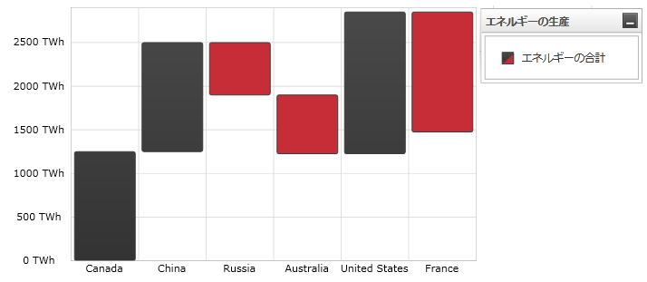

////

|metadata|
{
    "name": "datachart-category-waterfall-series",
    "controlName": ["{DataChartName}"],
    "tags": ["Application Scenarios","Charting","How Do I"],
    "guid": "f9c350d3-9dc2-46da-b669-8005c46fb800",  
    "buildFlags": [],
    "createdOn": "2014-06-05T19:39:00.4292878Z"
}
|metadata|
////

= ウォーターフォール シリーズ

このトピックは、コード例を示して、WaterfallSeries を link:{DataChartLink}.{DataChartName}.html[{DataChartName}] コントロールで使用する方法を説明します。

== 概要

トピックは以下のとおりです。

* <<Introduction,概要>>
* <<SeriesPreview,シリーズ プレビュー>>
* <<SeriesRecommendations,シリーズの提案>>
* <<DataRequirements,データ要件>>
* <<DataRenderingRules,データ描画の規則>>
* <<DataBindingExample,データ バインディング例>>
* <<RelatedContent,関連コンテンツ>>

[[Introduction]]
== 概要

ウォーターフォール シリーズはlink:datachart-category-series-overview.html[カテゴリ シリーズ]グループに属し、連続するデータ ポイント間の差を示す垂直列のコレクションを使用して描画されます。列は色でコード化され、値が正の変化であるか負の変化であるかを区別します。値は Y 軸 (NumericYAxis) に表され、カテゴリは X 軸 (CategoryXAxis または CategoryDateTimeXAxis) に表示されます。WaterfallSeries は、外観が範囲柱状シリーズに似ていますが、各データ ポイントに必要な数値データ列は 2 つでなく 1 つのみです。シリーズの他のタイプと軸のタイプを含んだより概念的情報は、link:datachart-category-series-overview.html[カテゴリ シリーズ]とlink:datachart-axes.html[チャート軸]トピックを参照してください。

[[SeriesPreview]]
== シリーズ プレビュー

図 1 は、{DataChartName} コントロールにプロットされた時に WaterfallSeries がどのように表示されるのかを示します。

図 1: WaterfallSeries タイプの実装例

[[SeriesRecommendations]]
== シリーズの提案

{DataChartName} は無数の各種シリーズ タイプのプロットをサポートしますが、同様のシリーズ タイプのウォーターフォール シリーズを使用することをお勧めします。ウォーターフォール シリーズで推奨されるシリーズのタイプ、および複数のシリーズ タイプのプロット方法に関する情報は、link:datachart-multiple-series.html[複数シリーズ]のトピックを参照してください。

[[DataRequirements]]
== データ要件

{DataChartName} コントロールによって固有のデータ モデルにチャートを簡単にバインドすることができますが、そのシリーズが必要とするデータの適切な量とタイプを必ず提供するようにしてください。使用しているシリーズのタイプに基づいた最小要件をデータが満たさないと、コントロールによってエラーが生成されます。データ シリーズの要件についての詳細は、 link:datachart-series-requirements.html[シリーズ要件]とlink:datachart-category-series-overview.html[カテゴリ シリーズ] を参照してください。

以下は、`WaterfallSeries` タイプのデータ要件のリストです。

* データ モデルには少なくとも 1 つの数値データ列を含む必要があります。
* データ モデルにはラベルのためのオプションの文字列または日時フィールドを含むことができます。

[[DataRenderingRules]]
== データ描画の規則

`WaterfallSeries` シリーズは以下の規則を使用してデータを描画します。

* データ マッピングの link:{DataChartLink}.AnchoredCategorySeries{ApiProp}ValueMemberPath.html[ValueMemberPath] プロパティとして指定されるデータ列内の各行は、データ モデル内の現在の行と過去の行の差を表す個別の垂直列として描画されます。
* x 軸上のデータ マッピングの `Label` プロパティにマップされる文字列または日時の列はカテゴリ ラベルとして使用されます。`Label` のデータ マッピングが指定されない場合、デフォルト ラベルが使用されます。
* カテゴリ ラベルは x 軸上に描かれます。データ値は y 軸上に描かれます。
* 描画する時、`WaterfallSeries` タイプの複数のシリーズは各クラスターがデータ ポイントを表すクラスターに描画されます。{DataChartName} コントロールのシリーズ コレクションの最初のシリーズは、クラスターの左側に列として描画されます。各連続するシリーズは、前のシリーズの右側に描画されます。この機能の詳細は、 link:datachart-multiple-series.html[複数シリーズ]のトピックを参照してください。

[[DataBindingExample]]
== データ バインディング例

以下のコード スニペットは、`WaterfallSeries` オブジェクトをカテゴリ データ サンプル (link:resources-sample-energy-data.html[エネルギーデータ サンプル]からダウンロード可能) にバインドする方法を示します。`WaterfallSeries` のデータ要件に関する情報は、このトピックのデータ要件セクションを参照してください。

ifdef::sl,wpf,win-universal[]

*XAML の場合:*
[source,xaml]
----
xmlns:local="clr-namespace:Infragistics.Models;assembly=YourAppName"
...
<ig:{DataChartName} x:Name="DataChart" >
    <ig:{DataChartName}.Resources>
        <local:EnergyDataSource x:Key="data" />
    </ig:{DataChartName}.Resources>
    <ig:{DataChartName}.Axes>
        <ig:NumericYAxis x:Name="YAxis"  />
        <ig:CategoryXAxis x:Name="XAxis" ItemsSource="{StaticResource data}" 
                          Label="{}{Country}" />
    </ig:{DataChartName}.Axes>
    <ig:{DataChartName}.Series>
        <ig:WaterfallSeries ItemsSource="{StaticResource data}" ValueMemberPath="Total" 
                            Title="Total Energy" 
                            XAxis="{Binding ElementName=XAxis}"
                            YAxis="{Binding ElementName=YAxis}">
        </ig:WaterfallSeries> 
    </ig:{DataChartName}.Series>
</ig:{DataChartName}>
----
endif::sl,wpf,win-universal[]

ifdef::xamarin[]
*XAML の場合:*
[source,xaml]
----
xmlns:local="clr-namespace:Infragistics.Models;assembly=YourAppName"
...
<ig:{DataChartName} x:Name="DataChart" >
    <ig:{DataChartName}.Resources>
        <ResourceDictionary>
			<local:EnergyDataSource x:Key="data" />
		</ResourceDictionary>
    </ig:{DataChartName}.Resources>
    <ig:{DataChartName}.Axes>
        <ig:NumericYAxis x:Name="YAxis"  />
        <ig:CategoryXAxis x:Name="XAxis" ItemsSource="{StaticResource data}" 
                          Label="Country" />
    </ig:{DataChartName}.Axes>
    <ig:{DataChartName}.Series>
        <ig:WaterfallSeries ItemsSource="{StaticResource data}" ValueMemberPath="Total" 
                            Title="Total Energy" 
                            XAxis="{x:Reference XAxis}"
                            YAxis="{x:Reference YAxis}">
        </ig:WaterfallSeries> 
    </ig:{DataChartName}.Series>
</ig:{DataChartName}>
----
endif::xamarin[]

ifdef::wpf,win-universal,win-forms,xamarin[]

*C# の場合:*
[source,csharp]
----
var data = new EnergyDataSource(); 
var yAxis = new NumericYAxis();
var xAxis = new CategoryXAxis();
xAxis.{ApiDataSource} = data;
xAxis.Label = "{Country}";

var series = new WaterfallSeries();
series.{ApiDataSource} = data;
series.ValueMemberPath = "Total";
series.Title = "Total Energy";
series.XAxis = xAxis;
series.YAxis = yAxis;
var chart = new {DataChartName}();
chart.Axes.Add(xAxis);
chart.Axes.Add(yAxis);
chart.Series.Add(series);
----
endif::wpf,win-universal,win-forms,xamarin[]
  
ifdef::wpf,win-universal,win-forms[]

*Visual Basic の場合:*

[source,vb]
----
Dim data As New EnergyDataSource()
Dim yAxis As New NumericYAxis()
Dim xAxis As New CategoryXAxis()
xAxis.{ApiDataSource} = data
xAxis.Label = "{Country}"

Dim series As New WaterfallSeries()
series.{ApiDataSource} = data
series.ValueMemberPath = "Total"
series.Title = "Total Energy"
series.XAxis = xAxis
series.YAxis = yAxis
Dim chart As New {DataChartName}()
chart.Axes.Add(xAxis)
chart.Axes.Add(yAxis)
chart.Series.Add(series)
----
endif::wpf,win-universal,win-forms[]

ifdef::android[]

*Java の場合:*

[source,js]
----
EnergyDataSource data = new EnergyDataSource();
NumericYAxis yAxis = new NumericYAxis();
CategoryXAxis xAxis = new CategoryXAxis();
xAxis.setDataSource(data);
xAxis.setLabel("Country");

WaterfallSeries series = new WaterfallSeries();
series.setDataSource(data);
series.setValueMemberPath("Total");
series.setTitle("Total Energy");
series.setXAxis(xAxis);
series.setYAxis(yAxis);
DataChartView chart = new DataChartView(rootView.getContext());
chart.addAxis(xAxis);
chart.addAxis(yAxis);
chart.addSeries(series);
----

endif::android[]

[[RelatedContent]]
== 関連コンテンツ

link:datachart-axes.html[軸]

link:datachart-category-range-column-series.html[範囲柱状シリーズ]

link:datachart-category-series-overview.html[カテゴリ シリーズ]

link:datachart-series-requirements.html[シリーズ要件]