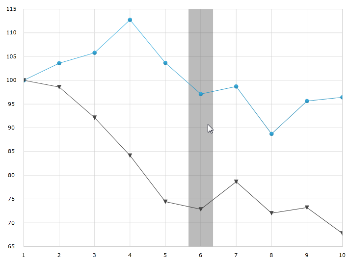

////

|metadata|
{
    "name": "datachart-categoryhighlightlayer",
    "controlName": ["{DataChartName}"],
    "tags": ["Charting","Getting Started","How Do I"],
    "guid": "4fb63863-ed39-497c-a8eb-9cb0b17e16cd",  
    "buildFlags": ["ANDROID","SL","WPF","WINFORMS"],
    "createdOn": "2014-06-05T19:39:00.6213683Z"
}
|metadata|
////

= カテゴリ強調表示レイヤー

== トピックの概要

=== 目的

このトピックは、pick:[wpf,win-universal,win-forms="ホバー"]pick:[xamarin="タッチ"]操作に使用されるカテゴリ強調表示レイヤーについての情報を提供します。カテゴリ強調表示レイヤーのプロパティについて説明し、実装例を示します。

=== 前提条件

本トピックの理解を深めるために、以下のトピックを参照することをお勧めします。

[options="header", cols="a,a"]
|====
|トピック|目的

|link:datachart-getting-started-with-datachart.html[データ チャートを使用した作業の開始]
|{DataChartName} コントロールは、コントロールの DataContext プロパティにマップされるデータ オブジェクト モデルを必要とします。ここでは、簡単なデータ オブジェクト モデルを提供しますが、自分自身で作成し、このサンプル コードの代わりに使用することができます。

| link:datachart-category-series-overview.html[カテゴリ シリーズ]
|このトピックは、{DataChartName} コントロールのカテゴリ シリーズのさまざまなタイプを説明します。

|====

=== このトピックの内容

このトピックは、以下のセクションで構成されます。

* <<Overview,概要>>
* <<Preview,プレビュー>>
* <<Properties,プロパティ>>
* <<Example,例>>
* <<RelatedContent,関連コンテンツ>>

[[Overview]]
== 概要

=== カテゴリ強調表示レイヤーの概要

link:{DataChartLink}.categoryhighlightlayer_members.html[CategoryHighlightLayer] は、{DataChartName} コントロール内の 1 つまたはすべてのカテゴリー軸を対象にしています。軸に、軸の主グリッド線の間に配置されるシリーズ、たとえば link:{DataChartLink}.columnseries.html[ColumnSeries] などが含まれる場合、現在のカテゴリを塗りつぶすシェイプが描画されます。

link:{DataChartLink}.lineseries.html[LineSeries] シリーズなどその他のシリーズの場合、ポインター位置に最も近いグリッドラインで調節可能な厚さを持つバンドを描画します。この場合、 link:{DataChartLink}.categoryhighlightlayer{ApiProp}useinterpolation.html[UseInterpolation] プロパティが有効になると、x 位置がポインターの x 位置に付け加えられます。

link:{DataChartLink}.series{ApiProp}brush.html[Brush] プロパティを設定することによって、強調表示領域の色を変更できます。このプロパティの詳細は、以下の link:datachart-commonproperties.html[共通のプロパティ] セクションを参照してください。

[[Preview]]

=== プレビュー

以下の画像は、link:{DataChartLink}.categoryhighlightlayer_members.html[CategoryHighlightLayer] を追加して描画した {DataChartName} コントロールのプレビューです。

ifdef::wpf,win-universal[]
image::images/Category_Highlight_Layer_1.png[]
endif::wpf,win-universal[]

ifdef::xamarin[]
image::images/Category_Highlight_Layer_3.png[]
endif::xamarin[]

[[Properties]]
== プロパティ

=== カテゴリ強調表示レイヤーのサマリー

以下の表で、 link:{DataChartLink}.categoryhighlightlayer_members.html[CategoryHighlightLayer] レイヤーのプロパティを簡単に説明します。

[options="header", cols="a,a,a"]
|====
|プロパティ名|プロパティ タイプ|説明

| link:{DataChartLink}.categoryhighlightlayer{ApiProp}bandhighlightwidth.html[BandHighlightWidth]
|`double`
|このプロパティは、グリッドライン上に配置されたシリーズの強調表示領域の幅を指定します。たとえば、 link:{DataChartLink}.lineseries.html[LineSeries]、 link:{DataChartLink}.areaseries.html[AreaSeries] および link:{DataChartLink}.splineseries.html[SplineSeries] です。 

このプロパティは、グリッドライン間に配置されたシリーズがある場合は影響を及ぼしません。たとえば、 link:{DataChartLink}.columnseries.html[ColumnSeries] および link:{DataChartLink}.waterfallseries.html[WaterfallSeries] です。 

このプロパティが設定されると、グリッドラインの周りに指定されたサイズの縞模様シェイプを強調表示します。

| link:{DataChartLink}.categoryhighlightlayer{ApiProp}targetaxis.html[TargetAxis]
|`CategoryAxisBase`
|このプロパティは、どの軸に有効なカテゴリ強調表示レイヤーを設定するかを指定します。

| link:{DataChartLink}.categoryhighlightlayer{ApiProp}useinterpolation.html[UseInterpolation]
|`bool`
|このプロパティは、強調表示バンドがグリッドラインにスナップするのでなくカーソルにスナップすべきかどうかを指定します。 

このプロパティは、グリッドライン間に配置されたシリーズがある場合は影響を及ぼしません。たとえば、 link:{DataChartLink}.columnseries.html[ColumnSeries] および link:{DataChartLink}.waterfallseries.html[WaterfallSeries] です。

|====

[[Example]]
== 例

=== 例

以下のスクリーンショットは、以下の設定の結果、 link:{DataChartLink}.categoryhighlightlayer_members.html[categoryHighlightLayer] オブジェクトの link:{DataChartLink}.categoryhighlightlayer{ApiProp}bandhighlightwidth.html[bandHighlightWidth] プロパティを持つ {DataChartName} コントロールの外観がどのように見えるかを示しています。

[options="header", cols="a,a"]
|====
|プロパティ|値

|link:{DataChartLink}.CategoryHighlightLayer{ApiProp}BandHighlightWidth.html[BandHighlightWidth]
|`50`

|====

ifdef::wpf,win-universal[]

endif::wpf,win-universal[]

ifdef::xamarin[]
image::images/Category_Highlight_Layer_4.png[]
endif::xamarin[]

以下のコードはこの例を実装します。

ifdef::wpf,win-universal[]

*XAML の場合:*

[source,xaml]
----
<ig:{DataChartName} x:Name="theChart" Margin="5,0,5,0" >
   <ig:{DataChartName}.Axes>
      <ig:CategoryXAxis x:Name="xmCategoryXAxis"
                        ItemsSource="{StaticResource CategoryData1}"
                        Label="{}{Category}">
         <ig:CategoryXAxis.LabelSettings>
            <ig:AxisLabelSettings x:Name="xmCategoryXAxisLabel" 
                                  Extent="25" 
                                  VerticalAlignment="Bottom" 
                                  FontSize="11" />
            </ig:CategoryXAxis.LabelSettings>
         </ig:CategoryXAxis>
         <ig:NumericYAxis x:Name="xmNumericYAxis1">
            <ig:NumericYAxis.LabelSettings>
               <ig:AxisLabelSettings x:Name="xmNumericYAxisLabel" 
                                     Extent="50" 
                                     Location="OutsideLeft" />
               </ig:NumericYAxis.LabelSettings>
            </ig:NumericYAxis>
    </ig:{DataChartName}.Axes>
    <ig:{DataChartName}.Series>
		<ig:CategoryHighlightLayer BandHighlightWidth="50" />
    
		<ig:LineSeries ItemsSource="{StaticResource CategoryData1}" 
                       ValueMemberPath="Value" 
                       XAxis="{Binding ElementName=xmCategoryXAxis}" 
                       YAxis="{Binding ElementName=xmNumericYAxis1}">
		</ig:LineSeries>
		<ig:LineSeries ItemsSource="{StaticResource CategoryData2}" 
                       ValueMemberPath="Value" 
                       XAxis="{Binding ElementName=xmCategoryXAxis}" 
                       YAxis="{Binding ElementName=xmNumericYAxis1}">
    </ig:LineSeries>
  </ig:{DataChartName}.Series>
</ig:{DataChartName}>
----

endif::wpf,win-universal[]

ifdef::xamarin[]

*XAML の場合:*

[source,xaml]
----
<ig:{DataChartName} x:Name="theChart">
  <ig:{DataChartName}.Axes>
    <ig:CategoryXAxis x:Name="xAxis"
                      ItemsSource="{Binding CategoryData1}"
                      Label="Category"/>
    <ig:NumericYAxis x:Name="yAxis"/>
  </ig:{DataChartName}.Axes>
  <ig:{DataChartName}.Series>
    <ig:CategoryHighlightLayer BandHighlightWidth="50"/>
    
    <ig:LineSeries XAxis="{x:Reference xAxis}"
                   YAxis="{x:Reference yAxis}"
                   ItemsSource="{Binding CategoryData1}"
                   ValueMemberPath="Value">
    </ig:LineSeries>
    <ig:LineSeries XAxis="{x:Reference xAxis}"
                   YAxis="{x:Reference yAxis}"
                   ItemsSource="{Binding CategoryData2}"
                   ValueMemberPath="Value">
    </ig:LineSeries>
  </ig:{DataChartName}.Series>
</ig:{DataChartName}>
----

endif::xamarin[]

*C# の場合:*

----
var catHighlightLayerSeries = new CategoryHighlightLayer();
catHighlightLayerSeries.BandHighlightWidth = 50;
theChart.Series.Add(catHighlightLayerSeries);
----

ifdef::wpf,win-universal,win-forms[]

*VB の場合:*

----
Dim catHighlightLayerSeries As New CategoryHighlightLayer()
catHighlightLayerSeries.BandHighlightWidth = 50
theChart.Series.Add(catHighlightLayerSeries)
----

endif::wpf,win-universal,win-forms[]

[[RelatedContent]]
== 関連コンテンツ

[options="header", cols="a,a"]
|====
|トピック|目的

| link:datachart-commonproperties.html[共通のプロパティ]
|このトピックは、pick:[wpf,win-universal,win-forms="ホバー"]pick:[xamarin="タッチ"]操作機能が、 link:{DataChartLink}.series_members.html[Series] クラスから継承したツールチップの相互作用を強調表示、pick:[wpf,win-universal,win-forms="ホバリング"]pick:[xamarin="タッチ"]および相互作用するために使用するプロパティおよびメソッドについての情報を提供します。

| link:datachart-crosshairlayer.html[十字線レイヤー]
|このトピックは、pick:[wpf,win-universal,win-forms="ホバー"]pick:[xamarin="タッチ"]操作に使用される十字線レイヤーについての情報を提供します。十字線のプロパティについて説明し、実装例を示します。

| link:datachart-categoryitemhighlightlayer.html[カテゴリ項目強調表示レイヤー]
|このトピックは、pick:[wpf,win-universal,win-forms="ホバー"]pick:[xamarin="タッチ"]操作に使用されるカテゴリ項目強調表示レイヤーについての情報を提供します。カテゴリ項目強調表示レイヤーのプロパティについて説明し、実装例を示します。

| link:datachart-categorytooltiplayer.html[カテゴリ ツールチップ レイヤー]
|このトピックは、pick:[wpf,win-universal,win-forms="ホバー"]pick:[xamarin="タッチ"]操作に使用されるカテゴリ ツールチップ レイヤーについての情報を提供します。カテゴリ ツールチップ レイヤーのプロパティについて説明し、実装例を提供します。

| link:datachart-itemtooltiplayer.html[項目ツールチップ レイヤー]
|このトピックは、pick:[wpf,win-universal,win-forms="ホバー"]pick:[xamarin="タッチ"]操作に使用される項目ツールチップ レイヤーについての情報を提供します。項目ツールチップ レイヤーのプロパティについて説明し、実装例も提供します。

|====
