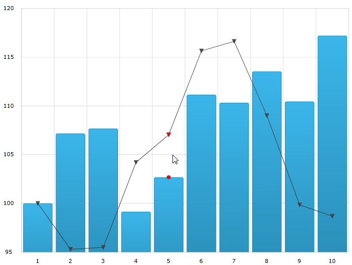

////
|metadata|
{
    "name": "datachart-categoryitemhighlightlayer",
    "controlName": ["{DataChartName}"],
    "tags": ["Charting","Getting Started","How Do I"],
    "guid": "bf559d04-b8c5-4838-a970-bd7ca9d05d29",  
    "buildFlags": ["SL","ANDROID","WPF","WINFORMS"],
    "createdOn": "2014-06-05T19:39:00.6243698Z"
}
|metadata|
////

= カテゴリ項目強調表示レイヤー

== トピックの概要

=== 目的

このトピックは、pick:[wpf,win-universal="ホバー"]pick:[xamarin="タッチ"]操作に使用されるカテゴリ項目強調表示レイヤーについての情報を提供します。カテゴリ項目強調表示レイヤーのプロパティについて説明し、実装例を示します。

=== 前提条件

本トピックの理解を深めるために、以下のトピックを参照することをお勧めします。

[options="header", cols="a,a"]
|====
|トピック|目的

| link:datachart-getting-started-with-datachart.html[データ チャートを使用した作業の開始]
|{DataChartName} コントロールは、コントロールの DataContext プロパティにマップされるデータ オブジェクト モデルを必要とします。ここでは、簡単なデータ オブジェクト モデルを提供しますが、自分自身で作成し、このサンプル コードの代わりに使用することができます。

| link:datachart-category-series-overview.html[カテゴリ シリーズ]
|このトピックは、{DataChartName} コントロールのカテゴリ シリーズのさまざまなタイプを説明します。

|====

=== このトピックの内容

このトピックは、以下のセクションで構成されます。

* <<Overview,概要>>
* <<Preview,プレビュー>>
* <<Properties,プロパティ>>
* <<Example,例>>
* <<RelatedContent,関連コンテンツ>>

[[Overview]]
== 概要

=== カテゴリ項目強調表示レイヤーの概要

link:{DataChartLink}.categoryitemhighlightlayer.html[CategoryItemHighlightLayer] は、縞模様シェイプをまたはマーカーをその位置で描画することによりカテゴリ軸を使用してシリーズで項目を強調表示します。

デフォルトの強調表示はシリーズの型に依存します。たとえば、 link:{DataChartLink}.columnseries.html[ColumnSeries] と link:{DataChartLink}.lineseries.html[LineSeries] は同じではありません。link:{DataChartLink}.columnseries.html[ColumnSeries] の場合は縞模様シェイプであり、 link:{DataChartLink}.lineseries.html[LineSeries] の場合はマーカーです。link:{DataChartLink}.categoryitemhighlightlayer{ApiProp}highlighttype.html[HighlightType] プロパティを設定してデフォルトの強調表示をオーバーライドできます。このプロパティの詳細は、以下の<<Properties,プロパティ>> セクションを参照してください。

[[Preview]]

=== プレビュー

以下の画像は、link:{DataChartLink}.categoryitemhighlightlayer.html[CategoryItemHighlightLayer] で追加して描画した {DataChartName} コントロールのプレビューです。

ifdef::wpf,win-universal[]
image::images/Category_Item_Highlight_Layer_1.png[]
endif::wpf,win-universal[]

ifdef::xamarin[]
image::images/Category_Item_Highlight_Layer_3.png[]
endif::xamarin[]

[[Properties]]
== プロパティ

=== カテゴリ項目強調表示レイヤーのサマリー

以下の表で、 link:{DataChartLink}.categoryitemhighlightlayer.html[CategoryItemHighlightLayer] レイヤーのプロパティを簡単に説明します。

[options="header", cols="a,a,a"]
|====
|プロパティ名|プロパティ タイプ|説明

| link:{DataChartLink}.categoryitemhighlightlayer{ApiProp}bandhighlightwidth.html[BandHighlightWidth]
|`double`
|このプロパティは、グリッドライン上に配置されたシリーズにおいて項目の強調表示領域の幅を指定します。たとえば、 link:{DataChartLink}.lineseries.html[LineSeries]、 link:{DataChartLink}.areaseries.html[AreaSeries] および link:{DataChartLink}.splineseries.html[SplineSeries] です。 

このプロパティは、グリッドライン間に配置されたシリーズがある場合は影響を及ぼしません。たとえば、 link:{DataChartLink}.columnseries.html[ColumnSeries] および link:{DataChartLink}.waterfallseries.html[WaterfallSeries] です。 

このプロパティに値セットがある場合、縞模様シェイプがグリッドラインの周りに強調表示されます。

| link:{DataChartLink}.categoryitemhighlightlayer{ApiProp}highlighttype.html[HighlightType]
| link:{DataChartLink}.categoryitemhighlighttype.html[CategoryItemHighlightType]
|このプロパティは、強調表示の見た目を指定します。 

デフォルトでは、 link:{DataChartLink}.lineseries.html[LineSeries] などのシリーズにはマーカーを、 link:{DataChartLink}.columnseries.html[ColumnSeries] などの場合は強調表示縞模様シリーズを使用します。

| link:{DataChartLink}.categoryitemhighlightlayer{ApiProp}useinterpolation.html[UseInterpolation]
|`bool`
|このプロパティは、強調表示バンドがグリッドラインにスナップするのでなくカーソルにスナップすべきかどうかを指定します。 

このプロパティは、グリッドライン間に配置されたシリーズがある場合は影響を及ぼしません。たとえば、 link:{DataChartLink}.columnseries.html[ColumnSeries] および link:{DataChartLink}.waterfallseries.html[WaterfallSeries] シリーズです。

ifdef::wpf,win-universal[]
| link:{DataChartLink}.categoryitemhighlightlayer{ApiProp}markertemplate.html[MarkerTemplate]
|`DataTemplate`
|このプロパティは、利用可能なマーカー タイプを使用する代わりにマーカー強調表示タイプにどのテンプレートを使用するかを指定します。
endif::wpf,win-universal[]

|====

[[Example]]
== 例

=== 例

以下のスクリーンショットは、_{DataChartName}_ コントロールと link:{DataChartLink}.CategoryItemHighlightLayer.html[CategoryItemHighlightLayer] オブジェクトの link:{DataChartLink}.CategoryItemHighlightLayer{ApiProp}BandHighlightWidth.html[BandHighlightWidth] および link:{DataChartLink}.Series{ApiProp}Brush.html[Brush] プロパティが以下の設定の結果としてどのように見えるかを示しています。

[options="header", cols="a,a"]
|====
|プロパティ|値

|link:{DataChartLink}.Series{ApiProp}Brush.html[Brush]
|`Red`

|link:{DataChartLink}.CategoryItemHighlightLayer{ApiProp}HighlightType.html[HighlightType]
|`Marker`

|====

ifdef::wpf,win-universal[]

endif::wpf,win-universal[]

ifdef::xamarin[]
image::images/Category_Item_Highlight_Layer_4.png[]
endif::xamarin[]

以下のコードはこの例を実装します。

ifdef::wpf,win-universal[]

*XAML の場合:*

[source,xaml]
----
<ig:{DataChartName} x:Name="theChart" Margin="5,0,5,0" >
   <ig:{DataChartName}.Axes>
      <ig:CategoryXAxis x:Name="xmCategoryXAxis"
                        ItemsSource="{StaticResource CategoryData1}"
                        Label="{}{Category}">
         <ig:CategoryXAxis.LabelSettings>
            <ig:AxisLabelSettings x:Name="xmCategoryXAxisLabel" 
                                  Extent="25" 
                                  VerticalAlignment="Bottom" 
                                  FontSize="11" />
         </ig:CategoryXAxis.LabelSettings>
      </ig:CategoryXAxis>
      <ig:NumericYAxis x:Name="xmNumericYAxis1">
         <ig:NumericYAxis.LabelSettings>
            <ig:AxisLabelSettings x:Name="xmNumericYAxisLabel" 
                                  Extent="50" 
                                  Location="OutsideLeft" />
            </ig:NumericYAxis.LabelSettings>
      </ig:NumericYAxis>
   </ig:{DataChartName}.Axes>
   <ig:{DataChartName}.Series>
         <ig:ColumnSeries ItemsSource="{StaticResource CategoryData1}" 
                          ValueMemberPath="Value" 
                          XAxis="{Binding ElementName=xmCategoryXAxis}" 
                          YAxis="{Binding ElementName=xmNumericYAxis1}">
         </ig:ColumnSeries>
         <ig:LineSeries ItemsSource="{StaticResource CategoryData2}" 
                        ValueMemberPath="Value" 
                        XAxis="{Binding ElementName=xmCategoryXAxis}" 
                        YAxis="{Binding ElementName=xmNumericYAxis1}">
         </ig:LineSeries>
         <ig:CategoryItemHighlightLayer HighlightType="Marker" Brush="Red" />
   </ig:{DataChartName}.Series>
</ig:{DataChartName}>
----

endif::wpf,win-universal[]

ifdef::xamarin[]

*XAML の場合:*

[source,xaml]
----
<ig:{DataChartName} x:Name="theChart">
  <ig:{DataChartName}.Axes>
    <ig:CategoryXAxis x:Name="xAxis"
                      ItemsSource="{Binding CategoryData1}"
                      Label="Category"/>
    <ig:NumericYAxis x:Name="yAxis"/>
  </ig:{DataChartName}.Axes>
  <ig:{DataChartName}.Series>
    <ig:ColumnSeries ItemsSource="{Binding CategoryData2}"
                     ValueMemberPath="Value"
                     XAxis="{x:Reference xAxis}"
                     YAxis="{x:Reference yAxis}">
    </ig:ColumnSeries>
    <ig:LineSeries ItemsSource="{Binding CategoryData1}"
                   ValueMemberPath="Value"
                   XAxis="{x:Reference xAxis}"
                   YAxis="{x:Reference yAxis}">
    </ig:LineSeries>

    <ig:CategoryItemHighlightLayer HighlightType="Marker" Brush="Red"/>
  </ig:{DataChartName}.Series>
</ig:{DataChartName}>
----

endif::xamarin[]

ifdef::wpf,win-universal,xamarin[]

*C# の場合:*

----
var catItemHighlightLayerSeries = new CategoryItemHighlightLayer();
catItemHighlightLayerSeries.HighlightType = CategoryItemHighlightType.Marker;
catItemHighlightLayerSeries.Brush = new SolidColorBrush(Colors.Red);
theChart.Series.Add(catItemHighlightLayerSeries);
----

endif::wpf,win-universal,xamarin[]

ifdef::wpf,win-universal[]

*VB の場合:*

----
Dim catItemHighlightLayerSeries As New CategoryItemHighlightLayer()
catItemHighlightLayerSeries.HighlightType = CategoryItemHighlightType.Marker;
catItemHighlightLayerSeries.Brush = New SolidColorBrush(Colors.Red)
theChart.Series.Add(catItemHighlightLayerSeries)
----

endif::wpf,win-universal[]

ifdef::win-forms[]

*C# の場合:*

----
var catItemHighlightLayerSeries = new CategoryItemHighlightLayer();
catItemHighlightLayerSeries.HighlightType = CategoryItemHighlightType.Marker;
catItemHighlightLayerSeries.Brush = new SolidColorBrush(Color.Red);
theChart.Series.Add(catItemHighlightLayerSeries);
----

*VB の場合:*

----
Dim catItemHighlightLayerSeries As New CategoryItemHighlightLayer()
catItemHighlightLayerSeries.HighlightType = CategoryItemHighlightType.Marker
catItemHighlightLayerSeries.Brush = New SolidColorBrush(Color.Red)
theChart.Series.Add(catItemHighlightLayerSeries)
----

endif::win-forms[]

[[RelatedContent]]
== 関連コンテンツ

[options="header", cols="a,a"]
|====
|トピック|目的

| link:datachart-commonproperties.html[共通のプロパティ]
|このトピックは、pick:[wpf,win-universal,win-forms="ホバー"]pick:[xamarin="タッチ"]操作機能が、 link:{DataChartLink}.series_members.html[Series] クラスから継承したツールチップの相互作用を強調表示、pick:[wpf,win-universal,win-forms="ホバリング"]pick:[xamarin="タッチ"]および相互作用するために使用するプロパティおよびメソッドについての情報を提供します。

| link:datachart-crosshairlayer.html[十字線レイヤー]
|このトピックは、pick:[wpf,win-universal,win-forms="ホバー"]pick:[xamarin="タッチ"]操作に使用される十字線レイヤーについての情報を提供します。十字線のプロパティについて説明し、実装例を示します。

| link:datachart-categoryhighlightlayer.html[カテゴリ強調表示レイヤー]
|このトピックは、pick:[wpf,win-universal,win-forms="ホバー"]pick:[xamarin="タッチ"]操作に使用されるカテゴリ強調表示レイヤーについての情報を提供します。カテゴリ強調表示レイヤーのプロパティについて説明し、実装例を示します。

| link:datachart-categorytooltiplayer.html[カテゴリ ツールチップ レイヤー]
|このトピックは、pick:[wpf,win-universal,win-forms="ホバー"]pick:[xamarin="タッチ"]操作に使用されるカテゴリ ツールチップ レイヤーについての情報を提供します。カテゴリ ツールチップ レイヤーのプロパティについて説明し、実装例を提供します。

| link:datachart-itemtooltiplayer.html[項目ツールチップ レイヤー]
|このトピックは、pick:[wpf,win-universal,win-forms="ホバー"]pick:[xamarin="タッチ"]操作に使用される項目ツールチップ レイヤーについての情報を提供します。項目ツールチップ レイヤーのプロパティについて説明し、実装例も提供します。

|====
