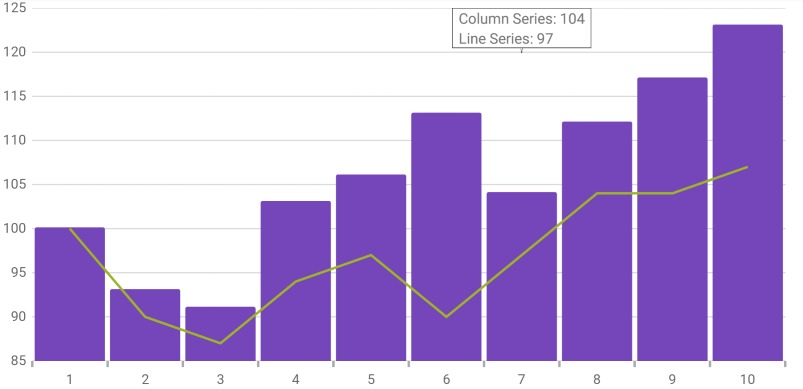

////

|metadata|
{
    "name": "datachart-categorytooltiplayer",
    "controlName": ["{DataChartName}"],
    "tags": ["Charting","How Do I"],
    "guid": "b6b81c4b-3335-437c-9a8b-2c3ee36c3514",  
    "buildFlags": ["ANDROID","WINFORMS","WPF","SL"],
    "createdOn": "2014-06-05T19:39:00.6263705Z"
}
|metadata|
////

= カテゴリ ツールチップ レイヤー

== トピックの概要

=== 目的

このトピックは、pick:[wpf,win-universal,win-forms="ホバー"]pick:[xamarin="タッチ"]操作に使用されるカテゴリ ツールチップ レイヤーについての情報を提供します。カテゴリ ツールチップ レイヤーのプロパティについて説明し、実装例を提供します。

=== 前提条件

本トピックの理解を深めるために、以下のトピックを参照することをお勧めします。

[options="header", cols="a,a"]
|====
|トピック|目的

| link:datachart-getting-started-with-datachart.html[データ チャートを使用した作業の開始]
|{DataChartName} コントロールは、コントロールの DataContext プロパティにマップされるデータ オブジェクト モデルを必要とします。ここでは、簡単なデータ オブジェクト モデルを提供しますが、自分自身で作成し、このサンプル コードの代わりに使用することができます。

| link:datachart-category-series-overview.html[カテゴリ シリーズ]
|このトピックは、{DataChartName} コントロールのカテゴリ シリーズのさまざまなタイプを説明します。

|====

=== このトピックの内容

このトピックは、以下のセクションで構成されます。

* <<Overview,概要>>
* <<Preview,プレビュー>>
* <<Properties,プロパティ>>
* <<Example,例>>
* <<_Ref345510469,関連コンテンツ>>

[[Overview]]
== 概要

=== カテゴリ ヒント レイヤーの概要

link:{DataChartLink}.categorytooltiplayer.html[CategoryToolTipLayer] は、カテゴリ軸を使用する {DataChartName} コントロールのシリーズ用にグループ化されたヒントを表示します。

特殊な軸を対象とするヒントを構成できます。これには、TargetAxis プロパティを設定します。このプロパティの詳細は、以下の<<Properties,プロパティ>> セクションを参照してください。

デフォルトでは、グループ化されたツールチップは {DataChartName} コントロールの一番上に表示されます。しかしこのデフォルト値は ToolTipPosition プロパティを設定することでオーバーライドできます。このプロパティの詳細は、以下の CategoryToolTipLayer セクションを参照してください。

[[Preview]]

=== プレビュー

以下の画像は、link:{DataChartLink}.categorytooltiplayer.html[CategoryToolTipLayer] を追加して描画した {DataChartName} コントロールのプレビューです。

ifdef::wpf,win-universal[]
image::images/Category_Tooltip_Layer_1.png[]
endif::wpf,win-universal[]

ifdef::xamarin,win-forms[]

endif::xamarin,win-forms[]

[[Properties]]
== プロパティ

=== カテゴリ ヒント レイヤーの要点

以下の表で、 link:{DataChartLink}.categorytooltiplayer.html[CategoryToolTipLayer] レイヤーのプロパティを簡単に説明します。

[options="header", cols="a,a,a"]
|====
|プロパティ名|プロパティ タイプ|説明

| link:{DataChartLink}.categorytooltiplayer{ApiProp}targetaxis.html[TargetAxis]
|`Axis`
|このプロパティは、どの軸に有効なカテゴリ ヒント レイヤーを設定するかを指定します。

ifdef::wpf,win-universal[]
| link:{DataChartLink}.categorytooltiplayer{ApiProp}tooltipstyle.html[ToolTipStyle]
|`Style`
|このプロパティは、表示されるヒントに適用するスタイルを指定します。デフォルトではヒントはチャートからスタイルを継承しますが、このプロパティを設定するとこのデフォルト設定を上書きできます。
endif::wpf,win-universal[]

| link:{DataChartLink}.categorytooltiplayer{ApiProp}useinterpolation.html[UseInterpolation]
|`bool`
|このプロパティは、ツールチップの x 位置がグリッド ラインや中央スペースにスナップするのでなく補間されるべきであるかどうかを指定します。

ifdef::xaml,android[]
| link:{DataChartLink}.categorytooltiplayer{ApiProp}tooltipposition.html[ToolTipPosition]
| link:{DataChartLink}.categorytooltiplayerposition.html[CategoryToolTipLayerPosition]
|このプロパティは、ツールチップの位置を指定します。以下に設定できます。 

* Auto – 位置は自動的に選択されます 

* OutsideStart - 軸の外側の始まり部分に表示します。 

* InsideStart - 軸の内側の始まり部分に表示します。 

* InsideEnd - 軸の内側の終わり部分に表示します。 

* OutsideEnd - 軸の外側の終わり部分に表示します。 

endif::xaml,android[]

|====

[[Example]]
== 例

以下のスクリーンショットは、以下の設定で構成された link:{DataChartLink}.categorytooltiplayer.html[CategoryToolTipLayer] オブジェクトの link:{DataChartLink}.categorytooltiplayer{ApiProp}tooltipposition.html[ToolTipPosition] プロパティで {DataChartName} コントロールを描画する方法について説明します。

[options="header", cols="a,a"]
|====
|プロパティ|値

| link:{DataChartLink}.categorytooltiplayer{ApiProp}tooltipposition.html[ToolTipPosition]
|`InsideStart`

|====

ifdef::wpf,win-universal[]
image::images/Category_Tooltip_Layer_2.png[]
endif::wpf,win-universal[]

ifdef::xamarin,win-forms[]
image::images/Category_Tooltip_Layer_4.png[]
endif::xamarin,win-forms[]

以下のコードはこの実装で使用されます。

ifdef::wpf,win-universal[]

*XAML の場合:*

[source,xaml]
----
<ig:{DataChartName} x:Name="theChart" Margin="5,0,5,0" >
   <ig:{DataChartName}.Axes>
      <ig:CategoryXAxis x:Name="xmCategoryXAxis"
                        ItemsSource="{StaticResource CategoryData1}"
                        Label="{}{Category}">
         <ig:CategoryXAxis.LabelSettings>
            <ig:AxisLabelSettings x:Name="xmCategoryXAxisLabel" 
                                  Extent="25"                
                                  VerticalAlignment="Bottom" 
                                  FontSize="11" />
         </ig:CategoryXAxis.LabelSettings>
      </ig:CategoryXAxis>
      <ig:NumericYAxis x:Name="xmNumericYAxis1">
         <ig:NumericYAxis.LabelSettings>
            <ig:AxisLabelSettings x:Name="xmNumericYAxisLabel" 
                                  Extent="50" 
                                  Location="OutsideLeft" />
         </ig:NumericYAxis.LabelSettings>
      </ig:NumericYAxis>
   </ig:{DataChartName}.Axes>
   <ig:{DataChartName}.Series>
      <ig:ColumnSeries ItemsSource="{StaticResource CategoryData1}" 
                       ValueMemberPath="Value" 
                       XAxis="{Binding ElementName=xmCategoryXAxis}" 
                       YAxis="{Binding ElementName=xmNumericYAxis1}">
         <ig:ColumnSeries.ToolTip>
            <TextBlock Text="{Binding Item.Value}" />
         </ig:ColumnSeries.ToolTip>
      </ig:ColumnSeries>
      <ig:LineSeries ItemsSource="{StaticResource CategoryData2}" 
                     ValueMemberPath="Value" 
                     XAxis="{Binding ElementName=xmCategoryXAxis}" 
                     YAxis="{Binding ElementName=xmNumericYAxis1}">
         <ig:LineSeries.ToolTip>
            <TextBlock Text="{Binding Item.Value}" />
         </ig:LineSeries.ToolTip>
      </ig:LineSeries>
      <ig:CategoryToolTipLayer ToolTipPosition="InsideStart"
                               TransitionDuration="0:00:00.1" />
   </ig:{DataChartName}.Series>
</ig:{DataChartName}>
----

endif::wpf,win-universal[]

ifdef::xamarin[]

[source,xaml]
----
<ig:{DataChartName} x:Name="theChart">
    <ig:{DataChartName}.Axes>
        <ig:CategoryXAxis x:Name="xAxis"
                          ItemsSource="{Binding CategoryData1}"
                          Label="Category"/>
        <ig:NumericYAxis x:Name="yAxis"/>
    </ig:{DataChartName}.Axes>
    <ig:{DataChartName}.Series>
        <ig:ColumnSeries ItemsSource="{Binding CategoryData1}"
                         ValueMemberPath="Value"
                         XAxis="{x:Reference xAxis}"
                         YAxis="{x:Reference yAxis}">
            <ig:ColumnSeries.ToolTipTemplate>
                <DataTemplate>
                    <Label Text="{Binding Item.Value}" FontSize="12" Margin="5,0,5,0" />
                </DataTemplate>
            </ig:ColumnSeries.ToolTipTemplate>
        </ig:ColumnSeries>
        <ig:LineSeries ItemsSource="{Binding CategoryData2}"
                       ValueMemberPath="Value"
                       XAxis="{x:Reference xAxis}"
                       YAxis="{x:Reference yAxis}">
            <ig:LineSeries.ToolTipTemplate>
                <DataTemplate>
                    <Label Text="{Binding Item.Value}" FontSize="12" Margin="5,0,5,0" />
                </DataTemplate>
            </ig:LineSeries.ToolTipTemplate>
        </ig:LineSeries>
        
        <ig:CategoryToolTipLayer ToolTipPosition="InsideStart"/>
    </ig:{DataChartName}.Series>
</ig:{DataChartName}>
----

endif::xamarin[]

ifdef::wpf[]

*C# の場合:*

----
var catToolTipLayerSeries = new CategoryToolTipLayer();
catToolTipLayerSeries.ToolTipPosition = CategoryTooltipLayerPosition.InsideStart;
chart.Series.Add(catToolTipLayerSeries);
----

endif::wpf[]

ifdef::win-forms[]

デフォルトのツールチップを有効にします。

*C# の場合:*

----
series.ShowDefaultTooltip = true;
----

`CategoryToolTipLayer` を設定します。

*C# の場合:*

----
var catToolTipLayerSeries = new CategoryToolTipLayer();
catToolTipLayerSeries.ToolTipPosition = CategoryTooltipLayerPosition.InsideStart;
chart.Series.Add(catToolTipLayerSeries);
----

endif::win-forms[]

ifdef::xamarin[]

*C# の場合:*

----
var catToolTipLayerSeries = new CategoryToolTipLayer();
catToolTipLayerSeries.ToolTipPosition = CategoryTooltipLayerPosition.InsideStart;
chart.Series.Add(catToolTipLayerSeries);
----

endif::xamarin[]

[[_Ref345510469]]
== 関連コンテンツ

[options="header", cols="a,a"]
|====
|トピック|目的

ifdef::wpf[]
| link:datachart-commonproperties.html[共通のプロパティ]
|このトピックは、ホバー操作機能が、 link:{DataChartLink}.series_members.html[Series] クラスから継承したツールチップの相互作用を強調表示、ホバリングおよび相互作用するために使用するプロパティおよびメソッドについての情報を提供します。
endif::wpf[]

| link:datachart-crosshairlayer.html[十字線レイヤー]
|このトピックは、ホバー操作に使用される十字線レイヤーについての情報を提供します。十字線のプロパティについて説明し、実装例を示します。

| link:datachart-categoryitemhighlightlayer.html[カテゴリ項目強調表示レイヤー]
|このトピックは、ホバー操作に使用されるカテゴリ項目強調表示レイヤーについての情報を提供します。カテゴリ項目強調表示レイヤーのプロパティについて説明し、実装例を示します。

| link:datachart-itemtooltiplayer.html[項目ツールチップ レイヤー]
|このトピックは、ホバー操作に使用される項目ツールチップ レイヤーについての情報を提供します。項目ツールチップ レイヤーのプロパティについて説明し、実装例も提供します。

|====
