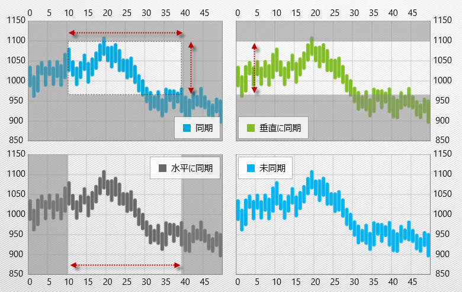

////

|metadata|
{
    "name": "datachart-chart-synchronization",
    "controlName": ["{DataChartName}"],
    "tags": ["Application Scenarios","Charting","How Do I"],
    "guid": "655102ae-db61-4b2a-8b46-e827a112a98c",  
    "buildFlags": ["WINFORMS","wpf","win-universal"],
    "createdOn": "2014-06-05T19:39:00.6653838Z"
}
|metadata|
////

= チャートの同期

link:{DataChartLink}.{DataChartName}.html[{DataChartName}]™ コントロールでは、同期とは複数チャート間でズーム、パンニング、十字線イベントを組み合わせることです。複数のチャート コントロールを水平 (X 軸に沿って)、垂直 (Y 軸に沿って)、または両方に同期できます。一連のチャートを同期させたい場合、 pick:[wpf,win-universal="link:{DataChartLink}.syncsettings{ApiProp}syncchannel.html[SyncChannel]"]  オブジェクトの  pick:[win-forms="link:{DataChartLinkBase}.seriesviewer{ApiProp}syncchannel.html[SyncChannel]"]  プロパティに同じ名前を指定し、チャートを水平、垂直、または両方に同期するかを指定します。

[[Properties]]
== 同期プロパティ

[options="header", cols="a,a,a"]
|====
|プロパティ名|タイプ|説明

|
ifdef::wpf,win-universal[] 

link:{DataChartLink}.syncsettings{ApiProp}syncchannel.html[SyncChannel] 

endif::wpf,win-universal[] 

ifdef::win-forms[] 

link:{DataChartLinkBase}.seriesviewer{ApiProp}syncchannel.html[SyncChannel] 

endif::win-forms[]
|文字列
|複数のチャート コントロールをリンク設定するための同期チャネルの識別子を決定します。

|
ifdef::wpf,win-universal[] 

link:{DataChartLink}.syncsettings{ApiProp}synchronizevertically.html[SynchronizeVertically] 

endif::wpf,win-universal[] 

ifdef::win-forms[] 

link:{DataChartLinkBase}.seriesviewer{ApiProp}synchronizevertically.html[SynchronizeVertically] 

endif::win-forms[]
|bool
|同期チャネルにリンクされたチャート コントロールを垂直方向に同期するかどうかを決定します。

|
ifdef::wpf,win-universal[] 

link:{DataChartLink}.syncsettings{ApiProp}synchronizehorizontally.html[SynchronizeHorizontally] 

endif::wpf,win-universal[] 

ifdef::win-forms[] 

link:{DataChartLinkBase}.seriesviewer{ApiProp}synchronizehorizontally.html[SynchronizeHorizontally] 

endif::win-forms[]
|bool
|同期チャネルにリンクされたチャート コントロールを水平方向に同期するかどうかを決定します。

|====

[[Example]]
== コード例

以下のサンプルでは、4 つの {DataChartName} コントロールですべての可能な同期化の組み合わせを紹介します。最初のチャートは水平と垂直に二番目と三番目のチャートとそれぞれ同期されています。四番目のチャートは、他のチャートと同期されていません。

ifdef::wpf,win-universal[]

*XAML の場合:*

[source]
----
<Grid>
    <Grid.RowDefinitions>
        <RowDefinition Height="1*"/>
        <RowDefinition Height="1*"/>
    </Grid.RowDefinitions>
    <Grid.ColumnDefinitions >
        <ColumnDefinition Width="1*" />
        <ColumnDefinition Width="1*" />
    </Grid.ColumnDefinitions>
    <ig:{DataChartName} x:Name="DataChart1" Grid.Row="0"
			HorizontalZoomable="True" VerticalZoomable="True">
        <ig:SyncManager.SyncSettings>
            <ig:SyncSettings SyncChannel="syncGroup1" SynchronizeHorizontally="True" SynchronizeVertically="True"/>
            </ig:SyncManager.SyncSettings>
    </ig:{DataChartName}>
    <ig:{DataChartName} x:Name="DataChart2" Grid.Row="0" Grid.Column="1" 
                        HorizontalZoomable="True" VerticalZoomable="True">
        <ig:SyncManager.SyncSettings>
            <ig:SyncSettings SyncChannel="syncGroup1" SynchronizeHorizontally="False" SynchronizeVertically="True"/>
            </ig:SyncManager.SyncSettings>
    </ig:{DataChartName}>
    <ig:{DataChartName} x:Name="DataChart3" Grid.Row="1" 
                       HorizontalZoomable="True" VerticalZoomable="True">
        <ig:SyncManager.SyncSettings>
            <ig:SyncSettings SyncChannel="syncGroup1" SynchronizeHorizontally="True" SynchronizeVertically="False"/>
        </ig:SyncManager.SyncSettings>
    </ig:{DataChartName}>
    <ig:{DataChartName} x:Name="DataChart4" Grid.Row="1" Grid.Column="1" 
                       HorizontalZoomable="True" VerticalZoomable="True">
        <ig:SyncManager.SyncSettings>
            <ig:SyncSettings SyncChannel="syncGroup2" SynchronizeHorizontally=" SynchronizeVertically="False"/>
        </ig:SyncManager.SyncSettings>
    </ig:{DataChartName}>
</Grid>
----

endif::wpf,win-universal[]

ifdef::wpf,win-forms,xamarin[]

*Visual Basic の場合:*

ifdef::xaml[]
----
Dim sync1 As New SyncSettings()
sync1.SyncChannel = "syncGroup1"
sync1.SynchronizeHorizontally = true
sync1.SynchronizeVertically = true
SyncManager.SetSyncSettings(DataChart1, sync1)

DataChart1.SyncChannel = "syncGroup1"
DataChart1.SynchronizeHorizontally = true
DataChart1.SynchronizeVertically = true

Dim sync2 As New SyncSettings()
sync2.SyncChannel = "syncGroup1"
sync2.SynchronizeHorizontally = false
sync2.SynchronizeVertically = true
SyncManager.SetSyncSettings(DataChart2, sync2)

DataChart2.SyncChannel = "syncGroup1"
DataChart2.SynchronizeHorizontally = false
DataChart2.SynchronizeVertically = true

Dim sync3 As New SyncSettings()
sync3.SyncChannel = "syncGroup1"
sync3.SynchronizeHorizontally = true
sync3.SynchronizeVertically = false
SyncManager.SetSyncSettings(DataChart3, sync3)

DataChart3.SyncChannel = "syncGroup1"
DataChart3.SynchronizeHorizontally = true
DataChart3.SynchronizeVertically = false

Dim sync4 As New SyncSettings()
sync4.SyncChannel = "syncGroup1"
sync4.SynchronizeHorizontally = false
sync4.SynchronizeVertically = false
SyncManager.SetSyncSettings(DataChart4, sync4)

DataChart4.SyncChannel = "syncGroup1"
DataChart4.SynchronizeHorizontally = false
DataChart4.SynchronizeVertically = false
----
endif::xaml[]

ifdef::win-forms[]
----
Dim sync1 As New SyncSettings()
sync1.SyncChannel = "syncGroup1"
sync1.SynchronizeHorizontally = true
sync1.SynchronizeVertically = true
SyncManager.SetSyncSettings(DataChart1, sync1)

DataChart1.SyncChannel = "syncGroup1"
DataChart1.SynchronizeHorizontally = true
DataChart1.SynchronizeVertically = true

Dim sync2 As New SyncSettings()
sync2.SyncChannel = "syncGroup1"
sync2.SynchronizeHorizontally = false
sync2.SynchronizeVertically = true
SyncManager.SetSyncSettings(DataChart2, sync2)

DataChart2.SyncChannel = "syncGroup1"
DataChart2.SynchronizeHorizontally = false
DataChart2.SynchronizeVertically = true

Dim sync3 As New SyncSettings()
sync3.SyncChannel = "syncGroup1"
sync3.SynchronizeHorizontally = true
sync3.SynchronizeVertically = false
SyncManager.SetSyncSettings(DataChart3, sync3)

DataChart3.SyncChannel = "syncGroup1"
DataChart3.SynchronizeHorizontally = true
DataChart3.SynchronizeVertically = false

Dim sync4 As New SyncSettings()
sync4.SyncChannel = "syncGroup1"
sync4.SynchronizeHorizontally = false
sync4.SynchronizeVertically = false
SyncManager.SetSyncSettings(DataChart4, sync4)

DataChart4.SyncChannel = "syncGroup1"
DataChart4.SynchronizeHorizontally = false
DataChart4.SynchronizeVertically = false
----
endif::win-forms[]

endif::wpf,win-forms,xamarin[]

ifdef::wpf,win-forms,xamarin[]

*C# の場合:*

ifdef::xaml[]
----
var sync1 = new SyncSettings();
sync1.SyncChannel = "syncGroup1";
sync1.SynchronizeHorizontally = true;
sync1.SynchronizeVertically = true;
SyncManager.SetSyncSettings(DataChart1, sync1);

DataChart1.SyncChannel = "syncGroup1";
DataChart1.SynchronizeHorizontally = true;
DataChart1.SynchronizeVertically = true;

var sync2 = new SyncSettings();
sync2.SyncChannel = "syncGroup1";
sync2.SynchronizeHorizontally = false;
sync2.SynchronizeVertically = true;
SyncManager.SetSyncSettings(DataChart2,sync2);

DataChart2.SyncChannel = "syncGroup1";
DataChart2.SynchronizeHorizontally = false;
DataChart2.SynchronizeVertically = true;

var sync3 = new SyncSettings();
sync3.SyncChannel = "syncGroup1";
sync3.SynchronizeHorizontally = true;
sync3.SynchronizeVertically = false;
SyncManager.SetSyncSettings(DataChart3,sync3);

DataChart3.SyncChannel = "syncGroup1";
DataChart3.SynchronizeHorizontally = true;
DataChart3.SynchronizeVertically = false;

var sync4 = new SyncSettings();
sync4.SyncChannel = "syncGroup1";
sync4.SynchronizeHorizontally = false;
sync4.SynchronizeVertically = false;
SyncManager.SetSyncSettings(DataChart4,sync4);

DataChart4.SyncChannel = "syncGroup1";
DataChart4.SynchronizeHorizontally = false;
DataChart4.SynchronizeVertically = false;
----
endif::xaml[]

ifdef::win-forms[]
----
var sync1 = new SyncSettings();
sync1.SyncChannel = "syncGroup1";
sync1.SynchronizeHorizontally = true;
sync1.SynchronizeVertically = true;
SyncManager.SetSyncSettings(DataChart1, sync1);

DataChart1.SyncChannel = "syncGroup1";
DataChart1.SynchronizeHorizontally = true;
DataChart1.SynchronizeVertically = true;

var sync2 = new SyncSettings();
sync2.SyncChannel = "syncGroup1";
sync2.SynchronizeHorizontally = false;
sync2.SynchronizeVertically = true;
SyncManager.SetSyncSettings(DataChart2,sync2);

DataChart2.SyncChannel = "syncGroup1";
DataChart2.SynchronizeHorizontally = false;
DataChart2.SynchronizeVertically = true;

var sync3 = new SyncSettings();
sync3.SyncChannel = "syncGroup1";
sync3.SynchronizeHorizontally = true;
sync3.SynchronizeVertically = false;
SyncManager.SetSyncSettings(DataChart3,sync3);

DataChart3.SyncChannel = "syncGroup1";
DataChart3.SynchronizeHorizontally = true;
DataChart3.SynchronizeVertically = false;

var sync4 = new SyncSettings();
sync4.SyncChannel = "syncGroup1";
sync4.SynchronizeHorizontally = false;
sync4.SynchronizeVertically = false;
SyncManager.SetSyncSettings(DataChart4,sync4);

DataChart4.SyncChannel = "syncGroup1";
DataChart4.SynchronizeHorizontally = false;
DataChart4.SynchronizeVertically = false;
----
endif::win-forms[]

endif::wpf,win-forms,xamarin[]

以下の画像は、すべての使用可能な同期の組み合わせを使用した 4 つの {DataChartName} コントロールで、ユーザーが最初のチャートのプロット領域の特定の領域にズームインしようとするとどのようになるかを示しています。

== 関連コンテンツ

* link:datachart-chart-navigation.html[チャート ナビゲーション]