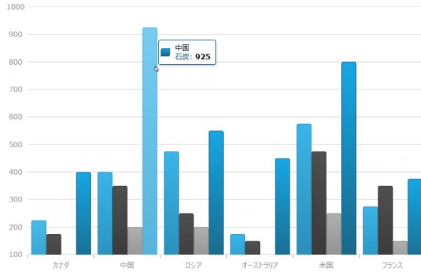
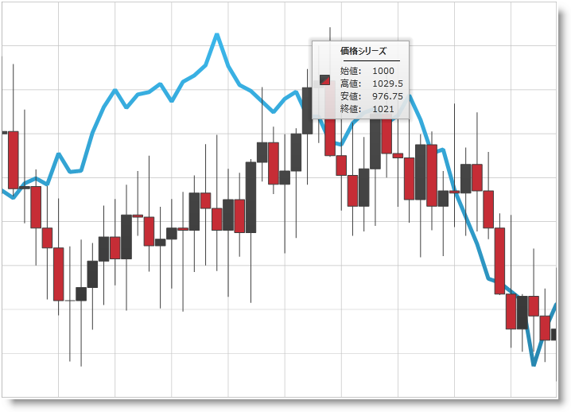
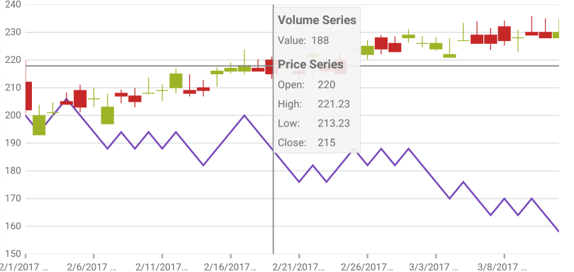

////

|metadata|
{
    "name": "datachart-chart-tooltips",
    "controlName": ["{DataChartName}"],
    "tags": ["Application Scenarios","Charting","How Do I"],
    "guid": "01682312-7c06-469f-87e6-c0cea516c9a6",  
    "buildFlags": ["wpf","win-universal"],
    "createdOn": "2014-06-05T19:39:00.6673846Z"
}
|metadata|
////

= チャート ツールチップ

ここでは、コード例とともに、pick:[sl,wpf="link:{DataChartLink}.{DataChartName}.html[{DataChartName}]™ コントロールのツールチップを有効する方法および新しいツールチップを作成する"]pick:[xamarin="link:{DataChartLink}.{DataChartName}.html[{DataChartName}]™ コントロールでツールチップを表示する"]方法を説明します。

== 概要

{DataChartName} コントロールでは、 pick:[sl,wpf="{DataChartName} コントロールでマウス カーソルがシリーズの上に置かれているときにツールチップが表示されます"]   pick:[xamarin,win-phone,win-universal="チャート プロット エリアでタップとホールドのジェスチャが実行されるとツールチップが表示されます。また、タップとホールドをしてから、放さずに指を移動させると、ツールチップの値が更新されます"] 。

== ツールチップの概要

ifdef::sl,wpf[]
{DataChartName} コントロールは、各シリーズ タイプにデフォルト ツールチップを提供します。デフォルト ツールチップは、 link:{DataChartLink}.series{ApiProp}showdefaulttooltip.html[ShowDefaultTooltip] プロパティを True に設定して有効にします。デフォルト ツールチップは、特定のシリーズ項目 (シリーズ タイトル、データ値、軸値など) に関するすべての情報を表示し、シリーズ スタイルに一致するためにスタイルが設定されます。
endif::sl,wpf[]

pick:[sl,wpf="デフォルト ツールチップが適さない場合、カスタム ツールチップを設定することもできます。"]ツールチップは次の特性をカスタマイズできます。

* ツールチップのコンテンツ
* ツールチップ ルックアンドフィール

ifdef::xamarin[]
ツールチップ コンテンツは、link:{DataChartLink}.Series.html[Series] オブジェクトの link:{DataChartLink}.Series{ApiProp}ToolTipTemplate.html[ToolTipTemplate] プロパテによって提供されます。{PlatformName} では、ツールチップを構成する視覚要素を含む link:https://developer.xamarin.com/guides/xamarin-forms/application-fundamentals/templates/data-templates/creating/[DataTemplate] を使用します。 

また、link:{DataChartLinkBase}.{DataChartBase}{ApiProp}ToolTipBackgroundColor.html[ToolTipBackgroundColor]、link:{DataChartLinkBase}.{DataChartBase}{ApiProp}ToolTipBorderColor.html[ToolTipBorderColor]、 link:{DataChartLinkBase}.{DataChartBase}{ApiProp}ToolTipBorderThickness.html[ToolTipBorderThickness] を設定してツールチップのルックアンドフィールを更にカスタマイズすることもできます。

*注:*
ツールチップは、link:datachart-scatter-series-overview.html[ScatterSeries] および link:datachart-polar-series-overview.html[PolarSeries] で現在サポートされません。 

アプリケーションでナビゲーションを実装した場合、ツールチップが表示されているときに {DataChartName} 以外へナビゲーションすることが可能ですが、トランジションが完了するまでツールチップが画面に表示されます。その前にツールチップを非表示にするには、ナビゲーションを開始する前に {DataChartName} の link:{DataChartLinkBase}.{DataChartBase}{ApiProp}HideToolTip.html[HideToolTip] メソッドを呼び出します。

link:{DataChartLinkBase}.{DataChartBase}{ApiProp}HideToolTip.html[HideToolTip] を呼び出す際に、フレームワークが {DataChartName} の操作を許可するかどうかに基づいて link:{DataChartLinkBase}.{DataChartBase}{ApiProp}Flush.html[Flush] を呼び出す必要がある場合があります。{DataChartName} のツールチップの非表示などの操作が遅延されます。フレームワークがコントロールの操作を許可しない場合、ツールチップはただちに非表示になりません。このような場合に link:{DataChartLinkBase}.{DataChartBase}{ApiProp}Flush.html[Flush] を呼び出すと、遅延された操作をすぐに実行し、ツールチップを非表示にします。

endif::xamarin[]

ifdef::wpf[]
ツールチップのコンテンツは、シリーズ オブジェクトの link:{DataChartLink}.series{ApiProp}tooltip.html[ツールチップ] プロパティにカスタム コンテンツを提供してカスタマイズできます。ツールチップのルック アンド フィールは、{DataChartName} コントロールの  pick:[xaml="link:{DataChartLinkBase}.{DataChartBase}{ApiProp}tooltipstyle.html[ToolTipStyle]"]  プロパティ pick:[win-phone="および"]   pick:[win-phone="link:{DataChartLinkBase}{ApiProp}tooltipinfoboxstyle.html[ToolTipInfoBoxStyle]"]   pick:[win-phone="プロパティ"] を通して管理されます。
endif::wpf[]

ifdef::sl,wpf[]
*注:* カスタム link:{DataChartLink}.series{ApiProp}tooltip.html[ToolTip] が設定されている場合、 link:{DataChartLink}.series{ApiProp}showdefaulttooltip.html[ShowDefaultTooltip] 設定は無視されます。
endif::sl,wpf[]

ifdef::sl,wpf[]
== デフォルト ツールチップ
endif::sl,wpf[]

ifdef::sl,wpf[]
以下のスクリーン ショットは、カテゴリ シリーズのデフォルト ツールチップについて紹介します。
endif::sl,wpf[]

ifdef::sl,wpf,win-phone[]

endif::sl,wpf,win-phone[]

== コード例: カスタム ツールチップの表示

この例は、財務チャートの任意のポイントの、オープン、高、低、およびクローズの売上高に関する情報をツールチップで表示する方法を示します。これを達成するには、 link:{DataChartLink}.lineseries.html[LineSeries] で量の値を、そして link:{DataChartLink}.financialpriceseries.html[FinancialPriceSeries] でオープン、高、低、およびクローズの値を表示するカスタム ツールチップを作成します。

=== プレビュー

ifdef::wpf,win-universal[]

endif::wpf,win-universal[]

ifdef::xamarin[]

endif::xamarin[]

図 1: 財務物価シリーズの値を示すカスタム ツールチップを含む {DataChartName} コントロール

== 手順

ifdef::xamarin[]

[start=1]
. ツールチップの背景と境界線を設定します。

*XAML の場合:*

[source,xaml]
----
<ig:{DataChartName} x:Name="dataChart1"
                   ToolTipBackgroundColor="#80F4F4F4"
                   ToolTipBorderColor="#1E000000"
                   ToolTipBorderThickness="2">
   <!--TODO: Add Series with custom tooltip content -->
</ig:{DataChartName}>
----

[start=2]
. カスタム ツールチップ コンテンツを link:{DataChartLink}.Series.html[Series] オブジェクトの link:{DataChartLink}.Series{ApiProp}ToolTipTemplate.html[ToolTipTemplate] プロパティに追加します。

*XAML の場合:*

[source,xaml]
----
<ig:XamDataChart.Series>
  <ig:LineSeries ItemsSource="{Binding}"
                 ValueMemberPath="Volume"
                 XAxis="{x:Reference commonXAxis}"
                 YAxis="{x:Reference volumnYAxis}"
                 Title="Volume Series">
    <ig:LineSeries.ToolTipTemplate>
      <DataTemplate>
        <StackLayout Orientation="Vertical" Margin="5">
          <Label Text="{Binding Series.Title}" FontAttributes="Bold" />
          <StackLayout Orientation="Horizontal">
            <Label Text="Value:" FontSize="12"/>
            <Label Text="{Binding Item.Volume}" FontSize="12"/>
          </StackLayout>
        </StackLayout>
      </DataTemplate>
    </ig:LineSeries.ToolTipTemplate>
  </ig:LineSeries>
  <ig:FinancialPriceSeries DisplayType="Candlestick"
                           ItemsSource="{Binding}"
                           OpenMemberPath="Open"
                           CloseMemberPath="Close"
                           HighMemberPath="High"
                           LowMemberPath="Low"
                           VolumeMemberPath="Volume"
                           XAxis="{x:Reference commonXAxis}"
                           YAxis="{x:Reference priceYAxis}"
                           Title="Price Series">
    <ig:FinancialPriceSeries.ToolTipTemplate>
      <DataTemplate>
        <StackLayout Orientation="Vertical" Margin="5">
          <Label Text="{Binding Series.Title}" FontAttributes="Bold" />
          <StackLayout Orientation="Horizontal">
            <Label Text="Open:" WidthRequest="40" FontSize="12"/>
            <Label Text="{Binding Item.Open}" FontSize="12"/>
          </StackLayout>
          <StackLayout Orientation="Horizontal">
            <Label Text="High:" WidthRequest="40" FontSize="12"/>
            <Label Text="{Binding Item.High, StringFormat='{0:N2}'}" FontSize="12"/>
          </StackLayout>
          <StackLayout Orientation="Horizontal">
            <Label Text="Low:" WidthRequest="40" FontSize="12"/>
            <Label Text="{Binding Item.Low, StringFormat='{0:N2}'}" FontSize="12"/>
          </StackLayout>
          <StackLayout Orientation="Horizontal">
            <Label Text="Close:" WidthRequest="40" FontSize="12"/>
            <Label Text="{Binding Item.Close}" FontSize="12"/>
          </StackLayout>
        </StackLayout>
      </DataTemplate>
    </ig:FinancialPriceSeries.ToolTipTemplate>
  </ig:FinancialPriceSeries>
</ig:XamDataChart.Series>
----

endif::xamarin[]

ifdef::wpf,win-universal[]

[start=1]
. チャートのツールチップのカスタム スタイルを追加します。

*XAML の場合:*
[source,xaml]
----
<UserControl.Resources>
   
</UserControl.Resources>
----

[start=2]
. {DataChartName} にカスタム ツールチップ スタイルを設定します。

*XAML の場合:*
[source,xaml]
----
<ig:{DataChartName} x:Name="DataChart"
                 ToolTipStyle="{StaticResource ToolTipStyle}">
        <!--TODO: Add Series with custom tooltip content -->
</ig:{DataChartName}>
----

[start=3]
. カスタム ツールチップ コンテンツを、 link:{DataChartLink}.series.html[シリーズ]オブジェクトの link:{DataChartLink}.series{ApiProp}tooltip.html[ToolTip] プロパティに追加します。

*XAML の場合:*

[source,xaml]
----
<ig:{DataChartName}.Series>
    <ig:LineSeries ItemsSource="{Binding}"
                   ValueMemberPath="Volume"
                   XAxis="{Binding ElementName=commonXAxis}"
                   YAxis="{Binding ElementName=volumeYAxis}">
            < !-- LineSeries の量を表示するシンプルなツールチップ -->
        <ig:LineSeries.ToolTip>
            <StackPanel Orientation="Vertical">
                <TextBlock Text="{Binding Series.Title}" FontWeight="Bold" />
                <StackPanel Orientation="Horizontal">
                    <TextBlock Text="Value:" />
                    <TextBlock Text="{Binding Item.Volume}"/>
                </StackPanel>
            </StackPanel>
        </ig:LineSeries.ToolTip>
    </ig:LineSeries>
    <ig:FinancialPriceSeries DisplayType="Candlestick"
                             ItemsSource="{Binding}"
                             OpenMemberPath="Open"
                             CloseMemberPath="Close"
                             HighMemberPath="High"
                             LowMemberPath="Low"
                             VolumeMemberPath="Volume"
                             XAxis="{Binding ElementName=commonXAxis}"
                             YAxis="{Binding ElementName=priceYAxis}">
            <!-- FinancialPriceSeries のすべての値 (OHLC) を表示する複雑なツールチップ -->
        <ig:FinancialPriceSeries.ToolTip>
            <StackPanel Orientation="Vertical">
                <TextBlock Text="{Binding Series.Title}" FontWeight="Bold" />
                <StackPanel Orientation="Horizontal">
                    <TextBlock Text="Open:" Width="40" />
                    <TextBlock Text="{Binding Item.Open}" />
                </StackPanel>
                <StackPanel Orientation="Horizontal">
                    <TextBlock Text="High:" Width="40" />
                    <TextBlock Text="{Binding Item.High}" />
                </StackPanel>
                <StackPanel Orientation="Horizontal">
                    <TextBlock Text="Low:" Width="40" />
                    <TextBlock Text="{Binding Item.Low}" />
                </StackPanel>
                <StackPanel Orientation="Horizontal">
                    <TextBlock Text="Close:" Width="40" />
                    <TextBlock Text="{Binding Item.Close}" />
                </StackPanel>
            </StackPanel>
        </ig:FinancialPriceSeries.ToolTip>
    </ig:FinancialPriceSeries>
</ig:{DataChartName}.Series>
----

endif::wpf,win-universal[]

[[RelatedContent]]
== 関連コンテンツ

[options="header", cols="a,a"]
|====
|トピック|目的

|link:datachart-chart-navigation.html[チャート ナビゲーション]
|このトピックは、{DataChartName} のナビゲーションについて説明します。

ifdef::wpf,win-universal,win-forms[]
|link:datachart-chart-synchronization.html[チャートの同期]
|このトピックは、複数チャート及ぶ同期、ズーム、パンニングなどについて説明します。
endif::wpf,win-universal,win-forms[]

|link:datachart-series-types.html[シリーズ タイプ]
|このトピックは、{DataChartName} でサポートされるさまざまなシリーズ タイプを説明します。

|link:datachart-series-requirements.html[シリーズ要件]
|このトピックは、すべてのシリーズ タイプの要件について説明します。
|====